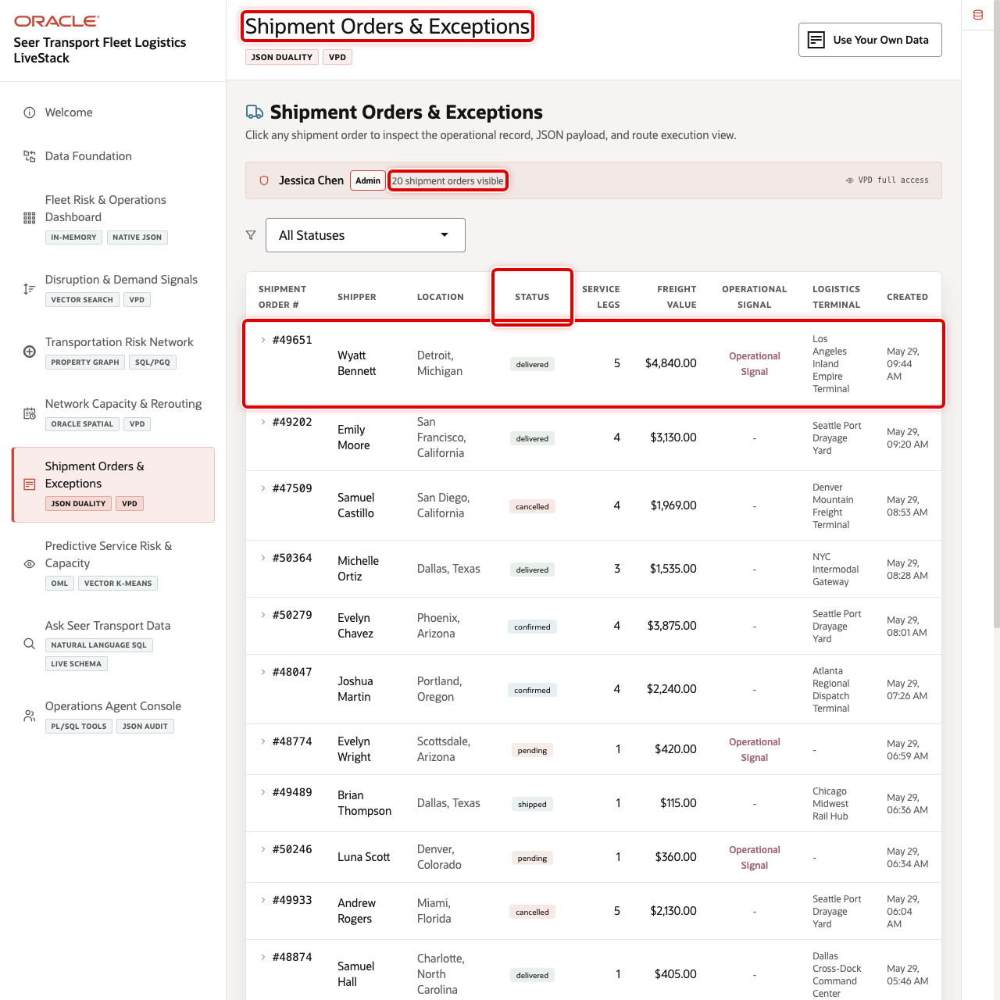
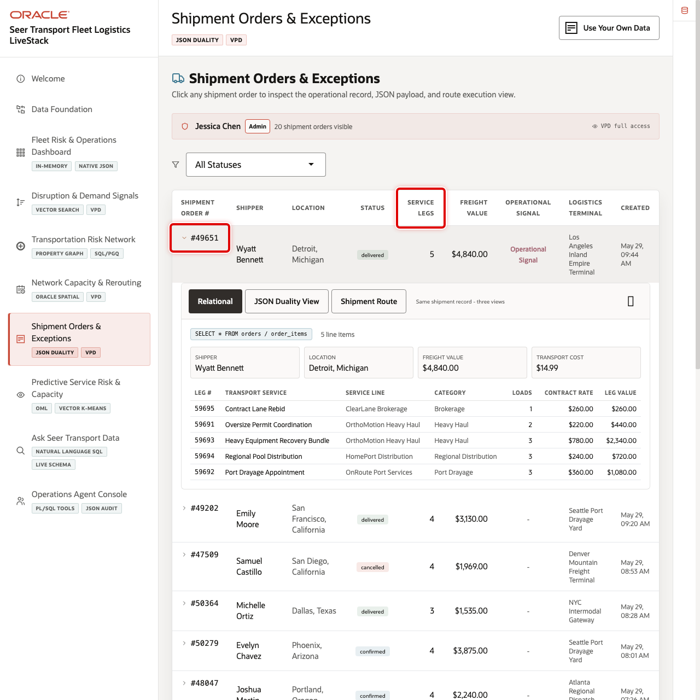
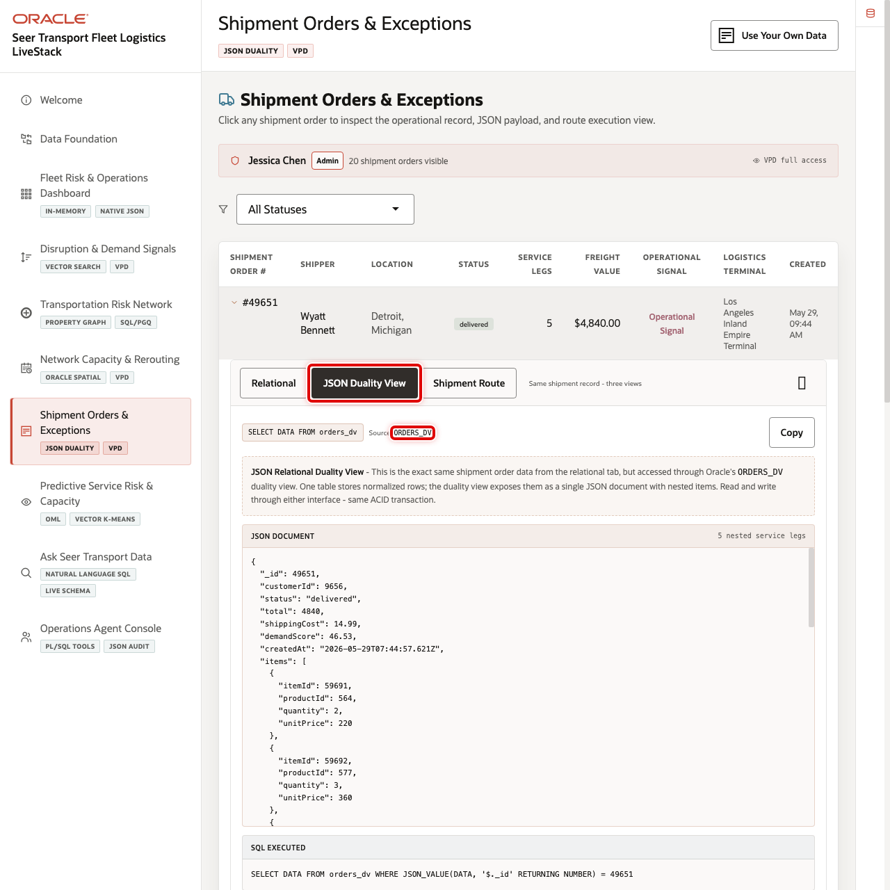
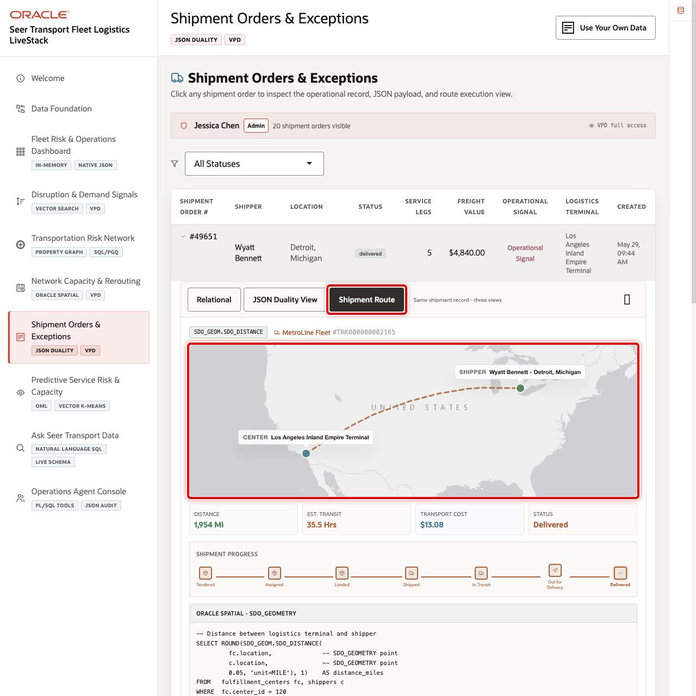

# Scene 7 Shipment Orders & Exceptions

## Introduction

**Shipment Orders & Exceptions** helps operations teams inspect shipment execution, service legs, route context, and JSON duality projections. It connects the operational shipment order list to exception investigation and document-style application access.

Transportation order workflows are often split across dispatch applications, customer systems, carrier tools, and analytics platforms. Business users need relational order detail, while application teams often need document-shaped payloads for APIs and mobile workflows.

Oracle AI Database helps by keeping the same shipment order data available through relational tables and JSON Relational Duality Views. In this scene, the user can inspect a shipment order, review service legs, compare the JSON document shape, and connect the order back to route and terminal context.

Estimated Time: 10 minutes

### Objectives

In this scene, you will learn what transportation decision the page supports, what evidence the user should inspect, and what action the business may take next.

## Task 1: Review the shipment order workspace

Use the order list to show shipment execution status and service exposure. In the current demo dataset, order **49651** is a delivered shipment order for **Wyatt Bennett** with **$4,840** in freight value, **5** service legs, and a social-driven source signal.

1. Click **Shipment Orders & Exceptions** in the sidebar.
2. Review the order KPI or summary cards at the top of the page.
3. Review the order list and status filters.
4. Click order **49651** or another visible high-value shipment order.

## Task 2: Inspect the relational shipment detail

The relational detail shows how the business sees the shipment: shipper, status, service legs, freight value, terminal, carrier, and shipment progress.

1. Review the order detail header.
2. Review the service legs. Order **49651** includes **Contract Lane Rebid**, **Oversize Permit Coordination**, **Heavy Equipment Recovery Bundle**, **Regional Pool Distribution**, and **Port Drayage Appointment**.
3. Review shipment progress and carrier details, including **MetroLine Fleet** and tracking number **TRK000000002165**.

## Task 3: Compare the JSON Duality View

Use the JSON Duality View to show that the same order data can support both business screens and application payloads.

1. Click **JSON Duality View** in the order detail.
2. Review the nested document shape for order header, service legs, shipper context, and shipment details.
3. Explain that the JSON view and relational view are not separate copies of the order.

## Task 4: Review route and terminal context

Use the route tab to connect the order back to terminal and geography.

1. Click **Shipment Route**.
2. Review the origin terminal and destination context.
3. Compare the shipment route with the capacity and routing scene if the seller wants to show how order execution connects to spatial planning.

You can move to the next scene.

## Credits & Build Notes
- **Author** - Oracle LiveLabs Team
- **Last Updated By/Date** - Oracle LiveLabs Team, 2026-05-29
