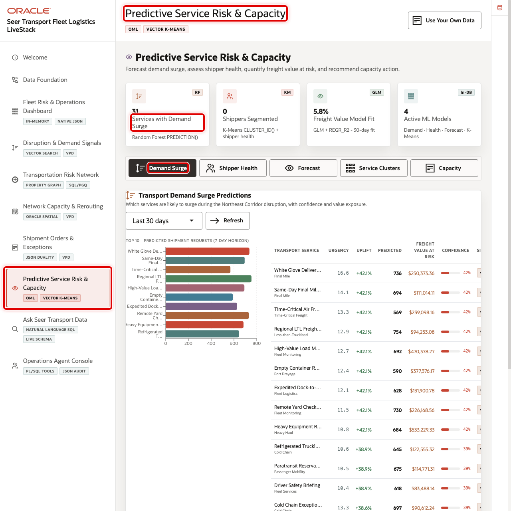
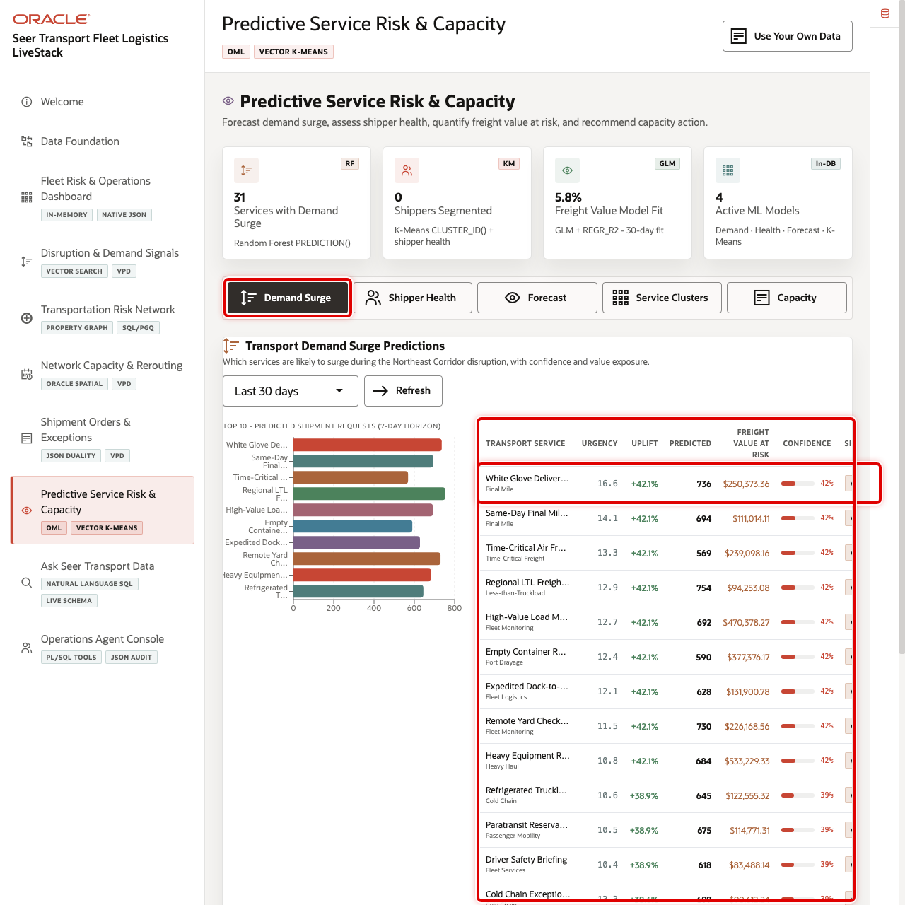
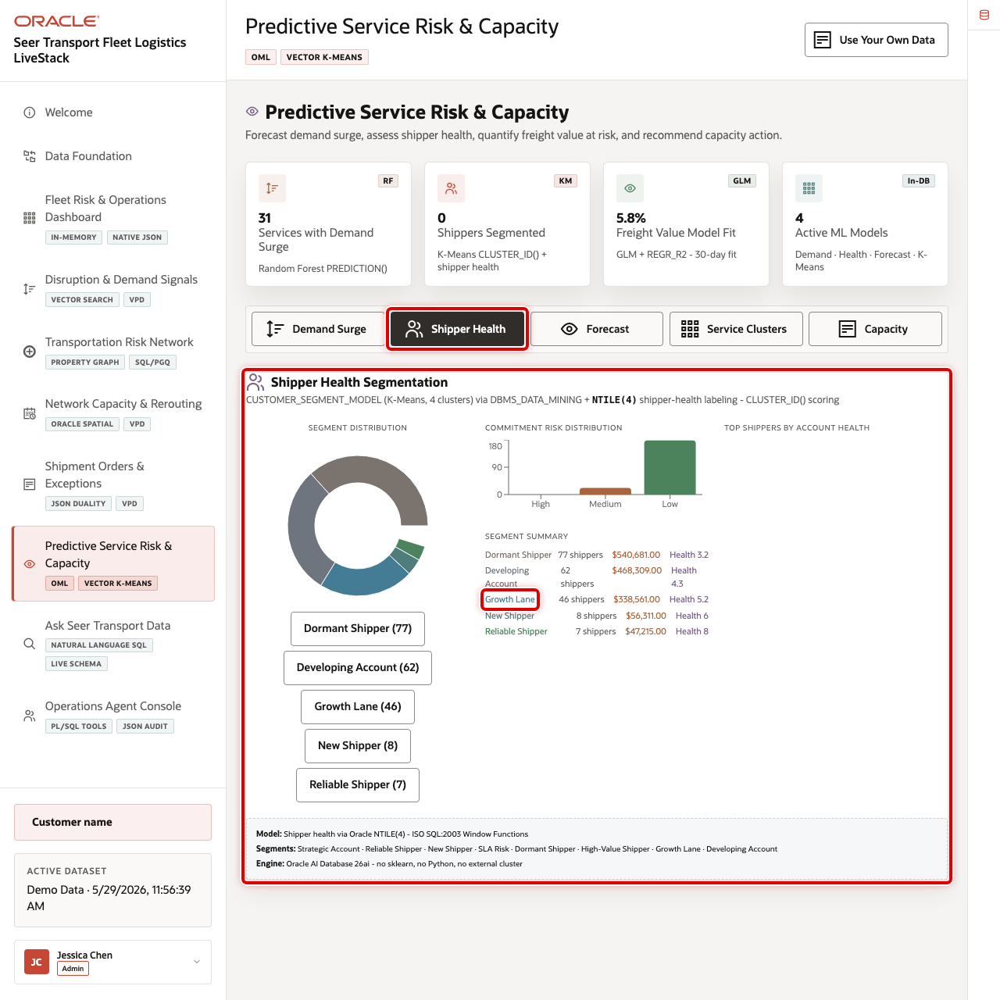
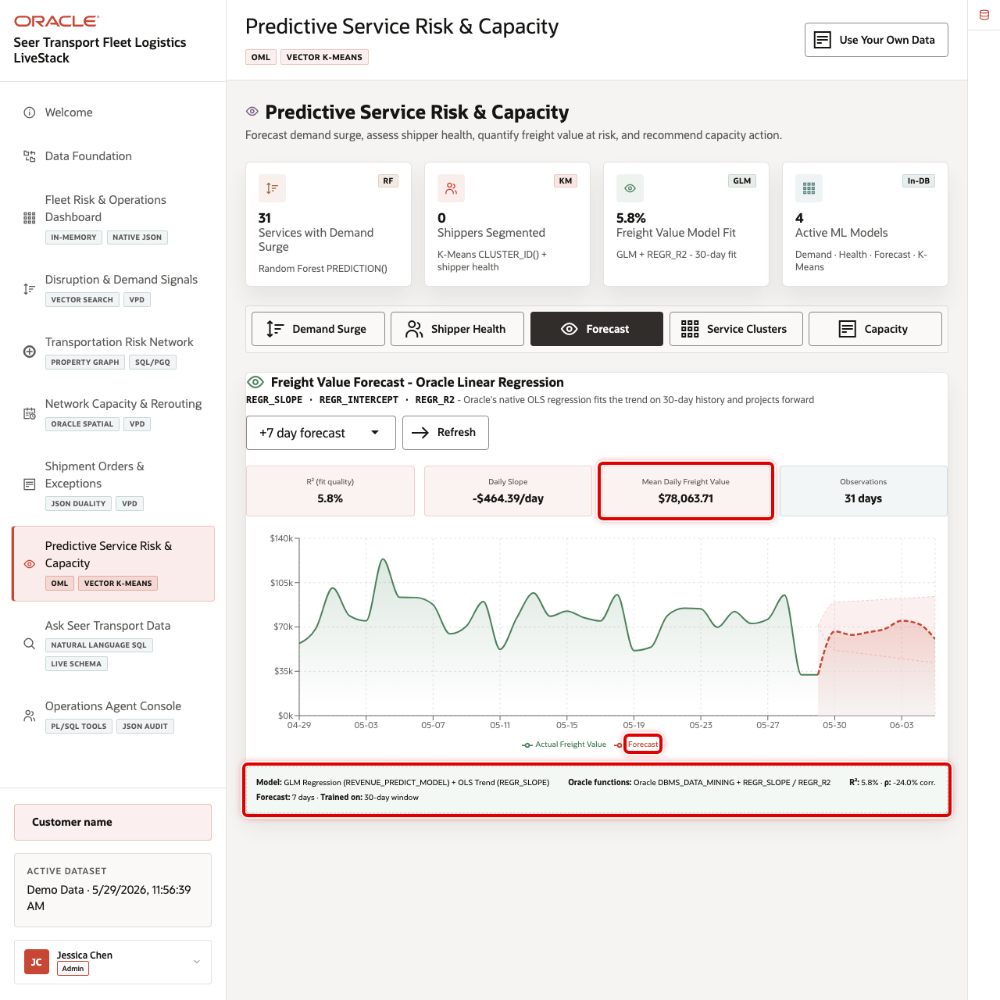
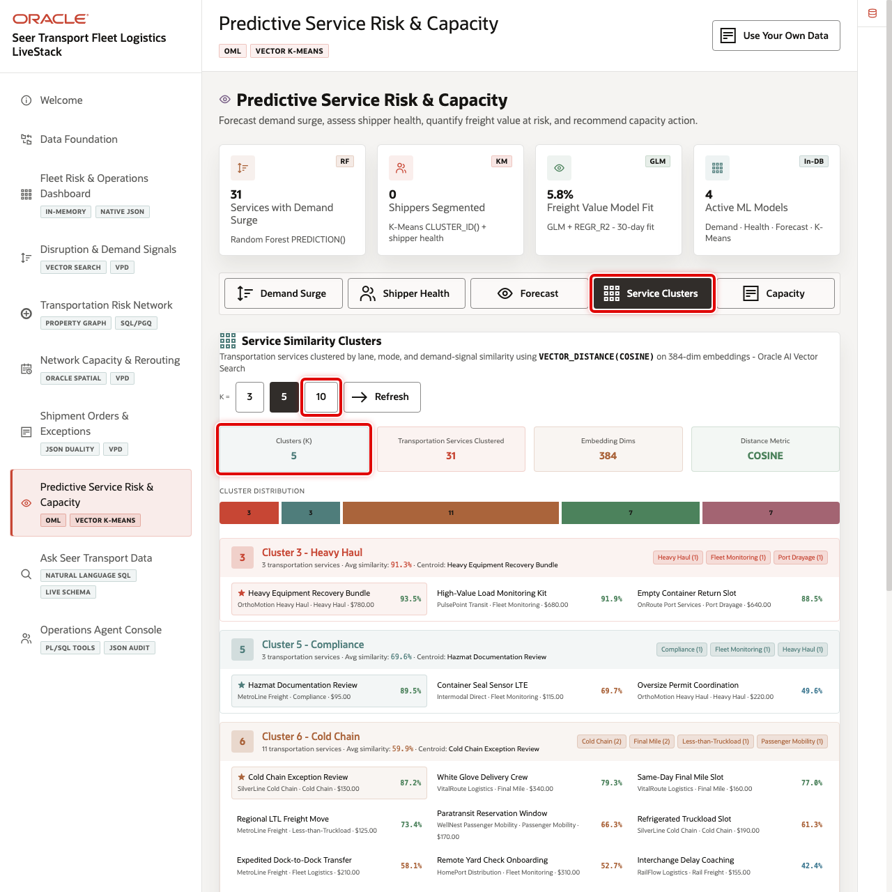
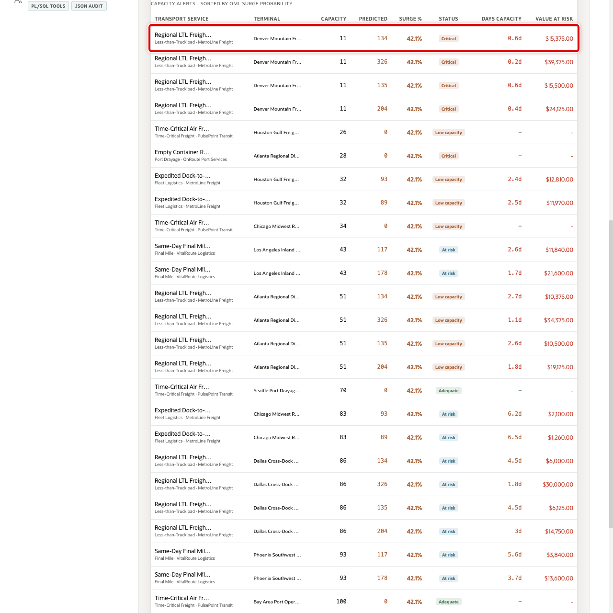

# Scene 8 Predictive Service Risk & Capacity

## Introduction

**Predictive Service Risk & Capacity** demonstrates Oracle Machine Learning and analytics workflows for transportation demand, shipper health, freight value forecasting, service similarity clustering, and capacity intelligence.

Transportation teams need to act before service risk becomes visible in missed pickups, terminal backlogs, or customer escalations. That is difficult when predictive models, operational orders, signal feeds, and capacity data are separated across tools.

Oracle AI Database helps by keeping model scoring, SQL analytics, vector features, forecasts, and operational data together. In this scene, the user can move between predictive tabs and show how model output becomes a planning decision.

Estimated Time: 10 minutes

### Objectives

In this scene, you will learn what transportation decision the page supports, what evidence the user should inspect, and what action the business may take next.

## Task 1: Review the predictive analytics workspace

1. Click **Predictive Service Risk & Capacity** in the sidebar.
2. Review the summary cards across the top of the page.
3. Review the analytics tabs: **Demand Surge**, **Shipper Health**, **Forecast**, **Service Clusters**, and **Capacity**.
4. Use Oracle Internals after the business flow is clear to explain DBMS_DATA_MINING and SQL scoring.

## Task 2: Inspect Demand Surge

Demand Surge shows which services are likely to experience elevated demand. In the current demo dataset, **White Glove Delivery Crew** is a top predicted surge service with predicted demand above **700** requests and more than **$250K** in freight value opportunity.

1. Click **Demand Surge**.
2. Review the predicted shipment request chart.
3. Review the top service rows, confidence, signal label, and freight value at risk.
4. Change the scoring window if you want to compare time horizons.

## Task 3: Filter Shipper Health

Shipper Health helps account and operations teams understand commitment risk and account patterns.

1. Click **Shipper Health**.
2. Review the segment distribution and commitment risk chart.
3. Click a segment filter such as **Growth Lane** or **Developing Account**.
4. Review the filtered shipper list.

## Task 4: Change the Forecast horizon

The forecast tab shows freight value trend and confidence bands so operators can understand expected service-value movement.

1. Click **Forecast**.
2. Change the forecast horizon using the dropdown.
3. Review model quality, daily slope, mean daily freight value, observations, and the forecast chart.

## Task 5: Change Service Clusters

Service clusters group transportation services by similarity so operators can reason about related services and risk cohorts.

1. Click **Service Clusters**.
2. Change the K value.
3. Review cluster distribution, top category, centroid service, and similarity percentages.

## Task 6: Review Capacity Intelligence

Capacity Intelligence joins demand forecasts with terminal capacity. In the current demo dataset, the page shows **100** monitored service-terminal pairs, critical capacity records, at-risk records, and total freight value at risk.

1. Click **Capacity**.
2. Review critical capacity, SLA risk, OML surge predicted, freight value at risk, and total monitored cards.
3. Review the capacity alert rows sorted by OML surge probability.
4. Focus on rows where predicted demand exceeds available capacity.

You can move to the next scene.

## Credits & Build Notes
- **Author** - Oracle LiveLabs Team
- **Last Updated By/Date** - Oracle LiveLabs Team, 2026-05-29
