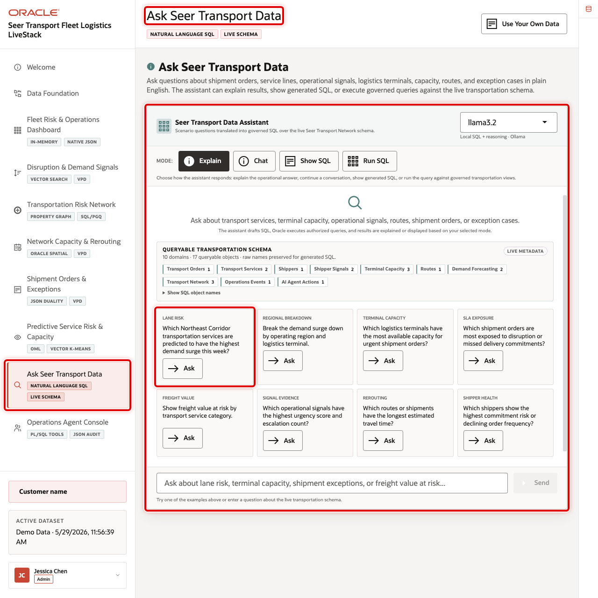
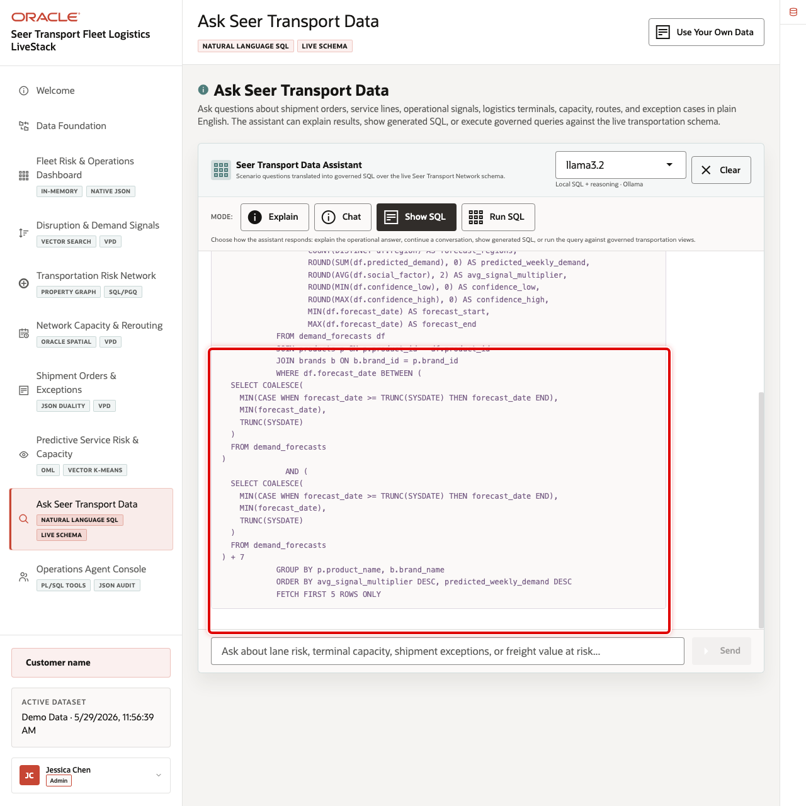
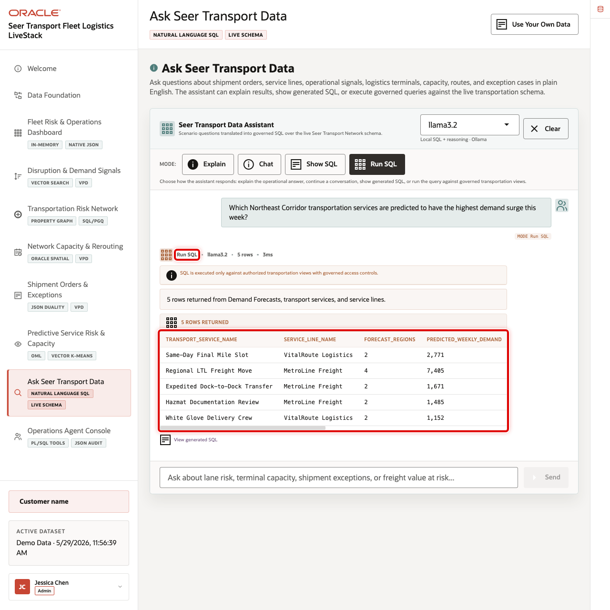

# Scene 9 Ask Seer Transport Data

## Introduction

**Ask Seer Transport Data** helps business users ask transportation questions in plain language without losing transparency. Users can inspect generated SQL, run it against trusted Oracle data, and review returned rows, which makes self-service analytics faster and easier to trust.

Natural-language data access can create governance risk if a model generates invalid SQL, references the wrong tables, hides the logic behind an answer, or exposes more data than the user should see. Transportation teams need fast answers, but data teams still need traceability, read-only execution, and a clear source of truth.

Oracle AI Database helps address these challenges by keeping query execution grounded in the live transportation schema. In this LiveStack Demo, the app sends the business question and schema context to the local Ollama runtime, validates the generated SQL path, and uses Oracle AI Database 26ai as the execution authority.

Estimated Time: 10 minutes

### Objectives

In this scene, you will learn what transportation decision the page supports, what evidence the user should inspect, and what action the business may take next.

## Task 1: Review the Ask Seer Transport Data workspace

Review the workspace to show how business users can ask questions in plain language while still keeping the query path visible and controlled.

1. Click **Ask Seer Transport Data** in the sidebar.
2. Review the runtime profile in the top right of the chat card. The current demo uses the local **llama3.2** runtime through the **SC_LLAMA_PROFILE** profile.
3. Review the four modes: **Explain**, **Chat**, **Show SQL**, and **Run SQL**.
4. Review the example question tiles.
5. Focus on the **Lane Risk** question: **Which Northeast Corridor transportation services are predicted to have the highest demand surge this week?**

## Task 2: Inspect generated SQL

Inspect the generated SQL to show that the answer is traceable. Even if the user does not read every line, the query can be reviewed instead of trusting a hidden AI response.

1. Click **Show SQL**.
2. Click **Ask** on **Which Northeast Corridor transportation services are predicted to have the highest demand surge this week?**
3. Review the generated SQL.

The generated SQL uses demand forecasts, transportation services, and service lines to find predicted demand surge for the current forecast window. This is the governance moment in the scene: the business user can inspect the query path before asking the database to return rows.

## Task 3: Run the SQL and inspect the returned data

Run the SQL and inspect returned rows to find concrete operational pressure.

1. Click **Clear** if the generated SQL result is still visible.
2. Click **Run SQL**.
3. Click **Ask** on the same **Lane Risk** question.
4. Review the returned table.
5. Focus on the first row: **Same-Day Final Mile Slot**.

In the current demo dataset, the question returns **5** rows. The first row is **Same-Day Final Mile Slot** from **VitalRoute Logistics**, with **2,771** predicted weekly demand and an average signal multiplier of **1.82** across forecast regions.

## Task 4: Explain the governance pattern

Explain the governance pattern as speed with control: the user asks in plain language, the system shows or runs SQL, Oracle returns trusted data, and the answer remains reviewable.

1. The user asks a transportation question in plain English.
2. The app builds prompt and schema context for the selected runtime profile.
3. Ollama drafts SQL or a response plan.
4. Oracle AI Database executes the generated SQL against the live schema.
5. The UI returns either visible SQL, raw rows, or a narrated answer.

You can move to the next scene.

## Credits & Build Notes
- **Author** - Oracle LiveLabs Team
- **Last Updated By/Date** - Oracle LiveLabs Team, 2026-05-29
