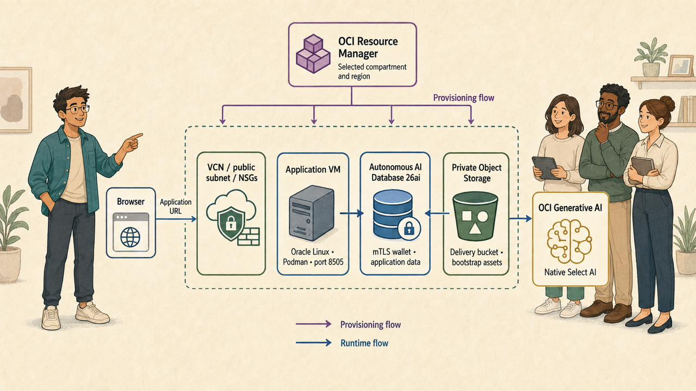
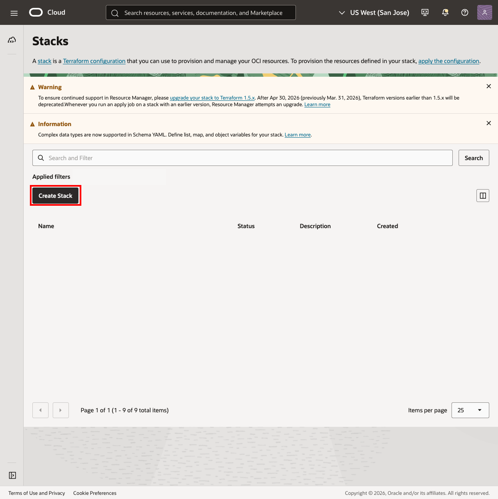
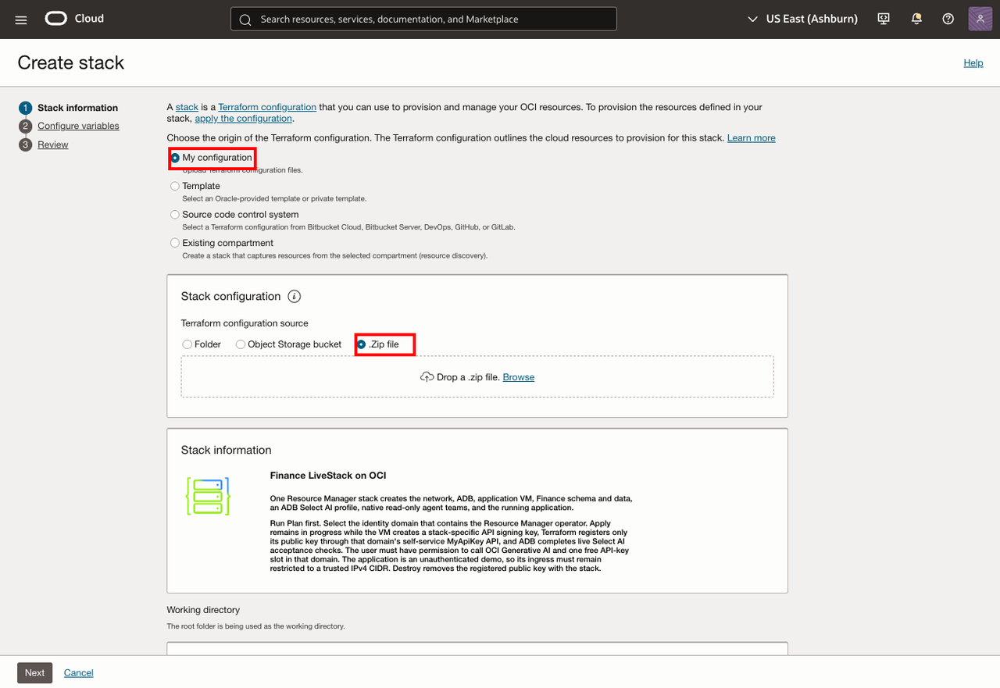
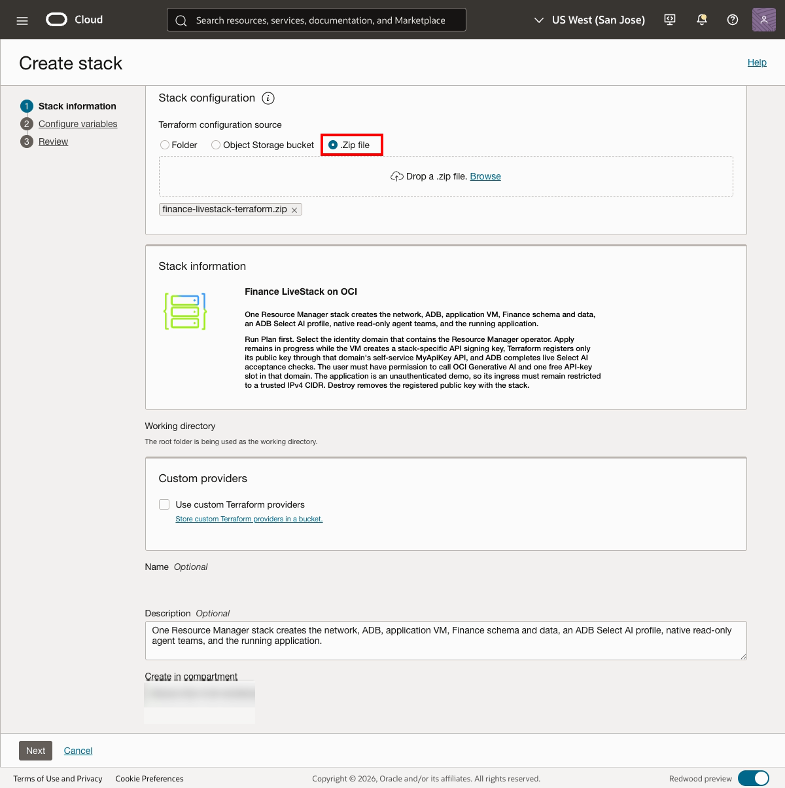
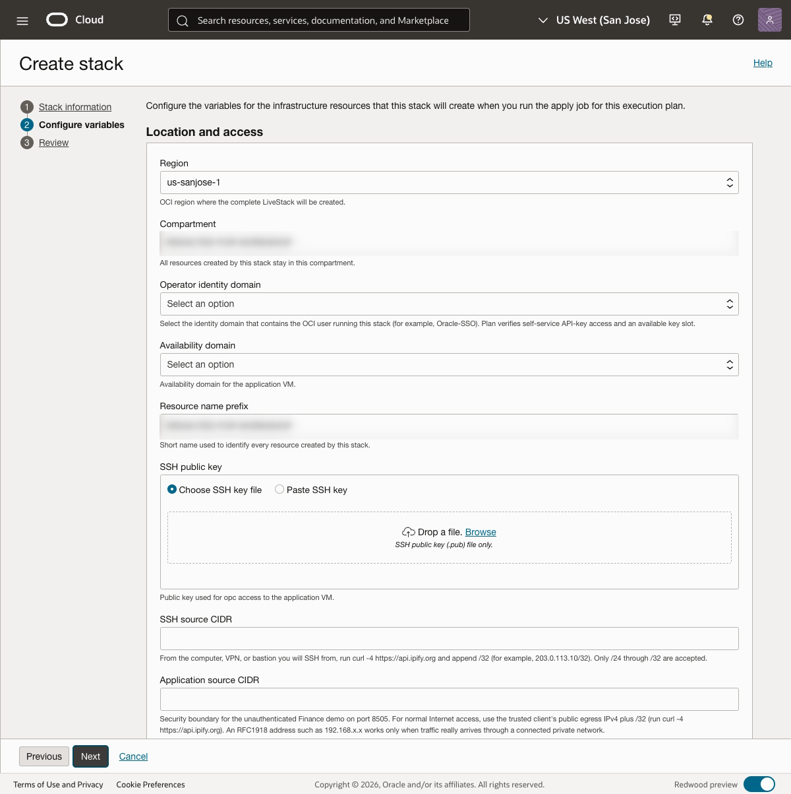
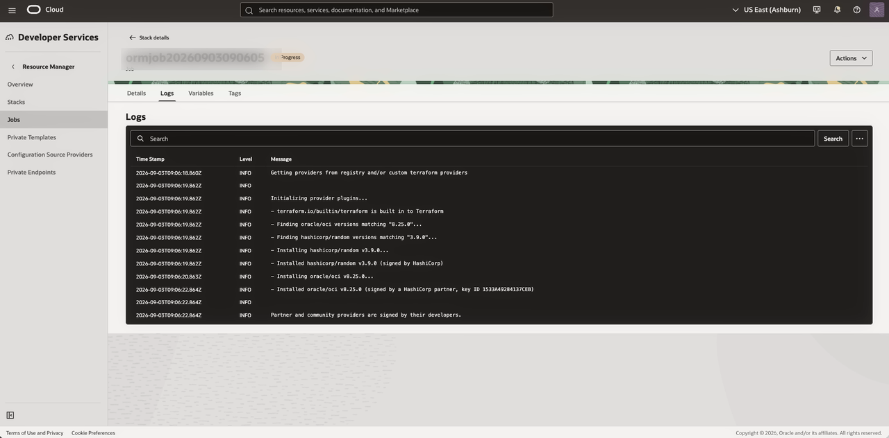
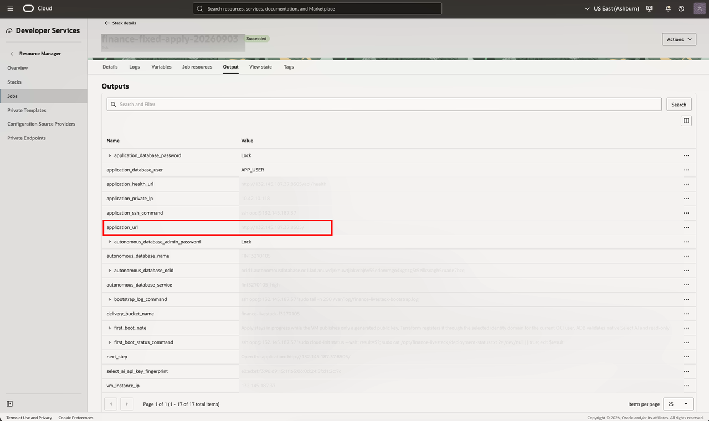

# Take It Home (OCI): Deploy the LiveStack with OCI Resource Manager

## Introduction

The LiveStack can run locally with Podman, but the same demo can also run in your own OCI tenancy. In this lab, you upload the approved Terraform package to **OCI Resource Manager**, review the proposed infrastructure, deploy the application, and open it from the Resource Manager outputs.

The Terraform package creates the network, an Oracle Linux application VM, a private Object Storage delivery bucket, and an Oracle Autonomous AI Database 26ai instance. During first boot, the VM loads the application schema and synthetic demo data, configures native Select AI with OCI Generative AI, and starts the application on port **8505**.

This is an unauthenticated demonstration deployment. Restrict access to trusted IPv4 CIDRs and do not use sensitive production data.

Estimated time: **45-90 minutes**, including database provisioning and application bootstrap.

### Objectives

In this lab, you will:

- Download the Resource Manager package from an OCI Object Storage PAR URL.
- Create an OCI Resource Manager stack from the Terraform ZIP.
- Configure the stack variables for your tenancy, network access, VM, database, and AI region.
- Review the configured variables before running Apply.
- Run Apply and wait for the application health check to pass.
- Open the application and verify the generated Resource Manager outputs.
- Destroy the stack when the demo is complete.

## Before you begin

Confirm that you have:

- An OCI tenancy and a compartment where you can create Resource Manager, Networking, Compute, Autonomous Database, Object Storage, and related resources.
- Permission to call OCI Generative AI in the compartment selected for the stack.
- Use the same OCI user for Resource Manager **Plan**, **Apply**, and **Destroy**. The stack uses that user’s identity domain for its temporary API-key registration.
- An SSH public key for the `opc` user on the application VM.
- A trusted public IPv4 address or CIDR for SSH and application access. To find it, open a command-line window on the computer that will access the application: use **Terminal** on macOS or Linux, or **Command Prompt** or **PowerShell** on Windows. For a normal Internet connection, run the following command and use the returned address with `/32`.

    ```bash
    <copy>
    curl -4 https://api.ipify.org
    </copy>
    ```

- Sufficient tenancy quota and budget for an Autonomous AI Database 26ai instance, an application VM, networking, and Object Storage.

> **Important:** Resource Manager **Apply** creates OCI resources that may incur charges. Keep `app_ingress_cidr` limited to trusted users. Run **Destroy** when the demonstration is complete.

## Architecture

The diagram below shows the main deployment and runtime paths.



## Task 1: Download the Resource Manager package

> **Release note:** The link below is an OCI Object Storage pre-authenticated request (PAR) for the Resource Manager ZIP used by this lab. In each lab variant, replace the URL with the release-owner-provided package for that variant. The PAR should grant only the access required to download this ZIP.

1. Download the package from the release-owner-provided PAR URL:

    [Download the Resource Manager package](https://c4u02.objectstorage.us-ashburn-1.oci.customer-oci.com/p/9DEArLjsgbKXuJgQtSG95E8hMXRFtxgHR8jiHbqz4HgyVYXVnSo0SC_s-zq5CJA3/n/c4u02/b/hosted-files/o/utilities-livestack-terraform.zip)

2. Keep the original filename of the downloaded ZIP file.

Expected result:

- You have the approved Resource Manager ZIP file available on the computer you will use to create the stack.
- The archive contains root-level Terraform files, `schema.yaml`, bootstrap scripts, verification assets, and the application payload.

## Task 2: Create the Resource Manager stack



1. Sign in to the OCI Console.

2. Open the navigation menu, select **Developer Services**, and then select **Resource Manager** and **Stacks**.

3. Select **Create stack**.

4. For the Terraform configuration source, select **My configuration**.



5. Under **Terraform configuration source**, select **.Zip file**.

6. Add the downloaded ZIP file to the upload area. Either drag and drop the ZIP file onto the dashed area, or select **Browse** and choose the ZIP file on your computer. Wait until the filename appears below the upload area.



7. Select the compartment that will contain the stack resources. The OCI region is selected later in the **Configure variables** step.

8. In the **Name** field, enter a recognizable stack name.

9. Select **Next** to open the **Configure variables** step.

Expected result:

- The uploaded filename appears below the upload area, and the **Stack information** panel shows the package-provided stack description.
- Resource Manager accepts the Terraform configuration and opens the variable form generated from `schema.yaml`.

## Task 3: Configure the stack variables



Configure the variables in the stack creation form.

Use the following guidance. Keep the shipped defaults unless your tenancy requires a different value.

| Variable | Guidance |
| --- | --- |
| **Region** | Region where Resource Manager creates the VCN, VM, database, and Object Storage resources. |
| **Compartment** | Compartment approved for this demonstration and OCI Generative AI access. |
| **Operator identity domain** | Select the identity domain containing the OCI user who runs Plan, Apply, and Destroy. Do not select a domain that does not contain that user. |
| **Availability domain** | Select an availability domain in the chosen stack region with VM capacity. |
| **Resource name prefix** | Use a unique value beginning with a letter and containing 3-30 letters, numbers, or hyphens, such as `demo-livestack`. |
| **SSH public key** | Paste the OpenSSH public key for the `opc` user. Do not paste the private key. |
| **SSH source CIDR** | Use the trusted public IPv4 address that will be used for SSH, followed by `/32`. The package accepts only IPv4 `/24` through `/32`. |
| **Application source CIDR** | Use the trusted public IPv4 address that will open the demo, followed by `/32`. It can match the SSH CIDR when the same computer is used. |
| **Bootstrap repair generation** | Leave this at `1` for the first deployment. Increment it only when intentionally rebuilding a one-shot VM after a failed repair or expired bootstrap callbacks. |
| **Application VM shape** | Keep `VM.Standard.E4.Flex` unless the tenancy requires another supported flexible shape. |
| **VM OCPUs / memory** | The shipped defaults are `2` OCPUs and `16` GB of memory. Increase them only when the selected shape or workload requires it. |
| **Autonomous Database license model** | Select the license model available in the tenancy. The default is `LICENSE_INCLUDED`. |
| **Autonomous Database ECPUs / storage** | The shipped defaults are `2` ECPUs and `1` TB. Confirm that the tenancy has capacity for the selected values. |
| **ADMIN password** | Leave blank to let Terraform generate a compliant password, or enter a 12-30 character value with uppercase, lowercase, and a number. Do not use spaces, quotes, or the word `admin`. |
| **ADB embedding model URI** | Leave the prefilled approved HTTPS value unchanged unless the release owner provides an approved replacement. Treat it as sensitive. |
| **OCI Generative AI region** | Select a supported region for the fixed on-demand `cohere.command-a-03-2025` model. The default is `us-chicago-1`; the database region can be different. |
| **OCI Generative AI model** | Leave `cohere.command-a-03-2025` selected. |

The hidden `tenancy_ocid` and `current_user_ocid` values are populated by Resource Manager. Do not try to replace them with another tenancy or user.

After configuring the variables, finish creating the stack:

1. Select **Next** to open the **Review** page.


2. Review the stack information and variable values.

3. Confirm that **Run apply** is selected. This tells Resource Manager to begin provisioning immediately after the stack is created.

4. Select **Create**.

Expected result:

- The form shows the groups **Location and access**, **Compute sizing**, and **Database and AI**.
- Required fields are populated, the two source CIDRs are restricted, and the model URI remains prefilled.
- Resource Manager creates the stack and starts the Apply job.
- The new stack opens with a job that provisions the LiveStack resources.

## Task 4: Monitor the Apply job


1. Open the Apply job created when you selected **Create**.

2. Confirm that the job state is **In Progress**. Keep this page open while Resource Manager provisions the stack. The Apply job usually takes **20-45 minutes**. Initial VM setup can take up to **90 minutes**.

3. Select the **Logs** tab to monitor the build.



4. Review the log entries as they appear. They show Terraform provider initialization and each resource operation that Apply performs.

5. Wait for the application VM to finish its bootstrap sequence. The VM installs Podman and SQLcl, downloads the application and wallet, loads the application schema and synthetic data, configures native Select AI, runs native acceptance checks, and starts the application.

6. Treat Apply as complete only when the job status is **Succeeded**. A running VM or a partially completed resource graph does not prove that the application is ready.

Expected result:

- While provisioning is underway, the Apply job shows **In Progress** and the **Logs** tab shows build activity.
- The Apply job eventually succeeds.
- The stack outputs include the application URL, health URL, database details, and bootstrap troubleshooting commands.

## Task 5: Open the outputs and verify the application



1. On the stack details page, open the **Outputs** section.

2. Open the `application_health_url` output. Confirm that it returns HTTP 200 and reports database connectivity and native-AI readiness.

3. Open the `application_url` output highlighted in the screenshot to access the deployed application. If the browser cannot connect, confirm that the client’s public IPv4 address is allowed by `app_ingress_cidr`.

4. Open the deployed application and complete the validation steps defined for the application. Confirm that it can read the seeded data.

5. If the application includes an AI assistant or agent, run its read-only validation. Confirm that it uses the deployed database and configured AI service.

Expected result:

- The health endpoint returns HTTP 200.
- The application opens on port `8505` and shows the deployed workflow.
- The application’s validation uses the deployed database and native OCI Generative AI configuration.

## Task 6: Investigate a failed bootstrap when needed

If Apply fails after the VM has been created, use the Resource Manager outputs before deciding whether to repair or destroy the stack.

1. Open a command-line window with SSH available: use **Terminal** on macOS or Linux, or **PowerShell** or **Command Prompt** on Windows. Copy the `first_boot_status_command` output and run it to check the VM bootstrap status.

2. If more detail is needed, copy and run the `bootstrap_log_command` output.

3. Review the recorded bootstrap phase and the last error. Common causes include database capacity, OCI Generative AI authorization, an unavailable VM shape, a blocked egress path, or an incorrect source CIDR.

4. For an incomplete initial deployment, inspect a fresh Plan before applying again. If the stack has unexpected retained resources or an uncertain state, run Destroy and create a clean deployment after the Destroy job succeeds.

Expected result:

- You identify the failure using the Resource Manager output and VM bootstrap log rather than host reachability alone.

## Task 7: Destroy the stack


1. After you finish the demonstration, return to the stack details page and select **Destroy**.

2. Confirm the Destroy operation and wait for the job to become **Succeeded**.

3. Review the job log and resource list. Confirm that the API key, application VM, Autonomous Database, VCN, callback objects, and private delivery bucket are removed.

4. If you need the demo again later, create a new stack from the approved ZIP and run Plan before Apply.

Expected result:

- Destroy completes successfully and the stack no longer retains the billable demo resources.

## Credits & Build Notes

- **Author** - Oracle LiveLabs Team.
- **Last Updated By/Date** - Oracle LiveLabs Team, September 2026.
