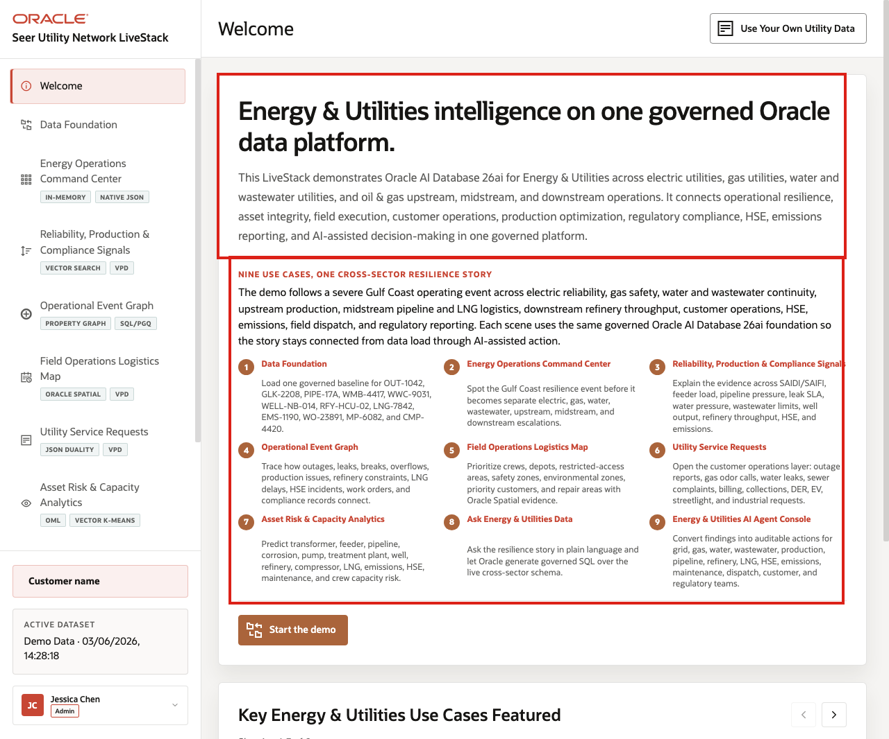
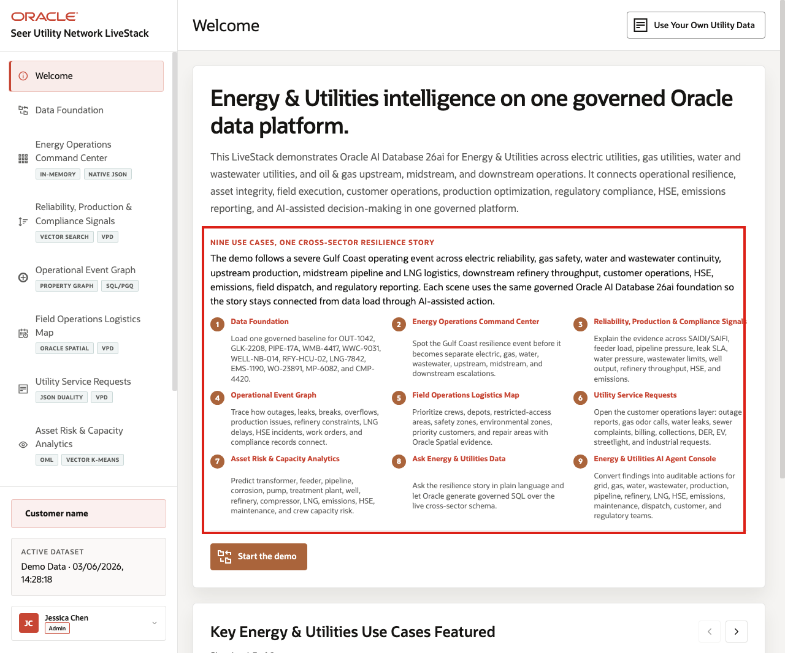
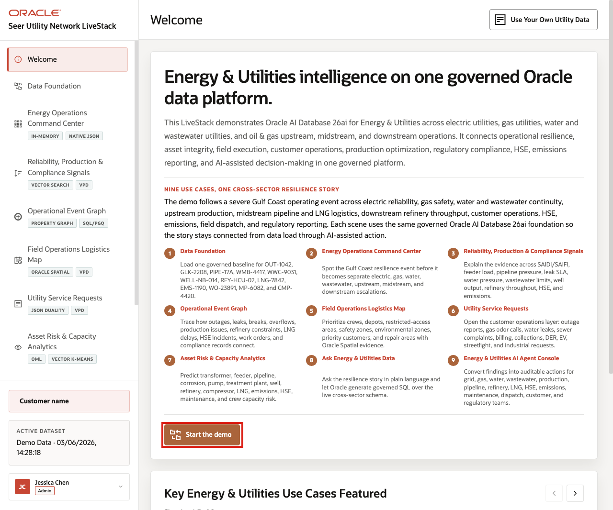

# Scene 1 Welcome and Demo Orientation

## Introduction

The opening scene establishes the demo story: **nine use cases, one cross-sector resilience story**. Seer Utility Network is managing a severe Gulf Coast operating event that touches electric reliability, gas safety, water and wastewater continuity, upstream production, midstream pipeline and LNG logistics, downstream refinery throughput, customer operations, HSE, emissions, field dispatch, and regulatory reporting.

Use this scene to make clear that the LiveStack is broader than electric grid operations. The electric outage story remains, but it is now one part of a connected Energy and Utilities operating picture.

Estimated Time: **5 minutes**

### Objectives

In this scene, you will learn how the demo story is organized, which Energy and Utilities subsectors are represented, and how the rest of the runbook follows one operating event through Oracle AI Database capabilities.

## Task 1: Review the cross-sector story

Start by orienting the audience to the headline and story rail. The purpose is to show that the demo follows one Gulf Coast operating event across multiple Energy and Utilities domains.

1. Read the welcome headline.
2. Review the story copy that describes the Gulf Coast operating event.
3. Point out the subsector coverage: electric, gas, water/wastewater, upstream, midstream, downstream, customer operations, HSE, emissions, field dispatch, and regulatory reporting.

Use this first screen to anchor the business conversation before you move into the data model or Oracle capability details.

## Task 2: Review the nine use cases

The story rail shows how the same governed Oracle AI Database foundation supports the entire demo flow.

1. Review **Data Foundation**.
2. Review **Energy Operations Command Center**.
3. Review **Reliability, Production and Compliance Signals**.
4. Continue through the rail until you have reviewed all nine use cases.

    

The key message is that each page is a different operating lens on the same event: the command center detects pressure, signals explain it, the graph connects records, the map coordinates field response, service requests show customer impact, analytics predict the next constraint, Ask Data supports governed questions, and agents coordinate audited action.

## Task 3: Continue the demo

After the audience understands the story, continue to the data foundation page to load or verify the governed baseline.

1. Click **Start the demo**.

    

2. Confirm the demo moves to **Data Foundation**.

Use this transition to explain that every later scene uses the same Energy and Utilities dataset, including records such as **OUT-1042**, **GLK-2208**, **PIPE-17A**, **WMB-4417**, **WWC-9031**, **WELL-NB-014**, **RFY-HCU-02**, **LNG-7842**, **EMS-1190**, and **HSE-3364**.

## Credits & Build Notes
- **Author** - Oracle LiveLabs Team
- **Last Updated By/Date** - Oracle LiveLabs Team, 2026-06-03
