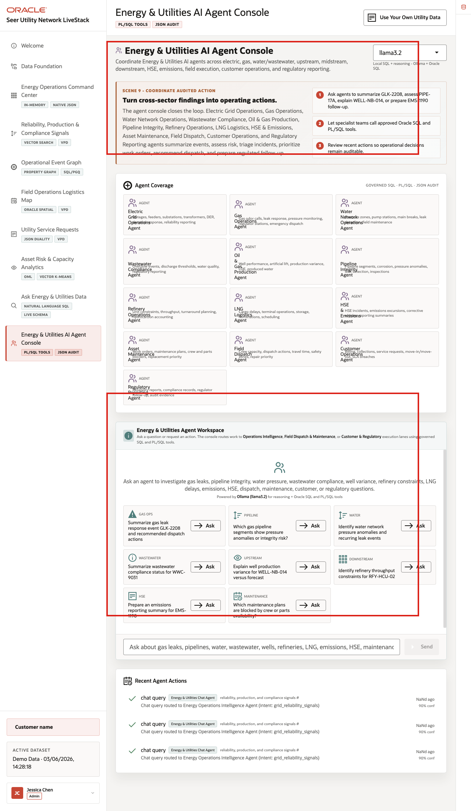
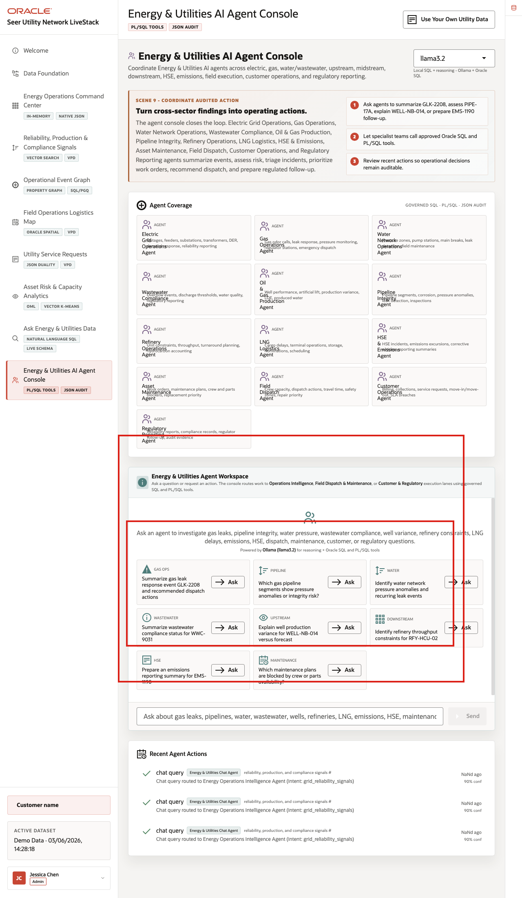
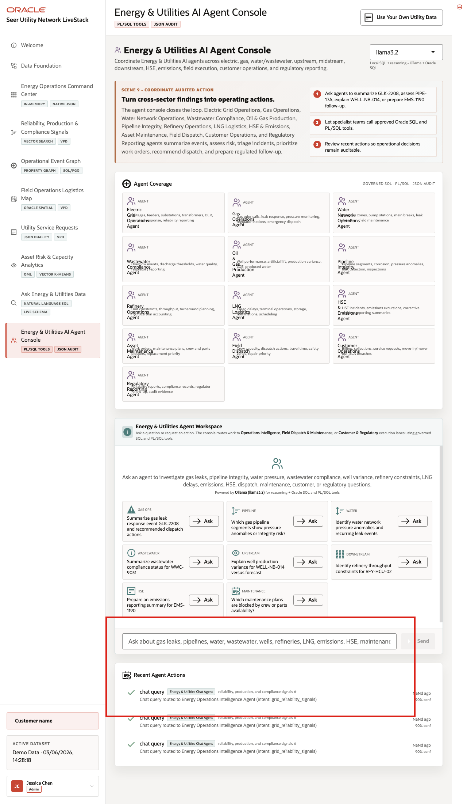

# Scene 10 Energy & Utilities AI Agent Console

## Introduction

**Energy & Utilities AI Agent Console** shows how AI assistance can support operational decisions without becoming a black box. Agents can support Electric Grid Operations, Gas Operations, Water Network Operations, Wastewater Compliance, Oil & Gas Production, Pipeline Integrity, Refinery Operations, LNG Logistics, HSE & Emissions, Asset Maintenance, Field Dispatch, Customer Operations, and Regulatory Reporting.

Oracle AI Database keeps the source data, SQL execution, PL/SQL tools, graph and spatial context, in-database analytics, and durable action logging connected to the same governed Energy and Utilities data foundation. The app orchestrates the agent workflow, Ollama provides local reasoning when available, and Oracle AI Database 26ai executes governed data operations and records action evidence.

Estimated Time: **10 minutes**

### Objectives

In this scene, you will learn how specialist agents convert cross-sector findings into auditable operating actions.

## Task 1: Review the agent console workspace

Review the agent console as an operational workspace. The user should notice the runtime profile, example questions, specialist routing, recent actions, confidence information, fallback context, and audit history before running an agent task.

1. Click **Energy & Utilities AI Agent Console** in the sidebar.
2. Review the runtime profile selector.
3. Review the specialist example questions, including gas leak response, pipeline integrity, water network pressure anomalies, wastewater compliance status, well production variance, refinery throughput constraints, maintenance work order priority, emissions reporting, HSE triage, field dispatch, reliability reporting, and billing or collections analysis.
4. Review **Recent Agent Actions** below the workspace.
5. Focus on the gas and pipeline example for **GLK-2208** and **PIPE-17A**.

Use this opening view to explain that the page is an operational agent console. The user can see routing, tools, results, confidence, fallback status, and action history, not just a chat response.

## Task 2: Run a gas and pipeline agent question

Perform the following steps to show how the agent summarizes gas leak response and pipeline integrity evidence while exposing the data, tool path, runtime status, and fallback context behind the answer.

1. Type or select the following question:

    `<copy>Summarize gas leak response event GLK-2208 and pipeline integrity risk for PIPE-17A</copy>`

2. Click **Send**.
3. Review the agent response at the top of the chat output.
4. Review any returned table, event evidence, tool badge, runtime badge, or fallback status.

    

**Expected result:** The response should summarize **GLK-2208** and **PIPE-17A** using Oracle operational event graph evidence. It should mention related evidence such as **HSE-3364**, a midstream pressure anomaly, gas leak response context, pipeline integrity risk, and pressure sensor evidence when those records are present in the live dataset.

If the runtime shows a timeout or fallback, use it as an observability example: the operator can see whether the answer came from a complete LLM/tool path or from Oracle SQL and PL/SQL fallback evidence.

## Task 3: Review the agent action audit trail

Perform the following steps to show that AI-assisted actions do not disappear after the conversation. Operators, supervisors, architects, and auditors can review what the agent did, which route it used, and how confident the system was.

1. Scroll to **Recent Agent Actions**.
2. Review the newest action row when the action list is populated.
3. Confirm that the row captures the agent action type, operational intent, confidence, related evidence, and runtime path.
4. Compare the visible action trail with the Oracle Internals diagram.

    

The governance point is that agent decisions should remain observable after the conversation, with action history available for incident review, customer follow-up, regulatory response, HSE review, emissions reporting, and continuous improvement.

The business value is that teams can make the decision from connected, governed data. **Oracle AI Database** provides the shared foundation that keeps operational data, analytics, graph evidence, SQL tools, PL/SQL actions, and AI workflows aligned.

*You can move to the next scene.*

## Credits & Build Notes
- **Author** - Oracle LiveLabs Team
- **Last Updated By/Date** - Oracle LiveLabs Team, 2026-06-03
