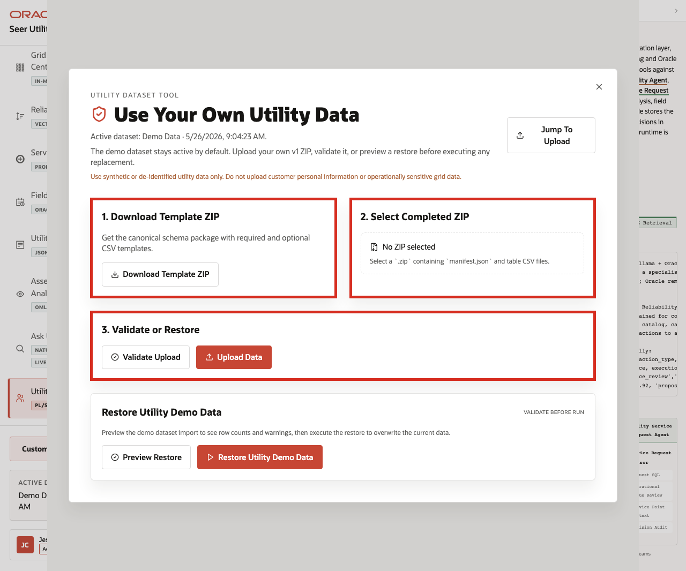
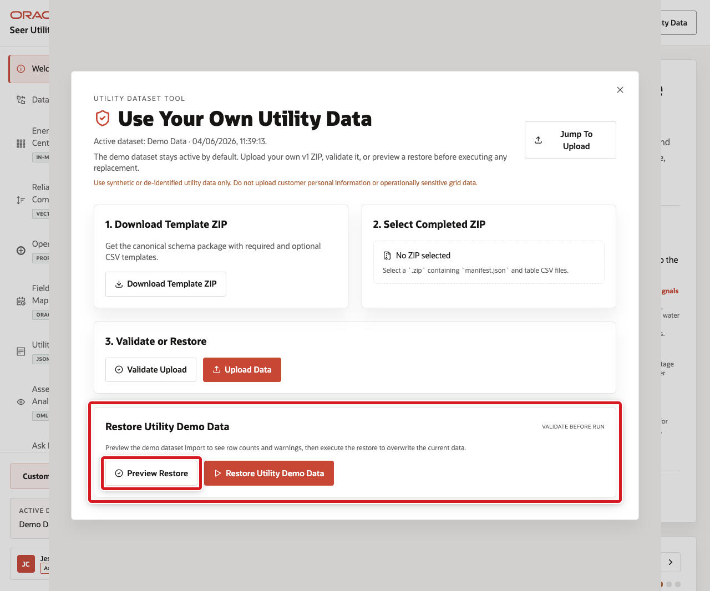

# Scene 11 Use Your Own Utility Data

## Introduction

**Use Your Own Utility Data** shows how users can replace or restore the dataset through the application while keeping the demo safe and repeatable.

The workflow supports template download, ZIP validation, upload, seeded-data restore, and the expectation that only synthetic or non-sensitive utility data is used.

This scene matters because an Energy and Utilities LiveStack is most useful when teams can map the demo pattern to their own service territory, meter, customer, asset, outage, and field operations terminology. The application makes that workflow explicit while keeping the seeded Seer Utility Network data available as a known-good baseline.

Estimated Time: **10 minutes**

### Objectives

In this scene, you will:
- Open the dataset tool from the application top bar.
- Review the active dataset label.
- Download the canonical utility dataset template.
- Review the completed ZIP upload and validation path.
- Preview or restore the seeded utility demo dataset.
- Explain the data safety expectation for synthetic or non-sensitive utility data.

## Task 1: Open the dataset tool

Perform the following set of steps to show where users can manage datasets and to reinforce the key safety rule: use only synthetic or non-sensitive utility data, never protected customer data, account secrets, grid security details, or regulated operational records.

1. From any application scene, click **Use Your Own Utility Data** in the top bar.
2. Review the modal title and active dataset line.
3. Use only synthetic or non-sensitive utility data. Do not upload protected customer data, account secrets, grid security details, or regulated operational records into the demo environment.
4. Review the main sections: **Download Template ZIP**, **Select Completed ZIP**, **Validate or Restore**, and **Restore Utility Demo Data**.

    

In the current demo, treat the displayed values as examples. Verify them before presenting, then use the result to explain the operational takeaway rather than relying on the exact numbers alone.

## Task 2: Review the template and upload workflow

Perform the following set of steps to show how custom utility datasets stay repeatable. The template defines the expected structure, validation checks the completed ZIP, and upload remains a deliberate action.

1. Click **Download Template ZIP** to download the canonical schema package.
2. Review **Select Completed ZIP**. The control expects a `.zip` containing `manifest.json` and table CSV files.
3. Review the **Validate Upload** and **Upload Data** actions.
4. Explain that validation should run before data replacement.

    

This workflow keeps custom demos repeatable and safe: the template defines the structure, validation checks the package, upload is explicit, and seeded data remains available for reset.

## Task 3: Preview or restore the seeded dataset

Perform the following set of steps to return the demo to a known-good baseline after testing custom synthetic utility data.

1. In **Restore Utility Demo Data**, click **Preview Restore**.
2. Review the row counts, warnings, or issues returned by the preview.
3. If you need to return the demo to the seeded baseline, click **Restore Utility Demo Data** after the preview enables the action.
4. Close the dataset manager when finished.

    

Use this scene to explain the operating guardrail: teams can bring synthetic utility data into the LiveStack, but the seeded dataset remains available as a known baseline.

You can move to the download lab when you want to run the **Energy and Utilities LiveStack** locally.

## Credits & Build Notes
- **Author** - Oracle LiveLabs Team
- **Last Updated By/Date** - Oracle LiveLabs Team, 2026-05-26
