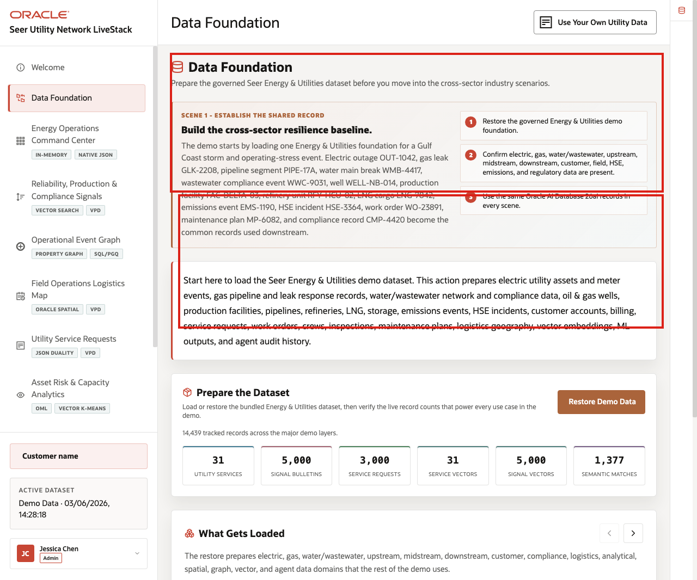
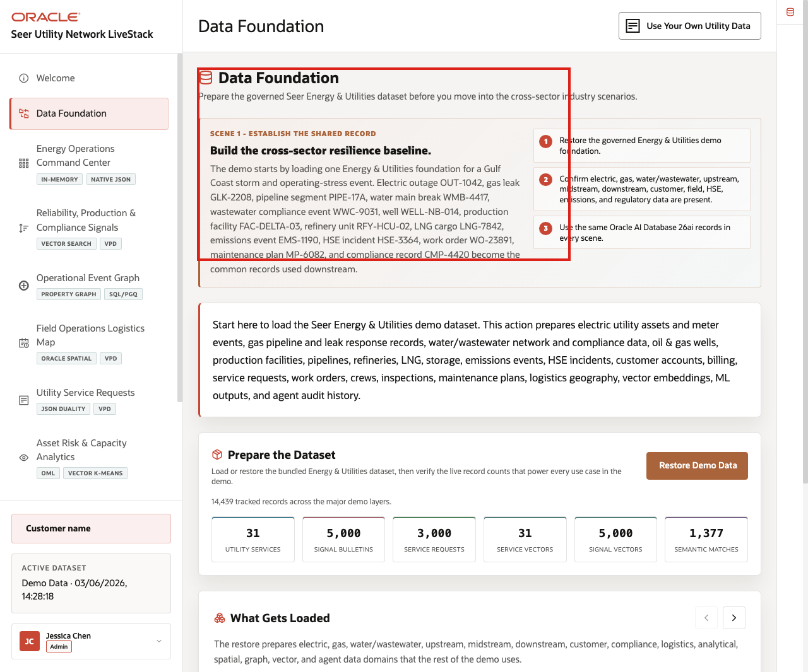
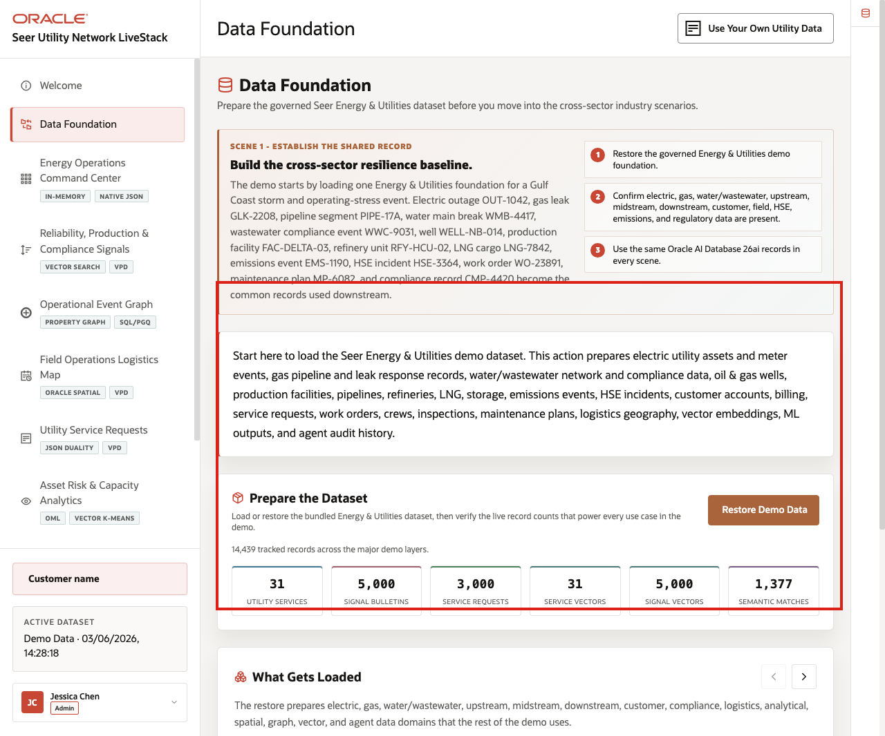
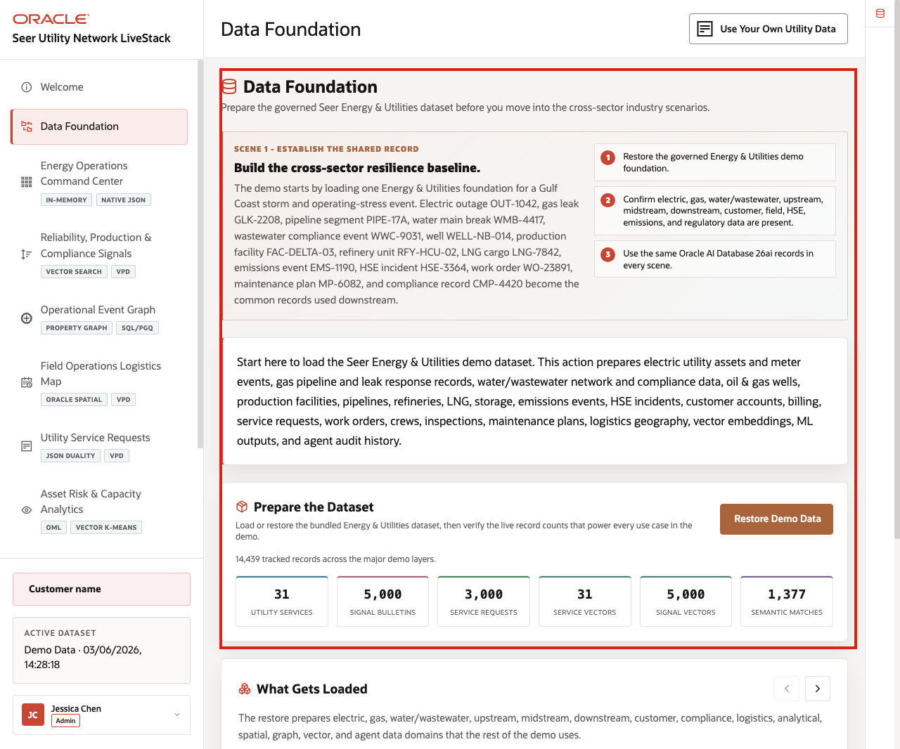

# Scene 2 Energy and Utilities Data Foundation

## Introduction

This scene prepares the trusted **Seer Utility Network** dataset used throughout the demo. Loading or restoring the data gives every later screen the same governed starting point for electric utility assets and meter events, gas pipeline and leak response data, water and wastewater network and compliance data, oil and gas wells, production facilities, pipelines, refineries, LNG logistics, emissions events, HSE incidents, customer accounts, billing, service requests, work orders, crews, inspections, maintenance plans, compliance records, regulatory reports, sensor readings, and operating events.

The page establishes that the runbook is not a set of disconnected mini-demos. The same Oracle-backed records support the command center, signal search, operational graph, field map, service requests, analytics, Ask Data, data import, and agent workflows.

Estimated Time: **5 minutes**

### Objectives

In this scene, you will confirm that the demo has a governed baseline for electric, gas, water/wastewater, upstream, midstream, downstream, customer operations, field work, HSE, emissions, and regulatory workflows.

**Note:** Oracle Internals is collapsed by default. Expand it only after the business flow is clear so you can connect the visible data foundation to the database capabilities behind the page.

## Task 1: Prepare the dataset

Perform the following steps so every later scene starts from the same trusted Energy and Utilities baseline.

1. From the welcome page, click **Start the demo**, or click **Data Foundation** in the sidebar.
2. In **Prepare the Dataset**, click **Restore Demo Data** only if the dataset needs to be reset to the seeded baseline.
3. Wait for the operation to complete if you run the restore.
4. Review the record counts below the action.

    

The seeded baseline should support named records such as **OUT-1042**, **GLK-2208**, **PIPE-17A**, **WMB-4417**, **WWC-9031**, **WELL-NB-014**, **FAC-DELTA-03**, **RFY-HCU-02**, **LNG-7842**, **EMS-1190**, **HSE-3364**, **WO-23891**, **MP-6082**, and **CMP-4420**.

**Notes:**
- Sample values may change after data refreshes or rebuilds. Verify live output before presenting, then explain the business takeaway.
- Use these counts to show that the dataset supports operational, analytical, spatial, graph, vector, machine learning, natural-language SQL, and audit workflows.

## Task 2: Review what gets loaded

Perform the following steps to show that the demo uses recognizable Energy and Utilities data, not only electric grid records.

1. Scroll to **What Gets Loaded**.
2. Review the data cards for assets, meters, work orders, crews, service requests, customer accounts, pipeline segments, wells, production facilities, compressor stations, refineries, LNG terminals, storage facilities, water treatment plants, wastewater facilities, emissions events, HSE incidents, maintenance plans, compliance records, regulatory reports, inspections, sensor readings, operating events, and billing or collections records.
3. Use the carousel controls to review the remaining data groups.
4. Click the **Oracle Internals** icon on the far-right rail to expand the sidebar, then review the Oracle capability notes.

    

The carousel should make the shared data model concrete: electric reliability data, gas safety data, water/wastewater data, oil and gas operations data, customer data, field work data, HSE and emissions data, compliance data, vectors, graph relationships, ML outputs, and agent actions are all prepared from one foundation.

## Task 3: Connect the foundation to the rest of the demo

Use this page as the bridge into the operating story. The same governed foundation supports the command center, reliability and production signal search, operational event graph, field operations map, service requests, analytics, Ask Data, data import, and AI agent workflows.

1. Explain that the command center will summarize the foundation as cross-sector operating indicators.
2. Explain that vector search will connect reliability, production, and compliance signals to affected services and assets.
3. Explain that graph, spatial, JSON duality, OML, Ask Data, BYO data, and agent pages all read from the same governed records.

    

The business value is that teams can move from a single trusted data foundation to operational resilience, asset integrity, field execution, customer operations, production optimization, regulatory compliance, HSE, emissions reporting, and AI-assisted decision-making.

*You can move to the next scene.*

## Credits & Build Notes
- **Author** - Oracle LiveLabs Team
- **Last Updated By/Date** - Oracle LiveLabs Team, 2026-06-03
