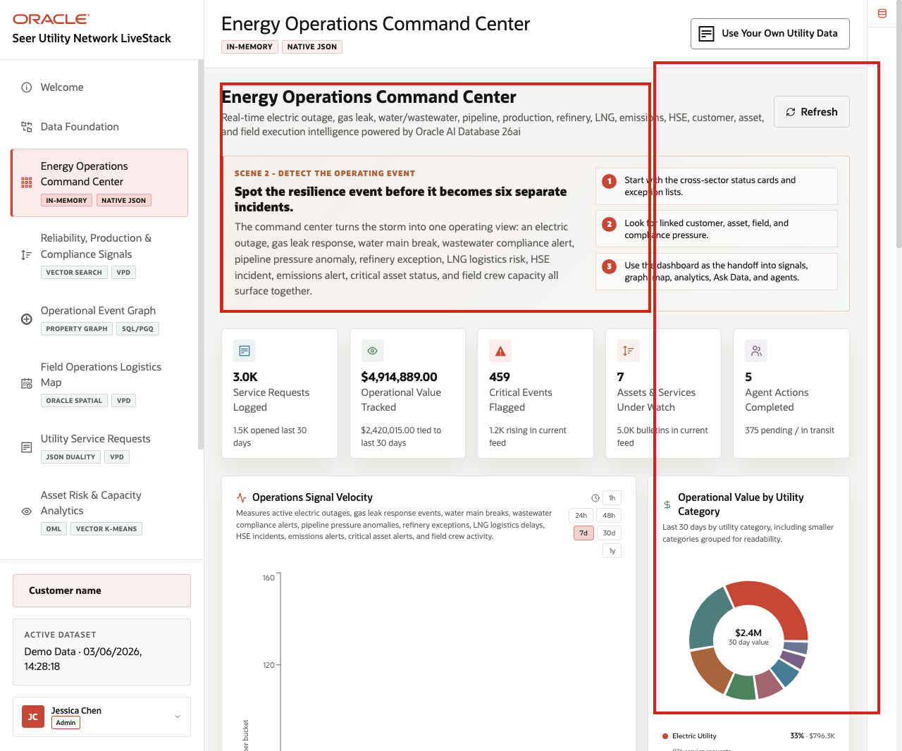
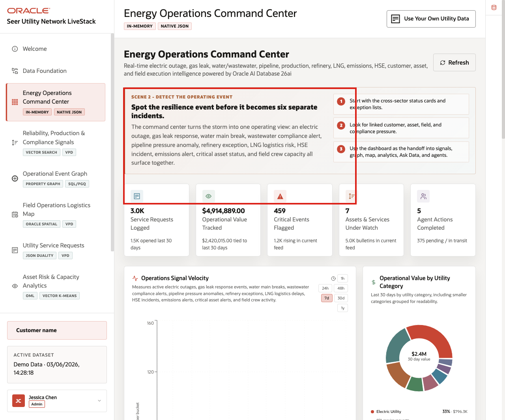
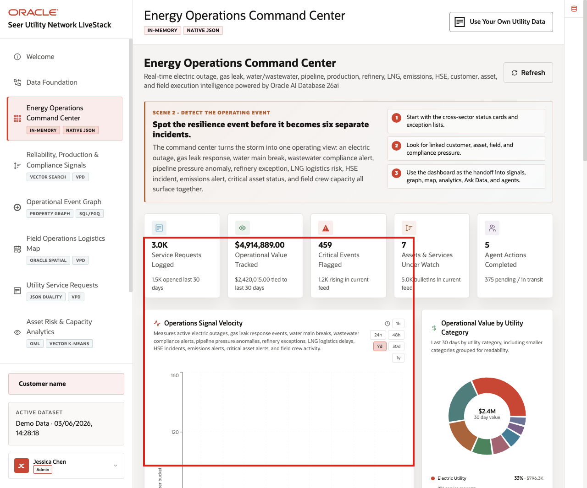
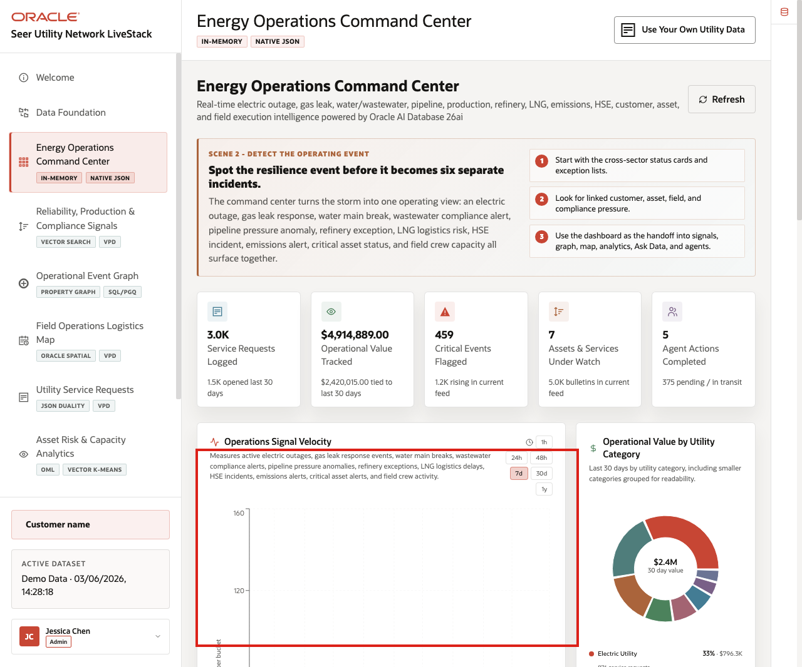

# Scene 3 Energy Operations Command Center

## Introduction

The **Energy Operations Command Center** helps leaders answer the first incident question: *Where does the Gulf Coast operating event need attention right now?*

The page brings together active electric outages, gas leak response events, water main breaks, wastewater compliance alerts, pipeline pressure anomalies, refinery operating exceptions, LNG logistics delays, HSE incidents, emissions alerts, critical asset alerts, customer impact, and field crew status in one operating view.

Dashboards like this are difficult when customer accounts, service points, smart meter events, leak calls, pipeline segments, wells, refineries, water facilities, wastewater records, field crews, compliance evidence, and agent activity live in different systems. Oracle AI Database helps keep operational, analytical, JSON, in-memory, and AI-ready data close to the same governed foundation.

Estimated Time: **10 minutes**

### Objectives

In this scene, you will learn how a cross-sector command center detects operational resilience pressure and hands the investigation to signals, graph, spatial, analytics, Ask Data, and agent workflows.

**Note:** Oracle Internals is collapsed by default. Expand it after the business flow is clear to connect the visible outcome to the database capabilities behind the page.

## Task 1: Review the command center dashboard

Use the dashboard as a daily triage view for the Gulf Coast event. The goal is to see where customer, asset, production, safety, compliance, and field execution pressure is accumulating.

1. Click **Energy Operations Command Center** in the sidebar.
2. Review the KPI cards across the top of the page.
3. Review **Energy Operations Signal Velocity**.
4. Review **Operational Value by Energy and Utilities Category**.
5. Review the watched services, assets, and operating events table.

    

6. Open **Oracle Internals** only after the business flow is clear.

The user should see one cross-sector operating picture instead of separate dashboards for electric reliability, gas safety, water response, wastewater compliance, upstream production, midstream pipeline/LNG logistics, downstream refinery operations, HSE, emissions, and customer service.

**Note:** Sample values may change after data refreshes or rebuilds. Verify live output before presenting, then explain the business takeaway.

## Task 2: Interpret signal velocity and operational value

Perform the following steps to understand where event volume, operational value, reliability risk, production pressure, and compliance exposure are moving at the same time.

1. Click a signal velocity time range such as **24h**, **48h**, **7d**, **30d**, or **1y**.
2. Review how the signal chart changes by time bucket.
3. Review the operational value chart by Energy and Utilities category.
4. Focus the conversation on categories such as electric outage response, gas leak response, water main repair, wastewater compliance, pipeline integrity, upstream production, refinery throughput, LNG logistics, HSE, emissions, and field operations.

    

The key business story is that Energy and Utilities users need to know where value, volume, safety, reliability, production, and compliance risk are moving together so they can choose the right operating response.

## Task 3: Review watched services, assets, and events

Perform the following steps to move from dashboard-level pressure to the specific service, asset program, facility, field partner, customer operation, or compliance record that may need attention.

1. Scroll to the watched services, assets, and operating events table.
2. Use the search box when rows are available.
3. Review columns for service or asset, subsector, signal count, network or operating impact, trend, and next step.
4. Look for cross-sector examples such as **GLK-2208**, **PIPE-17A**, **WMB-4417**, **WWC-9031**, **RFY-HCU-02**, **LNG-7842**, **EMS-1190**, or **HSE-3364** when they are visible.

    

The watched table turns the KPI story into operating decisions. A leader can move from "critical signals are high" to the specific asset, event, customer segment, facility, crew, or compliance workflow that needs review.

*You can move to the next scene.*

## Credits & Build Notes
- **Author** - Oracle LiveLabs Team
- **Last Updated By/Date** - Oracle LiveLabs Team, 2026-06-03
