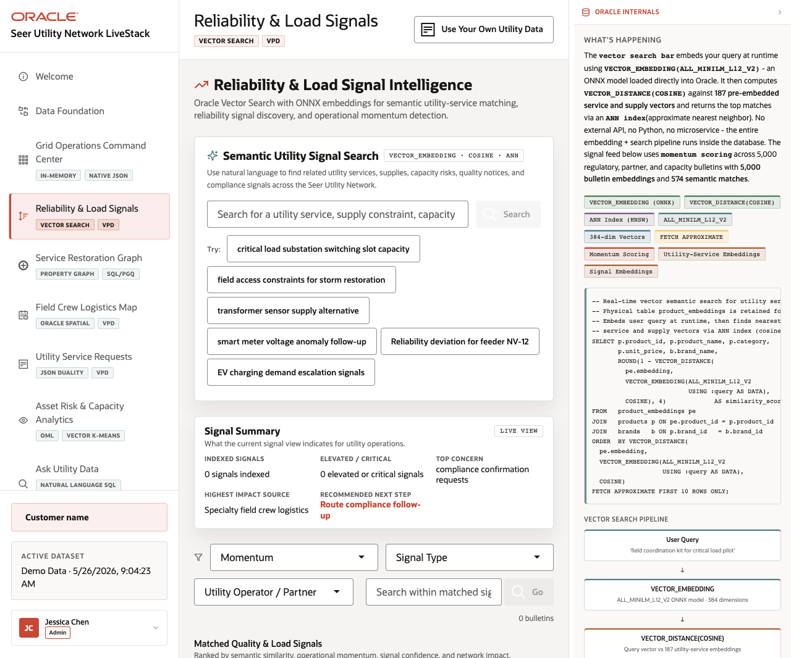
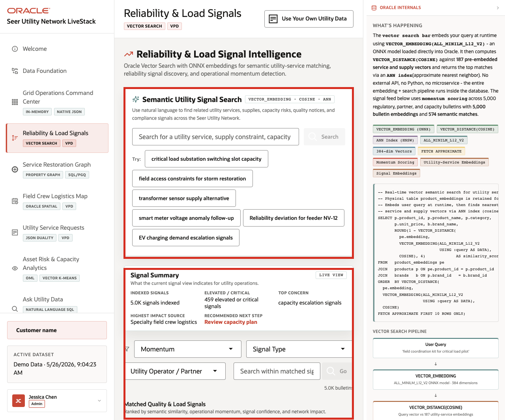

# Scene 4 Reliability and Load Signal Intelligence

## Introduction

**Reliability and Load Signal Intelligence** helps utility teams understand what operational signals are saying before the risk is obvious in service request volume alone.

The page connects capacity alerts, outage notes, smart meter anomalies, field constraints, compliance updates, and service mentions to affected utility services quickly enough to act.

Semantic search is difficult to implement when signals, utility-service catalogs, embeddings, search indexes, and access policies live in separate systems. Utility teams often have to move operational text into external search services, synchronize vector indexes, and then rebuild access control outside the database.

Oracle AI Database helps address these challenges by keeping vector search close to the governed utility data. In this LiveStack Demo, the page uses natural-language search over service and signal embeddings, shows match evidence, and keeps the operating feed tied to database access policies.

Estimated Time: **10 minutes**

### Objectives

In this scene, you will learn what utility decision the page supports, what evidence the user should inspect, and what action the team may take next.

## Task 1: Review the signal feed

Perform the following set of steps to see how reliability, load, capacity, field access, and customer operation signals are summarized for utility teams.

1. Click **Reliability & Load Signals** in the sidebar.
2. Review **Semantic Utility Signal Search** at the top of the page.
3. Review the example query chips, including **critical load substation switching slot capacity**, **field access constraints for storm restoration**, **transformer sensor supply alternative**, and **smart meter voltage anomaly follow-up**.
4. Review the **Signal Summary** cards.
5. Review **Matched Quality & Load Signals** below the summary.

    

In the captured hosted app, the page reports **5.0K** indexed signal bulletins, **459** elevated or critical signals, capacity escalation as the top concern, and a matched signal feed with affected services, open follow-ups, and action labels. Use this as the bridge between raw operational text and governed utility intelligence.

**Note:** Sample values may change after data refreshes or rebuilds. Verify live output before presenting, then explain the business takeaway.

## Task 2: Run semantic utility-service search

Perform the following set of steps to show how a utility user can search by operational intent, not only by exact service names or keywords.

1. Click the **critical load substation switching slot capacity** example query chip, or enter that phrase in the search field.
2. Click **Search** when the search action is enabled.

    

3. Review the service and supply match count returned above the signal summary.
4. Review the matched signal cards below the filters.
5. Use examples such as transformer load assessment, smart meter exchange, field access constraint, and vegetation clearance to explain that this is semantic matching, not simple keyword matching.

The operator can search using real operational language and still find related services, supplies, and signals even when the records use different wording.

## Task 3: Interpret the signal cards

Perform the following set of steps to identify the affected services, severity, evidence, and possible next actions, such as checking logistics impact, opening the restoration graph, or routing a compliance follow-up.

1. Scroll to **Matched Quality & Load Signals**.
2. Review signal type, criticality, source, network impact, match score, related signals, affected services, and open follow-ups when cards are populated.
3. Use action labels such as checking logistics impact, opening the restoration graph, or routing compliance follow-up to explain where the operator could go next.

    

The business value is that teams can make the decision from connected, governed data. Oracle AI Database provides the shared foundation that keeps operational data, analytics, and AI workflows aligned.

*You can move to the next scene.*

## Credits & Build Notes
- **Author** - Oracle LiveLabs Team
- **Last Updated By/Date** - Oracle LiveLabs Team, 2026-05-26
