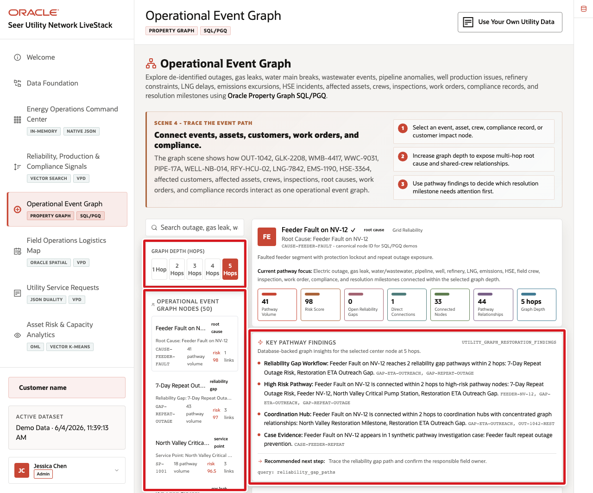
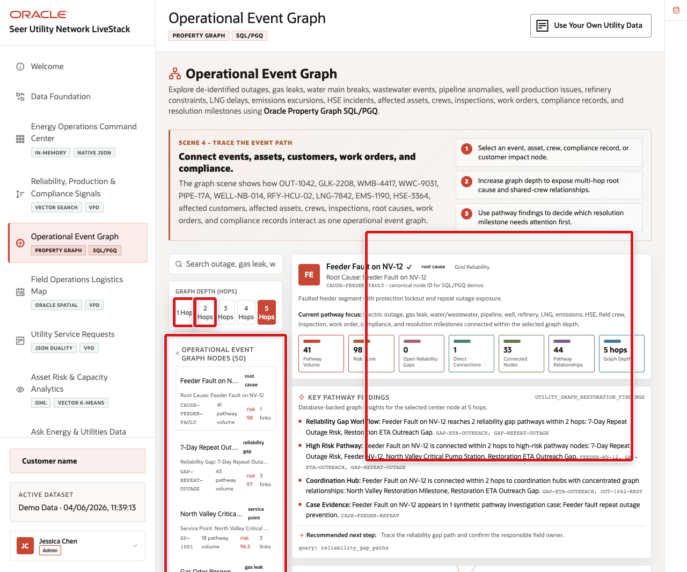
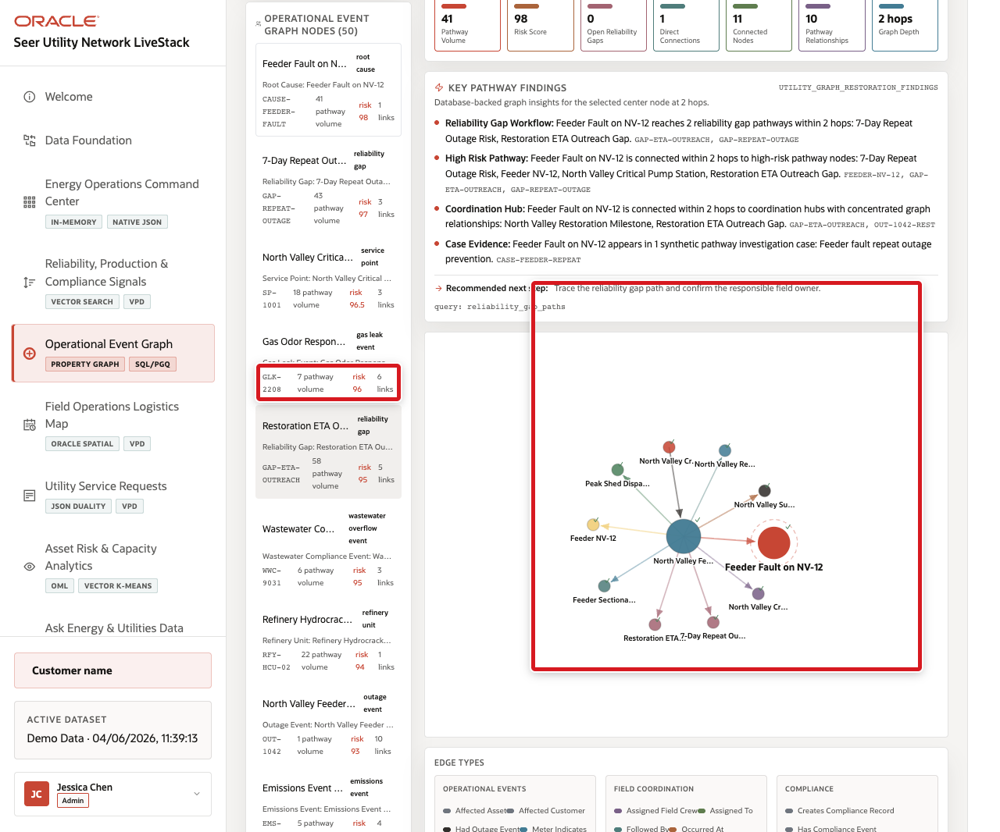
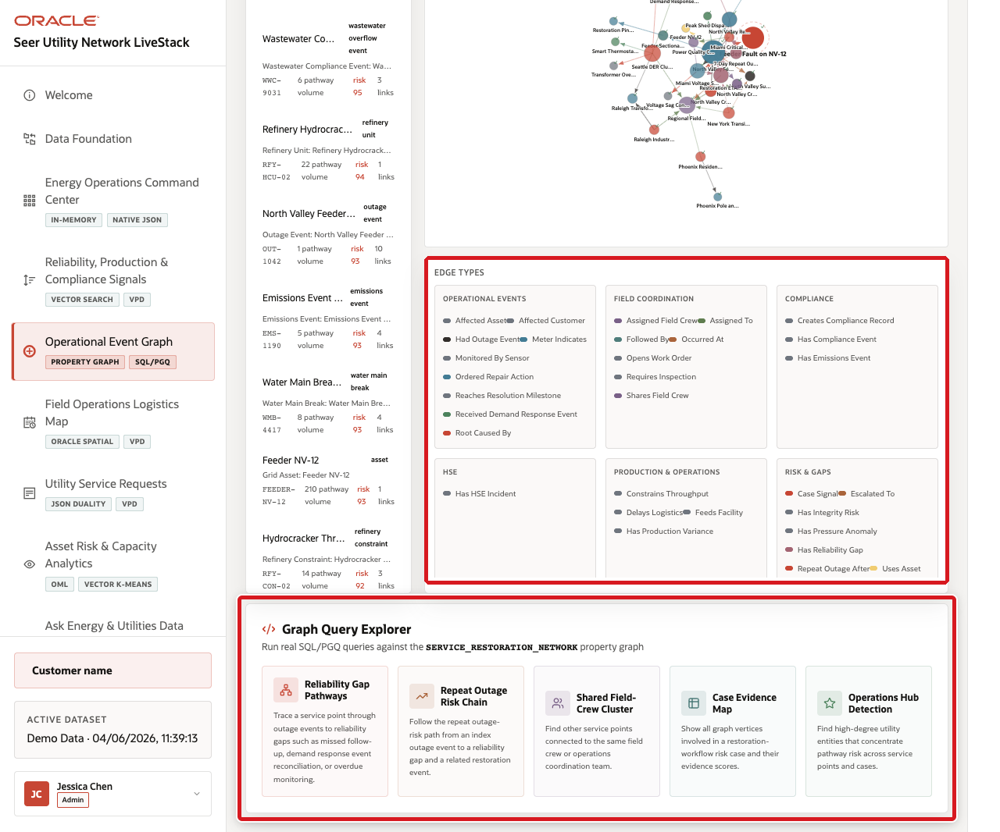

# Scene 5 Operational Event Graph

## Introduction

**Operational Event Graph** helps users understand relationships that are hard to see in isolated rows. The page connects events, assets, customers, crews, work orders, root causes, compliance records, and resolution milestones so teams can follow the Gulf Coast event as a connected operating path.

Energy and Utilities teams struggle when the information needed for one decision lives in separate tools. Oracle AI Database helps answer relationship questions across structured, spatial, graph, vector, and operational data so teams can reason across the event path instead of one record at a time.

Estimated Time: **10 minutes**

### Objectives

In this scene, you will learn how graph relationships connect events, assets, customers, crews, root causes, work orders, compliance records, and resolution milestones across the Gulf Coast event.

## Task 1: Review the graph workspace

Perform the following set of steps to see how the event graph connects records across subsectors:

1. Click **Operational Event Graph** in the sidebar.
2. Review the graph depth controls: **1 Hop**, **2 Hops**, **3 Hops**, **4 Hops**, and **5 Hops**.
3. Review the search field for event, asset, customer impact, crew, root cause, or compliance lookup.
4. Review **Operational Event Graph Nodes**.
5. Expand **Oracle Internals** after the business flow is clear and review the property graph and SQL/PGQ evidence.

    

The graph should include records such as **OUT-1042**, **GLK-2208**, **WMB-4417**, **WWC-9031**, **PIPE-17A**, **WELL-NB-014**, **RFY-HCU-02**, **LNG-7842**, **EMS-1190**, **HSE-3364**, affected customers, affected assets, crews, inspections, root causes, work orders, and compliance records.

**Note:** Sample values may change after data refreshes or rebuilds. Verify live output before presenting, then explain the business takeaway.

## Task 2: Explore a cross-sector event example

Perform the following set of steps to show how connected evidence can reveal shared root causes, shared crew constraints, affected assets, customer impact, and compliance exposure:

1. In the node list, locate **GLK-2208**, **PIPE-17A**, **OUT-1042**, or another high-priority event node.
2. Review the node type, identifier, pathway volume, risk score, and link count.
3. Compare it with nearby event, asset, HSE, emissions, work order, or compliance nodes.
4. Change the graph depth from **1 Hop** to **2 Hops** or **3 Hops** to explain how relationship scope changes.

    

Use this example to show why graph context matters: a pipeline pressure anomaly, gas leak response, HSE incident, crew assignment, customer impact, and compliance record are more informative together than as isolated records.

**Note:** Sample values may change after data refreshes or rebuilds. Verify live output before presenting, then explain the business takeaway.

## Task 3: Explain the Oracle graph pattern

Perform the following set of steps to explain how the graph remains an analysis view over governed Energy and Utilities data rather than a disconnected copy:

1. Review the **Graph Query Explorer** area.
2. Review the Oracle Internals content that references property graph and SQL/PGQ.
3. Explain that the graph is an analysis view over governed Energy and Utilities data rather than a disconnected copy.

    

The business value is that teams can make the decision from connected, governed data. **Oracle AI Database** provides the shared foundation that keeps operational data, analytics, and AI workflows aligned.

*You can move to the next scene.*

## Credits & Build Notes
- **Author** - Oracle LiveLabs Team
- **Last Updated By/Date** - Oracle LiveLabs Team, 2026-06-03
