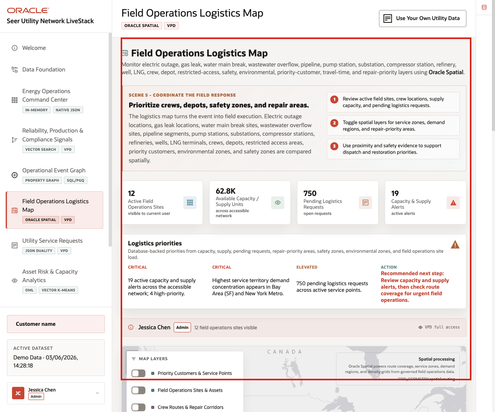
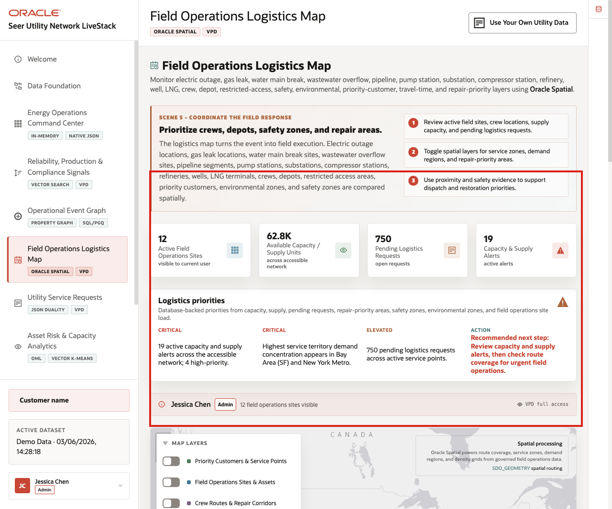
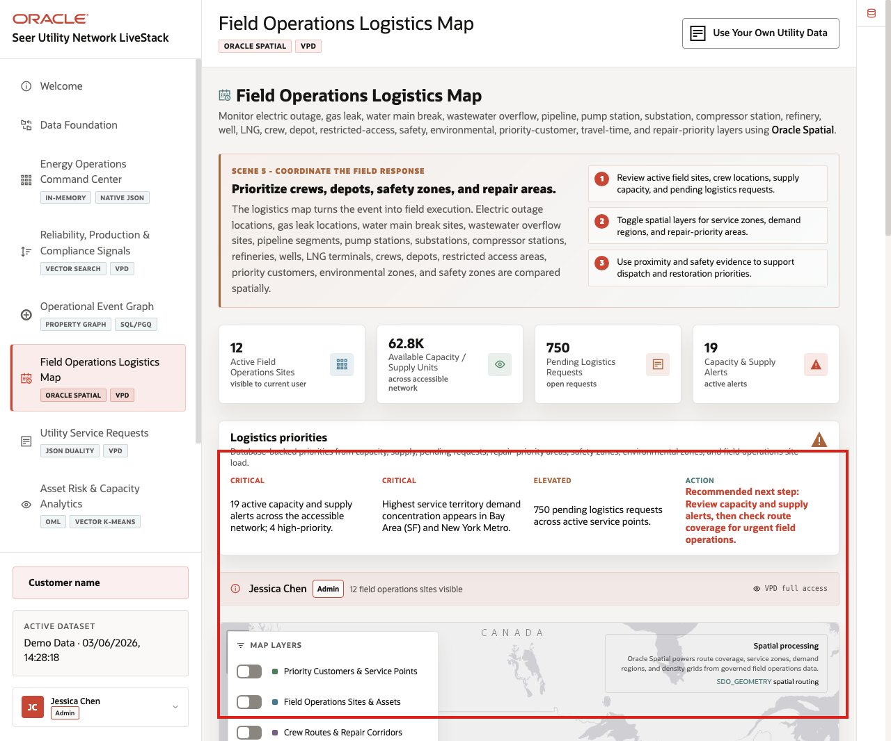

# Scene 6 Field Operations Logistics Map

## Introduction

**Field Operations Logistics Map** helps teams decide where crews, depots, priority customers, restricted access areas, safety zones, environmental zones, and repair-priority areas intersect. The page compares electric outage locations, gas leak locations, water main break locations, wastewater overflow locations, pipeline segments, pump stations, substations, compressor stations, refineries, wells, LNG terminals, crew locations, depot locations, and estimated travel time.

Location-aware decisions are difficult when field sites, routes, service zones, safety constraints, environmental areas, and operating events live outside the operational data platform. Oracle AI Database keeps spatial geometry and operational records together so the map can support dispatch, restoration, repair, safety, and compliance decisions.

Estimated Time: **10 minutes**

### Objectives

In this scene, you will learn how Oracle Spatial supports cross-sector field execution across electric, gas, water/wastewater, upstream, midstream, downstream, HSE, emissions, and customer operations.

## Task 1: Review logistics priorities

Perform the following steps to understand where demand, repair priority, field access, safety, environmental constraints, and route coverage may require attention.

1. Click **Field Operations Logistics Map** in the sidebar.
2. Review the stat cards across the top of the page.
3. Review **Logistics priorities** to the right of the cards.
4. Review the active user and VPD banner.

**Note:** Access controls help ensure users see only the Energy and Utilities data they are allowed to see, which matters for customer records, service requests, operational assets, safety-sensitive details, and AI governance.

    

Use the priority panel to connect field execution to the story: crews may need to respond to **OUT-1042**, **GLK-2208**, **WMB-4417**, **WWC-9031**, **PIPE-17A**, **RFY-HCU-02**, **LNG-7842**, **EMS-1190**, or **HSE-3364** depending on proximity, safety, access, and operational priority.

**Note:** Sample values may change after data refreshes or rebuilds. Verify live output before presenting, then explain the business takeaway.

## Task 2: Toggle spatial layers

Perform the following steps to compare different field operations questions: where incidents are located, where crews and depots are available, how routes connect, which zones are covered, which assets are nearby, and which areas have safety or environmental constraints.

1. Review the map and its layer controls.
2. Toggle service point or customer-priority layers.
3. Toggle field operations sites, routes, and zones.
4. Toggle density, demand, repair-priority, safety, or environmental layers when available.
5. Review how the map changes as layers are added or removed.

    

The layer controls let different users answer different operating questions, such as where a gas leak response overlaps with a safety zone, which crew is closest to a water main break, which depot can support pipeline repair, or which environmental zone affects restoration timing.

## Task 3: Compare site data with the map

Perform the following steps to connect visual location context with concrete operating records such as capacity, pending requests, alerts, current load, travel time, and status.

1. Scroll to the field operations sites table.
2. Review columns for site location, site type, services supported, capacity or supply units, pending requests, alerts, current load, and status.
3. Focus on visible sites such as dispatch depots, water response centers, restoration hubs, compressor stations, refineries, LNG terminals, or regional operations centers when available.
4. Use the table to connect map markers to concrete operating records.

    

The business value is that teams can make the decision from connected, governed data. Oracle AI Database provides the shared foundation that keeps operational data, spatial analysis, analytics, and AI workflows aligned.

*You can move to the next scene.*

## Credits & Build Notes
- **Author** - Oracle LiveLabs Team
- **Last Updated By/Date** - Oracle LiveLabs Team, 2026-06-03
