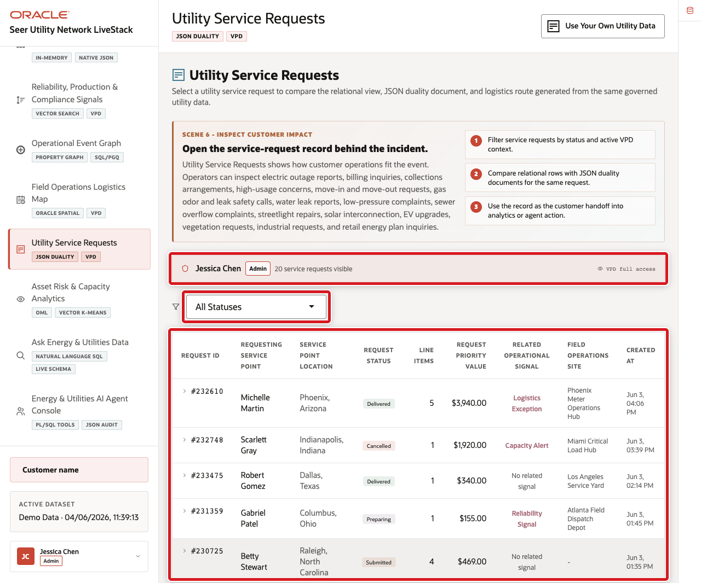
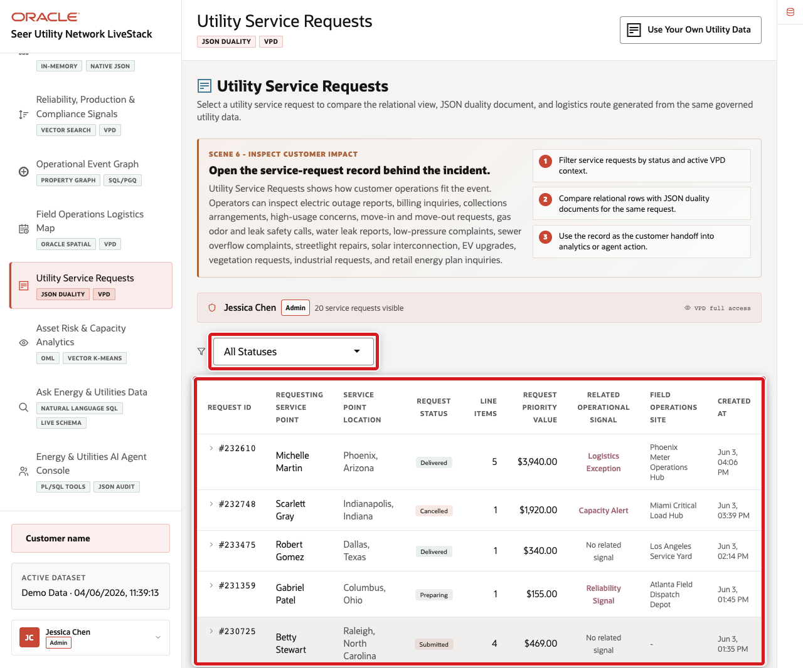
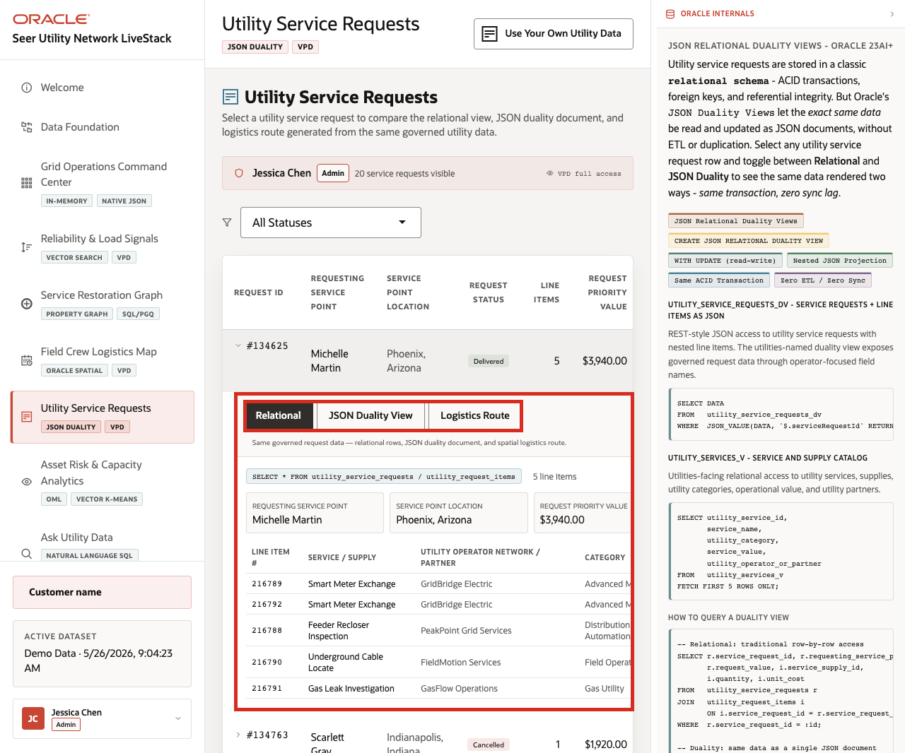
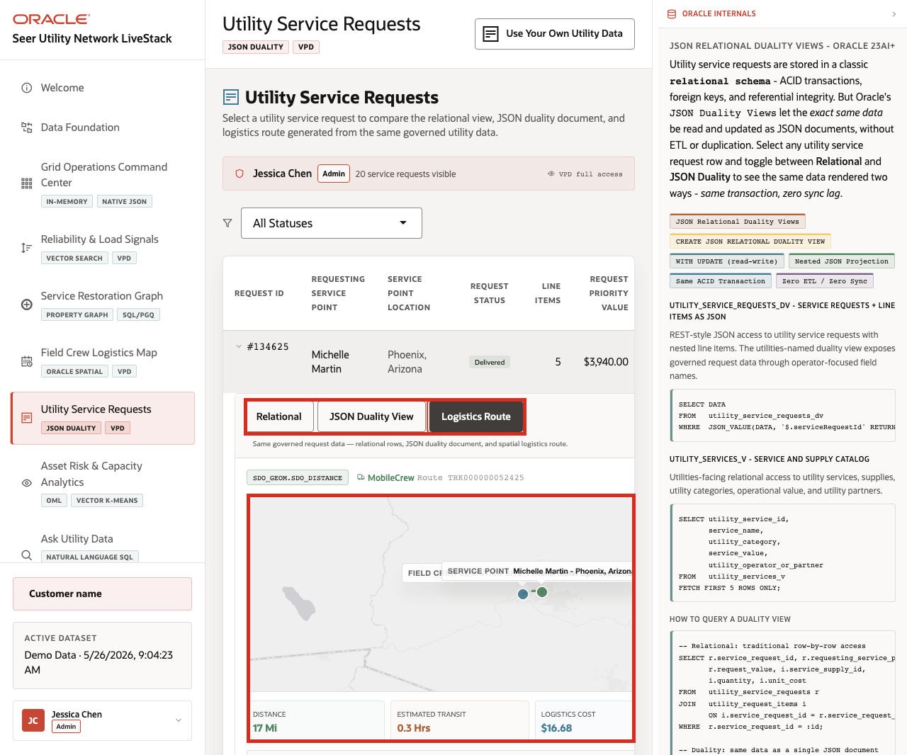

# Scene 7 Utility Service Requests

## Introduction

**Utility Service Requests** shows how one service request can support several workflows at once. Operations teams need request and line-item detail, application teams need document-shaped access, and field teams need route and logistics context.

Utility teams struggle when the information needed for one decision lives in separate tools. That separation slows action, increases reconciliation work, and makes it harder to trust the result.

Oracle AI Database helps address these challenges by keeping the utility service request record in one governed platform while exposing it through the shape each workflow needs. Relational tables provide transactional detail. JSON Relational Duality Views expose the same request as a nested JSON document. Oracle Spatial adds logistics route and distance context.

Estimated Time: **10 minutes**

### Objectives

In this scene, you will learn what utility decision the page supports, what evidence the user should inspect, and what action the team may take next.

## Task 1: Review the service request workspace

Perform the following set of steps to establish the operational context: who requested service support, what status the request is in, what value or priority is involved, and which field logistics site is responsible.

1. Click **Utility Service Requests** in the sidebar.
2. Review the active user banner. The current demo user is **Jessica Chen**, with **Admin** access and **20** visible service requests on the page.
3. Review the status filter.
4. Review the request table columns: request id, requesting service point, service point location, request status, line items, request priority value, reliability or load signal, field crew logistics site, and created time.
5. Focus on the first visible request in the table.

    

In the captured hosted app, the first visible request is **#134625** for **Michelle Martin** in **Phoenix, Arizona**. It is **Delivered**, has **5** line items, totals **$3,940.00**, and appears in the VPD-visible request list for the admin user. Use the visible first row as the data point for the rest of the scene.

**Note:** Sample values may change after data refreshes or rebuilds. Verify live output before presenting, then explain the business takeaway.

## Task 2: Inspect the relational request detail

Perform the following set of steps to validate the request header, service point, line items, priority value, logistics cost, and item-level information that operations teams need for service follow-up.

1. Click the first visible request row.
2. Confirm the **Relational** tab is selected.
3. Review requesting service point, service point location, request priority value, logistics cost, and line items when the detail panel loads.

    

**Expected result:** The UI returns the same type of result shown here. Exact rows, scores, or counts may vary by dataset, so verify the current values and focus the explanation on the operational pattern.

## Task 3: Compare the JSON Duality View

Perform the following set of steps to show that the same governed request can support both operations users and application teams without creating separate copies of the record.

1. Click **JSON Duality View** in the expanded request panel.
2. Review the source label for the utility service request duality view.
3. Review the JSON document for the selected request.
4. Notice that the document should include request identifiers, service point identifiers, request status, request value, logistics cost, demand score, created timestamp, and nested line items.

    

The key point is that the request is not copied into a separate document store. The same governed request can appear as operational detail or as a document shape for applications.

## Task 4: Review logistics route context

Perform the following set of steps to connect the service request to the field logistics site, service point, distance, transit time, logistics cost, route status, and request progress.

1. Click **Logistics Route** in the expanded request panel.
2. Review the field crew logistics site and service point.
3. Review distance, estimated transit, logistics cost, route status, and request progress.
4. Review the Oracle Spatial SQL example.

    

The business value is that teams can make the decision from connected, governed data. Oracle AI Database provides the shared foundation that keeps operational data, analytics, and AI workflows aligned.

*You can move to the next scene.*

## Credits & Build Notes
- **Author** - Oracle LiveLabs Team
- **Last Updated By/Date** - Oracle LiveLabs Team, 2026-05-26
