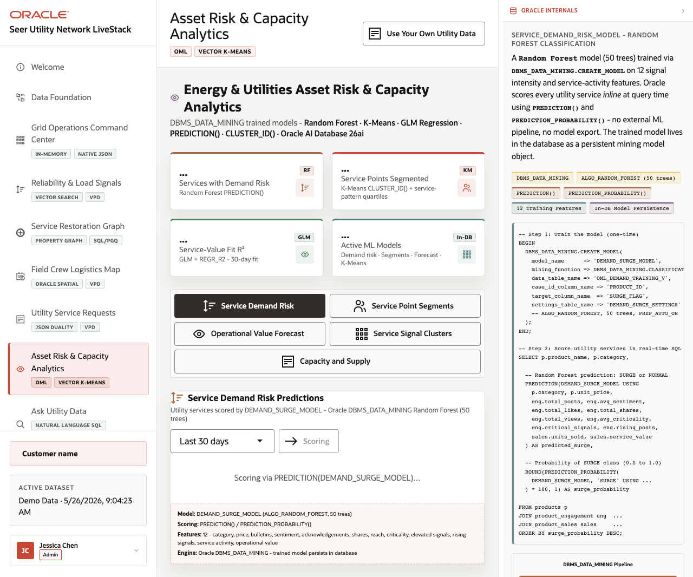
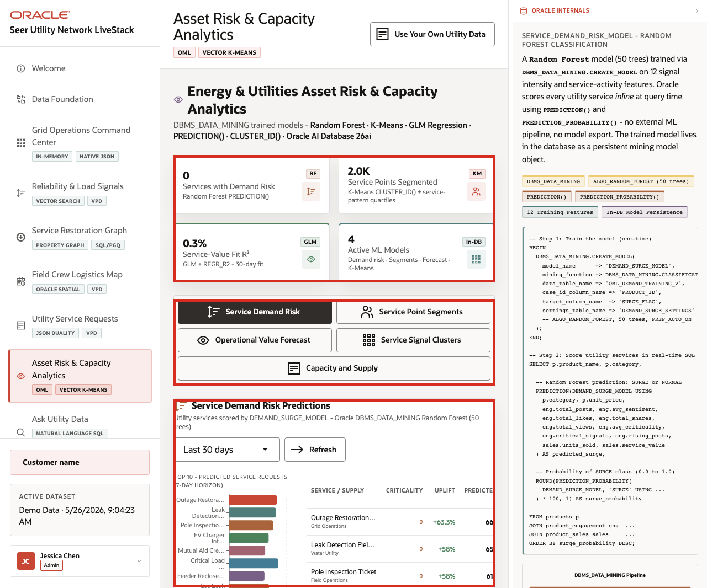
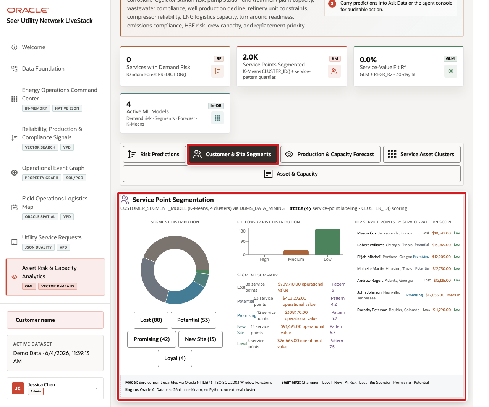
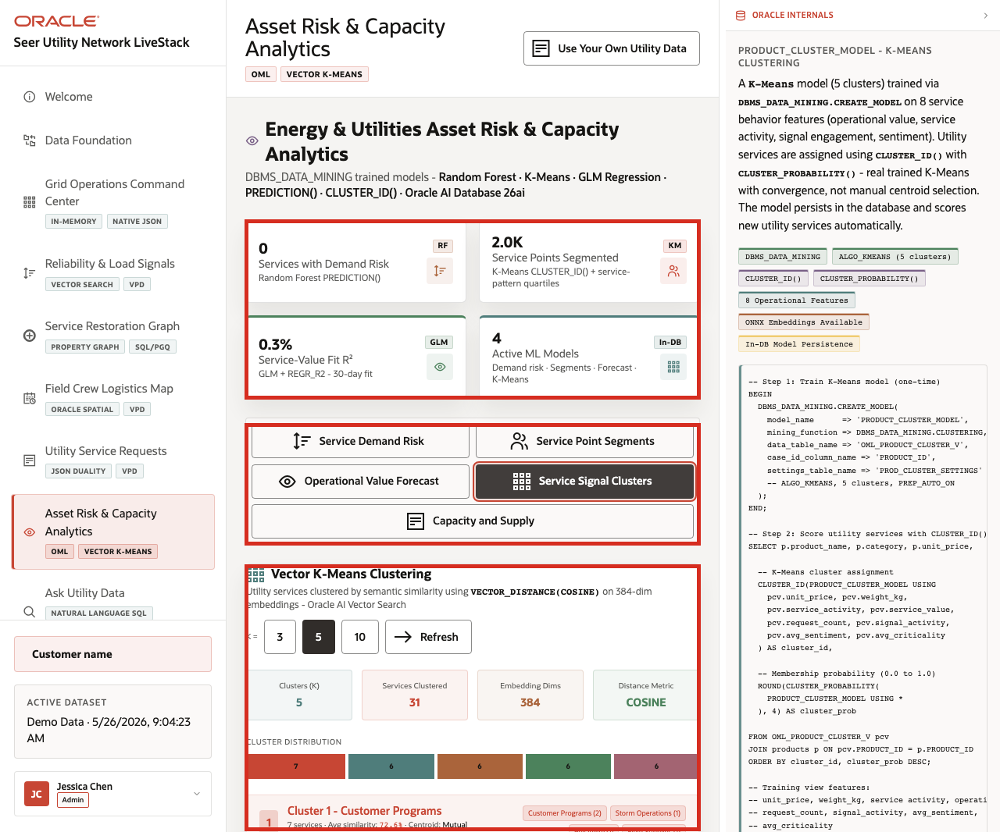
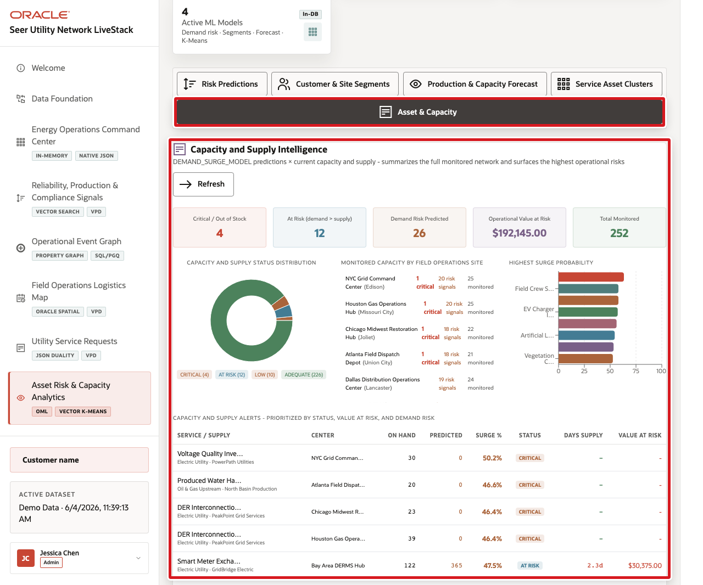

# Scene 8 Asset Risk and Capacity Analytics

## Introduction

**Asset Risk and Capacity Analytics** helps utility teams decide which predictive signals should become operational action. The page brings together demand risk, service point segments, operational value forecasting, semantic service clusters, and capacity or supply risk so teams can plan follow-up before field response or customer operations are affected.

Utility teams struggle when the information needed for one decision lives in separate tools. That separation slows action, increases reconciliation work, and makes it harder to trust the result.

Oracle AI Database helps address these challenges by keeping machine learning close to governed utility data. Oracle Machine Learning models and SQL analytics can run from the same connected data foundation that powers the rest of the LiveStack Demo.

Estimated Time: **12 minutes**

### Objectives

In this scene, you will learn what utility decision the page supports, what evidence the user should inspect, and what action the team may take next.

## Task 1: Inspect Service Demand Risk

Perform the following set of steps to identify utility services where predicted demand may require field capacity planning, supply review, customer outreach, asset review, or operational follow-up.

1. Click **Asset Risk & Capacity Analytics** in the sidebar.
2. Review the KPI cards at the top of the page: **Services with Demand Risk**, **Service Points Segmented**, **Service-Value Fit R2**, and **Active ML Models**.
3. Review the analytics tabs: **Service Demand Risk**, **Service Point Segments**, **Operational Value Forecast**, **Service Signal Clusters**, and **Capacity and Supply**.
4. Confirm that **Service Demand Risk** is selected.
5. Review the scoring window, **Refresh** control, and prediction output when the model returns rows.

    

In the captured demo dataset, the analytics page shows **2.0K** service points segmented, a **0.3%** service-value fit R2, and **4** active ML models. The Service Demand Risk tab surfaces a ranked prediction output with services such as outage restoration dispatch, leak detection field visits, pole inspection tickets, and EV charger interconnection reviews.

**Note:** Sample values may change after data refreshes or rebuilds. Verify live output before presenting, then explain the business takeaway.

## Task 2: Review Service Point Segments

Perform the following set of steps to turn model output into groups of service points that may need follow-up, targeted outreach, maintenance planning, demand response, or billing support.

1. Click **Service Point Segments**.
2. Review the segmentation model note for K-Means and service-pattern quartiles.
3. Review the segment distribution and highest-scoring service points when the output is populated.

    

Segmentation becomes operational when teams can turn service point groups into follow-up, outreach, maintenance planning, demand response, or billing support actions.

## Task 3: Interpret Operational Value Forecast

Perform the following set of steps to understand both the expected value trend and how much confidence planners should place in it.

1. Click **Operational Value Forecast**.
2. Review the forecast horizon selector and **Refresh** control.
3. Review the model quality cards and forecast chart.
4. Explain that a weak model fit tells planners to treat the forecast as directional, not certain. This builds trust because the demo does not hide weak predictions.

    

This page helps a user connect business value and operational volume to a governed forecast path. The model output is near the service and request data it uses, not in a disconnected notebook.

## Task 4: Explore Service Signal Clusters

Perform the following set of steps to see how related utility services and signals group together by meaning, which can support comparison, planning, and operational review.

1. Click **Service Signal Clusters**.
2. Review the **K =** controls.
3. Review the cluster count, services clustered, embedding dimensions, and distance metric when clustering completes.
4. Review a cluster card and its related services.

    

Use this tab to explain how vector similarity can group utility services and supplies by meaning. For example, smart meter exchange, transformer load assessment, vegetation clearance, and field access signals may cluster by operational similarity even when they use different text.

## Task 5: Review Capacity and Supply

Perform the following set of steps to connect predicted demand with available capacity, supply status, surge probability, site pressure, and operational value at risk.

1. Click **Capacity and Supply**.
2. Review the summary cards.
3. Review the capacity and supply status distribution.
4. Review monitored capacity by field crew logistics site.
5. Scan the highest surge probability chart for services or supplies that need attention.

    

In the captured demo dataset, the tab shows **4** critical or out-of-stock items, **12** at-risk items where demand exceeds supply, **26** demand-risk predictions, about **$192,145.00** operational value at risk, and **252** monitored records. This turns model output into an operating view: the user can see which sites and services need attention before a capacity issue affects field response or customer operations.

**Note:** Sample values may change after data refreshes or rebuilds. Verify live output before presenting, then explain the business takeaway.

*You can move to the next scene.*

## Credits & Build Notes
- **Author** - Oracle LiveLabs Team
- **Last Updated By/Date** - Oracle LiveLabs Team, 2026-05-26
