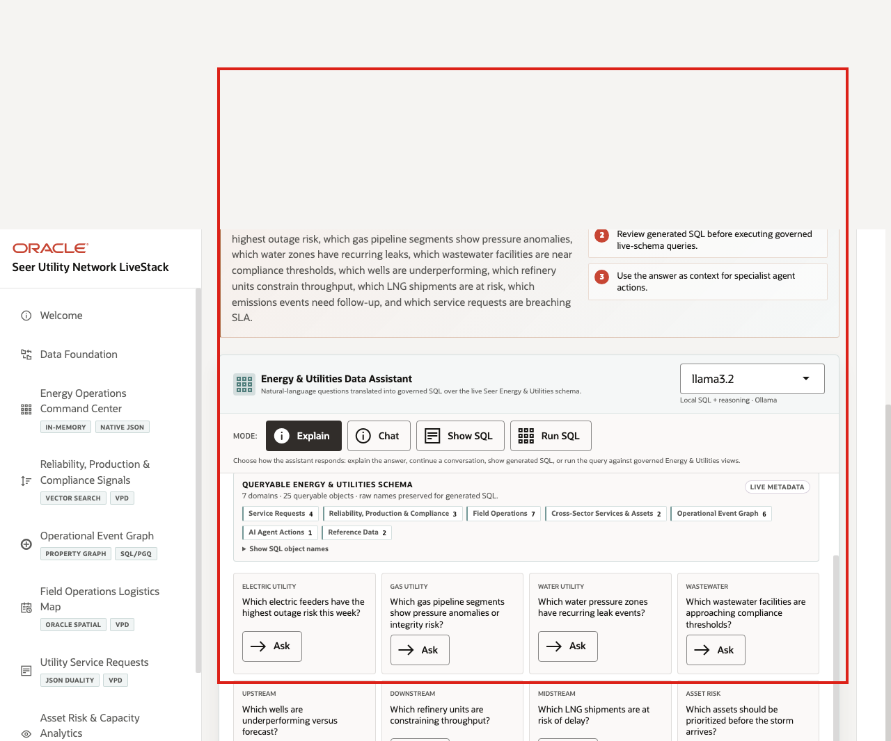
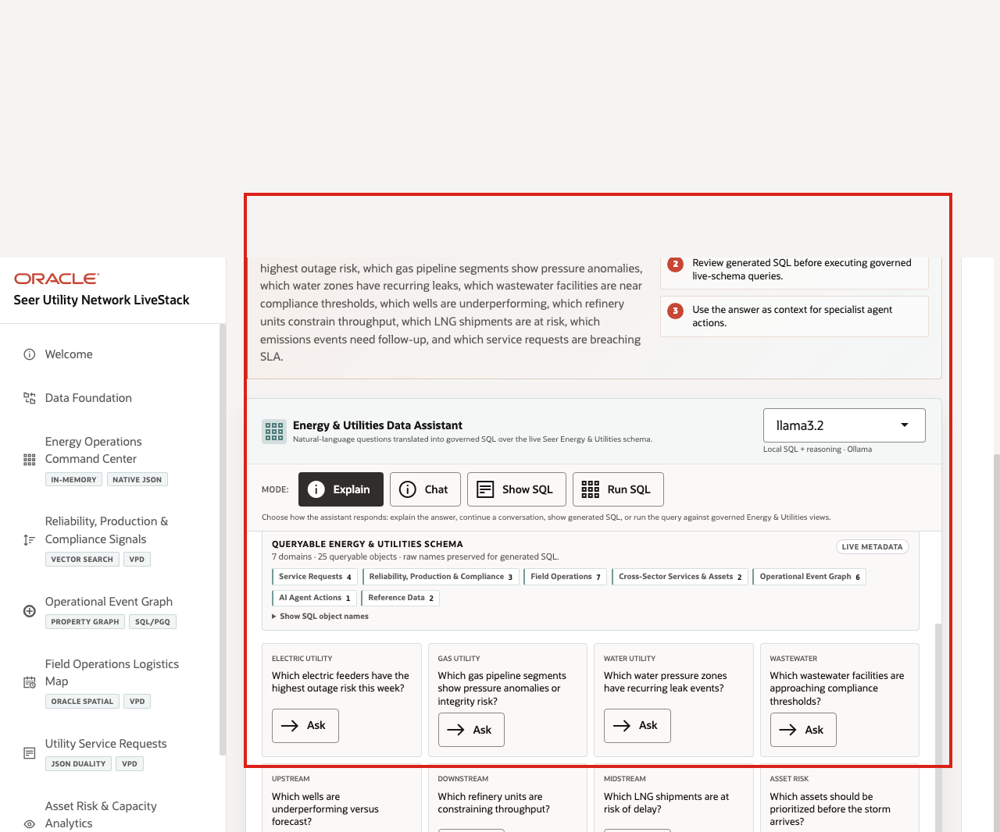

# Scene 9 Ask Energy & Utilities Data

## Introduction

**Ask Energy & Utilities Data** helps users ask operational questions in plain language while keeping the answer path visible. Users can compare narrated answers, conversational responses, generated SQL, and returned rows across electric, gas, water/wastewater, upstream, midstream, downstream, customer, field, HSE, emissions, and regulatory data.

Natural-language data access can create governance risk if the language model generates invalid SQL, references the wrong objects, hides the query path, or exposes more data than the user should see. Oracle AI Database keeps query execution grounded in the live Energy and Utilities schema while the UI shows the selected mode and generated SQL path.

**Note:** Ollama provides the local AI runtime used for reasoning, while Oracle remains the governed source for data access and execution.

Estimated Time: **10 minutes**

### Objectives

In this scene, you will learn how governed natural-language SQL can support cross-sector operating questions without hiding the query path.

## Task 1: Review the assistant workspace

Perform the following steps to show how Energy and Utilities users can ask questions in plain language while still keeping the query path visible and controlled.

1. Click **Ask Energy & Utilities Data** in the sidebar.
2. Review the runtime profile in the top right of the assistant card.
3. Review the queryable schema summary and domain groups.
4. Review the available modes: **Explain**, **Chat**, **Show SQL**, and **Run SQL**.
5. Review the example questions.

    

Use this opening view to explain that the assistant is not a generic chatbot. It is a governed Energy and Utilities data assistant that uses schema metadata, visible query modes, and Oracle-backed execution.

## Task 2: Use Explain mode for a narrated answer

Perform the following steps when the user wants a business-readable answer first.

1. Click **Explain**.
2. Ask a cross-sector question such as **Which gas pipeline segments show pressure anomalies or integrity risk?**, **Which wastewater facilities are approaching compliance thresholds?**, or **Which assets should be prioritized before the storm arrives?**

    

**Expected result:** The assistant returns a narrated answer and key findings without making generated SQL the main artifact. The response should connect the business answer to governed Energy and Utilities data rather than returning raw rows as the main story.

**Notes:**

- Sample values may change after data refreshes or rebuilds. Verify live output before presenting, then explain the business takeaway.
- Use this mode when the user wants a business-readable answer first. The system still uses governed SQL behind the scenes.

## Task 3: Use Chat mode for a conversational answer

Perform the following steps when the user is exploring the data interactively and may want follow-up questions, regional breakdowns, or a more conversational explanation.

1. Click **Clear** if the Explain result is still visible.
2. Click **Chat**.
3. Ask a related question, such as **Which customer service requests are breaching SLA?** or **Which emissions events require regulatory follow-up?**

    

**Expected result:** The assistant returns a conversational response and follow-up prompts grounded in the live Energy and Utilities schema.

## Task 4: Use Show SQL mode to inspect the query path

Perform the following steps when a data steward, operator, or reviewer needs to see the query path before rows are returned.

1. Click **Clear** if the Chat result is still visible.
2. Click **Show SQL**.
3. Ask a question such as **Which electric feeders have the highest outage risk this week?**, **Which wells are underperforming versus forecast?**, or **Which refinery units are constraining throughput?**
4. Review the generated SQL.

    

This is the governance moment: the user can inspect the generated SQL before asking the database to return rows.

## Task 5: Use Run SQL mode to inspect returned rows

Perform the following steps to inspect the live rows behind the answer. This helps the user connect a plain-English question to specific assets, facilities, customers, service requests, emissions events, or compliance records.

1. Click **Clear** if the generated SQL result is still visible.
2. Click **Run SQL**.
3. Ask a question such as **Which maintenance plans are blocked by crew or parts availability?** or rerun the previous question.
4. Review the returned table.

    

Use the completed mode examples to explain the governance pattern behind the page:

1. The user asks an Energy and Utilities question in plain English.
2. The app builds prompt and schema context for the selected runtime profile.
3. Ollama drafts SQL or a response plan.
4. Oracle AI Database executes authorized SQL against the live schema.
5. The UI returns visible SQL, rows, or a narrated answer depending on the selected mode.

This pattern matters because operators want faster answers, but they also need governed access, visible query logic, and a trusted execution layer.

*You can move to the next scene.*

## Credits & Build Notes
- **Author** - Oracle LiveLabs Team
- **Last Updated By/Date** - Oracle LiveLabs Team, 2026-06-03
