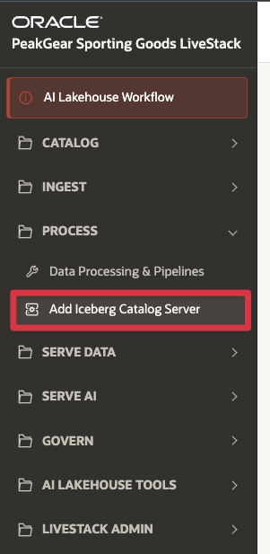
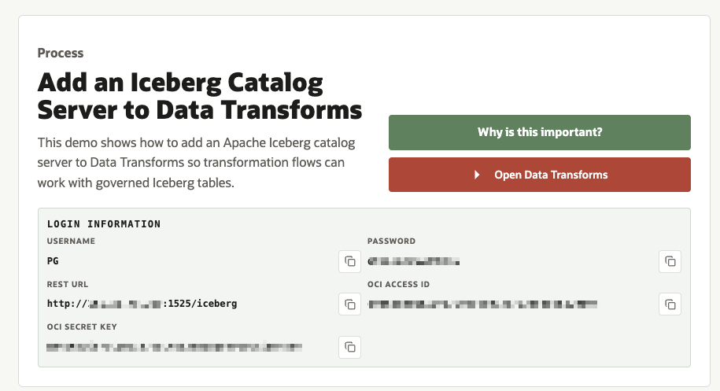
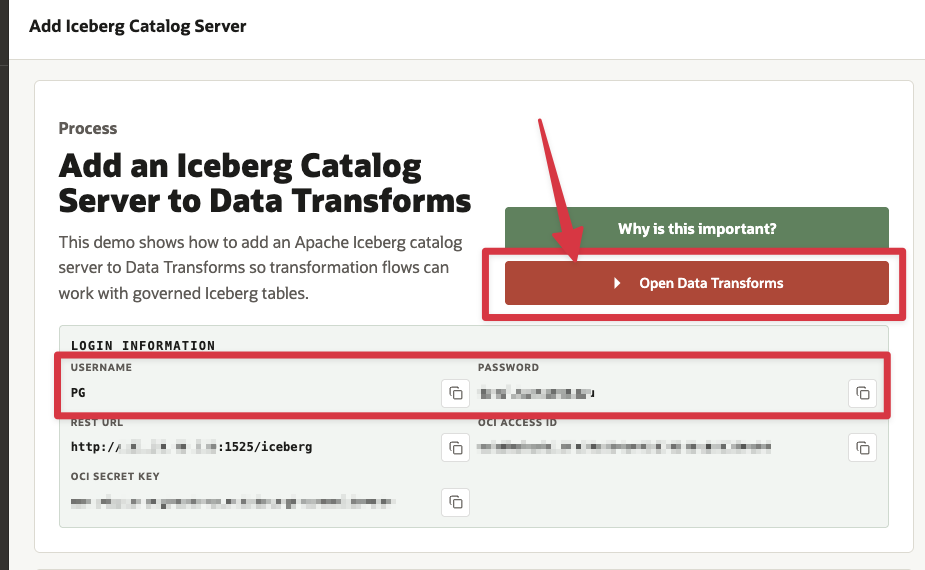
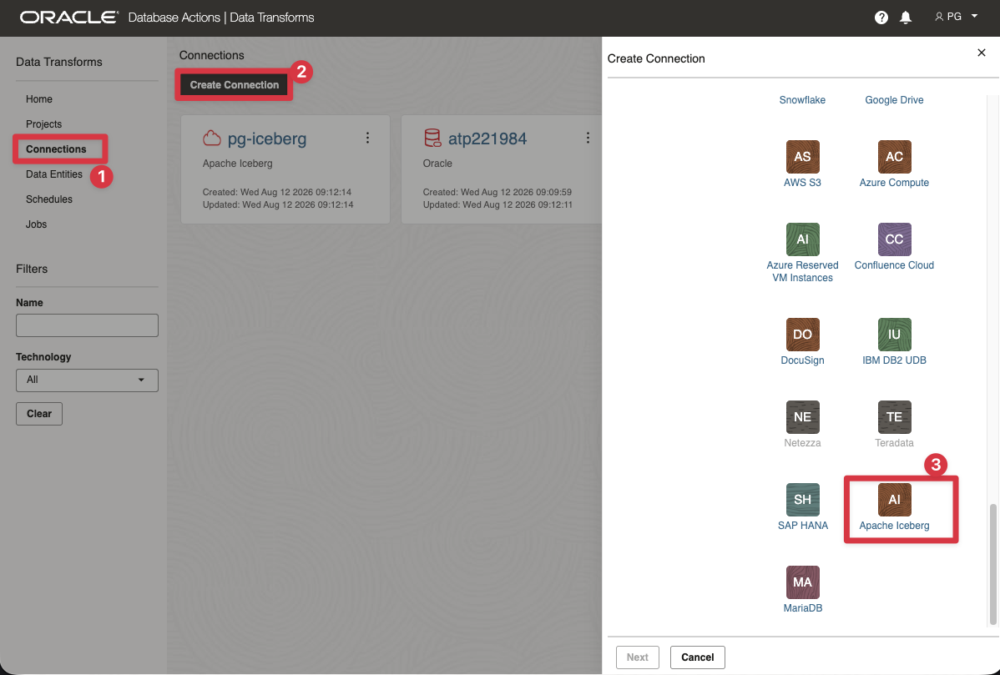
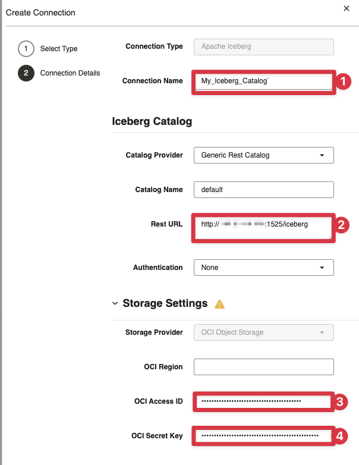
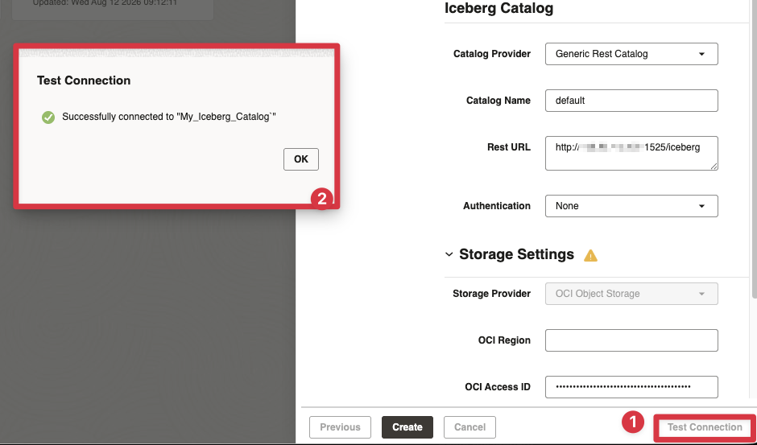
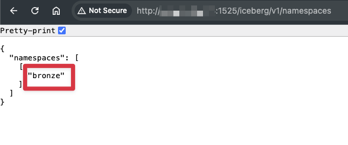
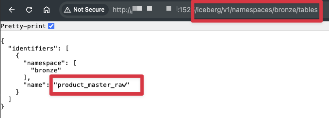
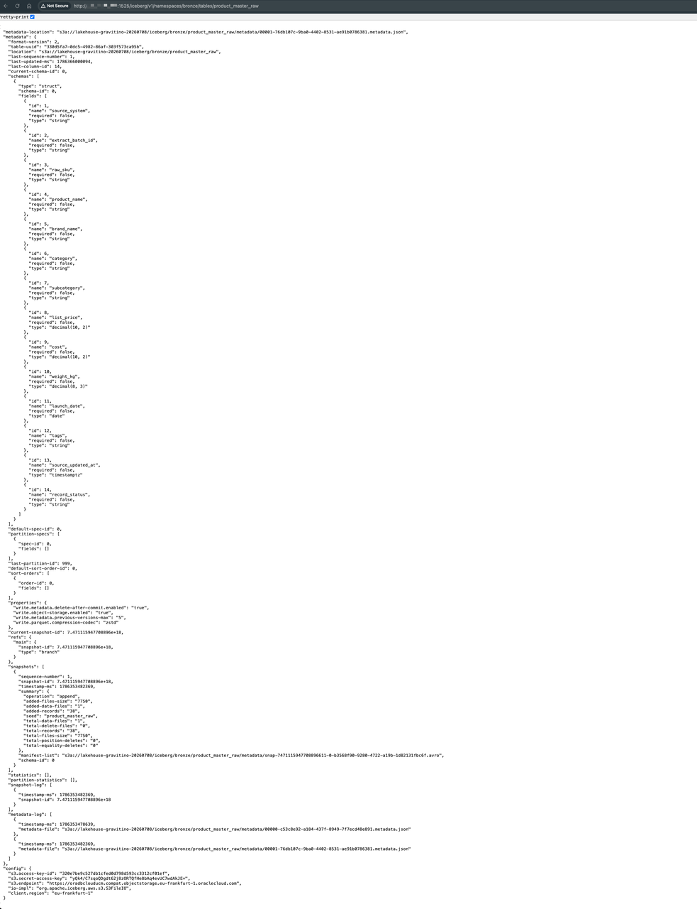

# Add an Apache Iceberg Catalog Server

## Introduction

**PeakGear** stores raw and curated data in the **AI Lakehouse**. A shared catalog lets different data tools find and use the same Iceberg tables.

**Apache Iceberg** is an open table format for analytical data stored in object storage. It manages table metadata separately from the data files, which lets compatible tools handle transactional updates, schema and partition changes, and older table versions. Multiple tools can work with the same table instead of each maintaining a separate copy.

An Apache Iceberg catalog gives tools one place to find table metadata. Without it, each team would need to manage object-storage paths and table details separately. In this scene, **Oracle Data Transforms** connects to the REST catalog and uses the namespaces and tables it publishes.

The connection can also use **OCI Object Storage** credentials when Data Transforms requests access to the table files.

This scene covers the **Catalog** stage of the AI Lakehouse. You add a new **Apache Iceberg** catalog server connection in Oracle Data Transforms using the values shown in the LiveStack. The connection points Data Transforms to the Iceberg REST service and the tables used by the demo.

Estimated Time: **10 minutes**

### Objectives

In this scene, you will:

- Open the **Add Iceberg Catalog Server** demo from the **Process** menu.
- Open Oracle Data Transforms and sign in with the displayed PG credentials.
- Create a new Apache Iceberg catalog server connection.
- Configure the connection with the LiveStack REST URL and OCI Object Storage credentials.
- Test the connection and confirm that the Iceberg namespace is available.

## Task 1: Open the Add Iceberg Catalog Server demo

Open the **Add Iceberg Catalog Server** demo from the **Process** menu:

1. In the left sidebar, expand **Process**.
2. Select **Add Iceberg Catalog Server**.
3. Confirm that the page title is **Add Iceberg Catalog Server**.

The page explains the catalog server and shows the values required for the connection. Keep this tab open while you configure Data Transforms.

## Task 2: Review and copy the connection values

The **Login Information** panel shows the values you need:

1. The **Username** and **Password** for Data Transforms.
2. The **REST URL** for the LiveStack Iceberg REST catalog.
3. The **OCI Access ID** and **OCI Secret Key**. Use these only when Data Transforms prompts for OCI Object Storage credentials.

## Task 3: Open and sign in to Data Transforms

Open **Data Transforms**:

1. Click **Open Data Transforms**.
2. Enter the PG username and password copied from the LiveStack page.
3. Click **Connect**.
4. Keep the LiveStack tab open so that you can return to it when you need to copy a connection value.

## Task 4: Create an Apache Iceberg connection

Create the catalog server connection:

1. From the Data Transforms home page, open **Connections**.
2. Click **Create Connection**.
3. Select **Apache Iceberg** as the technology.
4. Provide the following values:

| Data Transforms setting              | Value                                                |
| --------------------------------------| ------------------------------------------------------|
| Connection Name                      | `My_Iceberg_Catalog`                                 |
| Catalog provider                     | `Generic Rest Catalog`                               |
| Catalog name                         | `default`                                            |
| REST URL                             | Paste the **REST URL** from the LiveStack page       |
| Authentication                       | `None`                                               |
| OCI Region (in Storage Settings)     | Leave empty                                          |
| OCI Access ID (in Storage Settings)  | Paste the **OCI Access ID** from the LiveStack page  |
| OCI Secret Key (in Storage Settings) | Paste the **OCI Secret Key** from the LiveStack page |

## Task 5: Test and save the connection

Test and save the catalog server connection:

1. Click **Test Connection**.
2. Confirm that Data Transforms reports a successful connection.
3. Click **Save** or **Create**.
4. Return to the Connections or Data Servers list and confirm that `My_Iceberg_Catalog` appears as an Apache Iceberg connection.

## Task 6: Verify catalog server content

Verify the catalog contents:

1. Open a new browser tab. Enter the **REST URL** from the LiveStack page followed by `iceberg/v1/namespaces`. Confirm that the response lists the available namespaces on the catalog server.

2. Append `/bronze/tables` to the URL. Confirm that the response lists the tables in the namespace.

3. Append the table path to the URL. The complete URL is the **REST URL** from the LiveStack page followed by `iceberg/v1/namespaces/bronze/tables/product_master_raw`. Confirm that the response shows the metadata for the Iceberg table.

The table list can change when the demo data is refreshed. The key result is that the connection can discover the shared Iceberg namespace.

## Conclusion: Business Outcome

The Apache Iceberg catalog server gives PeakGear one place to find Iceberg table metadata. Data Transforms can use the REST catalog instead of each project maintaining its own table locations and storage settings.

This keeps table definitions reusable and lets compatible tools work with the same Iceberg data.

## Acknowledgements

* **Author** - Kevin Lazarz August 2026
* **Contributor** - Eugenio Galiano
* **Last Updated By/Date** - Kevin Lazarz  August 2026
