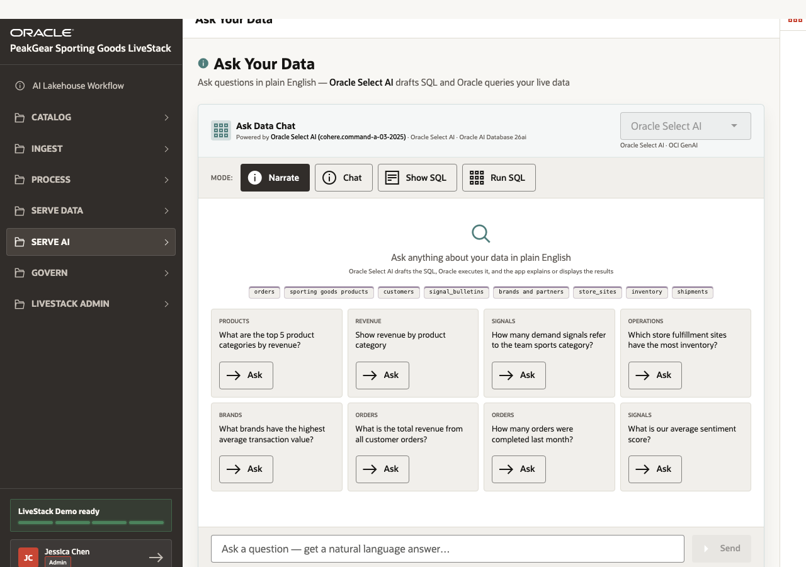
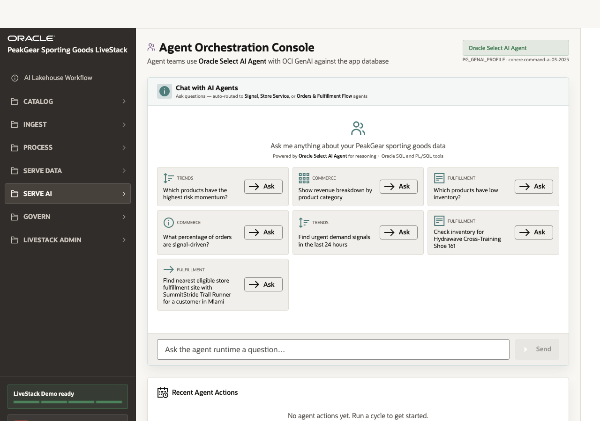

# Scene 10 Ask Data and Retail Agents

## Introduction

Business users and operators need answers without waiting for a data team to write every query. At the same time, AI must remain grounded in governed data and should not act like a disconnected chatbot.

This scene shows two AI experiences: **Ask Your Data** for natural-language data access and **Retail Operations Agents** for tool-backed operational workflows.

Estimated Time: **10 minutes**

### Objectives

In this scene, you will:

- Ask business questions against governed Oracle data.
- Review when Oracle Select AI is used instead of the local fallback.
- Understand how agent teams use tools and operational data.
- Connect AI outputs to auditable retail actions.

## Task 1: Ask a business question

1. Open **Serve AI** and select **Ask Your Data**.
2. Review the active runtime. When OCI GenAI and the Select AI profile are available, **Oracle Select AI** is the natural-language-to-SQL engine.
3. Ask a question such as **What are the top 5 product categories by revenue?** or **What is our average sentiment score?**
4. Explain that Select AI uses database metadata and OCI GenAI to generate and run SQL against governed Oracle data.

## Task 2: Review Retail Operations Agents

1. Open **Retail Operations Agents**.
2. Review the available teams: **Signal Agent**, **Store Fulfillment Agent**, and **Orders & Fulfillment Flow Agent**.
3. Ask a question that fits one of the workflows, such as **Find urgent demand signals in the last 24 hours** or **Which products have the highest risk momentum?**
4. Explain that the agent experience is stronger than a generic chatbot because it can use defined tools, operational tables, and auditable history.
5. Review the tool history or agent actions if visible to show how decisions are grounded and traceable.

You have completed the PeakGear AI Lakehouse LiveStack Demo runbook.

## Credits & Build Notes
- **Author** - Oracle LiveLabs Team
- **Last Updated By/Date** - Oracle LiveLabs Team, 2026-06-05
