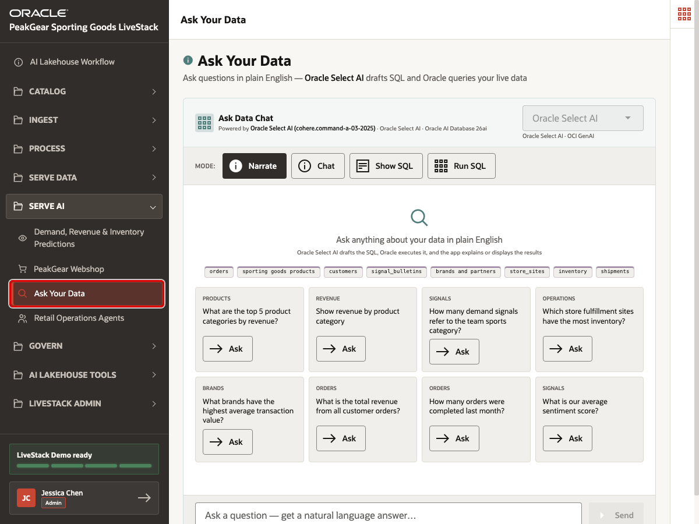
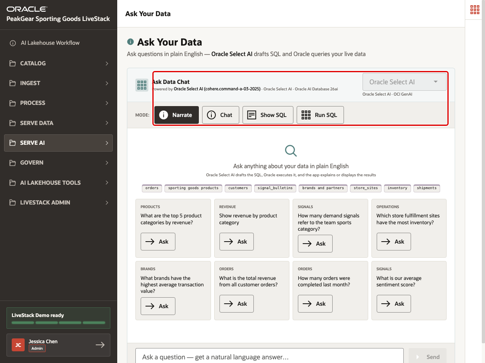
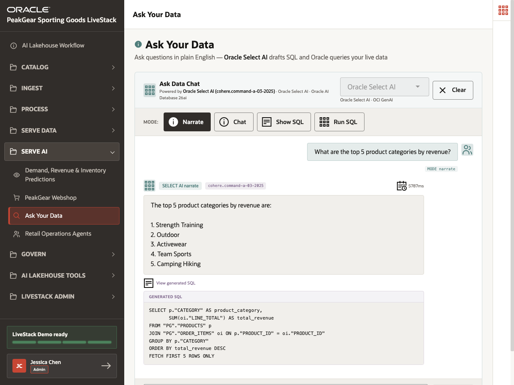

# Scene 15 Ask Your Data

## Introduction

PeakGear business users often need answers faster than a reporting backlog can deliver them. A merchandising lead may ask which categories drive revenue, an operations manager may ask where inventory is concentrated, and an executive may ask how demand signals are changing. Without a governed AI Lakehouse foundation, these questions often become spreadsheet pulls, manual SQL requests, or dashboard change tickets.

**Ask Your Data** shows a different Serve AI outcome. Data that has moved through the medallion process can be queried through natural language while still staying grounded in Oracle data and generated SQL. The user asks a business question, Oracle Select AI drafts the SQL from schema context, and Oracle queries the governed data foundation.

The business outcome is faster decision-making with transparency. Users can ask questions in plain English, inspect the generated SQL, and understand that the answer is coming from curated business data rather than an isolated chatbot memory.

Estimated Time: **10 minutes**

### Objectives

In this scene, you will:

- Open **Ask Your Data** from the **Serve AI** menu.
- Review the active Oracle Select AI runtime.
- Ask a revenue question in plain English.
- Inspect the generated SQL behind the answer.
- Connect natural-language data access to Gold-layer governed data.

## Task 1: Open Ask Your Data



1. In the left sidebar, expand **Serve AI**.
2. Select **Ask Your Data**.
3. Confirm that the page title is **Ask Your Data**.

This page is a Serve AI experience. The user is not preparing data or writing a pipeline. They are asking questions against curated data that has already been ingested, standardized, and served through the AI Lakehouse process.

## Task 2: Review the runtime and question options



1. Confirm that the runtime profile shows **Oracle Select AI**.
2. Review the available modes: **Narrate**, **Chat**, **Show SQL**, and **Run SQL**.
3. Keep **Narrate** selected for the first question.
4. Review the example question tiles.

The mode controls are useful during a technical verification. They show that the same governed data can support different consumption patterns: a narrated business answer, a conversational answer, a generated SQL preview, or executed SQL results.

## Task 3: Ask a revenue question and inspect SQL



1. Select the example question:

```text
What are the top 5 product categories by revenue?
```

2. Wait for the Select AI response.
3. Expand **View generated SQL**.
4. Review the answer and the SQL statement.

This step is important because it keeps the AI interaction auditable. The user can see the natural-language answer, but can also inspect the query that Oracle generated and ran against PeakGear's governed schema.

## Conclusion: Business Outcome

Ask Your Data shows how PeakGear can make Gold-layer data easier to consume without hiding how the answer is produced. The medallion process prepares trusted product, order, revenue, customer, inventory, and signal data. Oracle Select AI then helps business users translate questions into SQL over that governed foundation.

For the business, this reduces the time between question and answer, lowers dependence on one-off reporting requests, and gives users a transparent path from plain English to database-backed evidence.

You can move to the next scene.

## Credits & Build Notes
- **Author** - Oracle LiveLabs Team
- **Last Updated By/Date** - Oracle LiveLabs Team, 2026-06-13
