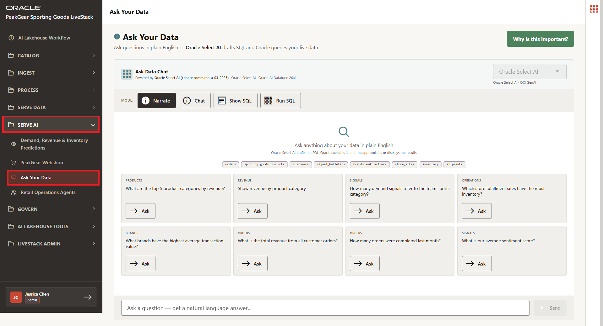
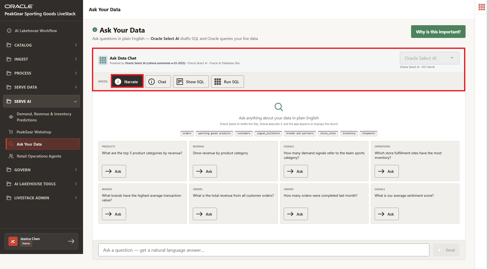
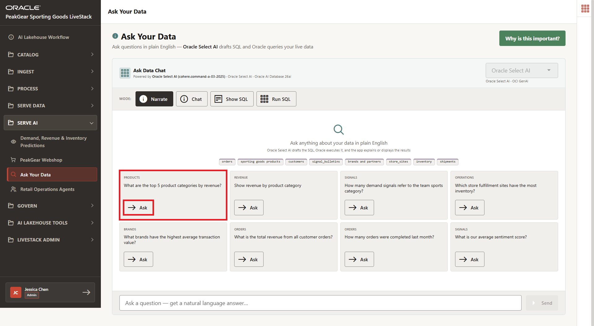
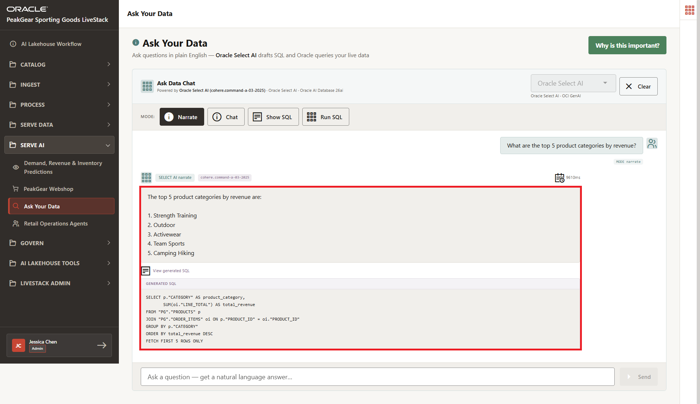

# Ask Your Data

## Introduction

PeakGear business users need answers about revenue, inventory, and demand without waiting for a new report. A merchandising lead may ask which categories drive revenue. An operations manager may ask where inventory is concentrated. An executive may ask how demand signals are changing.

**Ask Your Data** lets users ask these questions in plain language and review the SQL behind each answer. It is a data question interface, not a general-purpose chatbot.

**Oracle Select AI** in the **Oracle AI Database** translates the question into SQL over prepared Gold data, and the page lets users review the result.

The result is a business answer tied to database data, with the generated SQL available for review.

Estimated Time: **10 minutes**

### Objectives

In this scene, you will:

- Ask a business question about PeakGear data.
- Review the available response modes.
- Inspect the answer and the SQL behind it.
- See how prepared Gold data supports self-service questions.

## Task 1: Open Ask Your Data



Open Ask Your Data:

1. In the left sidebar, expand **Serve AI**.
2. Select **Ask Your Data**.
3. Confirm that the page title is **Ask Your Data**.

This page belongs to Serve AI. It uses data that has already been ingested, standardized, and prepared through the AI Lakehouse process.

## Task 2: Review the runtime and question options



Review the runtime and question options:

1. Confirm that the runtime profile shows **Oracle Select AI**.
2. Review the available modes: **Narrate**, **Chat**, **Show SQL**, and **Run SQL**.
3. Keep **Narrate** selected for the first question.
4. Review the example question tiles.

The same question can return a narrated answer, a conversational answer, a SQL preview, or executed SQL results.

## Task 3: Ask a revenue question and inspect SQL



Ask a revenue question and inspect the generated SQL:

1. Select the example question:

    ```text
    What are the top 5 product categories by revenue?
    ```

2. Wait for the Select AI response.
3. Expand **View generated SQL**.
4. Review the answer and the SQL statement.



The user can see the natural-language answer and inspect the query that Oracle generated and ran against PeakGear's data.

## Conclusion: Business Outcome

Ask Your Data shows how PeakGear can make Gold-layer data easier to use without hiding how the answer is produced. Bronze captures source data. Silver cleans and connects it. Gold provides data products for questions about products, orders, revenue, customers, inventory, and demand signals. Oracle Select AI translates a user's question into SQL over that data.

For the business, this shortens the path from a question to a database-backed answer and lets users check the query behind it.

## Acknowledgements

* **Author** - Kevin Lazarz August 2026
* **Contributor** - Eugenio Galiano
* **Last Updated By/Date** - Kevin Lazarz  August 2026
