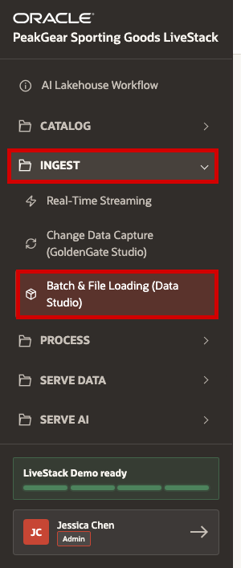
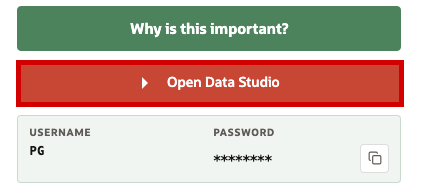
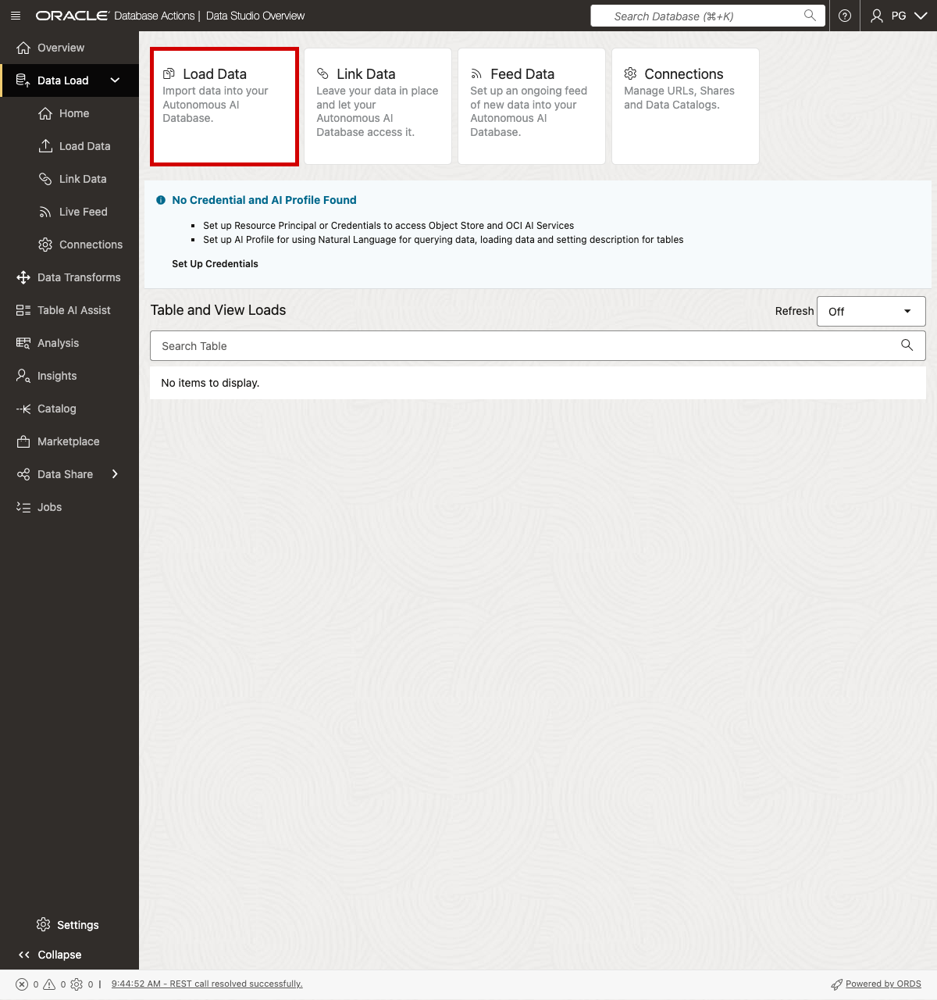
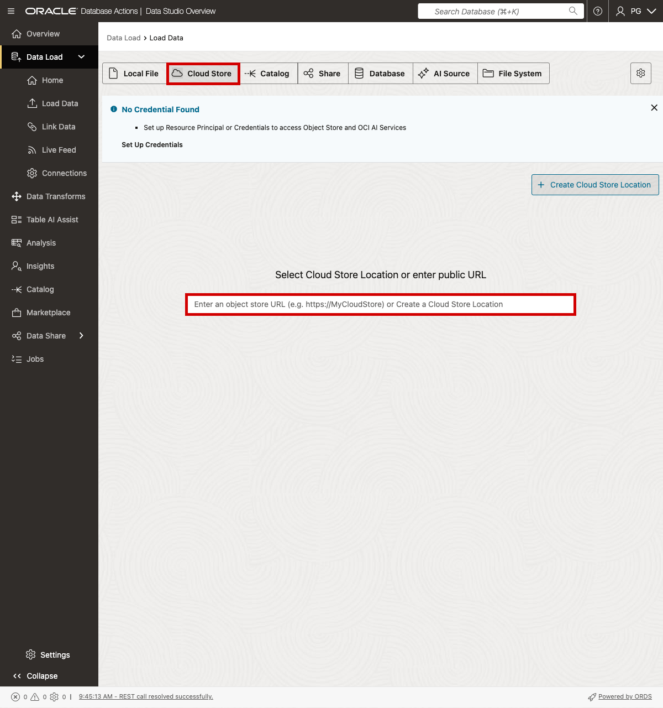
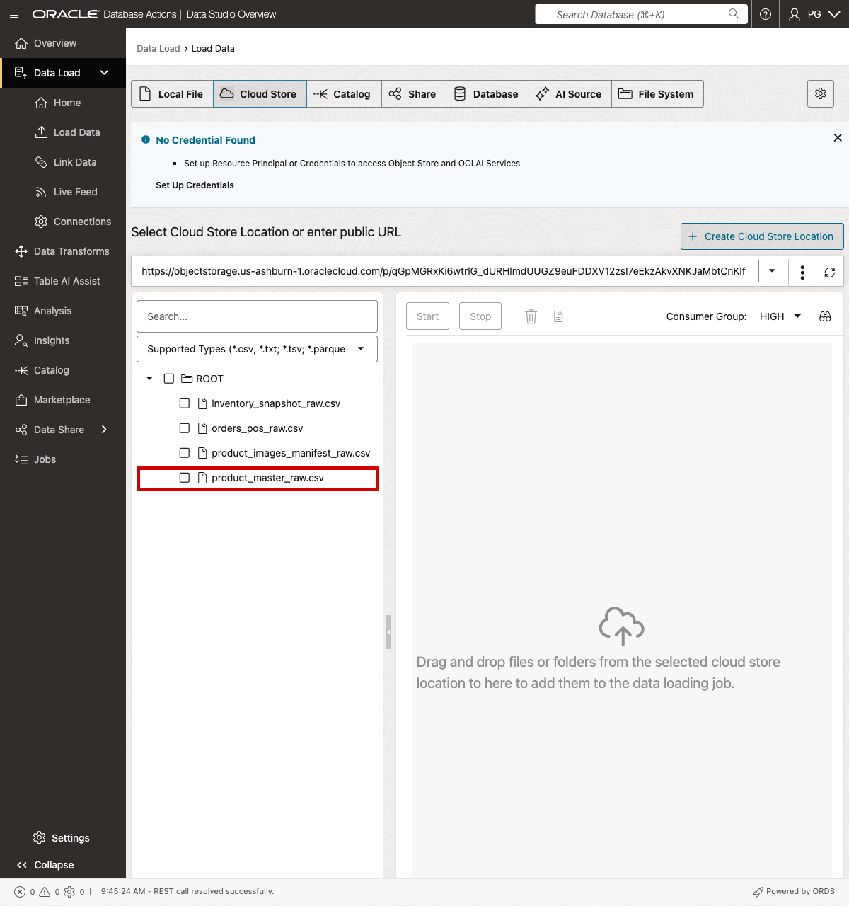
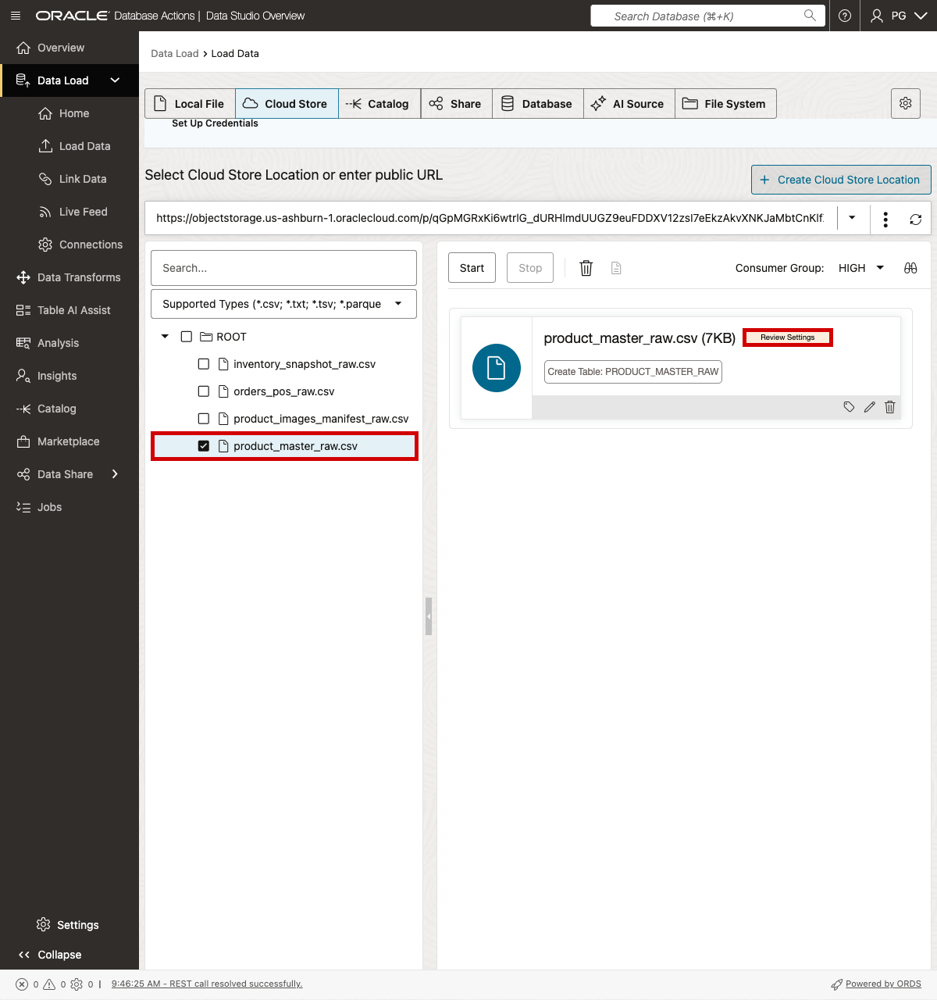
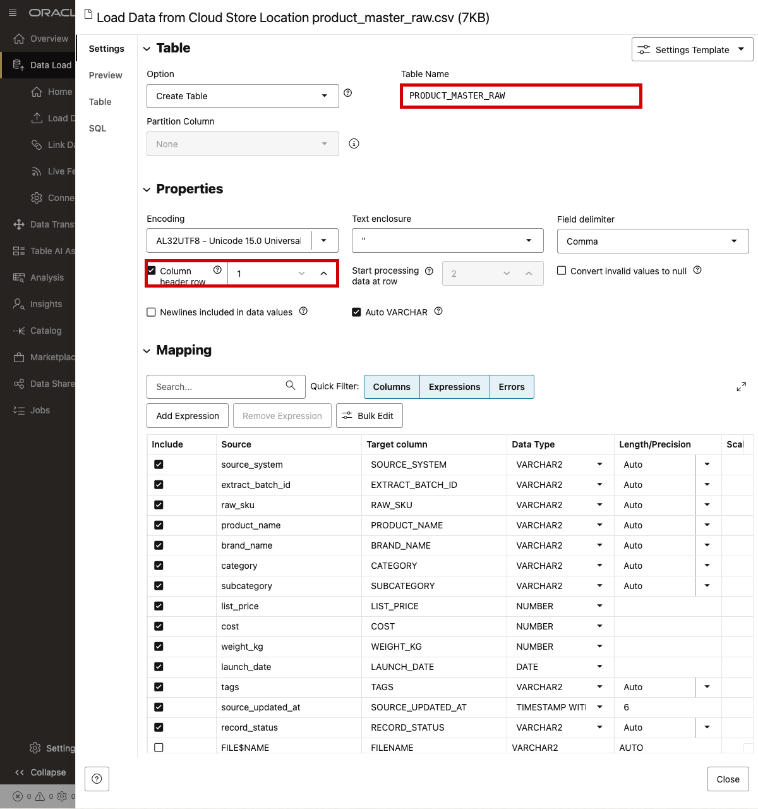
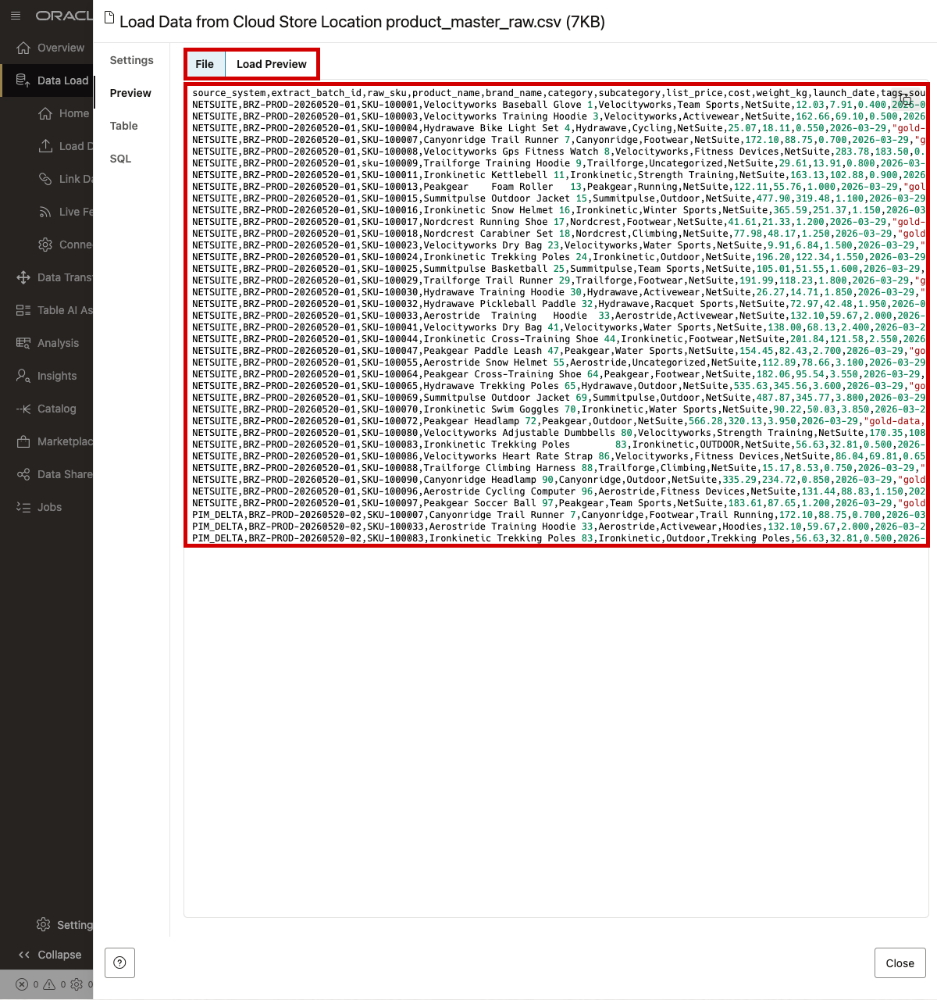
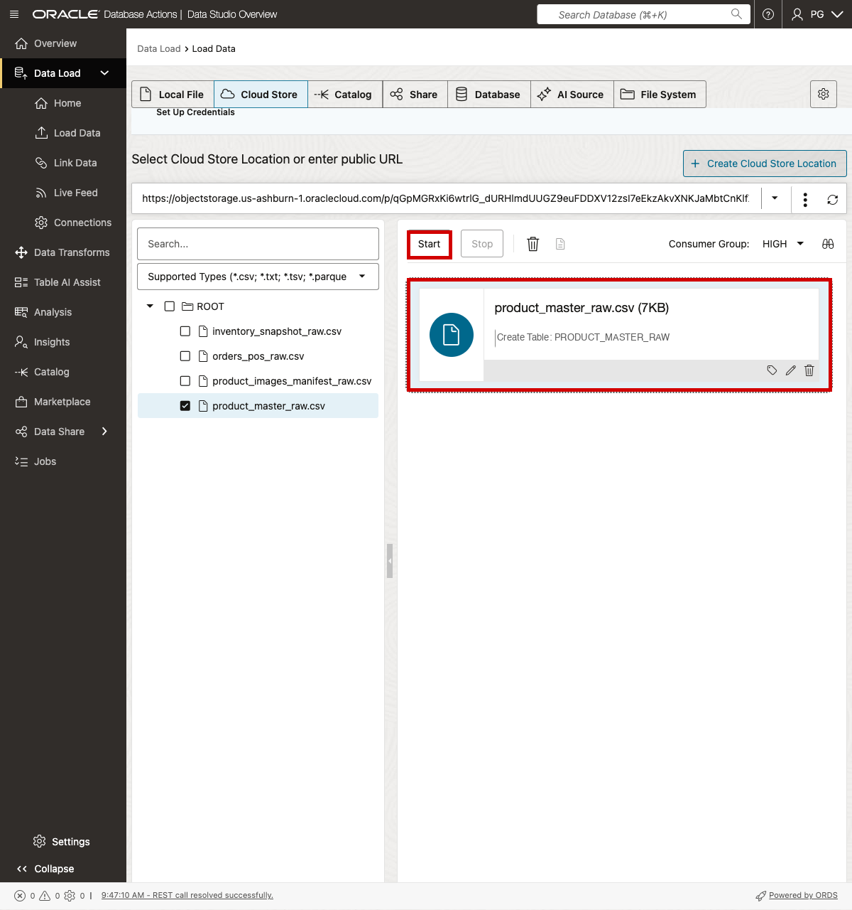
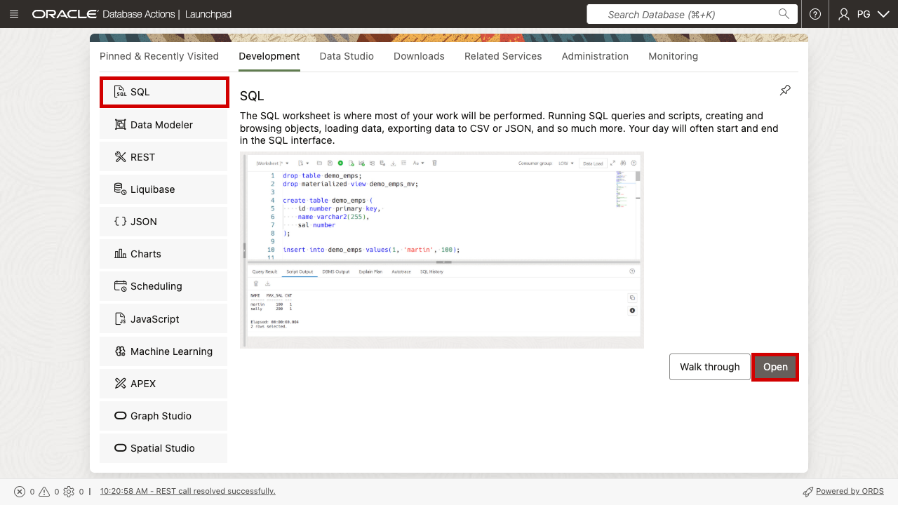

# Scene 4 Batch and File Loading Ingest

## Introduction

PeakGear does not only depend on live event streams. A large part of retail still arrives as files: product master updates from merchandising, POS order extracts from stores, inventory snapshots from fulfillment sites, and product image manifests from content operations.

Without a governed file loading path, these files often turn into manual spreadsheet work, one-off scripts, or direct updates into reporting tables. That creates familiar retail problems: product descriptions drift from the webshop, inventory teams argue over which snapshot is current, planners cannot explain why an order total changed, and AI experiences are grounded in data that no one can trace back to the original source file.

This scene shows how PeakGear lands batch files into the Bronze layer before anything is cleaned or reshaped. Bronze keeps the source-shaped data visible and traceable. Later processing can standardize SKUs, validate prices, enrich categories, connect image metadata, and publish Silver and Gold data products for the webshop, operations dashboards, product discovery, fulfillment analysis, and AI agents.

In this walkthrough, you will load `product_master_raw.csv` as the worked example. It is a good retail batch file because it contains the catalog attributes PeakGear needs before products can be searched, recommended, priced, joined to inventory, and used in curated data products.

Demand signals are not loaded in this scene. They are covered by the Real-Time Streaming Ingest scene.

Estimated Time: **10 minutes**

### Objectives

In this scene, you will:

- Open the **Batch & File Loading** demo from the **Ingest** menu.
- Review the Data Studio access point from the LiveStack page.
- Start a Data Load flow in Oracle Database Actions.
- Use the Object Storage public URL flow to locate the Bronze source files.
- Load `product_master_raw.csv` into a Bronze table.
- Verify that the loaded product master file contains the expected row count.
- Connect file-based Bronze ingest to later Silver and Gold business outcomes.

## Task 1: Open the Batch & File Loading demo



1. In the left sidebar, expand **Ingest**.
2. Select **Batch & File Loading (Data Studio)**.
3. Confirm that the page title is **Batch & File Loading (Data Studio)** before continuing.

## Task 2: Open Data Studio from the LiveStack page



1. Click **Open Data Studio**.
2. Sign in to Database Actions with the displayed PG username and password.
3. Return to the LiveStack page if you need to copy the Object Storage URL later in the walkthrough.

## Task 3: Choose Data Load in Database Actions



1. In Database Actions, open **Data Studio**.
2. Select **Data Load**.
3. Click the **Load Data** tile to start a new loading job.

## Task 4: Enter the Object Storage public URL



1. Select **Cloud Store**.
2. Copy the Object Storage prefix from the LiveStack page.
3. Paste it into the public URL field.
4. Press **Enter** to list the available Bronze files.
5. The **No Credential Found** banner is expected for this public URL flow.

## Task 5: Select the product master CSV



1. In the Cloud Store file list, locate `product_master_raw.csv`.
2. Select only `product_master_raw.csv` for this walkthrough.
3. Do not select demand signal files in this scene. Demand ingest is demonstrated in the real-time streaming scene.

The batch file set used by this scene is:

| Source file | Bronze target table | Expected rows |
| --- | --- | ---: |
| `product_master_raw.csv` | `PRODUCT_MASTER_RAW` | 38 |
| `orders_pos_raw.csv` | `ORDERS_POS_RAW` | 59 |
| `inventory_snapshot_raw.csv` | `INVENTORY_SNAPSHOT_RAW` | 42 |
| `product_images_manifest_raw.csv` | `PRODUCT_IMAGES_MANIFEST_RAW` | 37 |

## Task 6: Add the file and review settings



1. Double-click `product_master_raw.csv`, or drag it into the loading job panel.
2. Confirm that the job card shows `product_master_raw.csv`.
3. Click **Review Settings**.

## Task 7: Confirm the Bronze table name and CSV header



1. Confirm that **Table Name** is `PRODUCT_MASTER_RAW`.
2. Confirm that **Column header row** is checked.
3. Confirm that the field delimiter is **Comma**.
4. If `PRODUCT_MASTER_RAW` already exists in your environment and you do not want to replace it, use a temporary table name such as `PRODUCT_MASTER_RAW_DEMO` for the loading exercise.

## Task 8: Preview the product master file



1. Select **Preview**.
2. Confirm that the preview shows product fields such as source system, SKU, product name, brand, category, price, and launch date.
3. Close the settings dialog after the preview and table settings look correct.

## Task 9: Start the load



1. Confirm that the job card still shows `product_master_raw.csv`.
2. Click **Start**.
3. Wait for Database Actions to finish the load.
4. If you used a temporary table name in Task 7, remember that name for the verification query.

## Task 10: Verify the loaded Bronze table



1. Return to the Database Actions Launchpad.
2. Open **Development**.
3. Select **SQL**.
4. Click **Open**.
5. Run the row-count query for the table you loaded.

```sql
SELECT COUNT(*) AS product_master_rows
FROM PRODUCT_MASTER_RAW;
```

If you used a temporary table name, replace `PRODUCT_MASTER_RAW` with that table name:

```sql
SELECT COUNT(*) AS product_master_rows
FROM PRODUCT_MASTER_RAW_DEMO;
```

The expected row count for `product_master_raw.csv` is **38**.

## Task 11: Connect the load to the business outcome

1. Explain that the product master file is now available in Bronze exactly as it arrived.
2. Explain that the next processing scene can standardize categories, validate prices, deduplicate SKUs, enrich product attributes, and connect image metadata.
3. Connect the downstream outcome: once product data is refined through Silver and Gold, PeakGear can power webshop search, product discovery, operations dashboards, fulfillment decisions, and AI agents from a governed catalog foundation.
4. Reinforce the medallion pattern: file-based ingest is not the final business product. It is the controlled starting point that lets PeakGear turn raw source files into trusted, reusable data products.

You can move to the next scene.

## Credits & Build Notes
- **Author** - Oracle LiveLabs Team
- **Last Updated By/Date** - Oracle LiveLabs Team, 2026-06-11
