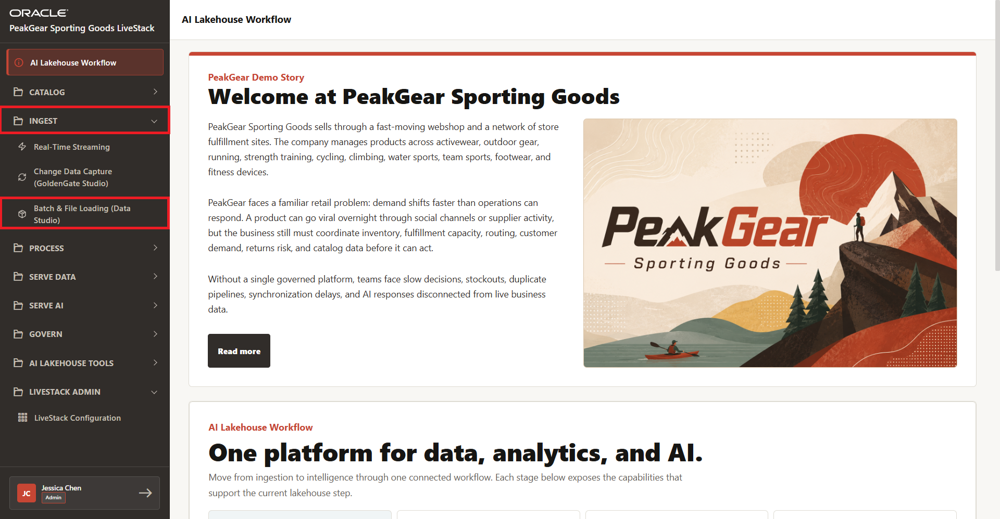
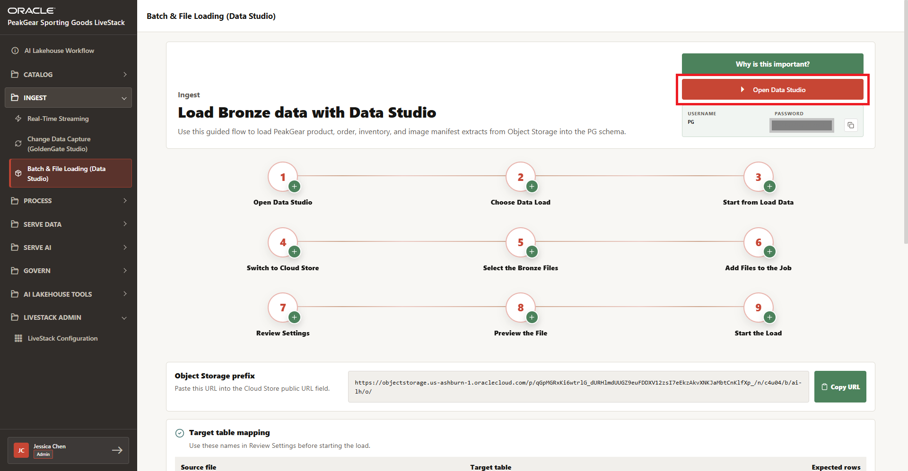
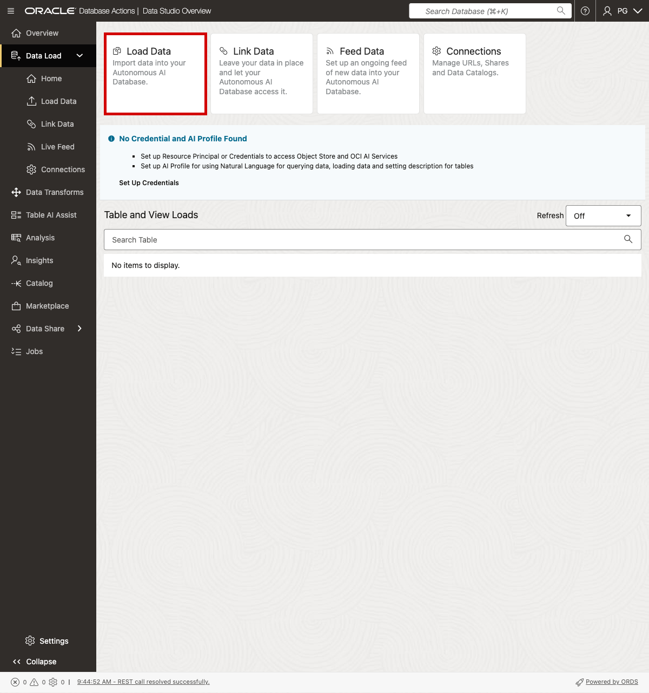
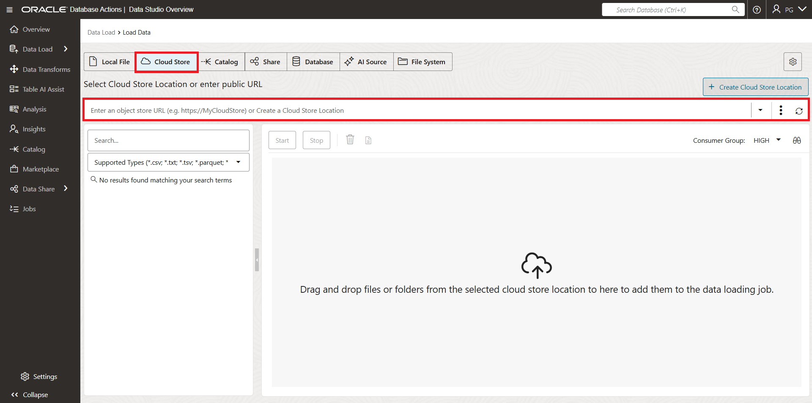
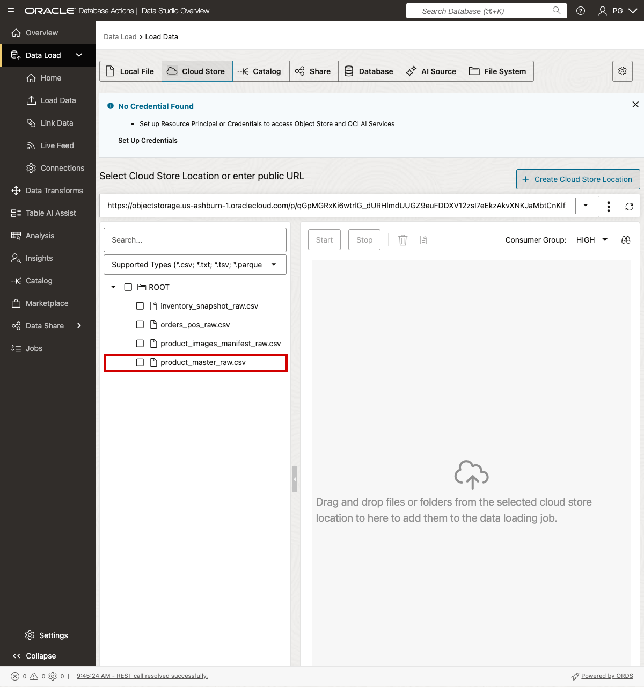
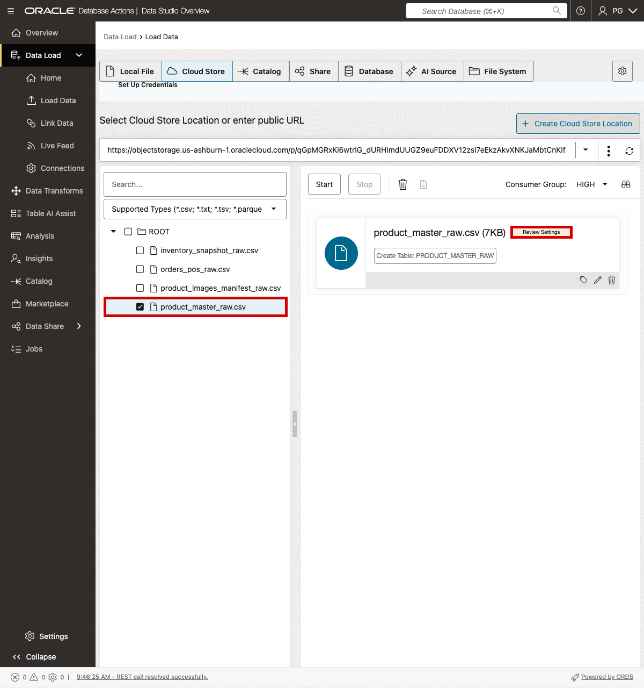
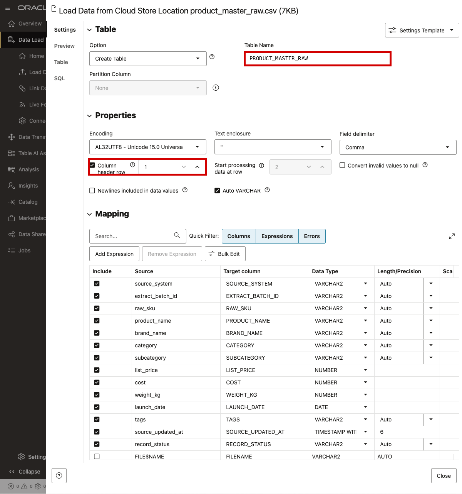
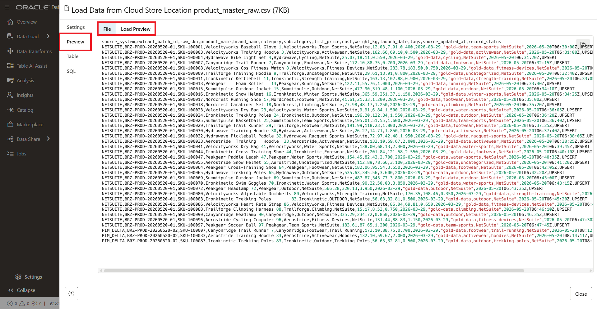
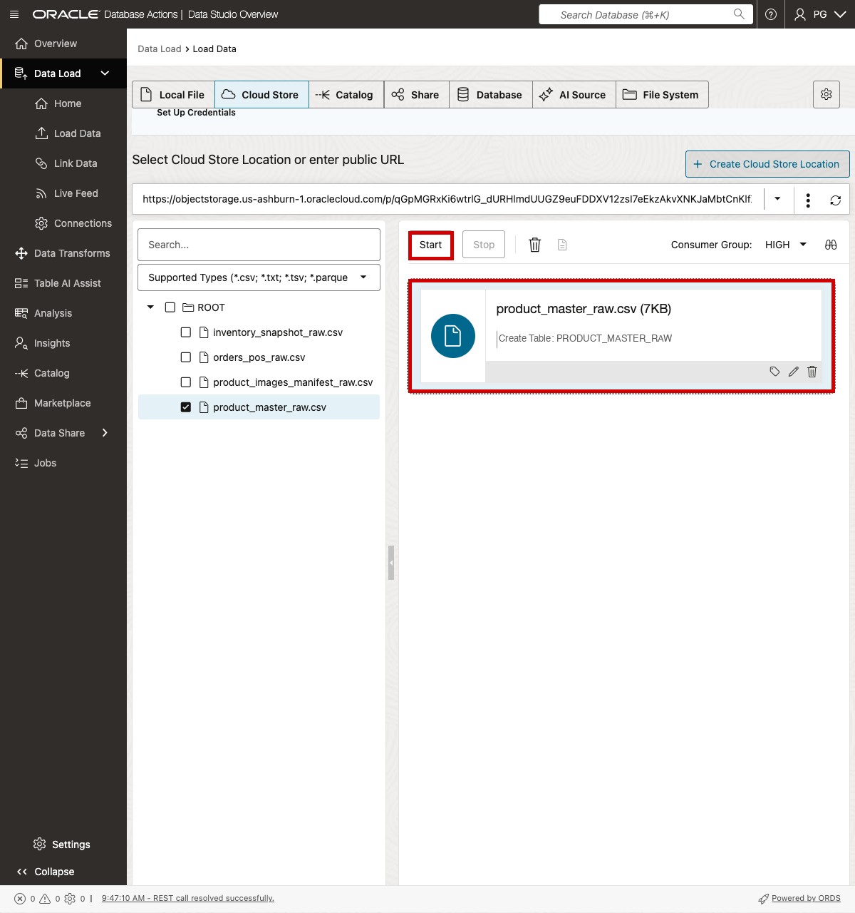
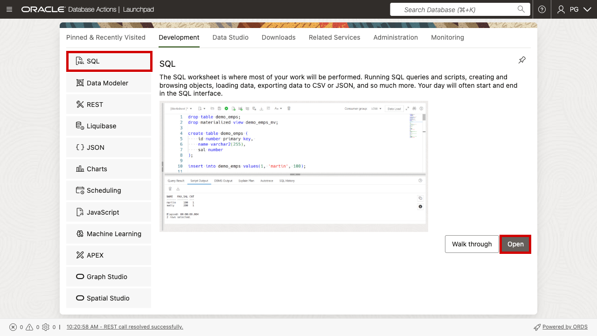

# Batch and File Loading Ingest

## Introduction

**PeakGear** receives some data continuously and other data in files. Streaming handles live events, while batch loading brings in files such as product master updates and inventory snapshots.

Without a repeatable file load, teams may handle each file by hand, use one-off scripts, or update reporting tables directly. Product descriptions and inventory snapshots can then become inconsistent, and teams may struggle to trace an AI answer back to its source file.

This scene loads a batch file into the **Bronze** layer before the data is cleaned or reshaped. **Bronze** preserves the original file shape so the source remains traceable.

The example uses `product_master_raw.csv`. It contains the catalog attributes PeakGear needs before products can support search, recommendations, pricing, inventory work, and later data products.

Demand signals are not loaded in this scene. They are covered by the Real-Time Streaming Ingest scene.

**Oracle Database Actions Data Studio** provides the **Data Load** workflow. It reads the product master CSV from **OCI Object Storage** and writes it to Bronze.

Estimated Time: **10 minutes**

### Objectives

In this scene, you will:

- Bring a product master file into the Bronze layer.
- Review the file before loading it.
- Start the prepared file load.
- Confirm that the Bronze table contains the expected product rows.
- See how file-based data can continue through the Silver and Gold stages.

## Task 1: Open the Batch & File Loading demo



Open the **Batch & File** Loading demo:

1. In the left sidebar, expand **Ingest**.
2. Select **Batch & File Loading (Data Studio)**.
3. Confirm that the page title is **Batch & File Loading (Data Studio)** before continuing.

## Task 2: Open Data Studio from the LiveStack page



Open **Data Studio** from the LiveStack page:

1. Click **Open Data Studio**.
2. Sign in to Database Actions with the displayed PG username and password.
3. Return to the LiveStack page if you need to copy the Object Storage URL later in the walkthrough.

## Task 3: Choose Data Load in Database Actions



Choose **Data Load** in **Database Actions**:

1. In Database Actions, open **Data Studio**.
2. Select **Data Load**.
3. Click the **Load Data** tile to start a new loading job.

## Task 4: Enter the Object Storage public URL



Enter the **Object Storage** public URL:

1. Select **Cloud Store**.
2. Copy the Object Storage prefix from the LiveStack page.
3. Paste it into the public URL field.
4. Press **Enter** to list the available Bronze files.
5. The **No Credential Found** banner is expected for this public URL flow.

## Task 5: Select the product master CSV



Select the product master CSV:

1. In the Cloud Store file list, locate `product_master_raw.csv`.
2. Select only `product_master_raw.csv` for this walkthrough.

The batch file set used by this scene is:

| Source file                       | Bronze target table           | Expected rows |
| -----------------------------------| -------------------------------| --------------:|
| `product_master_raw.csv`          | `PRODUCT_MASTER_RAW`          | 38            |
| `orders_pos_raw.csv`              | `ORDERS_POS_RAW`              | 59            |
| `inventory_snapshot_raw.csv`      | `INVENTORY_SNAPSHOT_RAW`      | 42            |
| `product_images_manifest_raw.csv` | `PRODUCT_IMAGES_MANIFEST_RAW` | 37            |

## Task 6: Add the file and review settings



Add the file and review the load settings:

1. Double-click `product_master_raw.csv`, or drag it into the loading job panel.
2. Confirm that the job card shows `product_master_raw.csv`.
3. Click **Review Settings**.

## Task 7: Confirm the Bronze table name and CSV header



Confirm the Bronze table name and CSV header settings:

1. Confirm that **Table Name** is `PRODUCT_MASTER_RAW`.
2. Confirm that **Column header row** is checked.
3. Confirm that the field delimiter is **Comma**.
4. If `PRODUCT_MASTER_RAW` already exists in your environment and you do not want to replace it, use a temporary table name such as `PRODUCT_MASTER_RAW_DEMO` for the loading exercise.

## Task 8: Preview the product master file



Preview the product master file before loading it:

1. Select **Preview**.
2. Confirm that the preview shows product fields such as source system, SKU, product name, brand, category, price, and launch date.
3. Close the settings dialog after the preview and table settings look correct.

## Task 9: Start the load



Start the file load:

1. Confirm that the job card still shows `product_master_raw.csv`.
2. Click **Start**.
3. Wait for Database Actions to finish the load.
4. If you used a temporary table name in Task 7, remember that name for the verification query.

## Task 10: Verify the loaded Bronze table



Verify the loaded **Bronze** table:

1. Return to the Database Actions Launchpad.
2. Open **Development**.
3. Select **SQL**.
4. Click **Open**.
5. Run the row-count query for the table you loaded.

    ```sql
    SELECT COUNT(*) AS product_master_rows
    FROM PRODUCT_MASTER_RAW;
    ```

If you used a temporary table name, replace `PRODUCT_MASTER_RAW` with that table name:

```sql
SELECT COUNT(*) AS product_master_rows
FROM PRODUCT_MASTER_RAW_DEMO;
```

The expected row count for `product_master_raw.csv` is **38**.

## Conclusion: Business Outcome

Batch and file loading gives PeakGear a controlled way to bring source files into the AI Lakehouse. The product master CSV is not the final business product; it is the Bronze starting point that preserves the file as it arrived.

Once the file is in Bronze, later stages can standardize categories, validate prices, remove duplicate SKUs, enrich product attributes, and connect image metadata. Gold data products can then support webshop search, product discovery, operations dashboards, fulfillment decisions, and AI agents.

For PeakGear, file-based source data follows the same lakehouse flow as streaming and CDC data, from raw input to operational use.

## Acknowledgements

* **Author** - Kevin Lazarz August 2026
* **Contributor** - Eugenio Galiano
* **Last Updated By/Date** - Kevin Lazarz  August 2026
