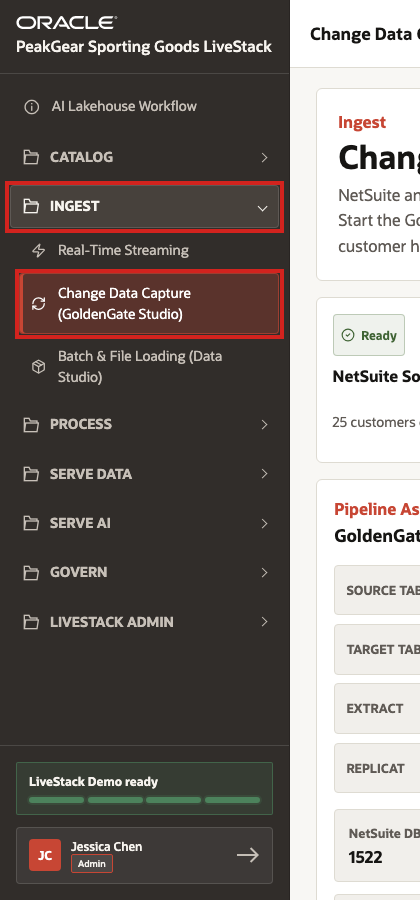
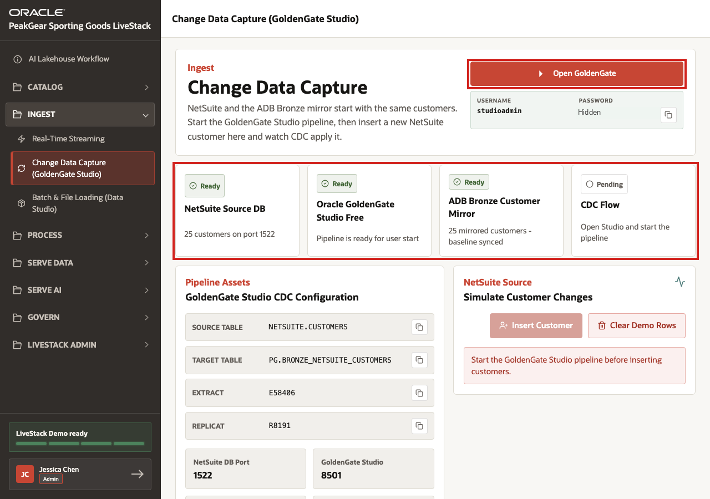
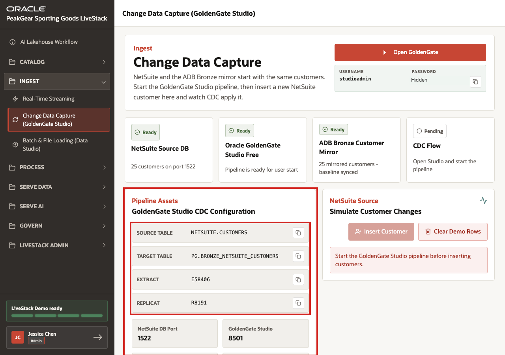
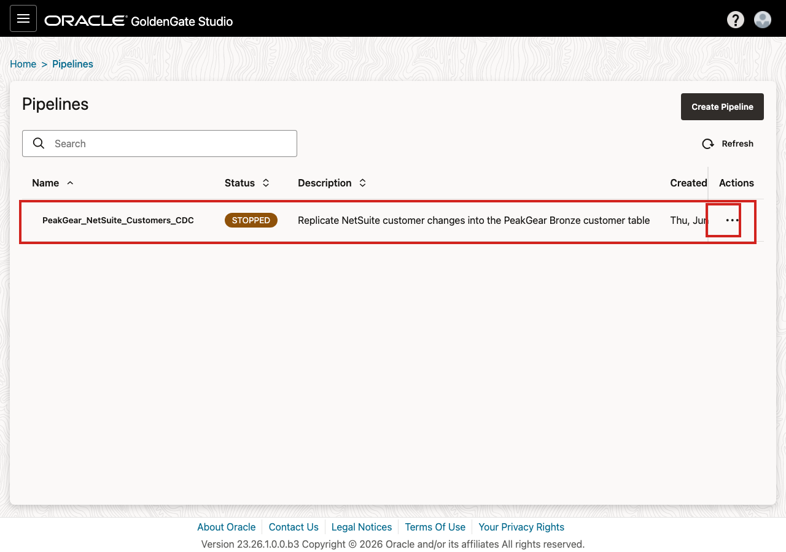
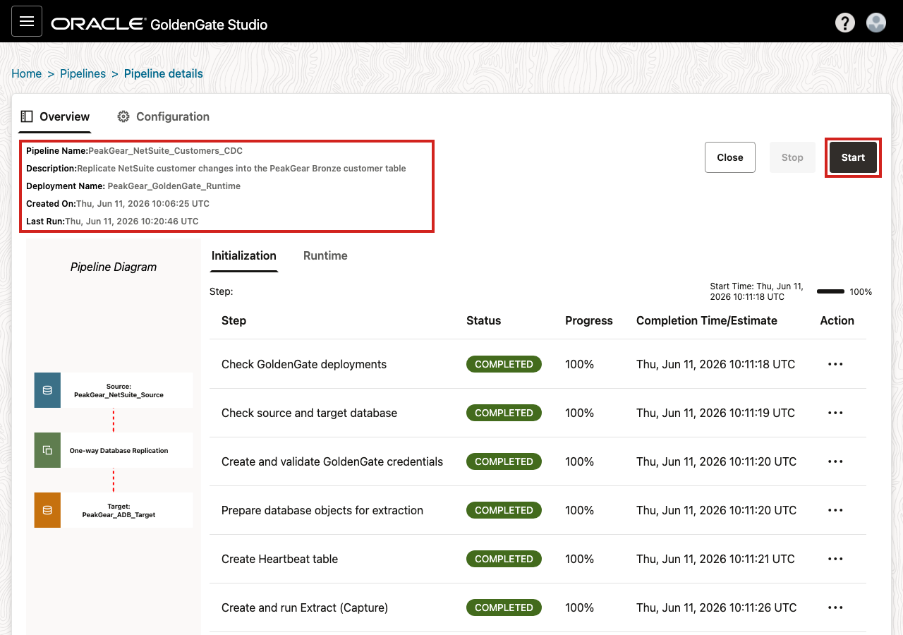
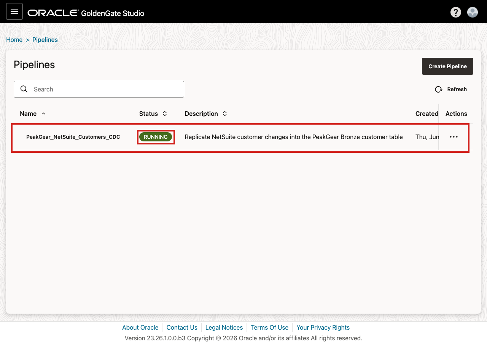
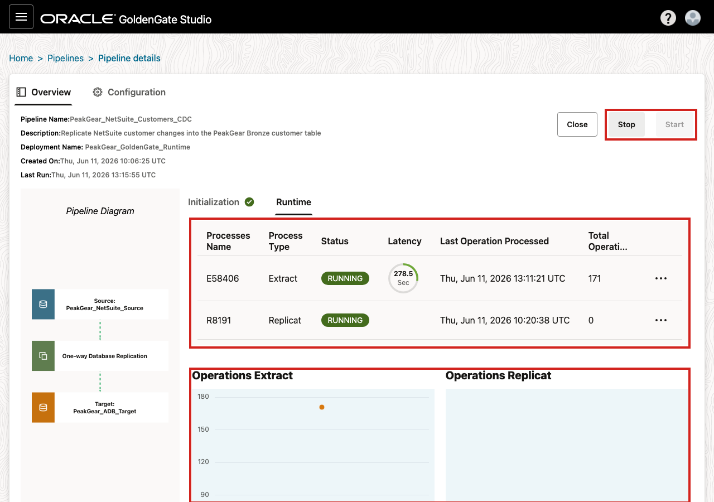
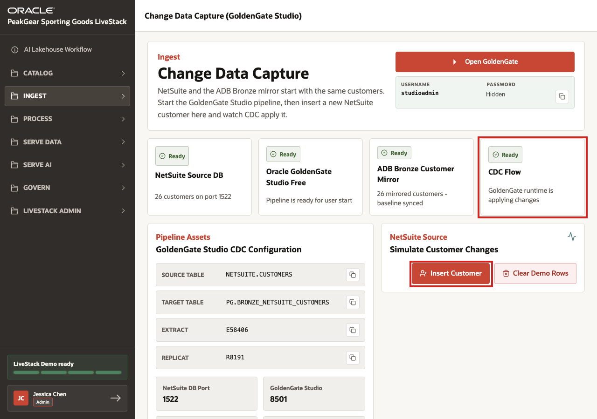
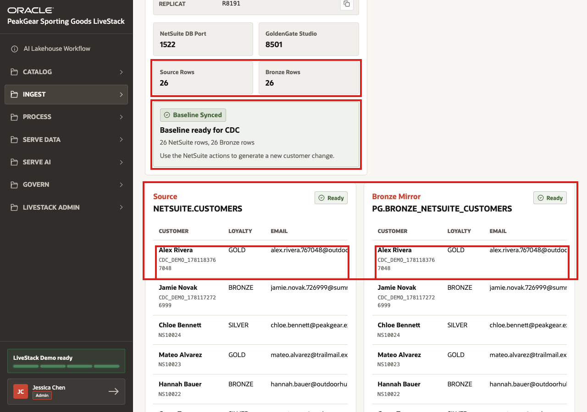

# Scene 3 Change Data Capture Ingest

## Introduction

PeakGear's customer data does not begin in the lakehouse. Customer profiles, loyalty tiers, contact details, and account updates are first created in operational systems that run the business every day.

Without change data capture, those updates reach analytics, applications, and AI experiences too late. A newly upgraded loyalty customer might still be treated like a standard shopper. A service agent might see an old email address. A dashboard might miss the newest customers until the next batch load finishes. The business outcome is familiar: decisions are technically correct for yesterday, but not current enough for the moment PeakGear needs to act.

This scene shows how PeakGear closes that gap. A NetSuite-style customer system remains the operational source, while GoldenGate captures changes and mirrors them into the Bronze layer of the AI Lakehouse. From there, the same customer updates can be refined through Silver and Gold so dashboards, customer experiences, predictions, and agents all work from trusted, current customer context.

Estimated Time: **10 minutes**

### Objectives

In this scene, you will:

- Open the **Change Data Capture** demo from the **Ingest** menu.
- Review the GoldenGate Studio access point and CDC readiness status.
- Confirm the source customer table, Bronze mirror table, extract, and replicat values.
- Start the prepared CDC pipeline in GoldenGate Studio.
- Insert a customer change in the NetSuite-style source system.
- Verify that the change appears in the Bronze customer mirror.
- Connect CDC ingest to the later Bronze, Silver, and Gold data product flow.

## Task 1: Open the Change Data Capture demo

1. In the left sidebar, expand **Ingest**.
2. Select **Change Data Capture (GoldenGate Studio)**.
3. Confirm that the page title is **Change Data Capture** before continuing.

## Task 2: Review GoldenGate access and CDC readiness

1. Review the GoldenGate Studio login area.
2. Click **Open GoldenGate** to open GoldenGate Studio in a new browser tab.
3. Use the displayed username and password from your environment to sign in.
4. Return to the LiveStack page and confirm that **NetSuite Source DB**, **Oracle GoldenGate Studio Free**, and **ADB Bronze Customer Mirror** show **Ready**.
5. If **CDC Flow** is still **Pending**, continue to the next tasks. That means the prepared pipeline still needs to be started.

## Task 3: Review the source-to-Bronze CDC configuration

1. Review **GoldenGate Studio CDC Configuration**.
2. Confirm the source table **NETSUITE.CUSTOMERS**.
3. Confirm the Bronze target table **PG.BRONZE\_NETSUITE\_CUSTOMERS**.
4. Confirm that an **Extract** and **Replicat** are listed.
5. Review the row counts and baseline status. Matching source and Bronze counts show that the initial customer baseline is synchronized before live changes are captured.

## Task 4: Start the prepared CDC pipeline in GoldenGate Studio

1. In GoldenGate Studio, select **Pipelines**.
2. Open the prepared pipeline **PeakGear\_NetSuite\_Customers\_CDC**.
3. Do not click **Create Pipeline**. The CDC pipeline already exists for this demo.

1. On the pipeline details page, review the pipeline name and deployment.
2. Click **Start**.
3. Wait for GoldenGate Studio to start the CDC runtime.
4. Return to the LiveStack page and wait for **CDC Flow** to change from **Pending** to **Ready**.

If the pipeline is already running, **Start** may be disabled and **Stop** may be enabled. In that case, leave the pipeline running and continue.

After the pipeline starts, the **Pipelines** page shows **PeakGear\_NetSuite\_Customers\_CDC** with status **RUNNING**.

In the pipeline details page, the **Runtime** view shows the running Extract and Replicat processes. This is the best GoldenGate Studio view to explain that the prepared CDC pipeline is active. The total operations and last-operation values can differ between demo runs.

## Task 5: Insert a customer change

1. In the LiveStack page, locate **Simulate Customer Changes**.
2. If the warning says to start the GoldenGate Studio pipeline, return to Task 4 and start the pipeline.
3. After **CDC Flow** is **Ready**, click **Insert Customer**.
4. Wait for the page to refresh. The inserted customer represents a new operational change created in the NetSuite-style source system.
5. Use **Clear Demo Rows** only when you need to reset the CDC scenario for a clean replay.

## Task 6: Verify the Bronze customer mirror

1. Review the **NETSUITE.CUSTOMERS** source table.
2. Review the **PG.BRONZE\_NETSUITE\_CUSTOMERS** Bronze mirror.
3. Confirm that the inserted customer appears in both the source table and the Bronze mirror.
4. Confirm that the source and Bronze row counts increased together. The screenshot shows one completed run where both counts moved to **26** after the insert; your count can differ if the demo has been reset or replayed.

## Conclusion: Business Outcome

Change data capture helps PeakGear keep operational customer context current. When a customer record changes in the NetSuite-style source system, GoldenGate mirrors that change into the AI Lakehouse Bronze layer without waiting for a batch cycle.

That current customer data can then move through the medallion process. Bronze preserves the source-shaped change, Silver can standardize and validate it, and Gold can serve trusted customer context to dashboards, webshop personalization, customer analytics, predictions, and AI agents.

For PeakGear, this reduces the gap between what happened in the operational system and what the business can act on. Teams can make decisions from current customer data instead of reconciling stale extracts across disconnected tools.

You can move to the next scene.

## Credits & Build Notes
- **Author** - Oracle LiveLabs Team
- **Last Updated By/Date** - Oracle LiveLabs Team, 2026-06-12
