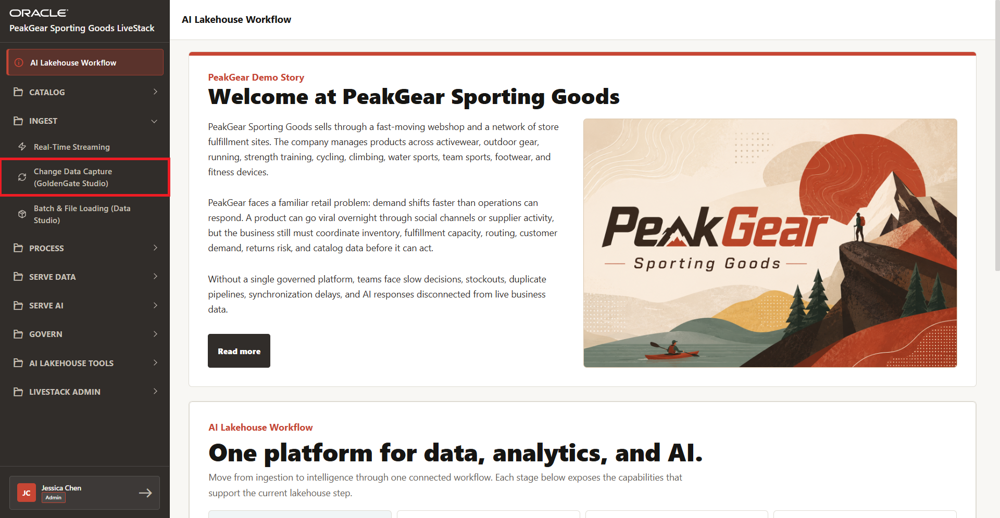
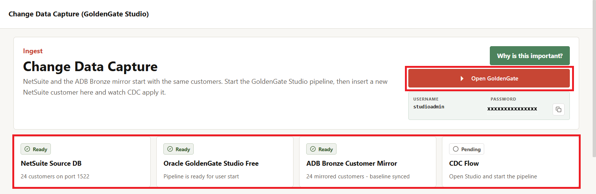
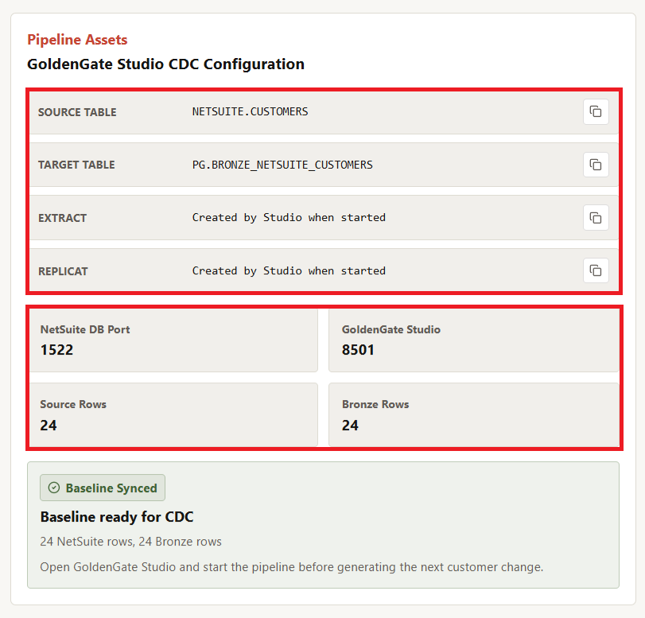
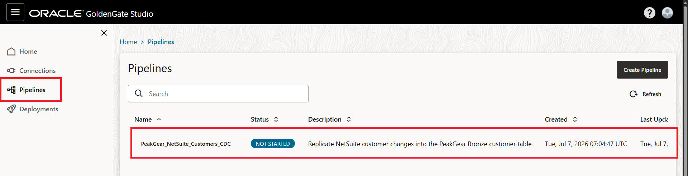
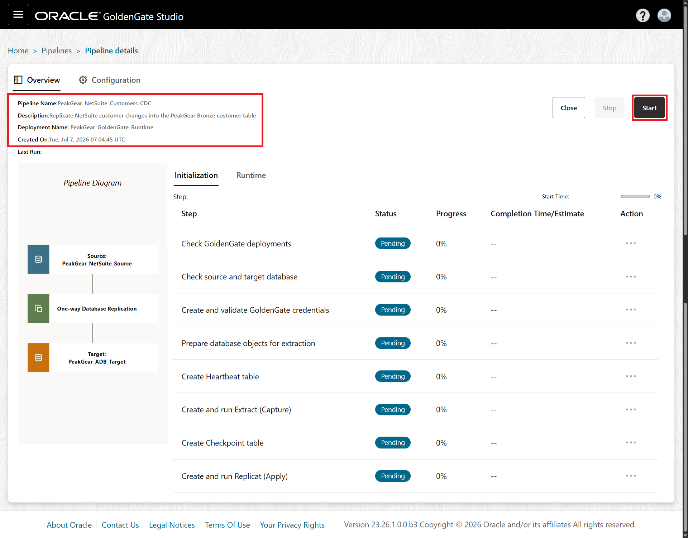
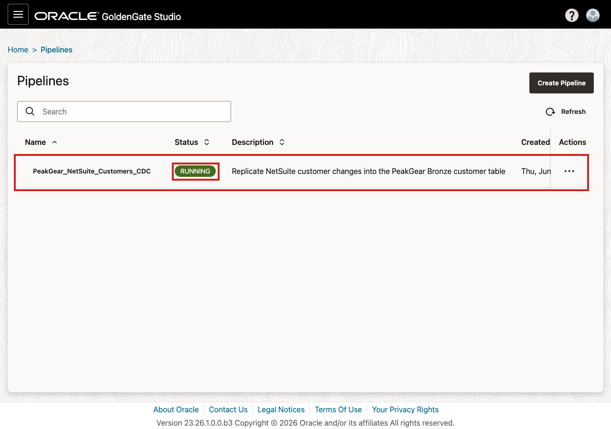
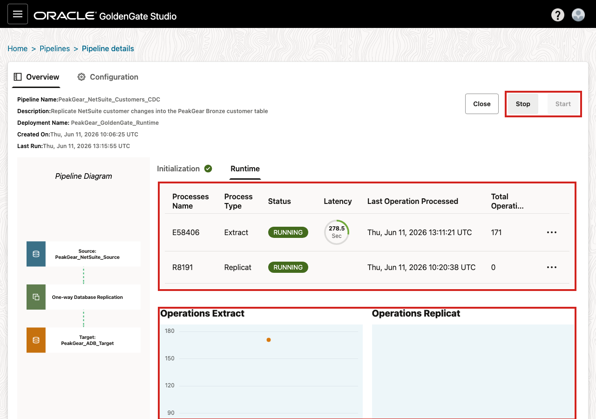
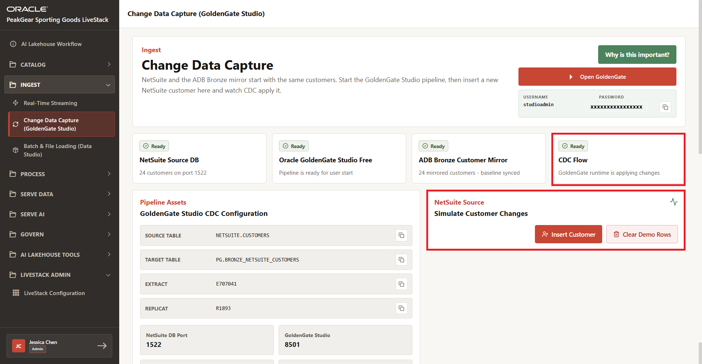
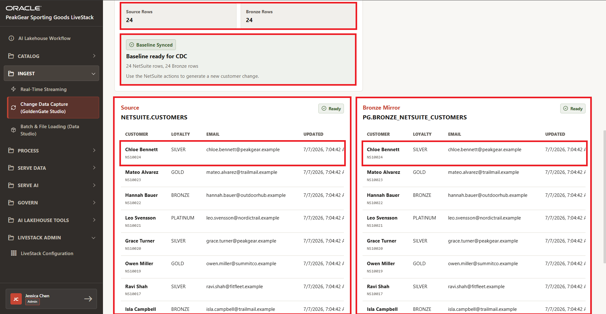

# Change Data Capture Ingest

## Introduction

PeakGear's customer data begins in an operational system, not in the **Lakehouse**. Change data capture, or CDC, copies each source change into the Lakehouse as it happens.

Without CDC, a new loyalty status or email change may wait for the next batch load. Analytics, applications, and AI experiences can then work with old customer information.

Oracle GoldenGate Studio provides the interface for this flow. It shows the prepared source-to-Bronze pipeline, lets you start it, and displays its status as the change is captured.

This scene uses a prepared CDC flow. You review it, start it, insert a customer change, and watch that change reach the Bronze layer.

Estimated Time: **10 minutes**

### Objectives

In this scene, you will:

- See how a customer change moves from an operational system into Bronze.
- Review the prepared CDC flow and its source and target.
- Start the flow and insert a customer change.
- Confirm that the Bronze mirror receives the change.
- See how CDC data can continue through Silver and Gold.

## Task 1: Open the Change Data Capture demo

Open the **Change Data Capture** demo:

1. In the left sidebar, expand **Ingest**.
2. Select **Change Data Capture (GoldenGate Studio)**.
3. Confirm that the page title is **Change Data Capture** before continuing.

## Task 2: Review GoldenGate access and CDC readiness

Review GoldenGate access and CDC readiness:

1. Review the **GoldenGate Studio** login area.
2. Click **Open GoldenGate** to open GoldenGate Studio in a new browser tab.
3. Use the displayed username and password from your environment to sign in.
4. Return to the LiveStack page and confirm that **NetSuite Source DB**, **Oracle GoldenGate Studio Free**, and **ADB Bronze Customer Mirror** show **Ready**.
5. If **CDC Flow** is still **Pending**, continue to the next tasks. That means the prepared pipeline still needs to be started.

## Task 3: Review the source-to-Bronze CDC configuration

Review the source-to-Bronze CDC configuration:

1. Review **GoldenGate Studio CDC Configuration**.
2. Confirm the source table **NETSUITE.CUSTOMERS**.
3. Confirm the Bronze target table **PG.BRONZE\_NETSUITE\_CUSTOMERS**.
4. Confirm that an **Extract** and **Replicat** are listed.
5. Review the row counts and baseline status. Matching source and Bronze counts show that the initial customer baseline is synchronized before live changes are captured.

## Task 4: Start the prepared CDC pipeline in GoldenGate Studio

Start the prepared CDC pipeline in GoldenGate Studio:

1. Select **Open GoldenGate**.
2. In **GoldenGate Studio**, select **Pipelines**.
3. Open the prepared pipeline **PeakGear\_NetSuite\_Customers\_CDC**.
4. Do not click **Create Pipeline**. The CDC pipeline already exists for this demo.

    

1. On the pipeline details page, review the pipeline name and deployment.
2. Click **Start**.
3. Wait for GoldenGate Studio to start the CDC runtime.
4. Return to the LiveStack page and wait for **CDC Flow** to change from **Pending** to **Ready**.

If the pipeline is already running, **Start** may be disabled and **Stop** may be enabled. In that case, leave the pipeline running and continue.

After the pipeline starts, the **Pipelines** page shows **PeakGear\_NetSuite\_Customers\_CDC** with status **RUNNING**.

In the pipeline details page, the **Runtime** view shows the running Extract and Replicat processes. This is the best GoldenGate Studio view to explain that the prepared CDC pipeline is active. The total operations and last-operation values can differ between demo runs.

## Task 5: Insert a customer change

Insert a customer change into the source system:

1. In the LiveStack page, locate **Simulate Customer Changes**.
2. If the warning says to start the GoldenGate Studio pipeline, return to Task 4 and start the pipeline.
3. After **CDC Flow** is **Ready**, click **Insert Customer**.
4. Wait for the page to refresh. The inserted customer represents a new operational change created in the NetSuite-style source system.
5. Use **Clear Demo Rows** only when you need to reset the CDC scenario for a clean replay.

## Task 6: Verify the Bronze customer mirror

Verify that the Bronze customer mirror received the source change:

1. Review the **NETSUITE.CUSTOMERS** source table.
2. Review the **PG.BRONZE\_NETSUITE\_CUSTOMERS** Bronze mirror.
3. Confirm that the inserted customer appears in both the source table and the Bronze mirror.
4. Confirm that the source and Bronze row counts increased together. The screenshot shows one completed run where both counts moved to **26** after the insert; your count can differ if the demo has been reset or replayed.

**Note:** Sample values may change after data refreshes or rebuilds. Focus on the expected result pattern and the business takeaway, not the exact values.

## Conclusion: Business Outcome

Change data capture helps PeakGear keep operational customer context current. When a customer record changes in the NetSuite-style source system, GoldenGate mirrors that change into the AI Lakehouse Bronze layer without waiting for a batch cycle.

That current customer data can then move through the medallion process. Bronze preserves the source-shaped change. Silver can standardize and validate it. Gold can serve customer context to dashboards, webshop personalization, customer analytics, predictions, and AI agents.

For PeakGear, CDC narrows the gap between an operational change and the data available for business use.

## Acknowledgements

* **Author** - Kevin Lazarz August 2026
* **Contributor** - Eugenio Galiano
* **Last Updated By/Date** - Kevin Lazarz  August 2026
