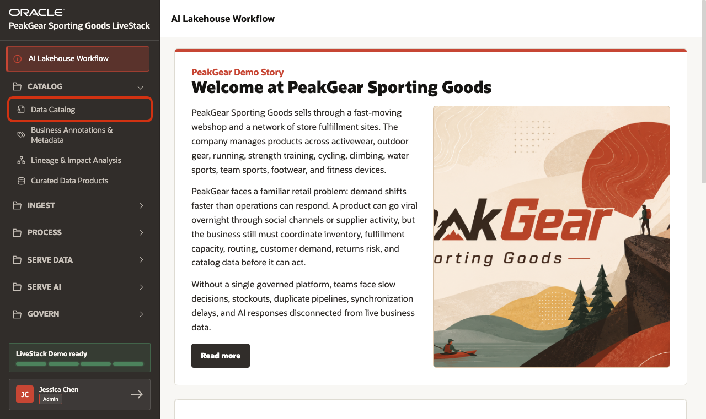
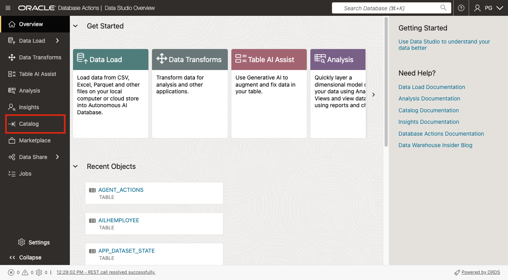
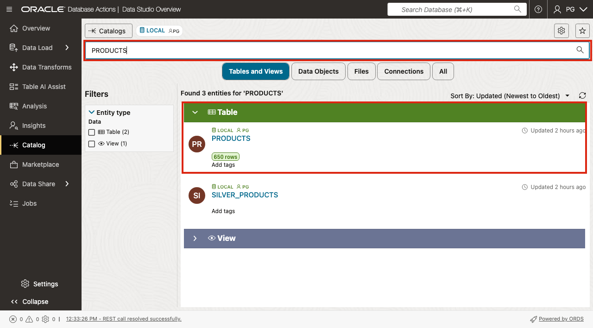
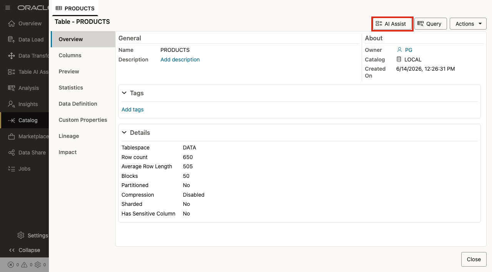
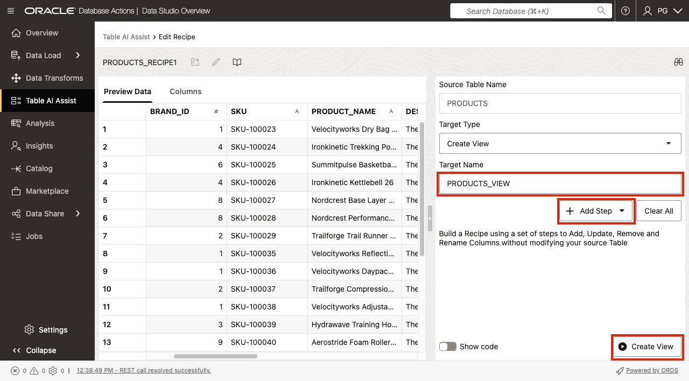

# Scene 2 Data Catalog and AI Table Explain

## Introduction

PeakGear has many useful retail datasets, but useful data is not the same as reusable data. A merchandising analyst may know where product data lives, an ecommerce team may use a different product extract, and an operations team may only trust the fields that appear in its dashboard. If every team discovers, interprets, and enriches product data independently, the business ends up with different answers to basic questions such as which product is being sold, what category it belongs to, and whether it has enough margin to promote.

The Catalog stage of the AI Lakehouse makes trusted data assets discoverable and understandable before they are used by dashboards, applications, machine learning, and AI agents. In this scene, you will start in **Data Studio Catalog**, find the curated `PRODUCTS` dataset, use **AI Assist** to understand the table, and create a small reusable view that adds a business-friendly `MARGIN_PCT` column.

This is intentionally simple. The point is not to build a complex data product. The point is to show how a user can go from "What trusted product data do we have?" to "Here is a documented, reusable product view that can support merchandising and downstream AI Lakehouse outcomes."

Estimated Time: **10 minutes**

### Objectives

In this scene, you will:

- Open **Data Catalog** from the **Catalog** menu.
- Open **Catalog** in Oracle Data Studio.
- Search for the curated `PRODUCTS` table.
- Review the `PRODUCTS` catalog details and launch **AI Assist**.
- Use the AI-assisted explanation to identify a useful derived business column.
- Create a reusable view named `PRODUCT_CATALOG_AI_DEMO_V`.
- Verify that the new view includes `MARGIN_PCT`.

## Task 1: Open the Data Catalog demo



1. In the left sidebar, expand **Catalog**.
2. Select **Data Catalog**.
3. A new browser tab opens Oracle Data Studio.

This is the Catalog step of the AI Lakehouse workflow. The user is not loading data or building a pipeline yet. The user is finding and understanding trusted data assets that can later be served as dashboards, applications, APIs, machine learning features, or AI agent context.

## Task 2: Open Catalog in Data Studio



1. If prompted, sign in with the `PG` username and password shown in **LiveStack Configuration**.
2. In Data Studio, select **Catalog** from the left navigation.
3. Confirm that the Catalog page opens.

Data Studio Catalog gives PeakGear a searchable inventory of database objects. For the demo, this is where the technical object becomes a business asset that users can inspect, explain, and reuse.

## Task 3: Find the PRODUCTS dataset



1. In the Catalog search field, enter:

```text
PRODUCTS
```

2. Press **Enter**.
3. Confirm that `PRODUCTS` appears in the results.
4. Confirm that the table shows **650 rows** in the reference environment.
5. Select `PRODUCTS` to open the table details.

The `PRODUCTS` table is a good catalog demo object because it is easy to understand and relevant to many business outcomes: product catalog browsing, merchandising decisions, semantic search, operations dashboards, webshop discovery, and AI agents.

## Task 4: Review the table and launch AI Assist



1. Review the `PRODUCTS` overview.
2. Confirm that the table is owned by `PG`, belongs to the `LOCAL` catalog, and has a row count of **650**.
3. Review the available detail tabs such as **Columns**, **Preview**, **Data Definition**, **Lineage**, and **Impact**.
4. Click **AI Assist**.

Use AI Assist as the explanation step. If the assistant asks for guidance, use this prompt:

```text
Explain this PRODUCTS table in business terms and suggest one simple derived column that would make it more useful for merchandising analysis.
```

A practical answer is `MARGIN_PCT`, because PeakGear can use it to compare promotional candidates, evaluate category profitability, and prioritize products that deserve more attention.

## Task 5: Review the Table AI Assist create-view workspace



1. Confirm that **Source Table Name** is `PRODUCTS`.
2. Confirm that **Target Type** is **Create View**.
3. In **Target Name**, replace the default value shown in the field with:

```text
PRODUCT_CATALOG_AI_DEMO_V
```

4. Review **Add Step**. This is where Table AI Assist can help build a recipe to add, update, remove, or rename columns without changing the source table.
5. Use the view SQL in the next task as the presenter-safe path for this demo.

The important point is that the source table is not modified. PeakGear can create a reusable view that adds business meaning on top of the trusted product dataset.

## Task 6: Create the margin-enriched product view

Open SQL from Data Studio or use the **Query** action from the `PRODUCTS` detail page. Create the view with this SQL:

```sql
CREATE OR REPLACE VIEW product_catalog_ai_demo_v AS
SELECT
  product_id,
  sku,
  product_name,
  description,
  category,
  subcategory,
  unit_price,
  unit_cost,
  ROUND(
    ((unit_price - unit_cost) / NULLIF(unit_price, 0)) * 100,
    2
  ) AS margin_pct
FROM products;
```

Then verify the result:

```sql
SELECT
  product_name,
  category,
  subcategory,
  unit_price,
  unit_cost,
  margin_pct
FROM product_catalog_ai_demo_v
ORDER BY margin_pct DESC
FETCH FIRST 10 ROWS ONLY;
```

The `MARGIN_PCT` column is intentionally simple. It turns existing product facts into a reusable business measure without duplicating the source table or forcing every downstream dashboard and AI feature to recalculate margin independently.

## Task 7: Verify the new view in Catalog

1. Return to **Catalog**.
2. Search for:

```text
PRODUCT_CATALOG_AI_DEMO_V
```

3. Open the view.
4. Confirm that the view includes `MARGIN_PCT`.
5. Use **AI Assist** again to explain the view in business terms.

This closes the Catalog loop: the user discovered a trusted table, understood it, enriched it as a view, and made the result available as another cataloged data asset.

## Conclusion: Business Outcome

The Data Catalog scene shows how PeakGear can move from technical database objects to reusable business data products. Instead of asking every team to rediscover product data and rebuild the same margin logic, the AI Lakehouse provides a cataloged place to find the asset, understand it, and publish a governed view.

For the business, this reduces duplicated interpretation, improves trust in downstream dashboards and AI features, and helps teams turn curated Gold-layer data into reusable products. The same pattern can be applied to inventory, orders, demand signals, returns, fulfillment sites, and customer datasets before they are served through analytics, applications, APIs, or agents.

You can move to the next scene.

## Credits & Build Notes
- **Author** - Oracle LiveLabs Team
- **Last Updated By/Date** - Oracle LiveLabs Team, 2026-06-14
