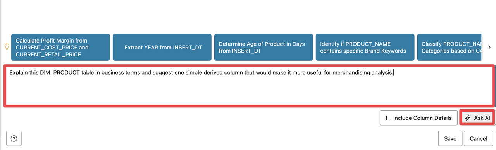
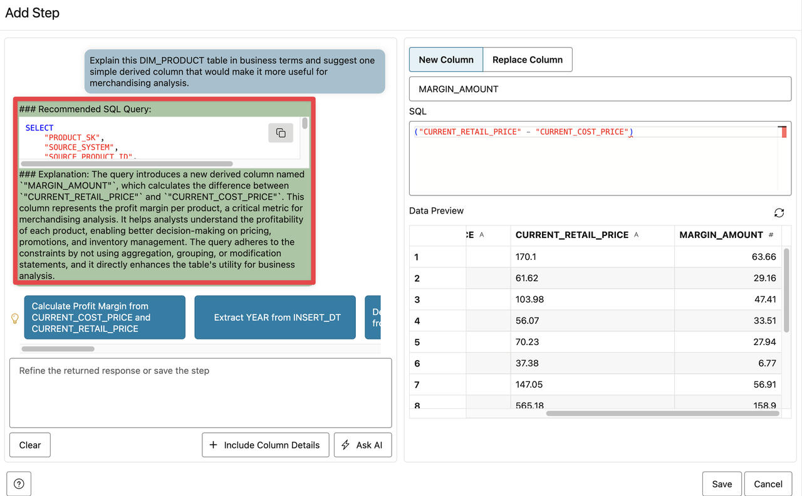
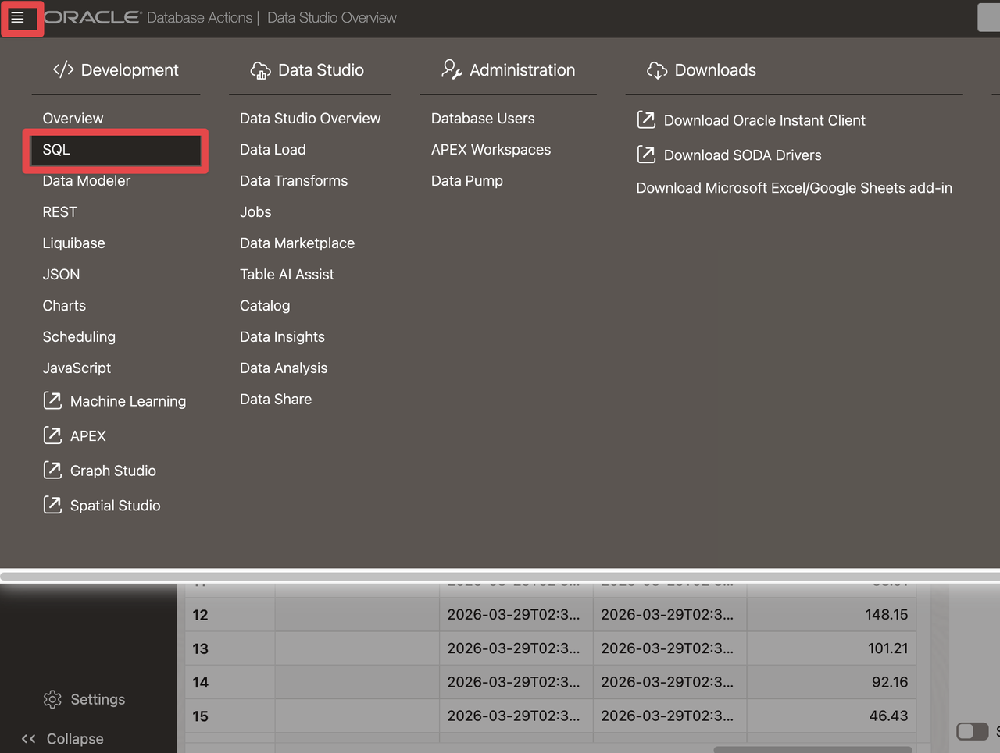

# Scene 2 Data Catalog and AI Table Explain

## Introduction

PeakGear has many useful retail datasets, but useful data is not automatically reusable data. **Catalog** helps users find trusted data before they build dashboards, AI features, reports, or reusable business views from it.

The Catalog stage makes trusted data assets discoverable and understandable before they are reused. In this scene, **Data Studio Catalog** is where a technical table becomes a documented business asset that other teams can inspect and reuse.

This scene is intentionally simple. Focus on the pattern: find a trusted table, understand what it contains, create a reusable view, and verify that the new view is available as another cataloged asset.

Estimated Time: **10 minutes**

### Objectives

In this scene, you will:

- Open **Data Catalog** from the **Catalog** menu.
- Open **Catalog** in Oracle Data Studio.
- Search for the curated `DIM_PRODUCT` table.
- Review the `DIM_PRODUCT` catalog details and launch **AI Assist**.
- Use the AI-assisted explanation to identify a useful derived business column.
- Create a reusable view named `DIM_PRODUCT_VIEW`.
- Verify that the new view includes `MARGIN_AMOUNT`.

## Task 1: Open the Data Catalog demo


Perform the following set of steps to open the Data Catalog demo from the LiveStack sidebar:

1. In the left sidebar, expand **Catalog**.
2. Select **Data Catalog**.
3. A new browser tab opens Oracle Data Studio.

This is the Catalog step of the AI Lakehouse workflow. The user is not loading data or building a pipeline yet. The user is finding and understanding trusted data assets that can later be served as dashboards, applications, APIs, machine learning features, or AI agent context.

## Task 2: Open Catalog in Data Studio


Perform the following set of steps to open **Catalog** in **Oracle Data Studio**:

1. If prompted, sign in with the `PG` username and password shown in **LiveStack Configuration**.
2. In Data Studio, select **Catalog** from the left navigation.
3. Confirm that the Catalog page opens.

Data Studio Catalog gives PeakGear a searchable inventory of database objects. For the demo, this is where the technical object becomes a business asset that users can inspect, explain, and reuse.

## Task 3: Find the DIM_PRODUCT dataset


Perform the following set of steps to find the **DIM_PRODUCT** dataset in Catalog:

1. In the Catalog search field, enter:

```text
DIM_PRODUCT
```

2. Press **Enter**.
3. Confirm that `DIM_PRODUCT` appears in the results.
4. Confirm that the table shows **20,000 rows** in the reference environment.
5. Select `DIM_PRODUCT` to open the table details.

The `DIM_PRODUCT` table is a good catalog demo object because it is easy to understand and relevant to many business outcomes: product catalog browsing, merchandising decisions, semantic search, operations dashboards, webshop discovery, and AI agents.

**Note:** Sample values may change after data refreshes or rebuilds. Focus on the expected result pattern and the business takeaway, not the exact values.

## Task 4: Review the table and launch AI Assist


Perform the following set of steps to review the DIM_PRODUCT table and launch AI Assist:

1. Review the `DIM_PRODUCT` overview.
2. Confirm that the table is owned by `PG`, belongs to the `LOCAL` catalog, and has a row count of **20,000**.
3. Review the available detail tabs such as **Columns**, **Preview**, **Data Definition**, **Lineage**, and **Impact**.
4. Click **AI Assist**.

## Task 5: Review the Table AI Assist create-view workspace


Perform the following set of steps to review the Table AI Assist create-view workspace:

1. Confirm that **Source Table Name** is `DIM_PRODUCT`.
2. Confirm that **Target Type** is **Create View**.
3. In **Target Name**, replace the default value shown in the field with:

```text
DIM_PRODUCT_VIEW
```

4. Review **Add Step**. This is where Table AI Assist can help build a recipe to add, update, remove, or rename columns without changing the source table.
5. Click **Add or replace column**

The system will analyze the table and metadata and give you suggestions.

You can also use your own prompt:

```text
Explain this DIM_PRODUCT table in business terms and suggest one simple derived column that would make it more useful for merchandising analysis.
```



A practical answer is `MARGIN_AMOUNT`, because PeakGear can use it to understand the profitability of each product, enabling better decision-making on pricing, promotions, and inventory management 



**Note:** Sample values may change after data refreshes or rebuilds. Focus on the expected result pattern and the business takeaway, not the exact values.


The important point is that the source table is not modified. PeakGear can create a reusable view that adds business meaning on top of the trusted product dataset.

## Task 6: Create and review the margin-enriched product view

Perform the following set of steps to create and verify the margin-enriched product view:

1. Click **Save** to create the enhanced view.

2. Click **Create View** and then confirm with **Yes**.

2. Open SQL from Data Studio

  

  Then verify the result:
  
  ```sql
  SELECT * FROM dim_product_view;
  ```
  
  The `MARGIN_AMOUNT` column is available.

  
  

This closes the Catalog loop: the user discovered a trusted table, understood it, enriched it as a view, and made the result available as another cataloged data asset.

## Conclusion: Business Outcome

The Data Catalog scene shows how PeakGear can move from technical database objects to reusable business data products. Instead of asking every team to rediscover product data and rebuild the same margin logic, the AI Lakehouse provides a cataloged place to find the asset, understand it, and publish a governed view.

For the business, this reduces duplicated interpretation, improves trust in downstream dashboards and AI features, and helps teams turn curated Gold-layer data into reusable products. The same pattern can be applied to inventory, orders, demand signals, returns, fulfillment sites, and customer datasets before they are served through analytics, applications, APIs, or agents.

You can move to the next scene.

## Credits & Build Notes
- **Author** - Oracle LiveLabs Team
- **Last Updated By/Date** - Oracle LiveLabs Team, 2026-06-14
