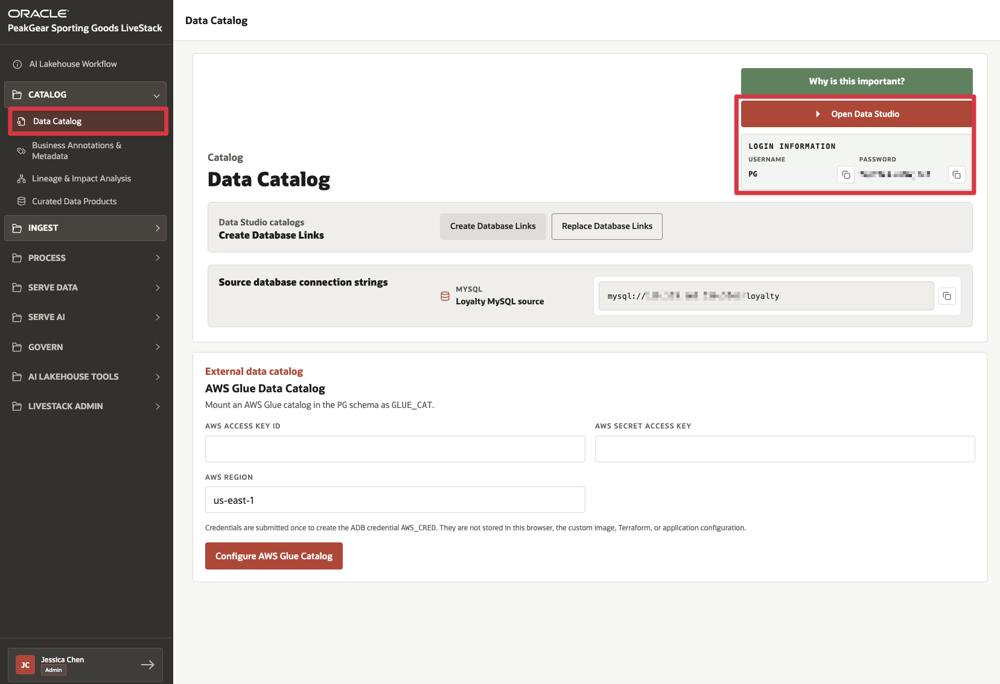
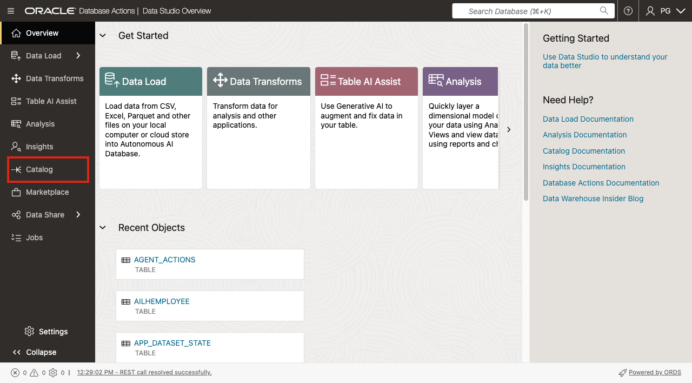
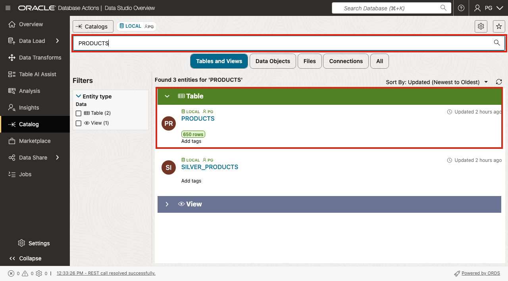
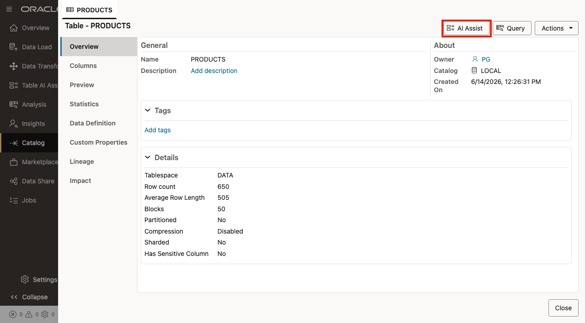
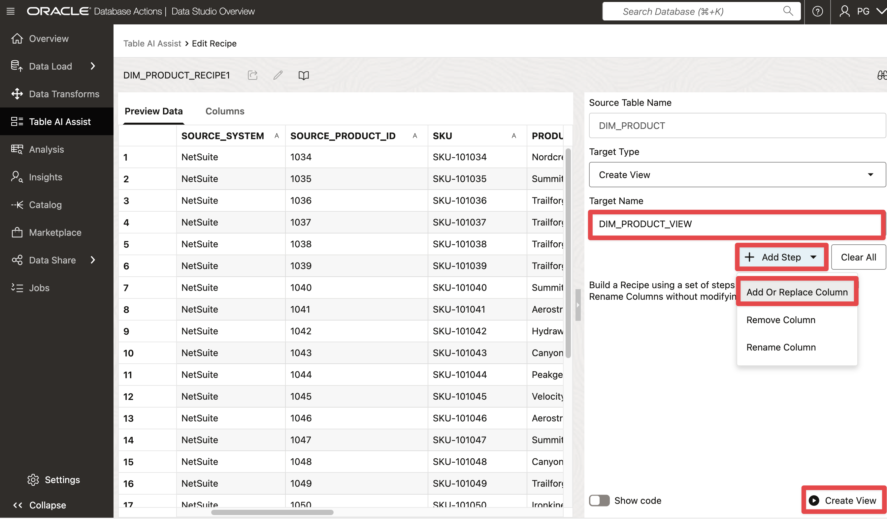
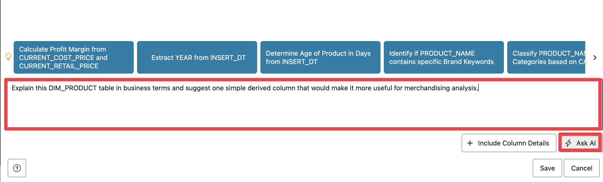
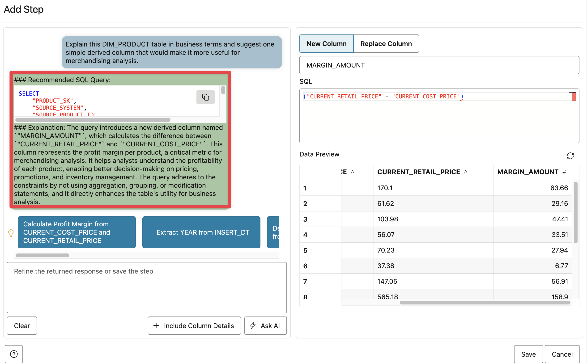
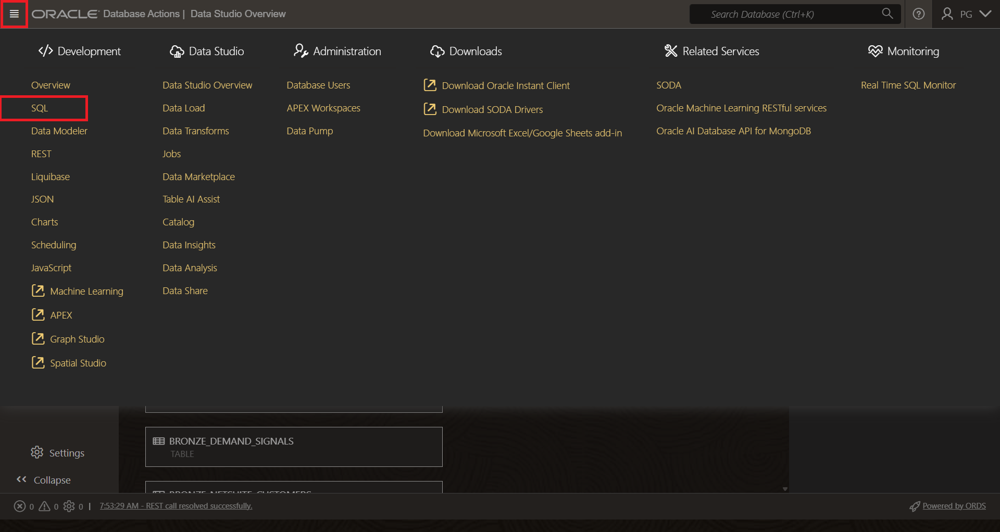

# Data Catalog and AI Table Explain

## Introduction

PeakGear has many retail datasets. **Catalog** helps users find the right table before they build dashboards, AI features, reports, or business views from it.

In the Catalog stage, **Oracle Data Studio Catalog** adds context to a technical table so users can inspect it and reuse it.

**AI Table Explain** uses **AI Assist** to describe the table and help create a reusable view with business meaning.

This scene follows a simple pattern: find a product table, review its contents, create a view with a business column, and confirm that the view is available in Catalog.

Estimated Time: **10 minutes**

### Objectives

In this scene, you will:

- Explore PeakGear product data in the catalog.
- Review what the data contains and how it can be used.
- Ask AI Assist to explain the data in business terms.
- Create a reusable version of the product data with margin information.
- Confirm that the updated product data is available for reuse.

## Task 1: Open the Data Catalog demo



Open the Data Catalog demo from the LiveStack sidebar:

1. In the left sidebar, expand **Catalog**.
2. Select **Data Catalog**.
3. A new browser tab opens Oracle Data Studio.

This is the Catalog stage of the AI Lakehouse. You are not loading data or building a pipeline here. You are finding and understanding a table that can later support dashboards, applications, APIs, machine learning features, or AI agents.

## Task 2: Open Catalog in Data Studio



Open **Catalog** in **Oracle Data Studio**:

1. If prompted, sign in with the `PG` username and password shown in **LiveStack Configuration**.
2. In Data Studio, select **Catalog** from the left navigation.
3. Confirm that the Catalog page opens.

Data Studio Catalog provides a searchable list of database objects. In this demo, use it to inspect a product table, ask AI Assist to explain it, and reuse the result as a view.

## Task 3: Find the DIM_PRODUCT table



Find the **DIM_PRODUCT** table in Catalog:

1. In the Catalog search field, enter:

    ```text
    DIM_PRODUCT
    ```

2. Press **Enter**.
3. Confirm that `DIM_PRODUCT` appears in the results.
4. Confirm that the table shows **20,000 rows** in the reference environment.
5. Select `DIM_PRODUCT` to open the table details.

The `DIM_PRODUCT` table is useful for this demo because several PeakGear experiences use product data:

- Product catalog browsing
- Merchandising
- Semantic search
- Operations dashboards
- Webshop discovery
- AI agents

**Note:** Sample values may change after data refreshes or rebuilds. Focus on the expected result pattern and the business takeaway, not the exact values.

## Task 4: Review the table and launch AI Assist



Review the `DIM_PRODUCT` table and launch AI Assist:

1. Review the `DIM_PRODUCT` overview.
2. Confirm that the table is owned by `PG`, belongs to the `LOCAL` catalog, and has a row count of **20,000**.
3. Review the available detail tabs such as **Columns**, **Preview**, **Data Definition**, **Lineage**, and **Impact**.
4. Click **AI Assist**.

## Task 5: Review the Table AI Assist create-view workspace



Review the Table AI Assist create-view workspace:

1. Confirm that **Source Table Name** is `DIM_PRODUCT`.
2. Confirm that **Target Type** is **Create View**.
3. In **Target Name**, replace the default value shown in the field with:

    ```text
    DIM_PRODUCT_VIEW
    ```

4. Review **Add Step**. Use this workspace to add, update, remove, or rename columns in the new view without changing the source table.
5. Click **Add or replace column**.

AI Assist analyzes the table and its metadata, then suggests changes.

You can also use your own prompt:

```text
Explain this DIM_PRODUCT table in business terms and suggest one simple derived column that would make it more useful for merchandising analysis.
```



A useful column to add is `MARGIN_AMOUNT`. PeakGear can use it to review product profitability when evaluating pricing, promotions, and inventory.



**Note:** Sample values may change after data refreshes or rebuilds. Focus on the expected result pattern and the business takeaway, not the exact values.


The source table stays unchanged. PeakGear can create a reusable view that adds business meaning to the product data.

## Task 6: Create and review the margin-enriched product view

Create and verify the margin-enriched product view:

1. Click **Save** to save the view configuration.

2. Click **Create View**, then confirm with **Yes**.

3. Open SQL from Data Studio.

  

  Then verify the result:
  
  ```sql
  SELECT * FROM dim_product_view;
  ```
  
  The `MARGIN_AMOUNT` column is available.

  
  

This completes the Catalog workflow: find a product table, understand it, add a business column in a view, and make the result available in Catalog.

## Conclusion: Business Outcome

The Data Catalog scene shows how PeakGear can turn a technical database object into a reusable data product. Users can find product data in the catalog, understand its columns, add margin logic in a view, and make that view available to other teams.

The same approach can be used for inventory, orders, demand, returns, fulfillment sites, and customer data. Those assets can then support analytics, applications, APIs, or AI agents.


## Acknowledgements

* **Author** - Kevin Lazarz August 2026
* **Contributor** - Eugenio Galiano
* **Last Updated By/Date** - Kevin Lazarz  August 2026
