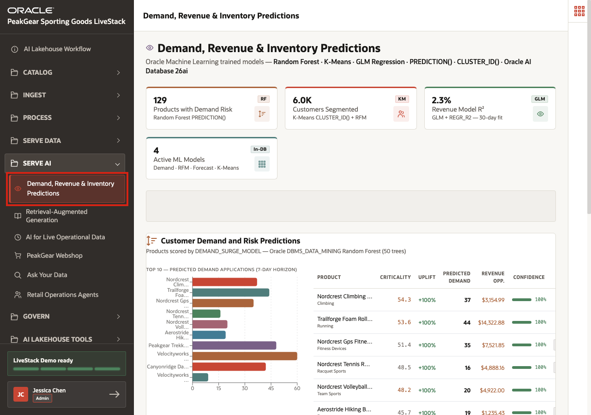
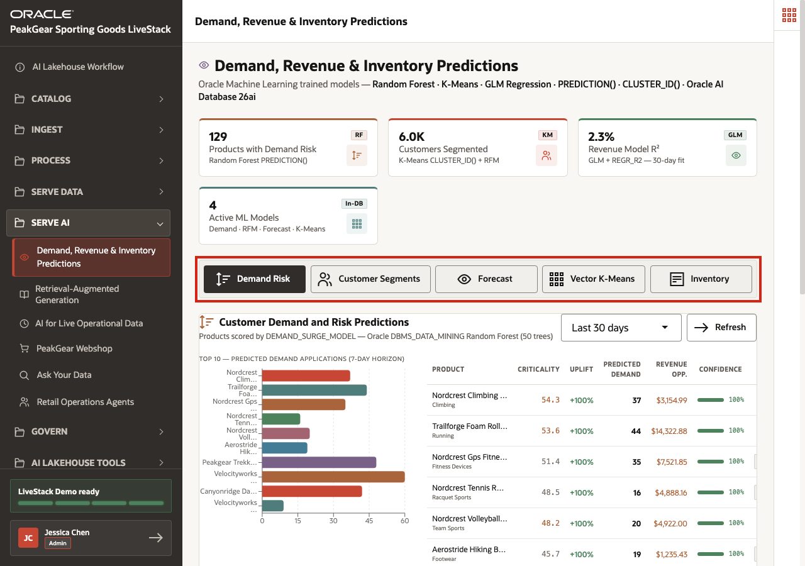
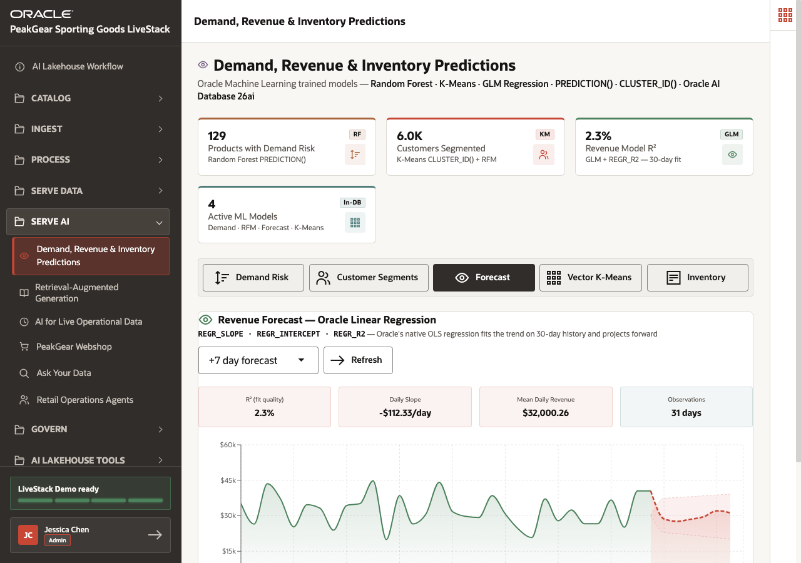
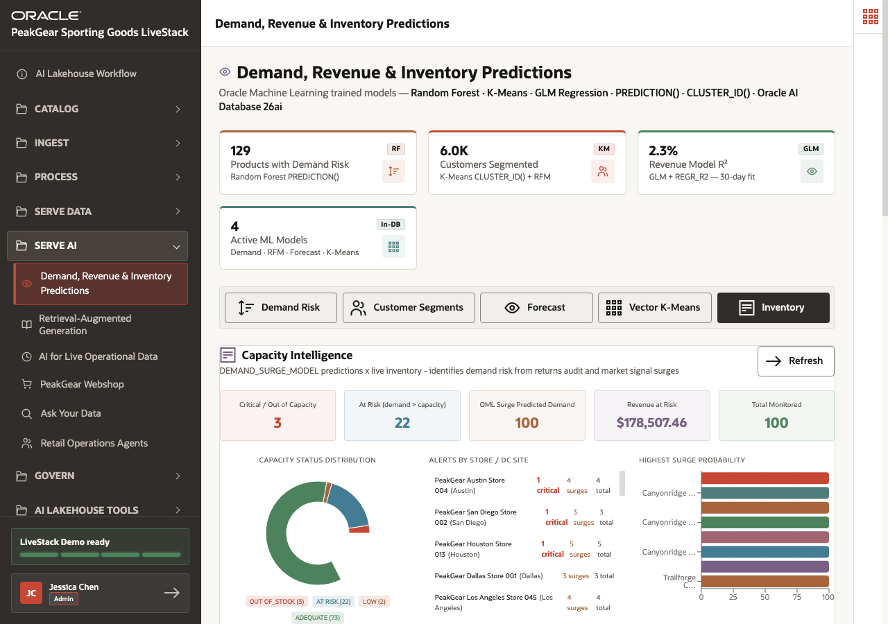

# Scene 13 Demand, Revenue, and Inventory Predictions

## Introduction

PeakGear has already brought operational data through the AI Lakehouse medallion process. Product demand signals, customer behavior, order history, revenue observations, and inventory levels can start as separate data sources. Bronze captures them, Silver standardizes and enriches them, and Gold serves the trusted feature foundation needed for predictive AI.

The business challenge is timing and confidence. PeakGear needs to know which products are at risk of demand surge, how revenue is trending, and where inventory exposure is building. If prediction models are trained on disconnected extracts or stale spreadsheets, planners may act too late, overstock the wrong products, or miss a demand spike that operations could have handled.

**Demand, Revenue & Inventory Predictions** shows how machine-learning output becomes a Serve AI outcome from the AI Lakehouse. Oracle Machine Learning can score demand risk, segment customers, forecast revenue, cluster products, and compare predicted demand against inventory from the same governed database foundation. The result is not just a model score. It is an AI-assisted operating view for allocation, replenishment, campaign focus, and revenue-risk mitigation.

Estimated Time: **10 minutes**

### Objectives

In this scene, you will:

- Open **Demand, Revenue & Inventory Predictions** from the **Serve AI** menu.
- Review the live model summary.
- Inspect product demand-risk predictions.
- Review revenue forecast output.
- Review inventory capacity intelligence.
- Connect predictive analytics to Gold-layer business outcomes.

## Task 1: Open Demand, Revenue & Inventory Predictions

1. In the left sidebar, expand **Serve AI**.
2. Select **Demand, Revenue & Inventory Predictions**.
3. Confirm that the page title is **Demand, Revenue & Inventory Predictions**.

This page is a Serve AI prediction experience. The user is consuming model output and operational intelligence that depend on curated lakehouse data.

## Task 2: Review demand-risk predictions

1. Review the model summary cards: **129 Products with Demand Risk**, **6.0K Customers Segmented**, **2.3% Revenue Model R²**, and **4 Active ML Models**.
2. Stay on the **Demand Risk** tab.
3. Review the predicted-demand chart and table.
4. Use visible product examples such as **Trailforge Foam Roller 227**, **Peakgear Trekking Poles 291**, and **Velocityworks Outdoor Jacket 231** to explain how demand risk becomes an operational planning signal.

The demand-risk tab translates cleaned product, demand, revenue, and customer signals into a ranked AI output. A planner can immediately see which products may need more inventory attention or campaign coordination.

## Task 3: Review revenue forecast

1. Select **Forecast**.
2. Review the **+7 day forecast** view.
3. Review the model metrics: **2.3% R²**, **-$112.33/day Daily Slope**, **$32,000.26 Mean Daily Revenue**, and **31 days Observations**.
4. Explain that the goal of the demo is to show how forecast output can be served next to operational data, not to tune the model during the walkthrough.

Revenue forecast gives the business a planning lens. Even when the model fit is not strong, the AI view helps users understand trend direction, observations, and forecast horizon from the same governed data foundation.

## Task 4: Review inventory capacity intelligence

1. Select **Inventory**.
2. Review the capacity summary: **3 Critical / Out of Capacity**, **22 At Risk**, **100 OML Surge Predicted Demand**, **$178,507.46 Revenue at Risk**, and **100 Total Monitored**.
3. Review the store/DC alert list, including **PeakGear Austin Store 004** and **PeakGear Dallas Store 001**.
4. Explain how this connects predicted demand to operational capacity.

The inventory view closes the loop between prediction and action. PeakGear can move from "which products may surge?" to "where do we have inventory risk?" without handing the analysis to a separate spreadsheet or standalone model runtime.

## Conclusion: Business Outcome

Demand, Revenue & Inventory Predictions shows how PeakGear can serve machine-learning output as part of the Serve AI layer of the AI Lakehouse business workflow. The prediction experience is grounded in the same medallion process that prepared product, customer, order, demand, revenue, and inventory data.

Bronze captures source events and snapshots. Silver standardizes business keys and features. Gold serves trusted data products that Oracle Machine Learning can score and turn into AI products that business users can inspect in context.

For the business, this means planners can identify demand risk earlier, understand revenue trajectory, focus inventory actions where capacity exposure is highest, and make replenishment decisions from governed operational data rather than disconnected model exports.

You can move to the next scene.

## Credits & Build Notes
- **Author** - Oracle LiveLabs Team
- **Last Updated By/Date** - Oracle LiveLabs Team, 2026-06-12
