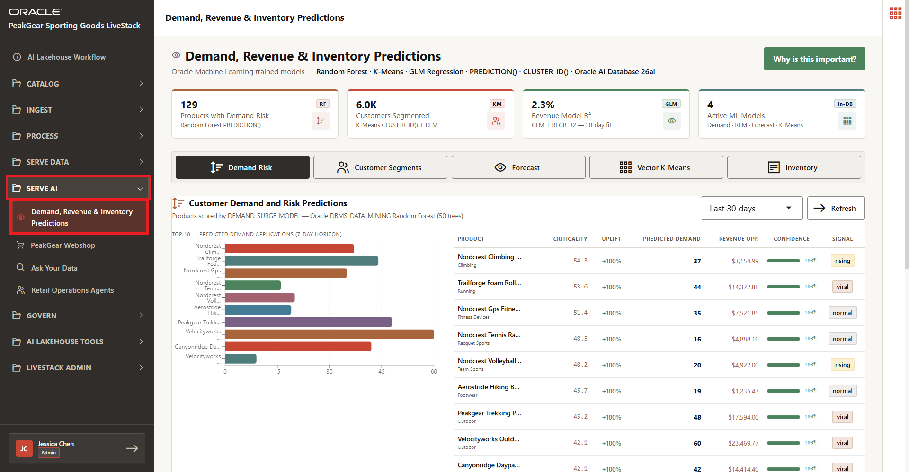
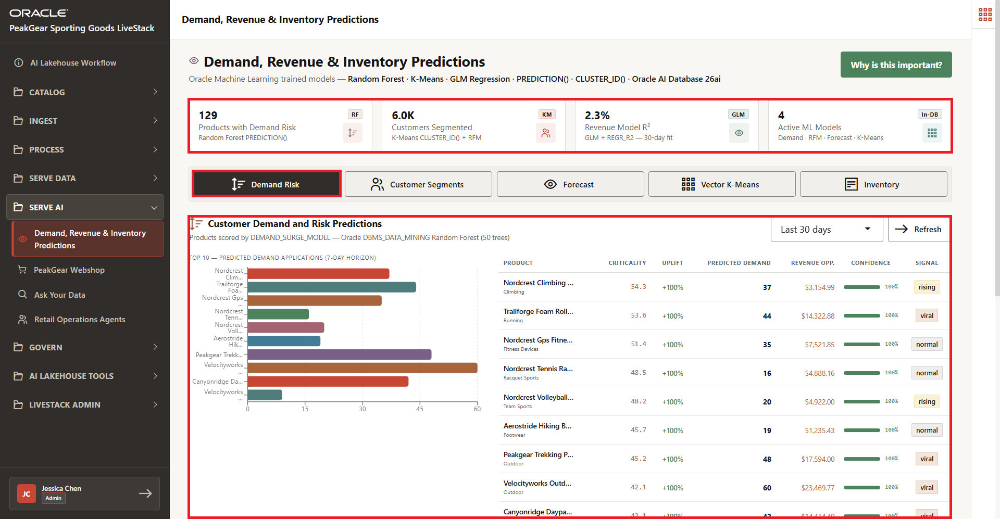
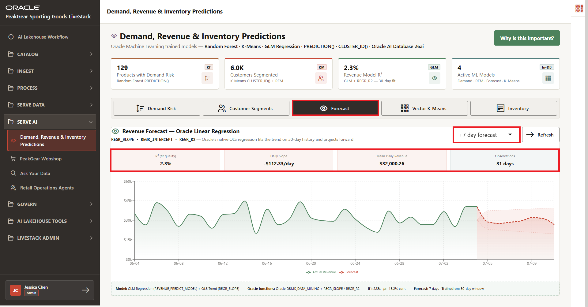
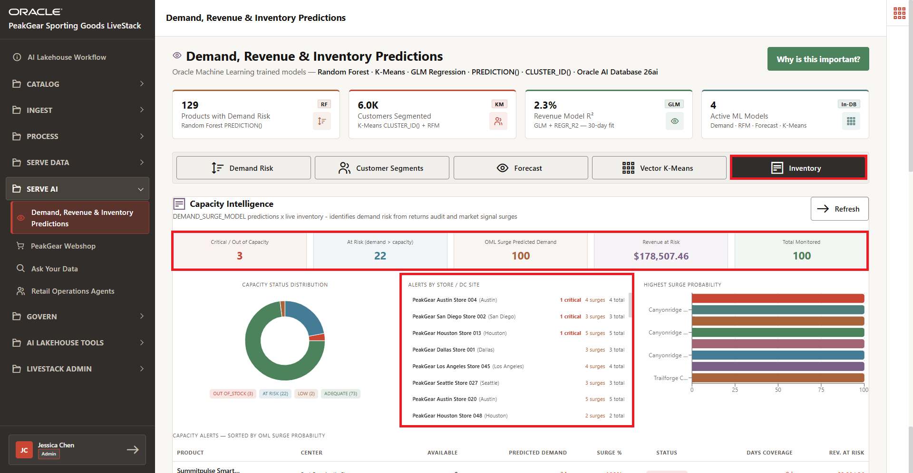

# Demand, Revenue, and Inventory Predictions

## Introduction

**PeakGear** has already brought operational data through the **AI Lakehouse** medallion process. This scene shows how prepared data can support predictions alongside dashboards and catalog views.

PeakGear needs to know which products may see a demand surge, how revenue is trending, and where inventory exposure is building. If models use stale or disconnected data, planners may act too late or focus on the wrong products.

**Demand, Revenue & Inventory Predictions** shows how machine-learning output becomes a Serve AI experience built on prepared lakehouse data.

The page presents **Oracle Machine Learning** output as demand risk, revenue forecasts, and inventory exposure.

Estimated Time: **10 minutes**

### Objectives

In this scene, you will:

- Review product demand risk, revenue trends, and inventory exposure.
- Compare the prediction results with the model summary.
- See how prepared data supports planning decisions.

## Task 1: Open Demand, Revenue & Inventory Predictions

Open **Demand, Revenue & Inventory Predictions**:

1. In the left sidebar, expand **Serve AI**.
2. Select **Demand, Revenue & Inventory Predictions**.
3. Confirm that the page title is **Demand, Revenue & Inventory Predictions**.

This page is a Serve AI prediction experience. The user is consuming model output and operational intelligence that depend on curated lakehouse data.

## Task 2: Review demand-risk predictions

Review the demand-risk predictions:

1. Review the model summary cards: **129 Products with Demand Risk**, **6.0K Customers Segmented**, **2.3% Revenue Model R²**, and **4 Active ML Models**.
2. Stay on the **Demand Risk** tab.
3. Review the predicted-demand chart and table.
4. Use visible product examples such as **Trailforge Foam Roller 227**, **Peakgear Trekking Poles 291**, and **Velocityworks Outdoor Jacket 231** to explain how demand risk becomes an operational planning signal.

The demand-risk tab combines product, demand, revenue, and customer signals into a ranked result. A planner can see which products may need more inventory attention or campaign coordination.

**Note:** Sample values may change after data refreshes or rebuilds. Focus on the expected result pattern and the business takeaway, not the exact values.

## Task 3: Review revenue forecast

Review the revenue forecast:

1. Select **Forecast**.
2. Review the **+7 day forecast** view.
3. Review the model metrics: **2.3% R²**, **-$112.33/day Daily Slope**, **$32,000.26 Mean Daily Revenue**, and **31 days Observations**.
4. Explain that the goal of the demo is to show how forecast output can be served next to operational data, not to tune the model during the walkthrough.

The revenue forecast shows trend direction, the number of observations, and the forecast horizon. The goal of this demo is to review the output, not tune the model.

**Note:** Sample values may change after data refreshes or rebuilds. Focus on the expected result pattern and the business takeaway, not the exact values.

## Task 4: Review inventory capacity intelligence

Review inventory capacity:

1. Select **Inventory**.
2. Review the capacity summary: **3 Critical / Out of Capacity**, **22 At Risk**, **100 OML Surge Predicted Demand**, **$178,507.46 Revenue at Risk**, and **100 Total Monitored**.
3. Review the store/DC alert list, including **PeakGear Austin Store 004** and **PeakGear Dallas Store 001**.
4. Explain how this connects predicted demand to operational capacity.

The inventory view connects predicted demand to capacity. PeakGear can move from "which products may surge?" to "where do we have inventory risk?" in the same experience.

## Conclusion: Business Outcome

Demand, Revenue & Inventory Predictions shows how PeakGear can use machine-learning output in the Serve AI layer of the AI Lakehouse. The experience uses data prepared through the same medallion process as the product, customer, order, demand, revenue, and inventory data.

Bronze captures source events and snapshots. Silver standardizes business keys and features. Gold provides data products that Oracle Machine Learning can score and return to business users in context.

For the business, planners can review demand risk, revenue trends, and capacity exposure together when they plan replenishment.

## Acknowledgements

* **Author** - Kevin Lazarz August 2026
* **Contributor** - Eugenio Galiano
* **Last Updated By/Date** - Kevin Lazarz  August 2026
