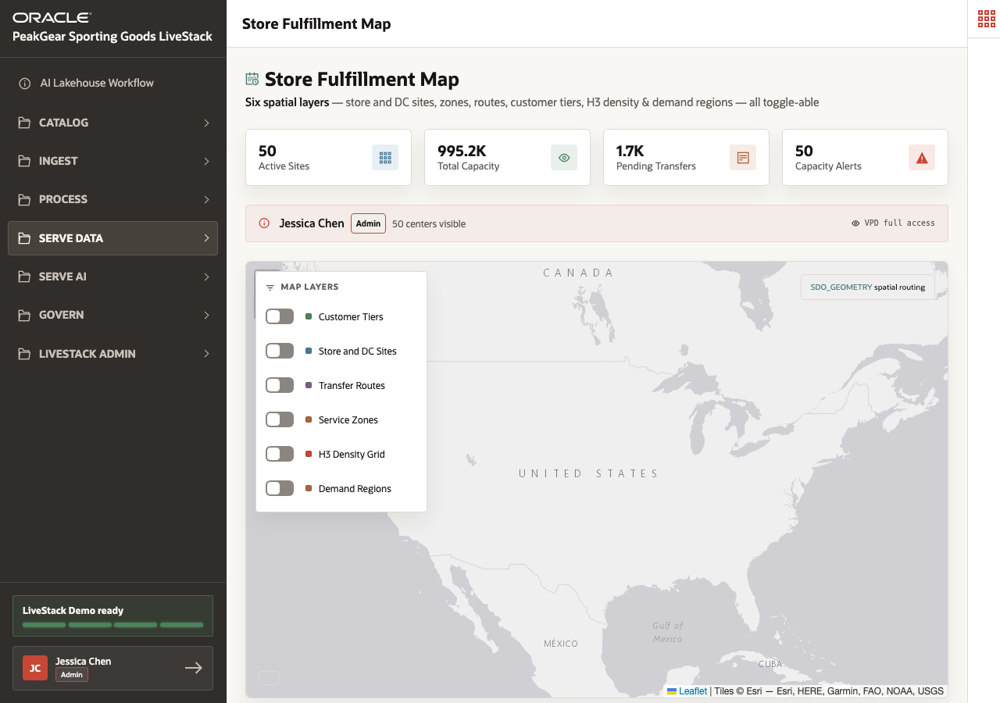
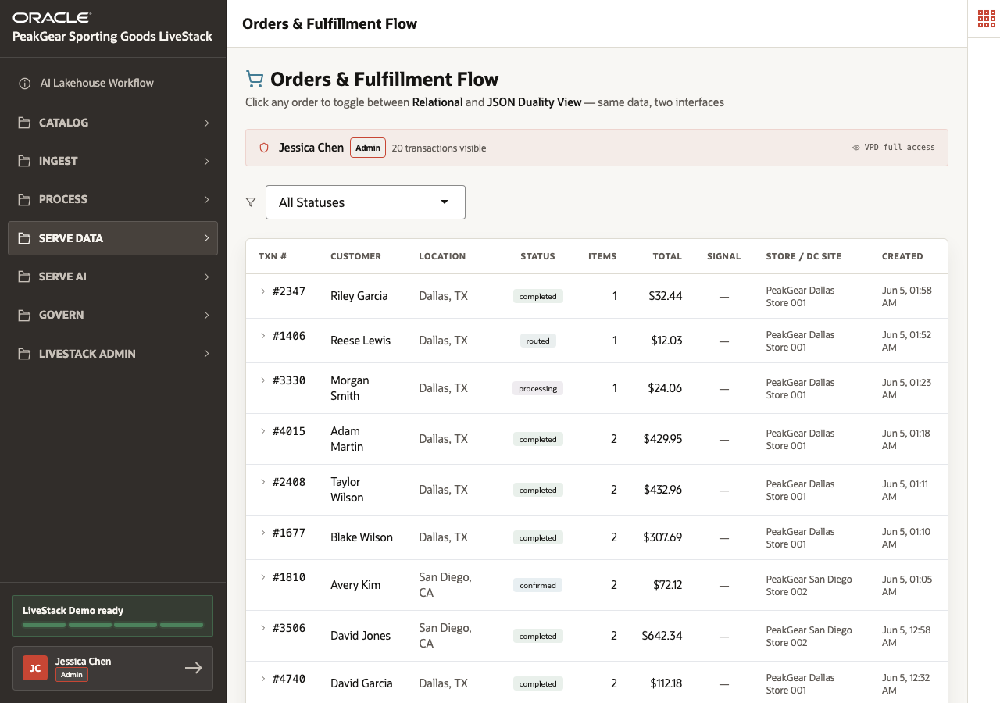
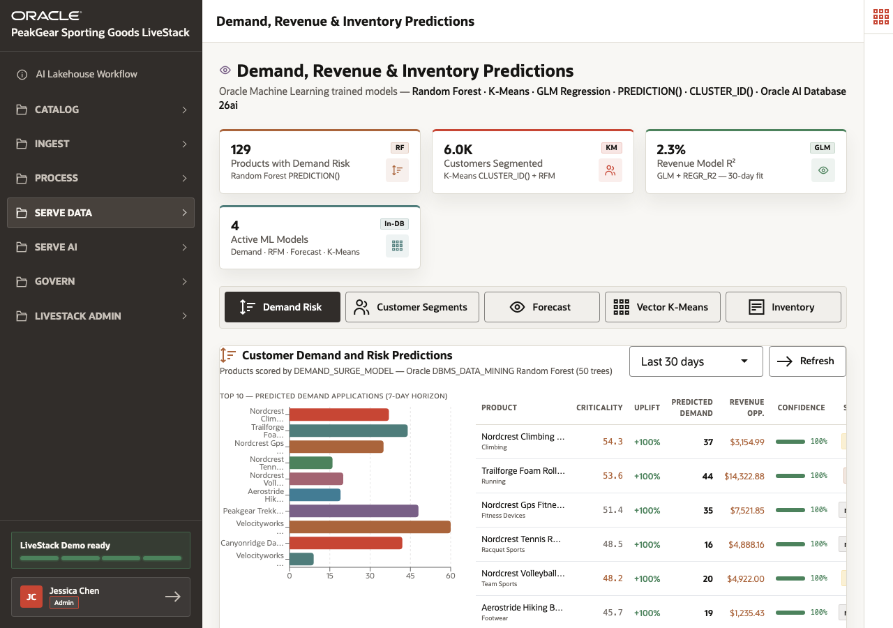

# Scene 9 Fulfillment, Orders, and Predictions

## Introduction

Retailers must turn demand insight into operational action. If a product starts trending in a region, PeakGear needs to understand store capacity, nearby fulfillment sites, order flow, and forecasted demand before deciding how to replenish or route.

This scene connects spatial fulfillment, order operations, and predictive analytics.

Estimated Time: **10 minutes**

### Objectives

In this scene, you will:

- Review store fulfillment sites and regional coverage.
- Inspect customer and order flow through JSON and relational views.
- Review machine learning predictions for demand, revenue, and inventory.
- Connect spatial, operational, and predictive data to one retail decision.

## Task 1: Review fulfillment capacity and geography

1. Open **Serve Data** and select **Store Fulfillment Map**.
2. Review the fulfillment site markers and table.
3. Use **PeakGear Austin Store 004** as a concrete example: it has **24,545 total units**, **172 products available**, and **71 pending shipments** in the live data.
4. Explain how spatial service zones help route orders across store fulfillment sites.

## Task 2: Review orders and fulfillment flow

1. Open **Orders & Fulfillment Flow**.
2. Review recent order rows such as **Order 2347** for **Riley Garcia** in **Dallas, TX**, fulfilled through **PeakGear Dallas Store 001**.
3. Open an order detail if available.
4. Explain how JSON duality and relational data help teams inspect customer orders from both application and database perspectives.

## Task 3: Review predictive analytics

1. Open **Demand, Revenue & Inventory Predictions**.
2. Review demand forecasts, revenue forecasts, customer segments, vector clusters, and inventory intelligence.
3. Use the live data point of **320 demand forecasts** to explain how predictions build on the same trusted foundation.
4. Connect the prediction output back to decisions: inventory allocation, replenishment, campaign focus, and revenue-risk mitigation.

You can move to the next scene.

## Credits & Build Notes
- **Author** - Oracle LiveLabs Team
- **Last Updated By/Date** - Oracle LiveLabs Team, 2026-06-05
