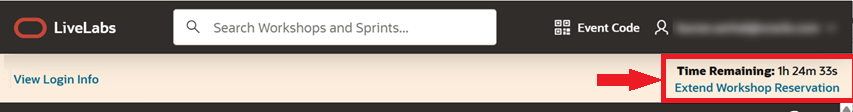
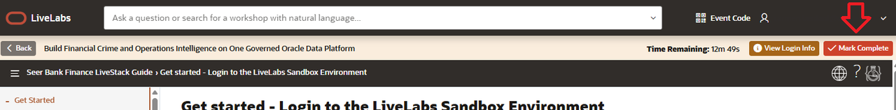
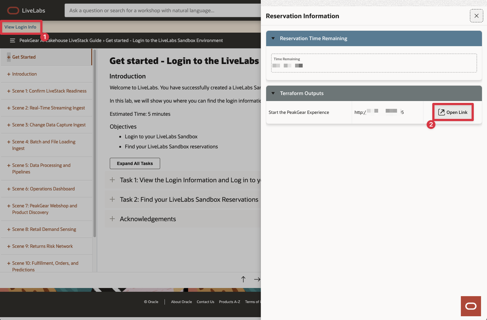
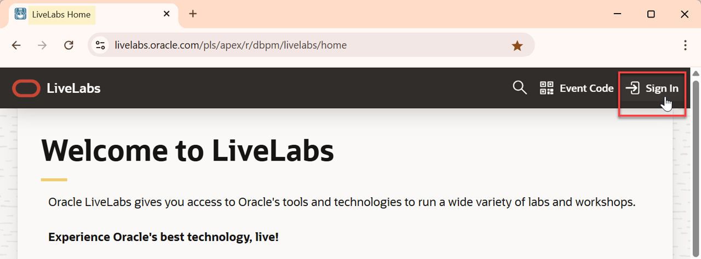
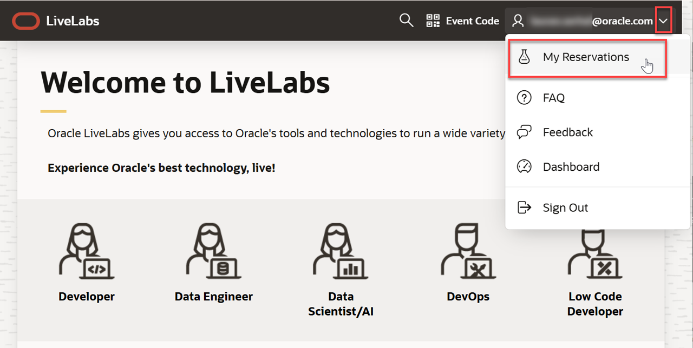
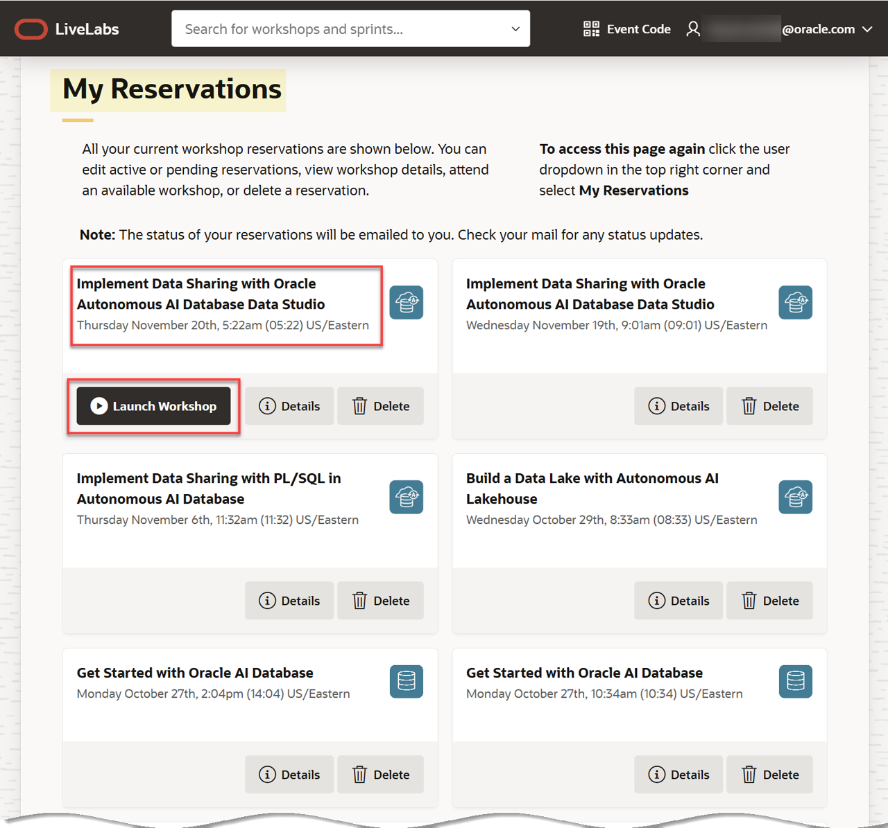

# Get started - Login to the LiveLabs Sandbox Environment

## Introduction

Welcome to LiveLabs.
You have successfully created a LiveLabs Sandbox environment!

In this lab, we will show you where you can find the login information and how to log in to your LiveLabs Sandbox.

Estimated Time: 5 minutes

### Objectives

- Login to your LiveLabs Sandbox
- Find your LiveLabs Sandbox reservations

## Task 1: View the Login Information and Log in to your LiveLabs Sandbox

1. Above the workshop instructions, you can find the information and actions you need to access and track your sandbox session:

    a. **View Login Info**: Click **View Login Info** to open your assigned credentials, resources, and other details needed to access your LiveLabs Sandbox.

    

    b. **Time Remaining**: This shows how much time is left before your LiveLabs Sandbox access expires.

    c. **Extend Workshop Reservation**: If this option is available, clicking it extends the duration of your workshop reservation by **30 minutes**.

    

    c. **Mark Complete**: After you finish the LiveStack demo, click **Mark Complete**. This marks the demo as completed on the **LiveStack's landing page**.

    

    >**Note:** Clicking **Mark Complete** marks the demo as completed on the **LiveStack's landing page**.

2. Click **View Login Info** to see your detailed reservation information.

3. Select **Open Link** to launch the Livestack Demo.

    

4. If you need to view your login information at any time, click the **View Login Info** link in **Run Workshop** browser tab. **Important:** Please be aware of the **Time Remaining** for your sandbox environment. Your environment will be deleted once the remaining time has expired.

## Task 2: Find your LiveLabs Sandbox Reservations

If you close your browser, and you want to launch your workshop again, use the following steps.

1. Go to [livelabs.oracle.com](https://livelabs.oracle.com), and then click **Sign In**.

    

2. Login using your Oracle account. Next, click the drop-down menu next to your account name, and then select **My Reservations**.

    

3. The **My Reservations** page is displayed. You can find here a complete history of all LiveLabs workshops that you had signed up for. Click **Launch Workshop** to start a workshop with an available (current) LiveLabs Sandbox environment.

    

You may now **proceed to the next lab**.

## Acknowledgements

* **Authors:**
    * LiveLabs Team
* **Last Updated By/Date:** Teodor C. Nechita / June 2026
