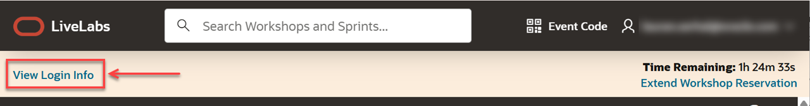
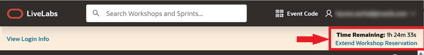
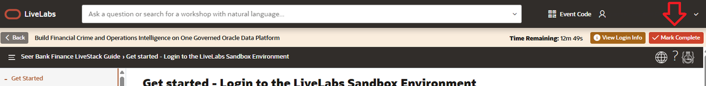
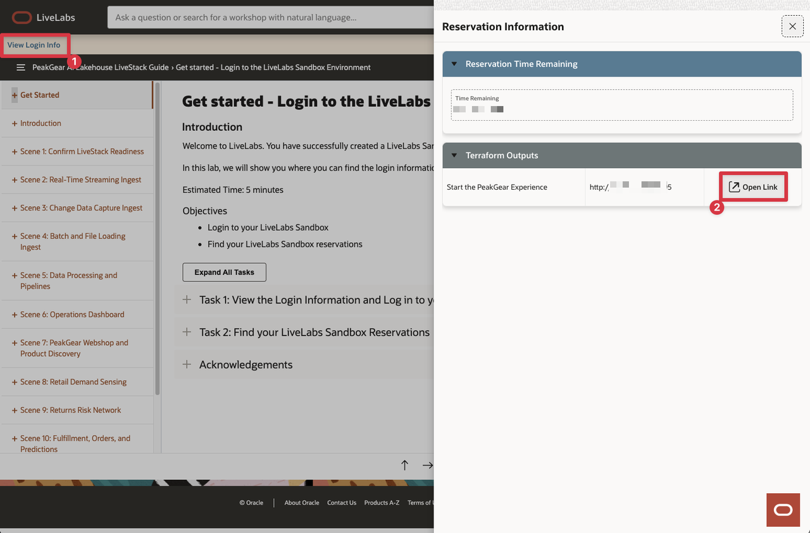
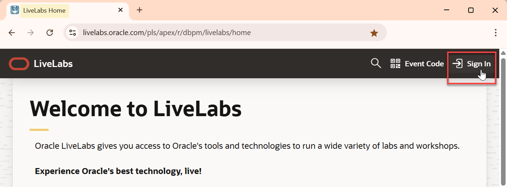
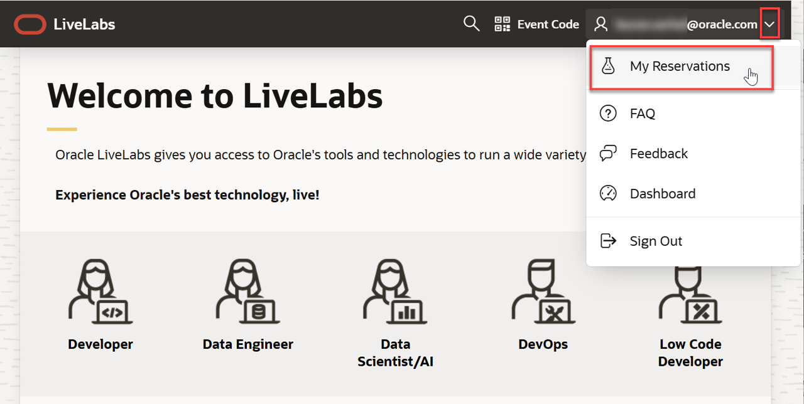
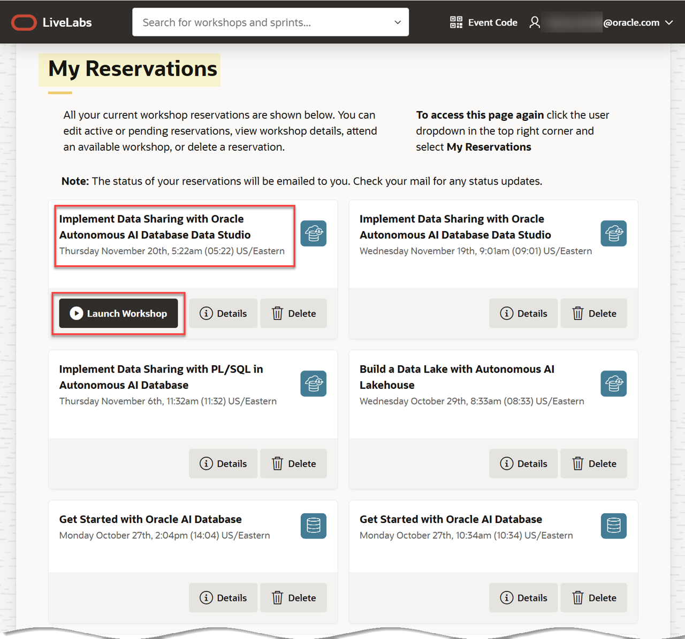

# Get Started: Log In to the LiveLabs Sandbox Environment

## Introduction

**Welcome to LiveLabs.**

You have successfully created a LiveLabs Sandbox environment. This sandbox is the temporary cloud environment where you open and run the PeakGear LiveStack demo.

In this lab, you will find the sandbox login information, open the running LiveStack demo, and learn how to return to your reservation if the browser closes.

**Note:** A "sandbox" is the temporary cloud environment where the guided demo runs.

Estimated Time: **5 minutes**

### Objectives

- Log in to your LiveLabs Sandbox.
- Find your LiveLabs Sandbox reservations.

## Task 1: View the Login Information and Log in to your LiveLabs Sandbox

Use the following controls to access and manage your sandbox session, then open the LiveStack demo:

1. Above the workshop instructions, you can find the information and actions you need to access and track your sandbox session:

    a. **View Login Info**: Open your assigned credentials, resources, and other details for the LiveLabs Sandbox.

    

    b. **Time Remaining**: Check how much time remains before your LiveLabs Sandbox access expires.

    c. **Extend Workshop Reservation**: If this option is available, click it to extend your workshop reservation by **30 minutes**.

    

    d. **Mark Complete**: After you finish the LiveStack demo, click **Mark Complete**. This marks the demo as completed on the **LiveStack landing page**.

    

    > **Note:** Use **Mark Complete** only after you finish the LiveStack demo. If you are still working through the scenes, leave the reservation open and continue with the next task.

2. Click **View Login Info** to see your detailed reservation information.

3. Select **Open Link** to launch the Livestack Demo.

    

4. If you need to view your login information again, click **View Login Info** in the **Run Workshop** browser tab.

**Important:** Check the **Time Remaining** for your sandbox environment. The environment is deleted when the remaining time expires.

## Task 2: Find your LiveLabs Sandbox Reservations

Return to your LiveLabs Sandbox reservation after closing the browser:

1. Go to [livelabs.oracle.com](https://livelabs.oracle.com), and then click **Sign In**.

    

2. Log in with your Oracle account. Click the drop-down menu next to your account name, then select **My Reservations**.

    

3. On the **My Reservations** page, find the LiveLabs workshops you have reserved. Click **Launch Workshop** to open a workshop with an available LiveLabs Sandbox environment.

    

Continue to the next lab.

## Acknowledgements

* **Author** - Kevin Lazarz August 2026
* **Contributor** - Eugenio Galiano
* **Last Updated By/Date** - Kevin Lazarz  August 2026
