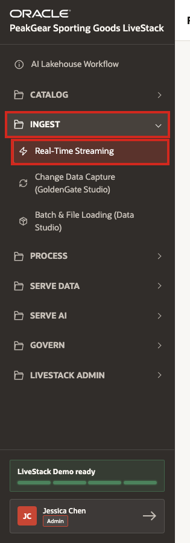
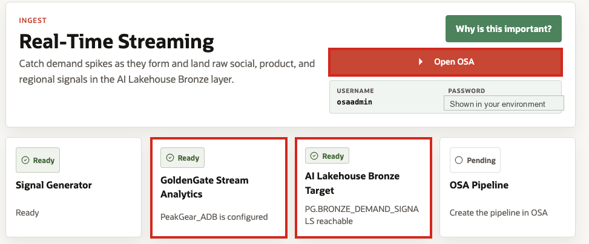
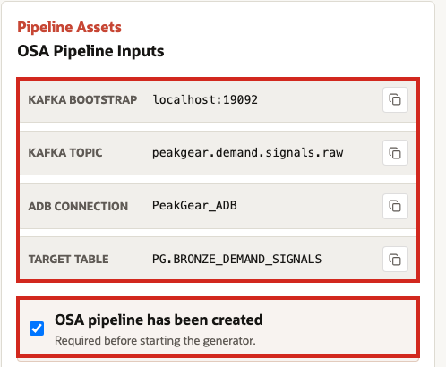
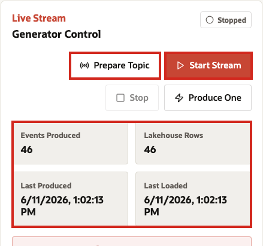
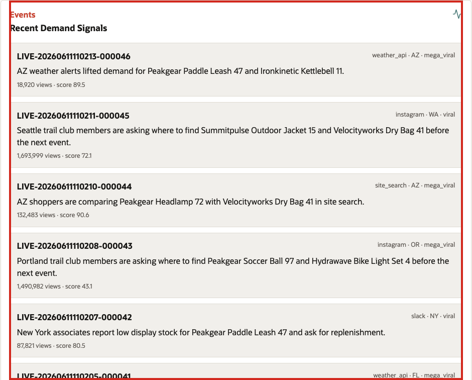

# Scene 2 Real-Time Streaming Ingest

## Introduction

PeakGear sells in a market where demand can change before traditional reporting catches up. A product can trend after a regional event, store associates can see shelves emptying before central teams notice, and shoppers can begin searching for alternatives while planners are still working from yesterday's numbers.

Without real-time streaming, PeakGear risks reacting too late: replenishment decisions arrive after stockouts, marketing campaigns miss the moment, fulfillment teams are surprised by regional demand, and AI experiences answer from data that is already stale.

This scene shows how PeakGear can move from delayed awareness to live business sensing. By capturing demand signals as they happen, the business creates an early-warning system for planners, merchandisers, fulfillment teams, and customer-facing AI. Those signals become the starting point for later processing, where raw observations are refined into trusted data products that support demand sensing, product discovery, dashboards, predictions, and AI agents.

Estimated Time: **10 minutes**

### Objectives

In this scene, you will:

- Open the **Real-Time Streaming** demo from the **Ingest** menu.
- Review where GoldenGate Stream Analytics access and readiness status are shown.
- Confirm the Kafka, ADB connection, and Bronze target values used by the stream.
- Start the live demand-signal generator.
- Monitor events as they land in the Bronze layer.
- Connect Bronze streaming ingest to later Silver and Gold data products.

## Task 1: Open the Real-Time Streaming demo

1. In the left sidebar, expand **Ingest**.
2. Select **Real-Time Streaming**.
3. Confirm that the page title is **Real-Time Streaming** before continuing.

## Task 2: Review GoldenGate Stream Analytics access

1. Click **Open OSA** if you want to inspect GoldenGate Stream Analytics in a new tab.
2. Use the displayed OSA credentials to sign in when prompted.
3. In GoldenGate Stream Analytics, review the existing streaming pipeline only. Do not create or change the pipeline during this demo walkthrough.
4. On the LiveStack page, confirm that **GoldenGate Stream Analytics** is **Ready** and that the **AI Lakehouse Bronze Target** is reachable.

## Task 3: Confirm the Kafka-to-Bronze pipeline values

1. Review **OSA Pipeline Inputs**.
2. Confirm the Kafka bootstrap value and the Kafka topic **peakgear.demand.signals.raw**.
3. Confirm the ADB connection **PeakGear_ADB**.
4. Confirm the target table **PG.BRONZE\_DEMAND\_SIGNALS**.
5. Select **OSA pipeline has been created** after you have confirmed the pipeline exists in GoldenGate Stream Analytics. This enables the generator controls in the LiveStack page.

## Task 4: Start the live demand-signal stream

1. Click **Prepare Topic** to confirm that the Kafka topic is available.
2. Click **Start Stream**.
3. Let the stream run long enough to produce visible events.
4. Watch **Events Produced** and **Lakehouse Rows** increase. Matching counts show that generated events are reaching the Bronze table.
5. Click **Stop** when you have enough events for the walkthrough.

## Task 5: Monitor Bronze events

1. Review **Recent Demand Signals**.
2. Point out that each **LIVE-** event came from the generator, moved through Kafka, was processed by GoldenGate Stream Analytics, and landed in **PG.BRONZE\_DEMAND\_SIGNALS**.
3. Explain that Bronze is intentionally raw. The next processing stage can clean, validate, deduplicate, enrich, and match products before Silver and Gold outputs are created.
4. Use **Clear Live Rows** only when you need to reset this scene for a clean replay.

## Conclusion: Business Outcome

Real-time streaming gives PeakGear earlier awareness of demand changes. Instead of waiting for delayed reports, planners and operations teams can see live demand signals land in the Bronze layer as they happen.

The value is not only the stream itself. The stream becomes part of the AI Lakehouse medallion process: Bronze preserves the source-shaped event, Silver can standardize and enrich it, and Gold can serve demand-aware data products to dashboards, fulfillment planning, predictions, and AI agents.

For PeakGear, this means the business can detect product demand sooner, react before inventory pressure becomes a customer problem, and ground downstream operational decisions in live governed data.

You can move to the next scene.

## Credits & Build Notes
- **Author** - Oracle LiveLabs Team
- **Last Updated By/Date** - Oracle LiveLabs Team, 2026-06-12
