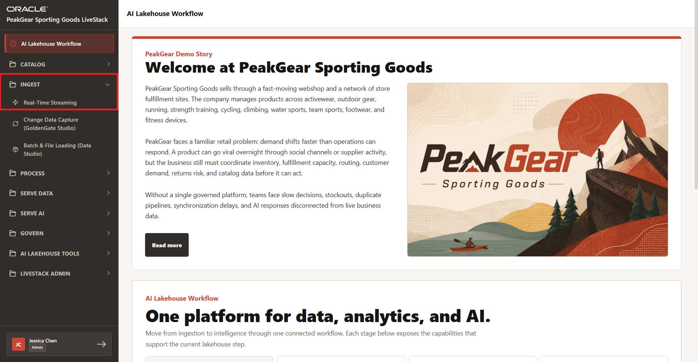
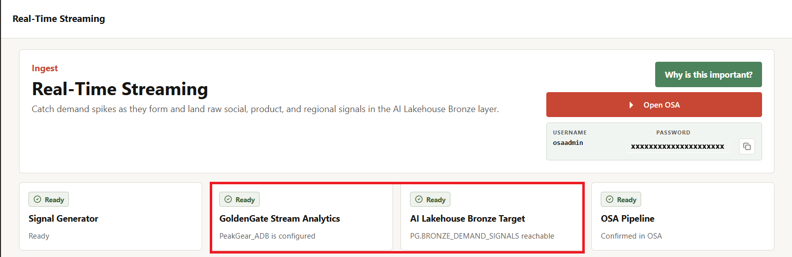
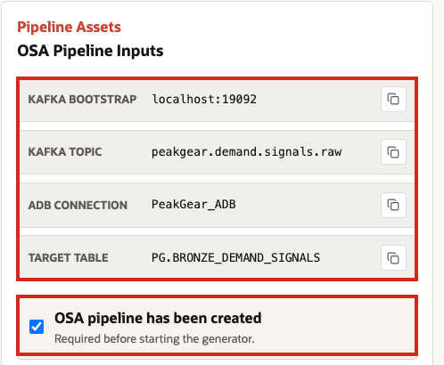
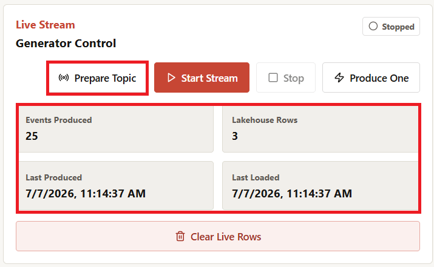
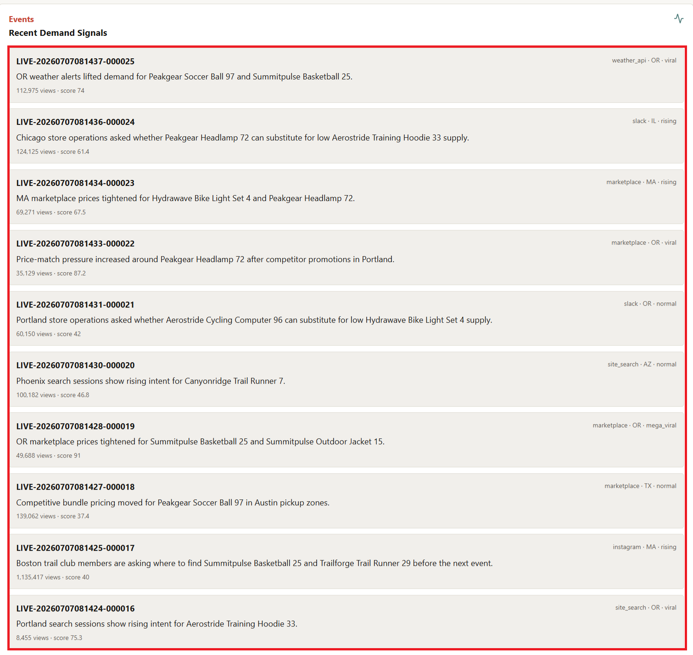

# Real-Time Streaming Ingest

## Introduction

**PeakGear** needs to see changing demand before the next report. Real-time streaming captures demand signals as they happen and writes them to Bronze.

Bronze receives the raw demand events first. Later processing can clean and enrich them before they become business-ready signals.

Apache Kafka carries the generated events to **Oracle GoldenGate Stream Analytics**, which provides the interface for this flow. It lets you start the prepared stream and monitor events as they move toward the Bronze layer.

This scene shows the first step in that flow. The live events can later support demand sensing, product discovery, dashboards, predictions, and AI agents after Silver and Gold processing.

Estimated Time: **10 minutes**

### Objectives

In this scene, you will:

- Start a prepared real-time demand stream.
- See where the events are sent.
- Watch events arrive in the Bronze layer.
- See how streaming data can continue through Silver and Gold.

## Task 1: Open the Real-Time Streaming demo

Open the Real-Time Streaming demo:

1. In the left sidebar, expand **Ingest**.
2. Select **Real-Time Streaming**.
3. Confirm that the page title is **Real-Time Streaming** before continuing.

## Task 2: Review GoldenGate Stream Analytics access

Review GoldenGate Stream Analytics access without changing the prepared pipeline:

1. Click **Open OSA** if you want to inspect GoldenGate Stream Analytics in a new tab.
2. Use the displayed OSA credentials to sign in when prompted.
3. In GoldenGate Stream Analytics, review the existing streaming pipeline only. Do not create or change the pipeline during this demo walkthrough.
4. On the LiveStack page, confirm that **GoldenGate Stream Analytics** is **Ready** and that the **AI Lakehouse Bronze Target** is reachable.

## Task 3: Confirm the Kafka-to-Bronze pipeline values

Confirm the Kafka-to-Bronze pipeline values:

1. Review **OSA Pipeline Inputs**.
2. Confirm the Kafka bootstrap value and the Kafka topic **peakgear.demand.signals.raw**.
3. Confirm the ADB connection **PeakGear_ADB**.
4. Confirm the target table **PG.BRONZE\_DEMAND\_SIGNALS**.
5. Select **OSA pipeline has been created** after you have confirmed the pipeline exists in GoldenGate Stream Analytics. This enables the generator controls in the LiveStack page.

## Task 4: Start the live demand-signal stream

Start the live demand-signal stream and watch events reach Bronze:

1. Click **Prepare Topic** to confirm that the Kafka topic is available.
2. Click **Start Stream**.
3. Let the stream run long enough to produce visible events.
4. Watch **Events Produced** and **Lakehouse Rows** increase. Matching counts show that generated events are reaching the Bronze table.
5. Click **Stop** when you have enough events for the walkthrough.

## Task 5: Monitor Bronze events

Monitor recent Bronze demand events:

1. Review **Recent Demand Signals**.
2. Point out that each **LIVE-** event came from the generator, moved through Kafka, was processed by GoldenGate Stream Analytics, and landed in **PG.BRONZE\_DEMAND\_SIGNALS**.
3. Explain that Bronze is intentionally raw. The next processing stage can clean, validate, deduplicate, enrich, and match products before Silver and Gold outputs are created.
4. Use **Clear Live Rows** only when you need to reset this scene for a clean replay.

## Conclusion: Business Outcome

Real-time streaming gives PeakGear earlier awareness of demand changes. Instead of waiting for delayed reports, planners and operations teams can see live demand signals land in the Bronze layer as they happen.

The stream becomes part of the AI Lakehouse medallion process. Bronze preserves the source-shaped event. Silver can standardize and enrich it. Gold can serve demand-aware data products to dashboards, fulfillment planning, predictions, and AI agents.

For PeakGear, the business can see product demand sooner and use the new signals in downstream operational decisions.

## Acknowledgements

* **Author** - Kevin Lazarz August 2026
* **Contributor** - Eugenio Galiano
* **Last Updated By/Date** - Kevin Lazarz  August 2026
