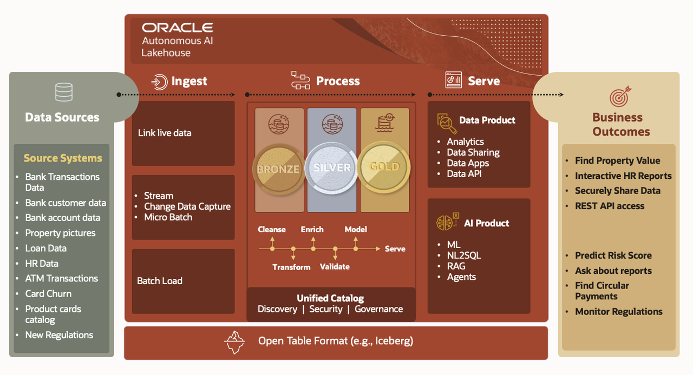

# PeakGear AI Lakehouse LiveStack Guide

## Introduction

PeakGear Sporting Goods sells through a fast-moving webshop and a network of store fulfillment sites. The company manages products across activewear, outdoor gear, running, strength training, cycling, climbing, water sports, team sports, footwear, and fitness devices.

PeakGear faces a familiar retail problem: demand shifts faster than operations can respond. A product can go viral overnight through social channels or supplier activity, but the business still must coordinate inventory, fulfillment capacity, routing, customer demand, returns risk, and catalog data before it can act.

Without a single governed platform, teams face slow decisions, stockouts, duplicate pipelines, synchronization delays, and AI responses disconnected from live business data.

By the end of this LiveStack Demo, you will understand how Oracle's AI Lakehouse architecture combines streaming data, vector search, graph analytics, spatial intelligence, machine learning, and AI agents into a single governed platform that helps retailers sense demand faster, optimize operations, and make decisions using live business data.

Estimated Demo Time: **150 minutes**

Each scene is designed to take between **5 and 10 minutes**.

### Objectives

In this LiveStack Demo, you will see how PeakGear can:

* Reduce stockouts
* Improve product discovery
* Lower fulfillment costs
* Reduce returns risk
* Accelerate business decision-making
* Enable trusted AI automation

### Prerequisites

Before you begin, confirm that you can open the running PeakGear Sporting Goods LiveStack in a modern browser. No coding or database administration knowledge is required to follow the business workflow.

## Architecture of PeakFlow

PeakFlow is the source-to-outcome architecture used by the PeakGear demo. It shows how an AI Lakehouse starts with operational data sources and ends with business outcomes delivered through data products and AI products.

The flow starts with source data such as product master data, orders, customer records, inventory snapshots, product images, demand signals, fulfillment sites, and returns activity. The demo shows several ways that data can enter the lakehouse:

- **Streaming ingest** for demand signals through Kafka and GoldenGate Stream Analytics.
- **Change data capture** from a NetSuite-style operational database through GoldenGate Studio.
- **Batch and object-storage loading** for product master, POS order, inventory, and product image manifest files through Data Studio.

The core AI Lakehouse process is the medallion flow from **Bronze** to **Silver** to **Gold**. Bronze preserves raw, source-shaped data. Silver standardizes, deduplicates, validates, and enriches that data. Gold publishes curated data products that are ready for applications, analytics, machine learning, and AI.

Catalog makes those trusted assets discoverable and understandable before they are reused. Users can find a curated table, understand its columns and business meaning, and publish a reusable view that becomes another data product.

The business outcomes in the later scenes come from those curated products. Serve Data demonstrates dashboards, catalog views, demand sensing, graph-based return analysis, spatial fulfillment, and order flow. Serve AI demonstrates predictions, semantic product discovery, natural-language data access, and retail agents grounded in governed operational data.

## Demo Flow

- **Scene 1:** Confirm LiveStack Readiness.
- **Scene 2:** Data Catalog and AI Table Explain.
- **Scene 3:** Real-Time Streaming Ingest.
- **Scene 4:** Change Data Capture Ingest.
- **Scene 5:** Batch and File Loading Ingest.
- **Scene 6:** Data Processing and Pipelines.
- **Scene 7:** Operations Dashboard.
- **Scene 8:** Product Catalog.
- **Scene 9:** Retail Demand Sensing.
- **Scene 10:** Returns Risk Network.
- **Scene 11:** Store Fulfillment Map.
- **Scene 12:** Orders and Fulfillment Flow.
- **Scene 13:** Demand, Revenue, and Inventory Predictions.
- **Scene 14:** PeakGear Webshop and Product Discovery.
- **Scene 15:** Ask Your Data.
- **Scene 16:** Retail Operations Agents.

## Learn More

- [Oracle AI Database 26ai documentation](https://docs.oracle.com/en/database/oracle/oracle-database/26/index.html)
- [Oracle AI Vector Search](https://www.oracle.com/database/ai-vector-search/)
- [Oracle Machine Learning for SQL documentation](https://docs.oracle.com/en/database/oracle/machine-learning/oml4sql/tasks.html)
- [Oracle Spatial and Graph documentation](https://docs.oracle.com/en/database/oracle/property-graph/)
- [Oracle GoldenGate Stream Analytics](https://www.oracle.com/integration/goldengate/stream-analytics/)
- [Oracle LiveLabs catalog](https://livelabs.oracle.com/)

## Credits & Build Notes
- **Author** - Oracle LiveLabs Team
- **Last Updated By/Date** - Oracle LiveLabs Team, 2026-06-14
