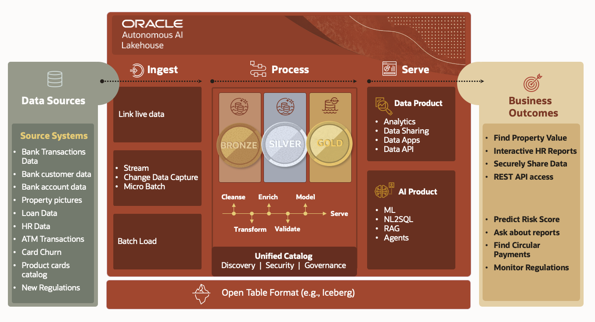

# PeakGear AI Lakehouse LiveStack Guide

## Introduction

**PeakGear Sporting Goods** is a fictional retailer used throughout this LiveStack. The demo uses product, order, customer, inventory, demand, fulfillment, and returns data. It shows how a retailer can support shoppers and operating teams from one data foundation. PeakGear uses **Oracle Autonomous AI Lakehouse**.

**Oracle Autonomous AI Lakehouse** combines the openness of Apache Iceberg with the built-in capabilities of Oracle AI Database.

It lets teams query lakehouse and enterprise data where it resides, without moving it. Teams can apply AI, vector search, machine learning, graph, and spatial features to that data.

These capabilities help teams create curated data products for AI applications and business workflows.

At PeakGear, this value shows up in practical business questions:

- Which products are gaining demand?
- Where is inventory available?
- Which returns need review?
- Can a shopper find a suitable product and resolve an order issue?

Each question connects to the same end-to-end lakehouse flow. **Ingest** brings in source data. **Process** refines it through the **Bronze**, **Silver**, and **Gold** medallion layers. **Serve Data** and **Serve AI** turn the resulting data products into business experiences.

The Process scenes also show how **Apache Iceberg** tables can be cataloged, transformed, and shared with other catalog servers.

Estimated Workshop Time:

- **10 to 15 minutes**
- **30 minutes**
- **60 minutes**, depending on the selected path

The PeakGear LiveStack includes many individual demos. We provide three recommended paths that cover a useful set of scenes within the time available.

### Objectives

In this LiveStack Demo, you will see how PeakGear can:

* Help shoppers find products by intent or image and resolve order issues
* Give planners demand, inventory, fulfillment, and returns context
* Let users ask questions and inspect the SQL behind the answer
* Keep customer and demand data current through files, streaming, and change data capture
* Prepare, explain, transform, and share reusable data products

### Prerequisites

Before you begin, open the running PeakGear Sporting Goods LiveStack in a modern browser. You do not need coding or database administration experience.

## Architecture of PeakFlow

PeakFlow shows how the demo moves data from source systems into customer and operational experiences.

The source data includes product master data, orders, customer records, inventory snapshots, product images, demand signals, fulfillment sites, and returns activity. The demo covers five parts of the flow:

- **Ingest** brings in files, live demand signals, and customer changes.
- **Process** prepares Bronze, Silver, and Gold data and works with Apache Iceberg tables.
- **Catalog** helps users find and understand reusable data assets.
- **Serve Data** presents data through dashboards, product views, fulfillment maps, and return-risk analysis.
- **Serve AI** uses the same data for product discovery, data questions, predictions, and operational agents.

The **AI Lakehouse** uses a medallion flow from **Bronze** to **Silver** to **Gold**. Bronze keeps source data traceable. Silver cleans and enriches it. Gold publishes data products for business use.

## Demo Flow

Most scenes stand on their own. Choose a business question or capability, then open that scene. Some scenes use the same sample data or require a service to be ready first. Each scene lists its prerequisites.

The workshop has three suggested paths. The **10 Minute Recommended Path** covers the most visible customer and operational outcomes. The **30 Minute Recommended Path** adds return-risk analysis and Iceberg processing. The **60 Minute Recommended Path** starts with business outcomes, then follows the data and service work behind them.

### 10 Minute Recommended Path

Follow the [10 Minute Recommended Path](?lab=quickstart) in this order:

- **PeakGear Webshop and Product Discovery:** Help shoppers find products by intent or image.
- **Ask PeakGear:** Use order 7820 to resolve a product-support issue.
- **Operations Dashboard:** Give planners a Watched Products view with operational context.
- **Real-Time Streaming Ingest:** Show new demand events arriving in Bronze.

### 30 Minute Recommended Path

Follow the [30 Minute Recommended Path](?lab=highlevel) in this order:

- **PeakGear Webshop and Product Discovery:** Help shoppers find products and resolve an order issue.
- **Operations Dashboard:** Give planners one view of watched products and operational context.
- **Returns Risk Network:** Investigate connected returns and prioritize review.
- **Real-Time Streaming Ingest:** Show live demand events arriving in Bronze.
- **Transform Iceberg Data:** Apply a business rule to Iceberg-backed Bronze data and create `GOLD_PRODUCTS`.

### 60 Minute Recommended Path

Follow the [60 Minute Recommended Path](?lab=extended) in this order:

- **PeakGear Webshop and Product Discovery**
- **Operations Dashboard**
- **Returns Risk Network**
- **Ask Your Data**
- **Retail Operations Agents**
- **Real-Time Streaming Ingest**
- **Change Data Capture Ingest**
- **Data Catalog and AI Table Explain**
- **Transform Iceberg Data**
- **Load Data to an Apache Iceberg Catalog Server**

Each scene also stands on its own. Skip or revisit a scene when another business question is more relevant.

### Scene Catalog

| Scene | Lakehouse stage | Business outcome | Oracle technology or feature in use |
| --- | --- | --- | --- |
| [Add an Apache Iceberg Catalog Server](?lab=add-catalog-server) | Catalog | Make Iceberg tables discoverable and reusable across compatible data engines. | Oracle Data Transforms, Apache Iceberg REST Catalog, OCI Object Storage |
| [Data Catalog and AI Table Explain](?lab=data-catalog) | Catalog | Find, understand, and publish a reusable product view. | Oracle Data Studio Catalog, AI Assist, AI Table Explain |
| [Load Data to an Apache Iceberg Catalog Server](?lab=load-to-icerberg) | Process | Publish a Gold product as an open table for other engines. | Oracle Data Transforms, Apache Iceberg incremental load, Iceberg Catalog Server |
| [Transform Iceberg Data](?lab=process-bronze-to-silver) | Process | Apply business rules to Iceberg Bronze data and create a downstream Gold result. | Oracle Data Transforms, Apache Iceberg, Iceberg Catalog Server |
| [Batch and File Loading Ingest](?lab=batch-and-file-loading) | Ingest | Bring product and inventory files into Bronze while preserving their source shape. | Oracle Database Actions Data Studio, Data Load, OCI Object Storage |
| [Change Data Capture Ingest](?lab=change-data-capture) | Ingest | Keep customer updates current for analytics, applications, and AI features. | Oracle GoldenGate Studio, change data capture, Bronze mirror |
| [Real-Time Streaming Ingest](?lab=ingest-real-time-and-batch-data) | Ingest | Give planners earlier visibility into changing demand. | GoldenGate Stream Analytics, Apache Kafka, Bronze ingest |
| [Ask Your Data](?lab=ask-your-data) | Serve AI | Let business users ask questions in plain language and inspect the SQL behind the answer. | Oracle Select AI, Oracle AI Database, Gold-layer data |
| [Demand, Revenue, and Inventory Predictions](?lab=demand-revenue-and-inventory-predictions) | Serve AI | Help planners see demand risk, revenue trends, and inventory exposure. | Oracle Machine Learning, prediction models, Serve AI |
| [PeakGear Webshop and Product Discovery](?lab=peakgear-webshop-and-product-discovery) | Serve AI | Help shoppers find products by intent or image and resolve order issues. | Oracle AI Vector Search, in-database embeddings, Ask PeakGear |
| [Retail Operations Agents](?lab=retail-operations-agents) | Serve AI | Turn urgent demand questions into operational actions that teams can review. | Oracle AI Database Select AI Agent, `DBMS_CLOUD_AI_AGENT`, SQL and PL/SQL tools |
| [Operations Dashboard](?lab=operations-dashboard) | Serve Data | Give planners one view of watched products, demand, fulfillment, and capacity. | Oracle AI Database converged queries, semantic search, JSON Relational Duality |
| [Orders and Fulfillment Flow](?lab=orders-and-fulfillment-flow) | Serve Data | Show one trusted order across relational, JSON, and route views. | Oracle AI Database, JSON Relational Duality, Oracle Spatial |
| [Product Catalog](?lab=product-catalog) | Serve Data | Provide a reusable product view for search, merchandising, and operations. | Oracle AI Database, Gold data product, Serve Data |
| [Retail Demand Sensing](?lab=retail-demand-sensing) | Serve Data | Let planners search emerging demand by business intent and see affected products and markets. | Oracle AI Vector Search, semantic search, Serve Data |
| [Returns Risk Network](?lab=returns-risk-network) | Serve Data | Investigate connected return-risk relationships and prioritize review. | Oracle Spatial and Graph, graph queries, Serve Data |
| [Store Fulfillment Map](?lab=store-fulfillment-map) | Serve Data | Help fulfillment teams match capacity, demand, and routes to serve orders. | Oracle Spatial, H3 grid, Gold data product |

## Learn More

- [Oracle AI Database 26ai documentation](https://docs.oracle.com/en/database/oracle/oracle-database/26/index.html)
- [Oracle AI Vector Search](https://www.oracle.com/database/ai-vector-search/)
- [Oracle Machine Learning for SQL documentation](https://docs.oracle.com/en/database/oracle/machine-learning/oml4sql/tasks.html)
- [Oracle Spatial and Graph documentation](https://docs.oracle.com/en/database/oracle/property-graph/)
- [Oracle GoldenGate Stream Analytics](https://www.oracle.com/integration/goldengate/stream-analytics/)
- [Oracle LiveLabs catalog](https://livelabs.oracle.com/)

## Acknowledgements

* **Author** - Kevin Lazarz August 2026
* **Contributor** - Eugenio Galiano
* **Last Updated By/Date** - Kevin Lazarz  August 2026
