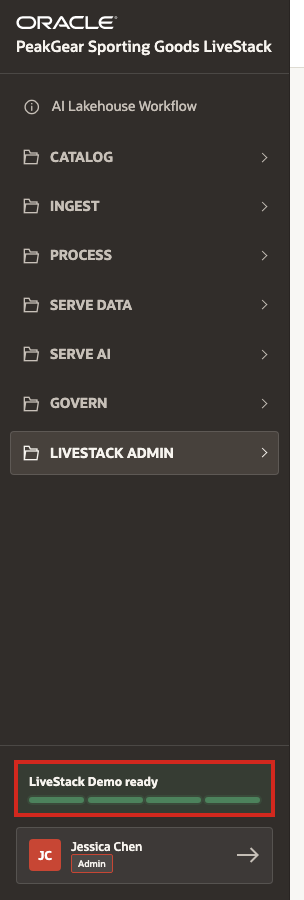
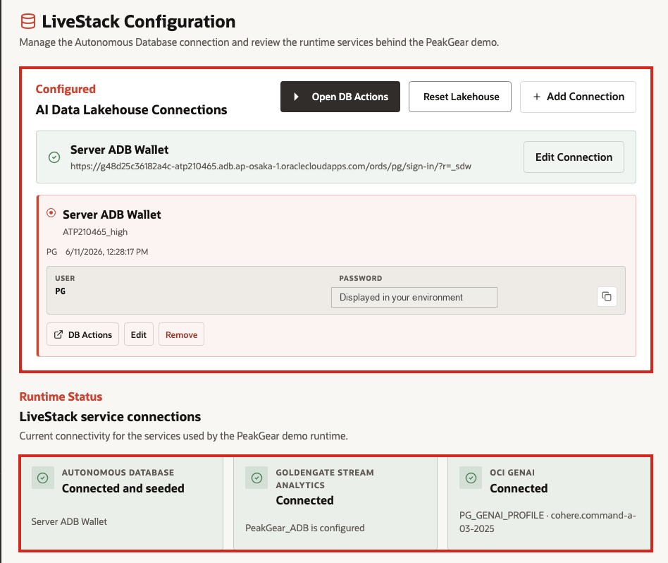
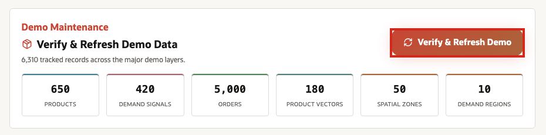
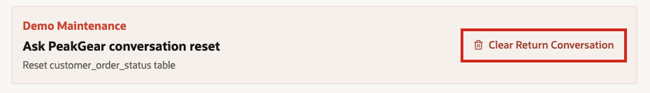

# Scene 1 Confirm LiveStack Readiness

## Introduction

Before you run the **PeakGear** business scenarios, confirm that the LiveStack services are connected and the demo data has been initialized. These readiness checks prevent confusing failures later because the demo can look broken when a required service or seeded dataset is not ready.

The fastest check is the **LiveStack Demo ready** indicator in the lower-left sidebar. The four green lights are the demo health check: they confirm that the required services and seeded data are ready before you begin the business walkthrough.

Estimated Time: **5 minutes**

### Objectives

In this scene, you will:

- Confirm that all four LiveStack readiness lights are green.
- Open **LiveStack Configuration** from **LiveStack Admin**.
- Double-check the Autonomous Database, GoldenGate Stream Analytics, and OCI GenAI connections.
- Run the mandatory demo data refresh before starting the business walkthrough.
- Reset the Ask PeakGear conversation state only when the return and exchange flow needs to be replayed.

## Task 1: Check the sidebar readiness indicator

Perform the following set of steps to confirm that the LiveStack readiness indicator shows the demo is ready:

1. Look at the lower-left sidebar.
2. Find **LiveStack Demo ready**.
3. Confirm that all four readiness lights are green.
4. Treat the four lights as the first readiness gate:
   - **Autonomous Database** is connected.
   - **GoldenGate Stream Analytics** is connected.
   - **OCI GenAI** is connected.
   - **Demo data** has been seeded into Autonomous Database.
5. If any light is not green, do not continue to the business demo. Open **LiveStack Admin** and select **LiveStack Configuration** to identify which dependency is not ready.

## Task 2: Double-check LiveStack Configuration

Perform the following set of steps to double-check the LiveStack service connections before starting the business walkthrough:

1. Open **LiveStack Admin** from the sidebar and select **LiveStack Configuration**.
2. Review **AI Data Lakehouse Connections**.
3. Confirm that the active Autonomous Database connection is configured.
4. Review the connected database service, the connected user, and the password displayed for the runbook environment.
5. Review **LiveStack service connections** and confirm:
   - **Autonomous Database** shows **Connected and seeded**.
   - **GoldenGate Stream Analytics** shows **Connected**.
   - **OCI GenAI** shows **Connected**.

## Task 3: Refresh and load demo data

**Important:** This step is mandatory before running the demo.

Perform the following set of steps to refresh and load the seeded demo data before running the scenes:

1. In **LiveStack Configuration**, go to **Demo Maintenance**.
2. Click **Verify & Refresh Demo** or **Load Demo Data**, depending on the button label shown by the current environment.
3. Wait for the refresh to complete.
4. Confirm that the demo counts are populated. In the reference environment, the page shows **650 products**, **420 demand signals**, **5,000 orders**, **180 product vectors**, **50 spatial zones**, and **10 demand regions**.
5. Explain that this step initializes the business data used across the demo and creates or refreshes embeddings used by semantic search and AI-driven parts of the experience.

**Note:** Sample values may change after data refreshes or rebuilds. Focus on the expected result pattern and the business takeaway, not the exact values.

## Task 4: Reset the return workflow only when needed

Perform the following set of steps to reset the return workflow only when you need a clean replay:

1. Use **Clear Return Conversation** in the **Reset customer\_order\_status table** section only when you need to replay the Ask PeakGear return and exchange scenario.
2. After resetting, rerun the relevant Ask PeakGear scene from the beginning so the conversation state is clean.

## Conclusion: Business Outcome

The readiness checks protect the rest of the LiveStack Demo. Before PeakGear can trust dashboards, streaming ingest, CDC, product discovery, predictions, or agents, the shared services and seeded business data need to be available.

When the readiness lights are green and the demo data refresh has completed, users know the AI Lakehouse foundation is ready. The Autonomous Database connection, GoldenGate Stream Analytics connection, OCI GenAI connection, and seeded demo data are all in place, so later scenes can focus on business outcomes instead of troubleshooting missing dependencies.

For PeakGear, this means the demo starts from a reliable operating baseline: the same governed data and connected services can support ingest, processing, Serve Data dashboards, and Serve AI experiences.

You can move to the next scene.

## Credits & Build Notes
- **Author** - Oracle LiveLabs Team
- **Last Updated By/Date** - Oracle LiveLabs Team, 2026-06-12
