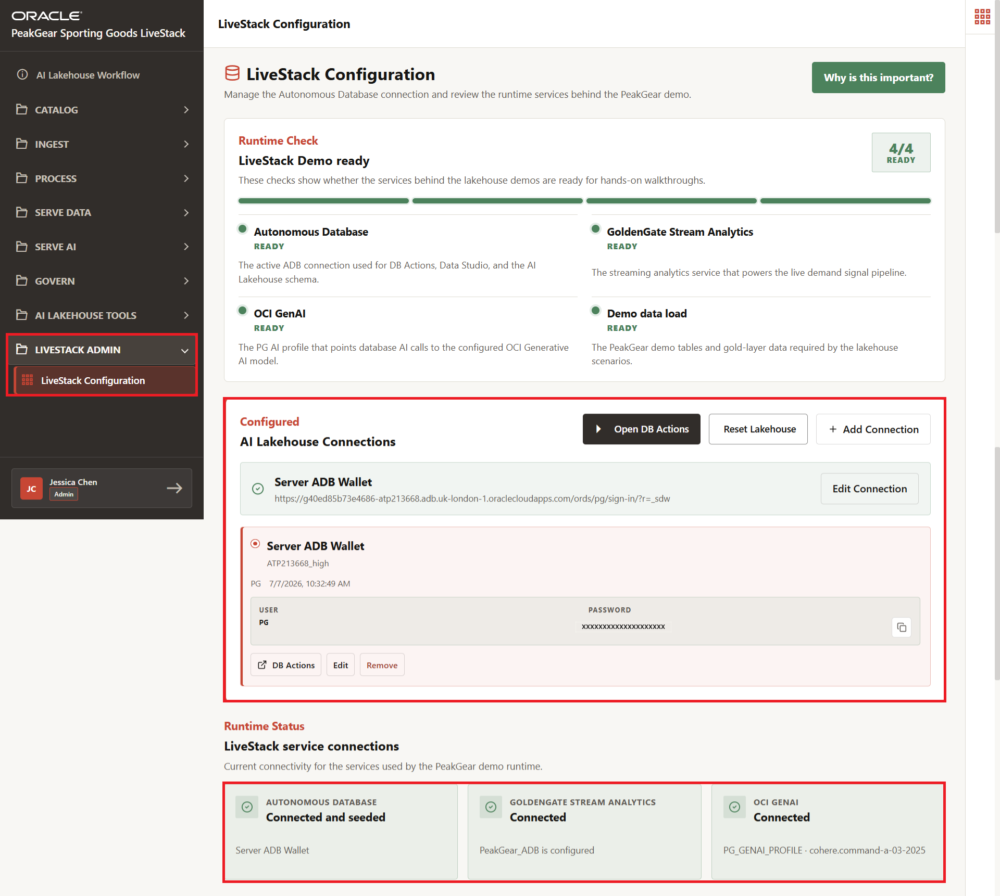
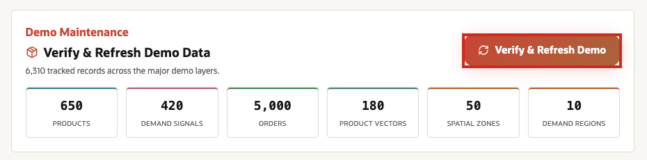
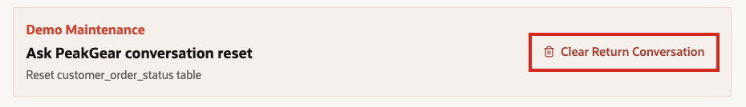

# Confirm LiveStack Readiness

## Introduction

Before you run the **PeakGear** business scenarios, check that the LiveStack services are connected and the demo data is ready. These checks prevent failures caused by a missing service or incomplete data.

The fastest check is the **LiveStack Demo ready** indicator in the lower-left sidebar. Its four green lights show whether the required services and demo data are ready.

The readiness panel checks the Autonomous Database, **GoldenGate Stream Analytics**, and **OCI GenAI** connections before you start the other scenes.

Estimated Time: **5 minutes**

### Objectives

In this scene, you will:

- Confirm that the required services are connected.
- Refresh the demo data before starting the business scenes.
- Reset the Ask PeakGear conversation only when you need to replay the return and exchange scenario.

## Task 1: Double-check LiveStack Configuration

Check the LiveStack service connections before starting the business walkthrough:

1. Open **LiveStack Admin** from the sidebar and select **LiveStack Configuration**.
2. Review **AI Data Lakehouse Connections**.
3. Confirm that the active Autonomous Database connection is configured.
4. Review the connected database service, the connected user, and the password displayed for the runbook environment.
5. Review **LiveStack service connections** and confirm:
   - **Autonomous Database** shows **Connected and seeded**.
   - **GoldenGate Stream Analytics** shows **Connected**.
   - **OCI GenAI** shows **Connected**.

## Task 2: Refresh and load demo data

**Important:** Complete this step before running the demo.

Refresh and load the demo data before running the scenes:

1. In **LiveStack Configuration**, go to **Demo Maintenance**.
2. Click **Verify & Refresh Demo** or **Load Demo Data**, depending on the button label shown by the current environment.
3. Wait for the refresh to complete.
4. Confirm that the demo counts are populated. In the reference environment, the page shows **650 products**, **420 demand signals**, **5,000 orders**, **180 product vectors**, **50 spatial zones**, and **10 demand regions**.
5. Explain that this step initializes the business data used across the demo and creates or refreshes embeddings used by semantic search and AI-driven parts of the experience.

**Note:** Sample values may change after data refreshes or rebuilds. Focus on the expected result pattern and the business takeaway, not the exact values.

## Task 3: Reset the return workflow only when needed

Reset the return workflow when you need a clean replay:

1. Use **Clear Return Conversation** in the **Reset customer\_order\_status table** section only when you need to replay the Ask PeakGear return and exchange scenario.
2. After resetting, rerun the relevant Ask PeakGear scene from the beginning so the conversation state is clean.

## Conclusion: Business Outcome

The readiness checks protect the rest of the LiveStack Demo. Before PeakGear can trust dashboards, streaming ingest, CDC, product discovery, predictions, or agents, the shared services and seeded business data need to be available.

When the readiness lights are green and the demo data refresh is complete, the AI Lakehouse environment is ready. The required connections and demo data are in place for the later scenes.

For PeakGear, the same environment can support ingest, processing, Serve Data dashboards, and Serve AI experiences.

## Acknowledgements

* **Author** - Kevin Lazarz August 2026
* **Contributor** - Eugenio Galiano
* **Last Updated By/Date** - Kevin Lazarz  August 2026
