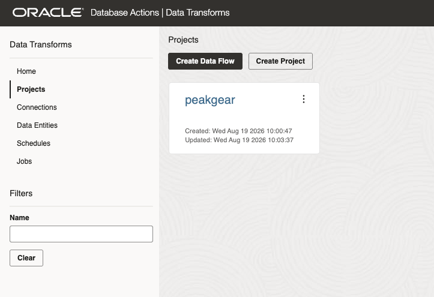
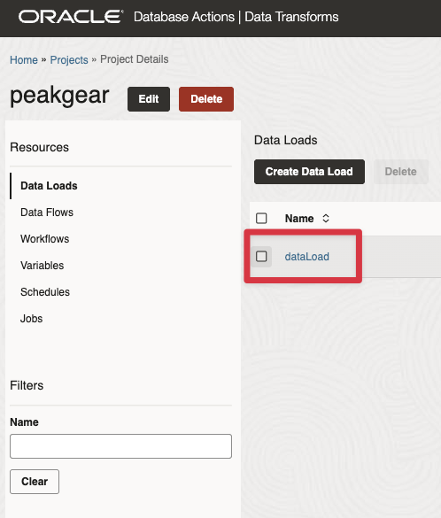
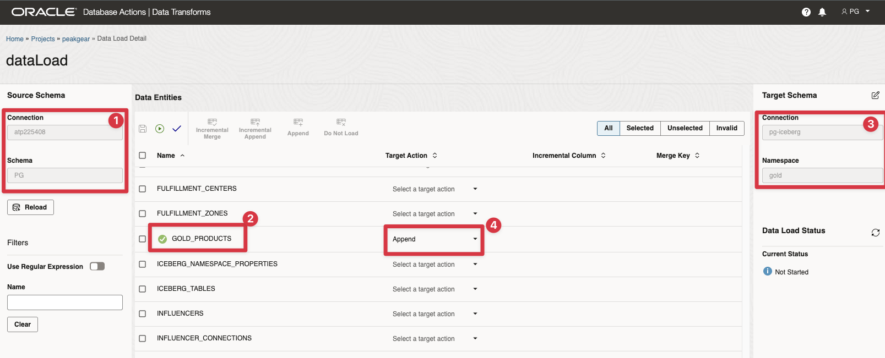
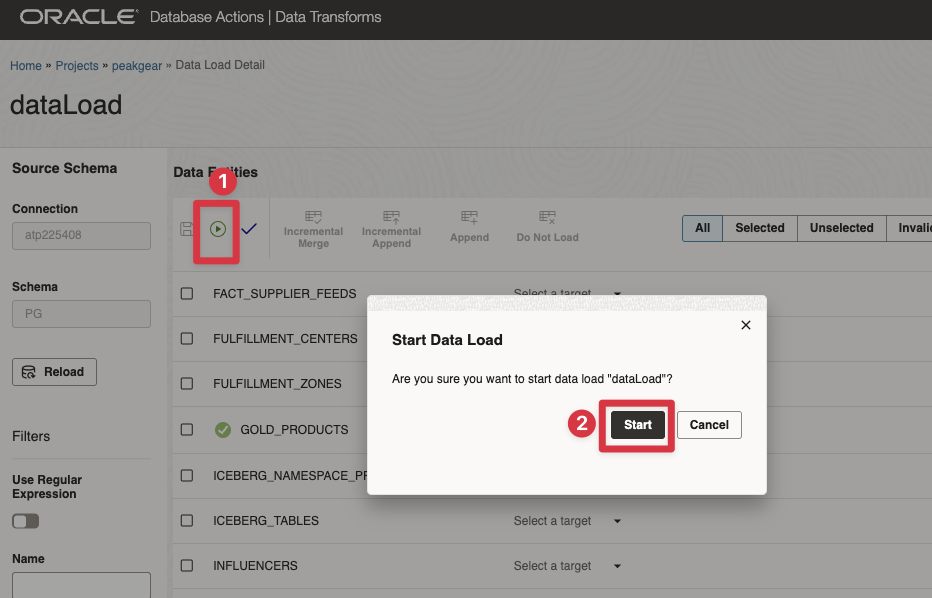
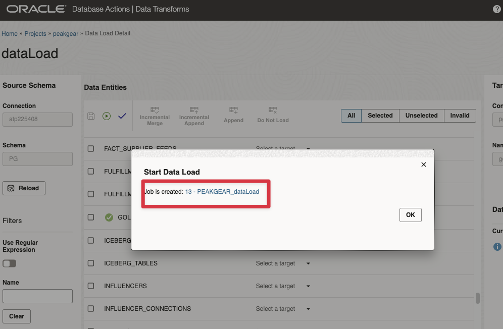
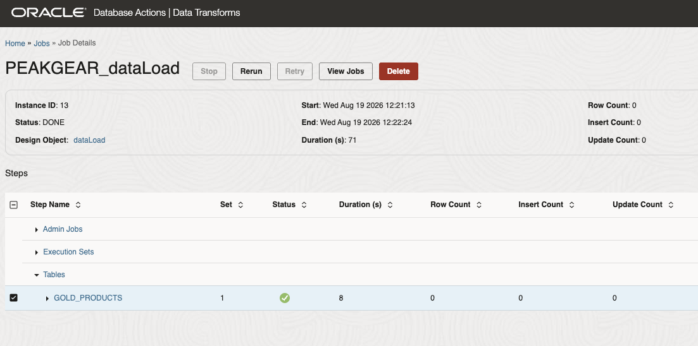
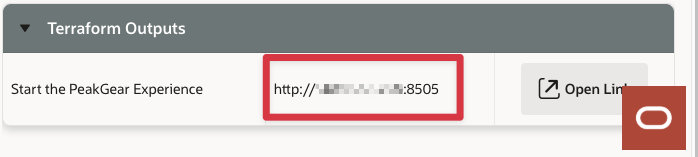
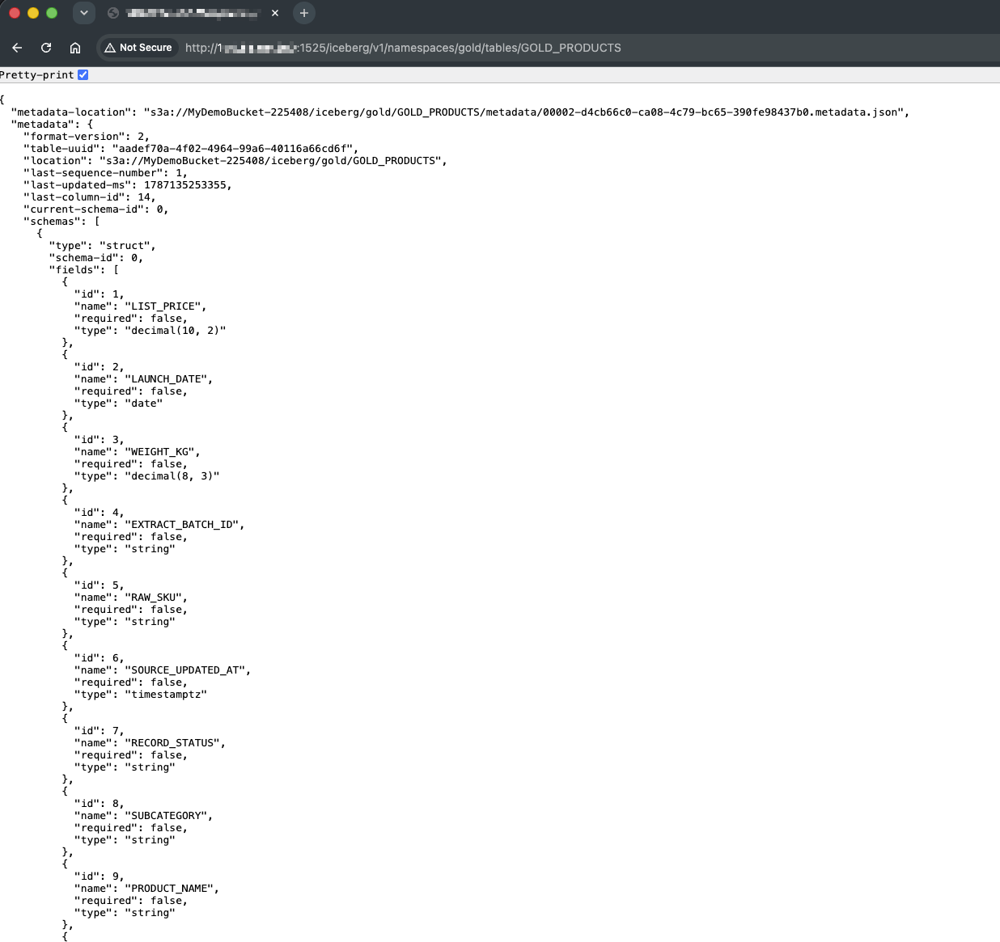

# Load Data to an Apache Iceberg Catalog Server

## Introduction

**PeakGear** has transformed product data in an Oracle Autonomous Database table. In this scene, **Oracle Data Transforms** uses a preconfigured data load to publish that table to the **Apache Iceberg Catalog Server**.

The data load reads the `GOLD_PRODUCTS` table from the Oracle `PG` schema and writes it to the `GOLD` namespace in the Iceberg catalog. The load uses **Iceberg incremental** mode and an **append** target action, demonstrating how a data product can be made available in an open table format for other lakehouse engines and data platforms.

**Key message:** Load Oracle data into an open Iceberg data product.

Estimated Time: **10 minutes**

>**Note**: You must have finished the scene Transform Iceberg Data!

### Objectives

In this scene, you will:

- Open the **Load Data to Iceberg Catalog Server** demo from the **Process** menu.
- Open Oracle Data Transforms and sign in with the displayed PG credentials.
- Open the preconfigured `peakgear` project and its `dataLoad` object.
- Inspect the Oracle source and Apache Iceberg target configuration.
- Execute the data load and confirm that it completes successfully.

## Task 1: Open and sign in to Data Transforms

Perform the following steps to open **Data Transforms**:

1. Click **Open Data Transforms**.
2. Copy the displayed PG username and password from the **Login information** panel.
3. Enter those credentials and click **Connect**.
4. Keep the LiveStack tab open so that you can return to the demo page if needed.

## Task 2: Open the preconfigured data load

The environment provisions the project, connections, schemas, and data load for this demo. You do not need to create them manually.

1. From the Data Transforms home page, open **Projects**.
2. Open the project named `peakgear`.
   
   

3. In the project resources, open **Data Loads**.
4. Open the data load named `dataLoad`.

  

If the project or data load is not visible yet, wait briefly and refresh the page. First-boot provisioning creates these objects after the Data Transforms service and Iceberg catalog are ready.

## Task 3: Inspect the source and target configuration

Review the data load configuration before starting it. The preconfigured object contains the following source and target settings:

| Setting               | Configuration       |
| -----------------------| ---------------------|
| Data load             | `dataLoad`          |
| Project               | `peakgear`          |
| Source technology     | Oracle              |
| Source schema         | `PG`                |
| Source table          | `GOLD_PRODUCTS`     |
| Target technology     | Apache Iceberg      |
| Target namespace      | `GOLD`              |
| Load mode             | Iceberg incremental |
| Target preload action | Append              |

The source is the transformed product data created in the previous scene. The load publishes that data to the Iceberg catalog; it does not change the Oracle source table.

Confirm the following in the data load editor:

1. The source model uses the Oracle connection and the `PG` schema.
2. `GOLD_PRODUCTS` is selected as the source table.
3. The target model uses the Apache Iceberg connection and the `GOLD` namespace.
4. The target preload action is **Append**.

## Task 4: Validate and run the data load

Perform the following steps to execute the preconfigured load:

1. Click **Save** if Data Transforms shows unsaved changes.
2. Validate the data load and confirm that no validation errors are reported.
3. Click **Start** to run `dataLoad`.

 

4. Open the displayud **Job**.

5. Monitor the job until its status is **Successful** or **Completed**.

The first run creates or appends the `GOLD_PRODUCTS` data in the Iceberg `GOLD` namespace. Because the target action is append, avoid starting the load repeatedly in the same environment unless you intentionally want to add another copy of the source rows.

## Bonus Task: Verify the loaded data

Now, let's confirm that the catalog server contains our new `GOLD_PRODUCTS` table.
We can do that using the Iceberg catalog server REST API.

1. On the View Login information screen, copy the IP address (without the port):
   
   

2. Create the REST API URL:

  `IP Adresss` + :1525/iceberg/v1/namespaces/gold/tables/GOLD_PRODUCTS

  For example:

  `123.456.789:1525/iceberg/v1/namespaces/gold/tables/GOLD_PRODUCTS`

3. Open the URL in a browser and review the results:

You can review the table definition and Iceberg table metadata

## Conclusion: Business Outcome

PeakGear can publish a curated Oracle data product to an open Apache Iceberg table without requiring each downstream platform to connect directly to the source database.

The preconfigured `dataLoad` reads `PG.GOLD_PRODUCTS`, uses the Iceberg Catalog Server to resolve the target namespace, and appends the data to the Iceberg table. Other compatible data platforms can then discover and consume the same cataloged data product.

You can move to the next scene.

## Acknowledgements

* **Author** - Kevin Lazarz August 2026
* **Contributor** - Eugenio Galiano
* **Last Updated By/Date** - Kevin Lazarz  August 2026
