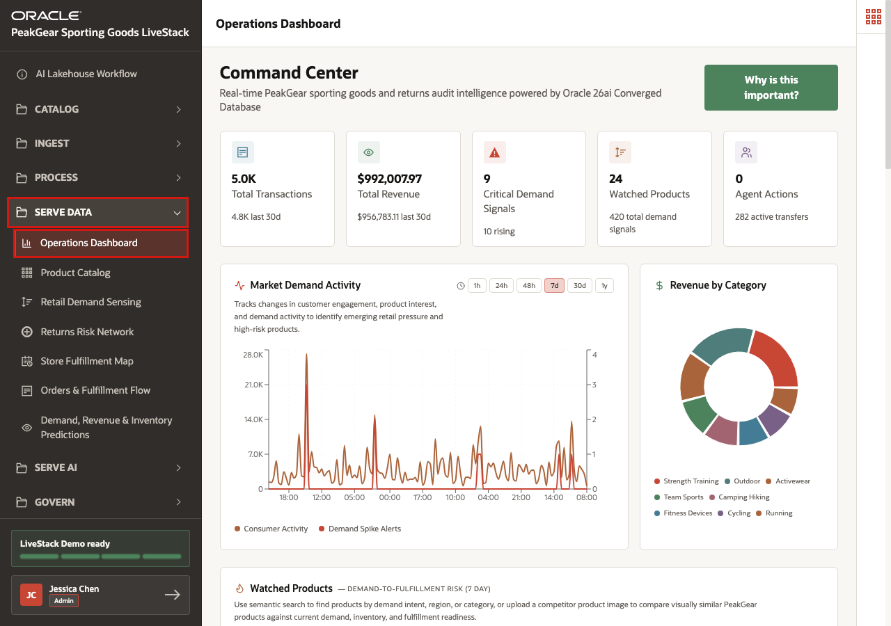
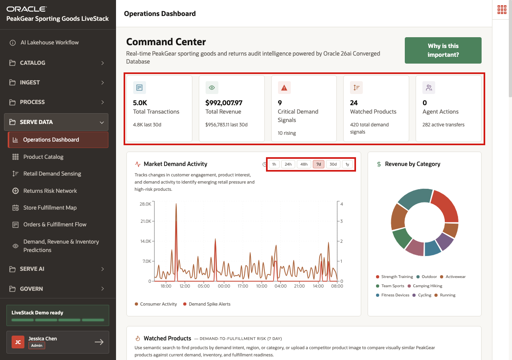
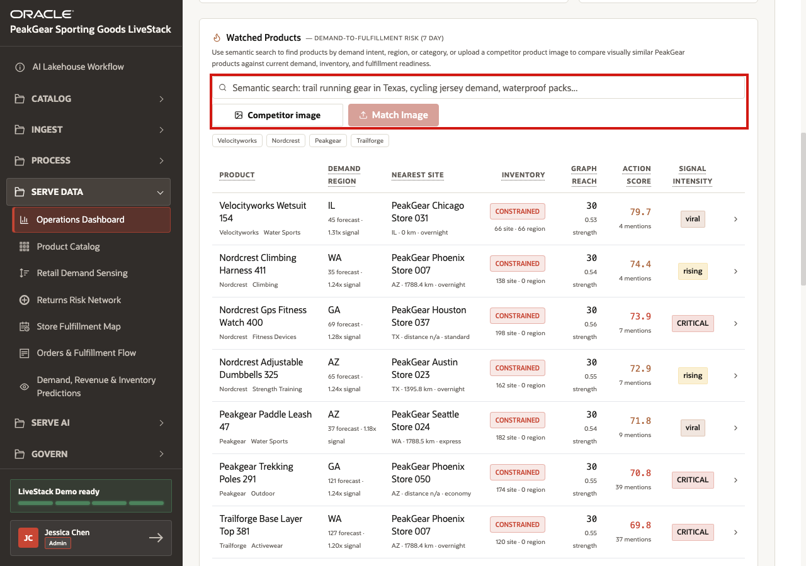
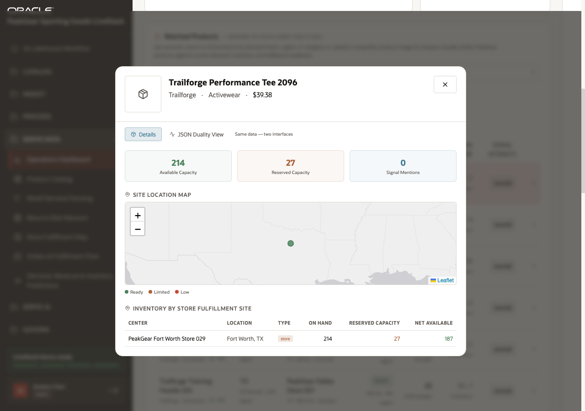
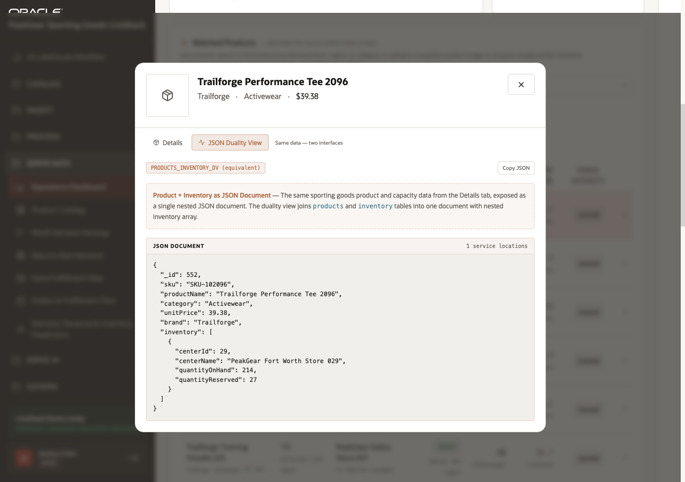

# Scene 6 Operations Dashboard

## Introduction

PeakGear has now moved data through the AI Lakehouse path. Streaming signals, customer changes, and file-based product data have landed in Bronze. Processing has cleaned, standardized, and enriched that data into reusable Silver and Gold outputs. The next question is practical: what can the business do with those trusted data products?

The **Operations Dashboard** is a Serve Data example. It shows how a retail operations team can move from disconnected reports to one operating view for revenue, demand pressure, inventory readiness, fulfillment coverage, product risk, and AI-assisted decisions.

Without this kind of lakehouse foundation, PeakGear would likely need separate dashboards for orders, social demand, inventory, geography, product relationships, and semantic search. Each dashboard would have its own data movement, reconciliation rules, and timing gaps. That makes it harder to answer a simple operational question: which products need attention right now, and what should the business do next?

This scene shows the outcome of the medallion process. Curated Gold data products can be served directly into an operational dashboard, while still preserving access to multiple data modalities behind the scenes. The best example is the **Watched Products** table. It behaves like a single operational table, but it showcases a converged query pattern across relational product and inventory data, JSON demand signals, spatial fulfillment context, graph reach, and semantic search for both typed keywords and uploaded images.

Estimated Time: **10 minutes**

### Objectives

In this scene, you will:

- Open the **Operations Dashboard** from the **Serve Data** menu.
- Review the command center as a business-facing Gold data product.
- Search watched products with a natural-language demand intent.
- Open a product detail view to inspect fulfillment and capacity context.
- Review the JSON Duality view to see the same served data as a nested document.
- Connect the dashboard workflow to PeakGear business outcomes.

## Task 1: Open the Operations Dashboard



1. In the left sidebar, expand **Serve Data**.
2. Select **Operations Dashboard**.
3. Confirm that the page title is **Operations Dashboard** and that the main page shows the **Command Center**.

The dashboard sits in Serve Data because it is not another ingest or transformation step. It is a business-facing consumption point for data that has already been refined through the AI Lakehouse process.

## Task 2: Review the command center



1. Review the KPI cards for **Total Transactions**, **Total Revenue**, **Critical Demand Signals**, **Watched Products**, and **Agent Actions**.
2. Review the **Market Demand Activity** chart and use the time range controls if you want to compare recent demand activity windows.
3. Explain the business value: PeakGear can see current operating pressure from one trusted dashboard instead of reconciling separate reports.

These metrics are the dashboard-level proof that curated data products can be served to operations users after the medallion process has made the data usable.

## Task 3: Use watched-products semantic search



1. Scroll to **Watched Products**.
2. In the semantic search field, enter:

```text
trail running gear in Texas
```

3. Wait for the table to refresh.
4. Review the brand filter chips if you want to narrow the result set.
5. Optionally click **Competitor image**, select a JPG or PNG product image, and click **Match Image**.

Typed search and image matching are both Serve Data experiences. A user does not need to know which tables, vectors, or joins are used. They ask a business question, and the dashboard returns products enriched with demand, fulfillment, and risk context. The returned watched-products table is the converged-query proof point: product facts, demand signals, fulfillment readiness, graph reach, action score, and semantic match context appear together in one operational view.

## Task 4: Open a watched-product detail view



1. Click a row in the watched-products table.
2. Review the product header, brand, category, and price.
3. Review the capacity summary: **Available Capacity**, **Reserved Capacity**, and **Signal Mentions**.
4. Review the site location map and the **Inventory by Store Fulfillment Site** table.
5. Explain that this is a dashboard drill-down from a Gold data product into operational detail.

This is where the business outcome becomes concrete. A planner can start from a demand-intent search, identify a product, and immediately see whether PeakGear has enough capacity in the right fulfillment area.

## Task 5: Review the JSON Duality view



1. In the product detail modal, click **JSON Duality View**.
2. Review the explanation that the same product and capacity data is exposed as a nested JSON document.
3. Review the **JSON Document** panel.
4. Optionally click **Copy JSON** if you want to inspect the document outside the UI.

The dashboard can serve an operations user with cards, maps, and tables, while the same governed data can also be exposed as document-shaped JSON for applications and APIs. This is another Serve Data outcome from the same lakehouse process.

## Conclusion: Business Outcome

The Operations Dashboard shows the business value of serving trusted Gold-layer data products from the AI Lakehouse. PeakGear does not need to build and maintain separate integration paths for orders, inventory, demand signals, product relationships, geography, and AI search. Those data products have already been prepared through the medallion process and can be consumed from one governed foundation.

The watched-products experience is the key takeaway. A converged query can bring together relational product and inventory facts, JSON demand signals, spatial fulfillment context, graph reach, and semantic search results. Instead of relying on complex, expensive integration work and extensive custom coding, PeakGear can deliver a more efficient and effective operational dashboard that is grounded in trusted data served through the Gold layer.

For the business, this means operations teams can identify product risk earlier, understand fulfillment pressure faster, and make decisions from live governed data instead of reconciling disconnected reports.

You can move to the next scene.

## Credits & Build Notes
- **Author** - Oracle LiveLabs Team
- **Last Updated By/Date** - Oracle LiveLabs Team, 2026-06-12
