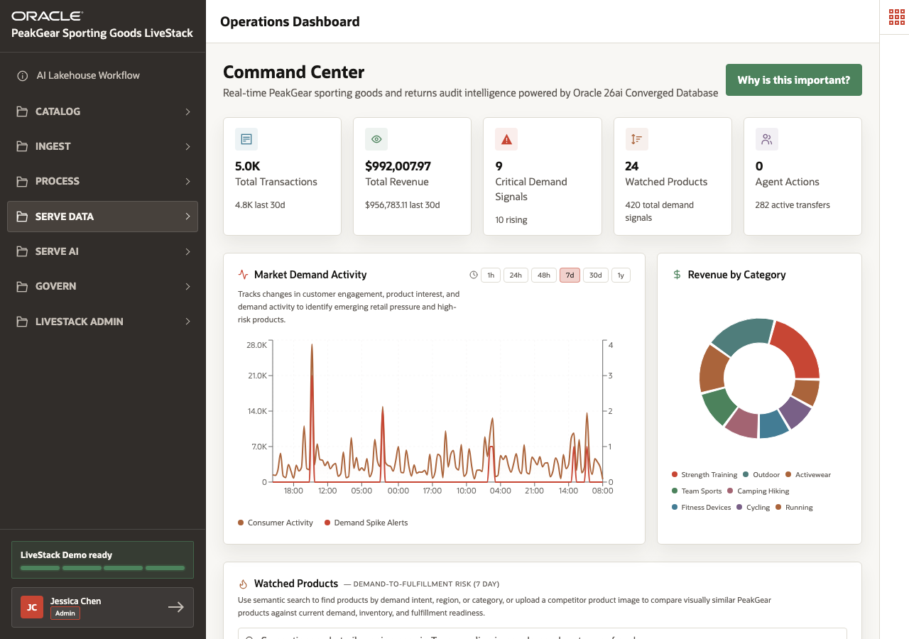

# Scene 5 Operations Dashboard

## Introduction

Retail operations leaders need one view that connects revenue, orders, product demand, fulfillment pressure, inventory, returns risk, and AI action. In many environments, this requires multiple dashboards and separate integration layers.

This scene shows how the **Operations Dashboard** uses one converged data foundation to present operational intelligence across data types.

Estimated Time: **10 minutes**

### Objectives

In this scene, you will:

- Review the executive command center for PeakGear operations.
- Inspect watched products and live operational metrics.
- Explain why converged queries reduce dashboard complexity.
- Connect dashboard evidence to relational, JSON, spatial, graph, vector, and AI workloads.

## Task 1: Review the command center metrics

1. Open **Serve Data** and select **Operations Dashboard**.
2. Review the top-level metrics for transactions, revenue, demand signals, watched products, and agent actions.
3. Explain that the demo is based on **5,000 orders** and **420 demand-signal posts**.
4. Use the **Why is this important?** button to explain that a fully converged query can serve dashboards without separate data engines for every data type.

## Task 2: Inspect watched products

1. Review the **Watched Products** table.
2. Use products such as **Canyonridge Compression Shorts 399**, **Canyonridge Daypack 63**, **Velocityworks Outdoor Jacket 231**, or **Hydrawave Volleyball 184** as visible examples.
3. Click a watched product row to open the detail modal.
4. Review how product image, signal intensity, demand region, inventory by fulfillment site, and JSON document details support one operational decision.

You can move to the next scene.

## Credits & Build Notes
- **Author** - Oracle LiveLabs Team
- **Last Updated By/Date** - Oracle LiveLabs Team, 2026-06-05
