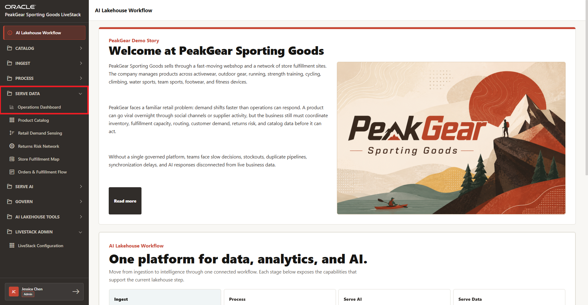
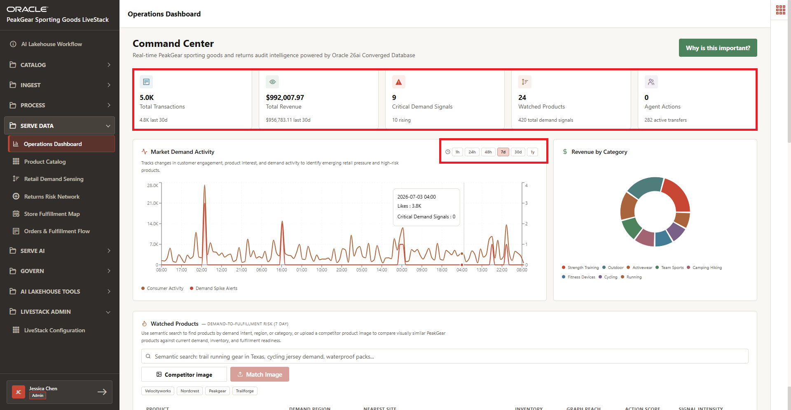
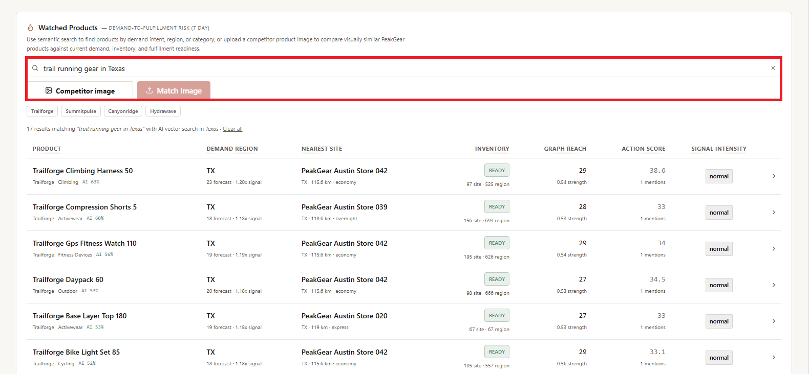
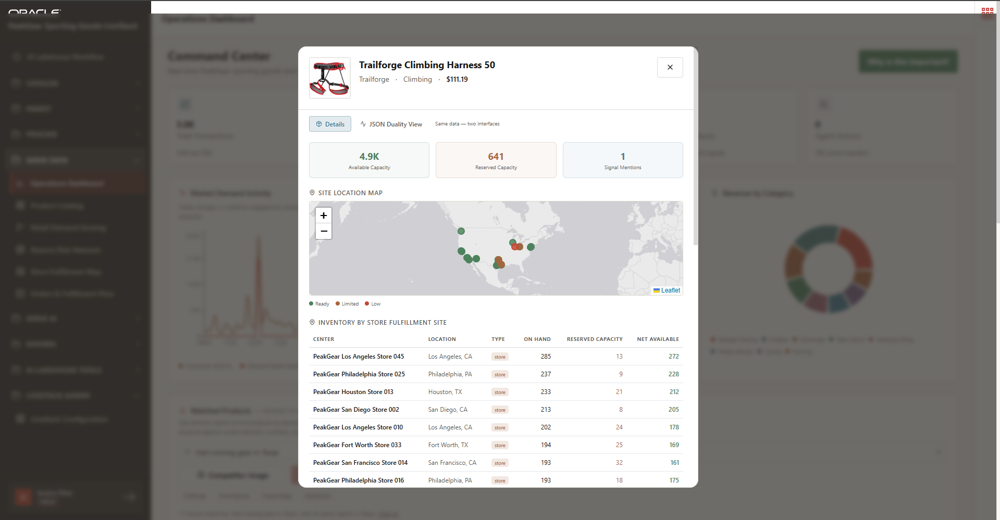
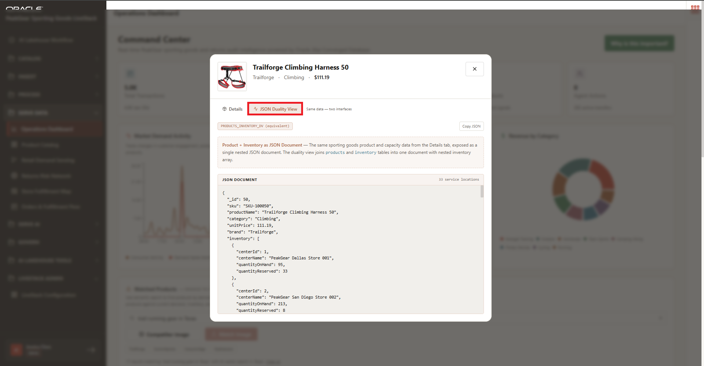

# Operations Dashboard

## Introduction

PeakGear has moved data through the **AI Lakehouse** path. This scene shows how prepared data supports an operations team.

The **Operations Dashboard** brings watched products, demand, fulfillment, and capacity into one **Serve Data** view.

Planners need to know which products need attention and what the business should do next. The dashboard brings the related context together so they do not have to compare separate reports.

The dashboard uses Gold data products, the prepared outputs of the medallion process.

The **Watched Products** table uses an **Oracle AI Database converged query** to combine product, demand, fulfillment, graph, and semantic-search results.

**JSON Relational Duality** exposes the selected product context as a JSON document for applications.

Estimated Time: **10 minutes**

### Objectives

In this scene, you will:

- Review watched products and current operational metrics.
- Search for products by demand intent.
- Inspect fulfillment and capacity context for a product.
- See the same served data as a JSON document.

## Task 1: Open the Operations Dashboard



Open the **Operations Dashboard**:

1. In the left sidebar, expand **Serve Data**.
2. Select **Operations Dashboard**.
3. Confirm that the page title is **Operations Dashboard** and that the main page shows the **Command Center**.

The dashboard sits in Serve Data because it uses data that has already been refined through the AI Lakehouse process.

## Task 2: Review the command center



Review the command center:

1. Review the KPI cards for **Total Transactions**, **Total Revenue**, **Critical Demand Signals**, **Watched Products**, and **Agent Actions**.
2. Review the **Market Demand Activity** chart and use the time range controls if you want to compare recent demand activity windows.
3. Use the dashboard to see current operating pressure without reconciling separate reports.

These metrics show how the medallion process prepares data for operations users.

## Task 3: Use watched-products semantic search



Search Watched Products:

1. Scroll to **Watched Products**.
2. In the semantic search field, enter:

    ```text
    trail running gear in Texas
    ```

3. Wait for the table to refresh.
4. Review the brand filter chips if you want to narrow the result set.
5. Optionally click **Competitor image**, select a JPG or PNG product image, and click **Match Image**.

Typed search and image matching are both Serve Data experiences. Users can ask a business question and see products with demand, fulfillment, and risk context in the same table. The Watched Products table uses a converged query to combine product facts with demand, fulfillment, graph, action-score, and semantic-match data.

## Task 4: Open a watched-product detail view



Open a watched-product detail view:

1. Click a row in the watched-products table.
2. Review the product header, brand, category, and price.
3. Review the capacity summary: **Available Capacity**, **Reserved Capacity**, and **Signal Mentions**.
4. Review the site location map and the **Inventory by Store Fulfillment Site** table.
5. Use the detail view to move from the Gold product data to operational detail.

This is where the business outcome becomes concrete. A planner can start from a demand-intent search, identify a product, and immediately see whether PeakGear has enough capacity in the right fulfillment area.

## Task 5: Review the JSON Duality view



Review the **JSON Duality** view for the selected product:

1. In the product detail modal, click **JSON Duality View**.
2. Review the explanation that the same product and capacity data is exposed as a nested JSON document.
3. Review the **JSON Document** panel.
4. Optionally click **Copy JSON** if you want to inspect the document outside the UI.

The dashboard serves operations users with cards, maps, and tables. Applications and APIs can use the same data as a JSON document.

## Conclusion: Business Outcome

The Operations Dashboard shows how Gold-layer data products can support one operational view. PeakGear can use prepared order, inventory, demand, product, geography, and search data without building a separate view for each question.

The Watched Products experience brings together relational product and inventory facts, JSON demand signals, spatial fulfillment context, graph relationships, and semantic search results through one converged query.

For the business, operations teams can identify product risk earlier, understand fulfillment pressure, and make decisions from the same current data.


## Acknowledgements

* **Author** - Kevin Lazarz August 2026
* **Contributor** - Eugenio Galiano
* **Last Updated By/Date** - Kevin Lazarz  August 2026
