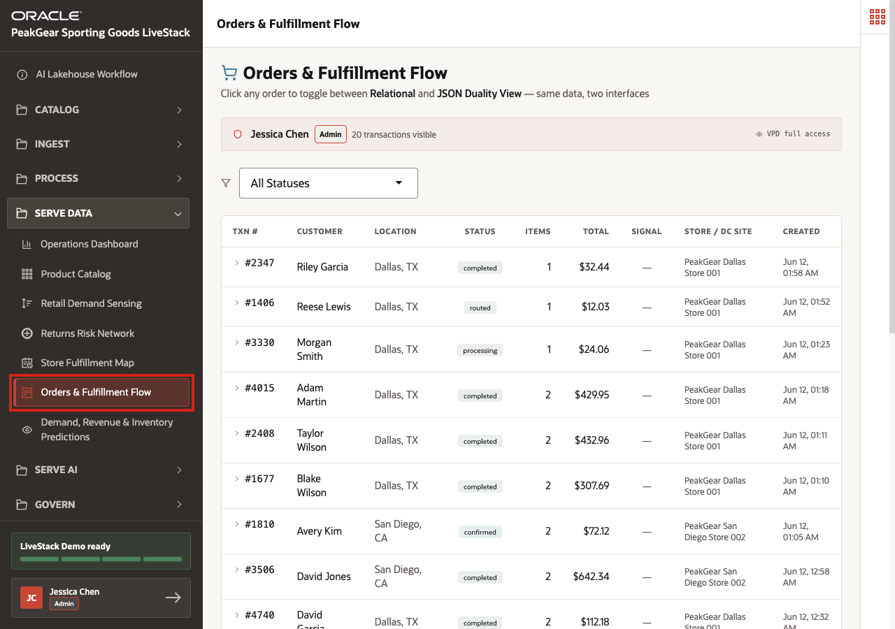
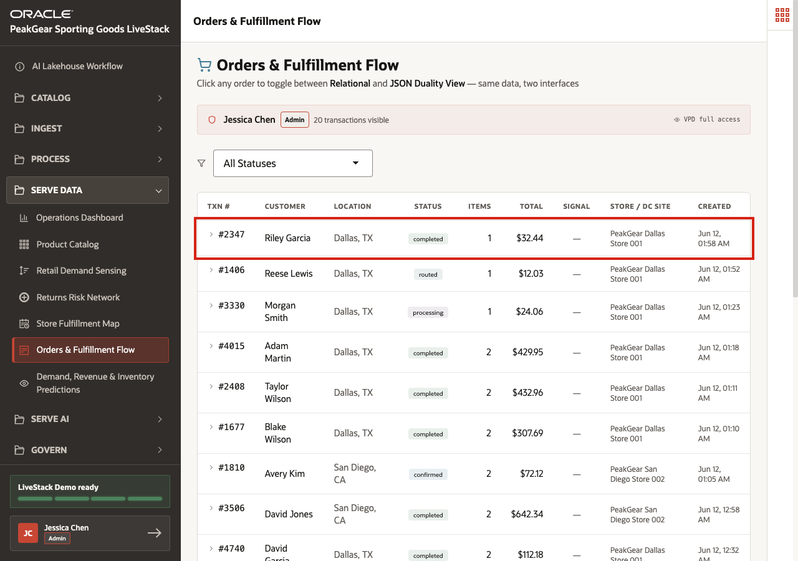
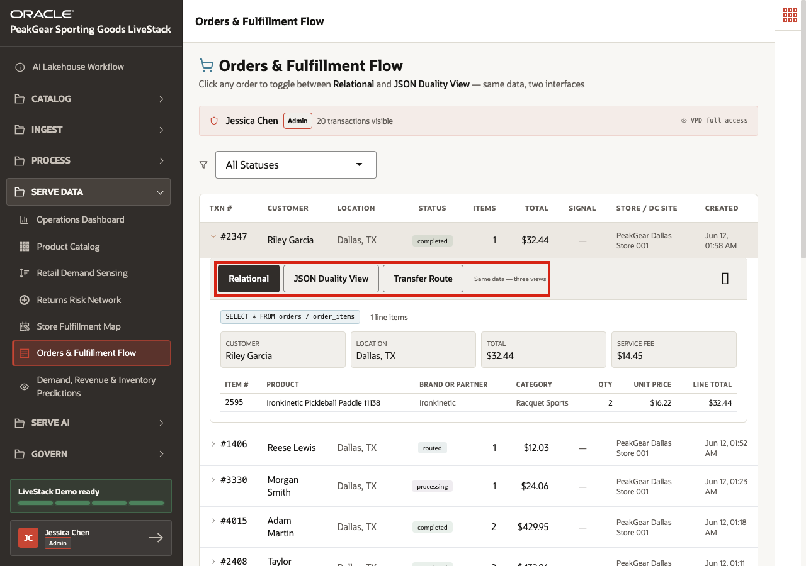
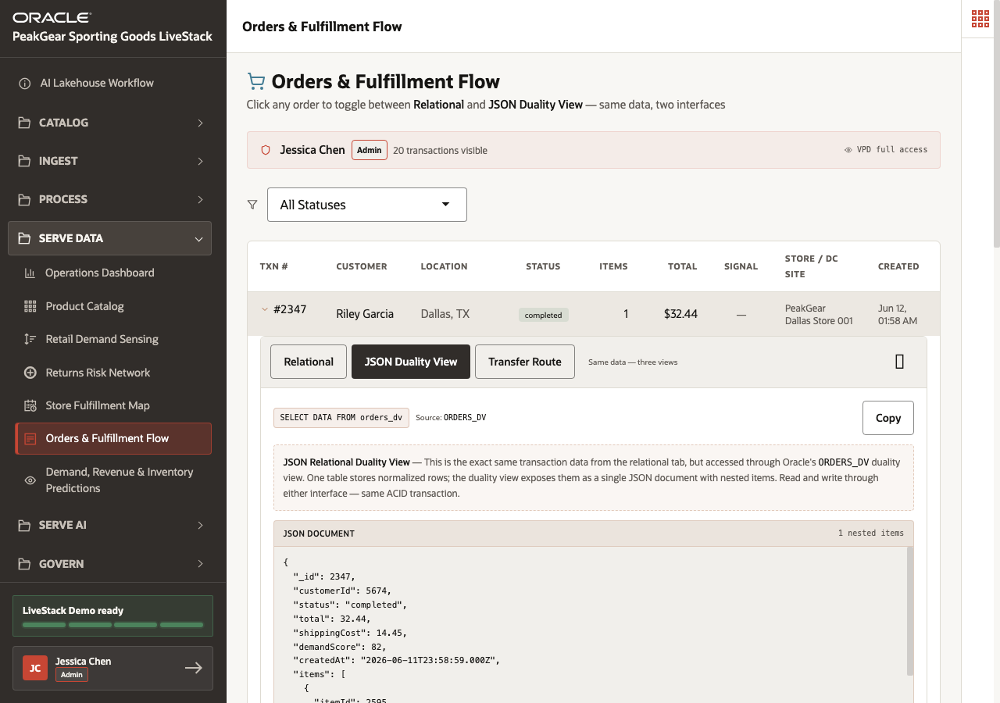
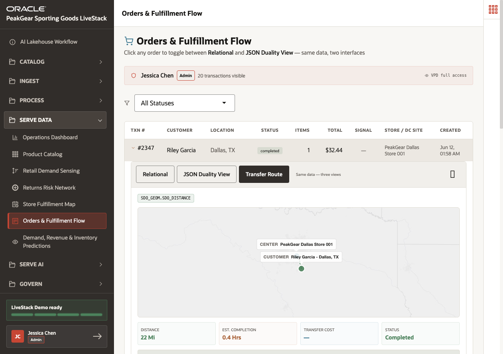

# Scene 12 Orders and Fulfillment Flow

## Introduction

**PeakGear** has already used the **AI Lakehouse** process to prepare orders, customers, products, inventory, and fulfillment-site data. This scene shows how one order can be viewed in several useful shapes without creating separate copies.

The business challenge is handoff friction. An ecommerce order may look like a JSON document to the application team, a relational transaction to the database team, a shipment or transfer route to fulfillment, and a customer-service case to support. If each team works from a separate copy, the business creates sync delays, conflicting answers, and expensive integration logic.

**Orders & Fulfillment Flow** shows how the AI Lakehouse can serve one trusted operational order view in multiple forms. JSON Duality means application-style JSON and relational tables stay connected to the same source of truth.

Estimated Time: **10 minutes**

### Objectives

In this scene, you will:

- Open **Orders & Fulfillment Flow** from the **Serve Data** menu.
- Use a specific order as the demo point.
- Compare relational and JSON Duality views of the same order.
- Review the transfer route for the selected order.
- Connect order flow to Gold-layer business outcomes.

## Task 1: Open Orders & Fulfillment Flow

Perform the following set of steps to open **Orders & Fulfillment Flow**:

1. In the left sidebar, expand **Serve Data**.
2. Select **Orders & Fulfillment Flow**.
3. Confirm that the page title is **Orders & Fulfillment Flow**.

This page shows a served order data product. The user is no longer cleaning order records or building integration code. They are using the curated operational output of the medallion process.

## Task 2: Select the demo order

Perform the following set of steps to select the demo order:

1. Review the order table.
2. Use **Order 2347** as the demo point.
3. Confirm the visible order details: **Riley Garcia**, **Dallas, TX**, **completed**, **1 item**, **$32.44**, fulfilled by **PeakGear Dallas Store 001**.
4. Click the **Order 2347** row.

This order is intentionally simple. That makes it useful for showing how the same trusted transaction can be viewed through different technical interfaces without becoming a different copy of data.

**Note:** Sample values may change after data refreshes or rebuilds. Focus on the expected result pattern and the business takeaway, not the exact values.

## Task 3: Review relational order detail

Perform the following set of steps to review relational order detail:

1. Start on the **Relational** tab.
2. Review the customer, location, total, and service-fee fields.
3. Review the line item **Ironkinetic Pickleball Paddle 11138**.
4. Use the tab controls to explain that the same order can be inspected as relational data, JSON document data, or route data.

The relational view is useful for operational reporting and database analysis. It shows the familiar row-and-column perspective that order operations teams often need.

## Task 4: Compare the JSON Duality view

Perform the following set of steps to compare the JSON Duality view:

1. Select **JSON Duality View**.
2. Review the generated JSON document for **Order 2347**.
3. Confirm that the JSON document still represents the same transaction: status **completed**, total **32.44**, and one nested item.
4. Explain that JSON Relational Duality lets application-style documents and relational tables stay consistent without ETL or duplicate synchronization.

This is a practical Serve Data outcome. Application teams can work with JSON documents, operations teams can work with relational tables, and the business avoids drift between copies.

**Note:** Sample values may change after data refreshes or rebuilds. Focus on the expected result pattern and the business takeaway, not the exact values.

## Task 5: Review the transfer route

Perform the following set of steps to review the transfer route:

1. Select **Transfer Route**.
2. Review the route from **PeakGear Dallas Store 001** to **Riley Garcia - Dallas, TX**.
3. Review the route metrics: **22 Mi**, **0.4 Hrs**, and status **Completed**.
4. Explain that this route uses the same curated order, customer, and fulfillment-site context shown in the earlier views.

The route view connects order operations to spatial context. PeakGear can use order, customer, fulfillment, and location data together instead of asking a user to reconcile separate order and mapping systems.

**Note:** Sample values may change after data refreshes or rebuilds. Focus on the expected result pattern and the business takeaway, not the exact values.

## Conclusion: Business Outcome

Orders & Fulfillment Flow shows how PeakGear can reduce integration complexity around operational orders. The same Gold-layer order data product can support relational analysis, JSON application access, and spatial transfer-route review.

The medallion process makes that possible. Bronze captures operational order events, Silver standardizes customers, items, sites, and statuses, and Gold serves a consistent order foundation. Oracle AI Database can then expose the same data through relational SQL, JSON Relational Duality, and spatial functions.

For the business, this means order teams can investigate fulfillment questions faster, application teams avoid duplicate data pipelines, and customer-service or operations users can work from the same trusted transaction context.

You can move to the next scene.

## Credits & Build Notes
- **Author** - Oracle LiveLabs Team
- **Last Updated By/Date** - Oracle LiveLabs Team, 2026-06-12
