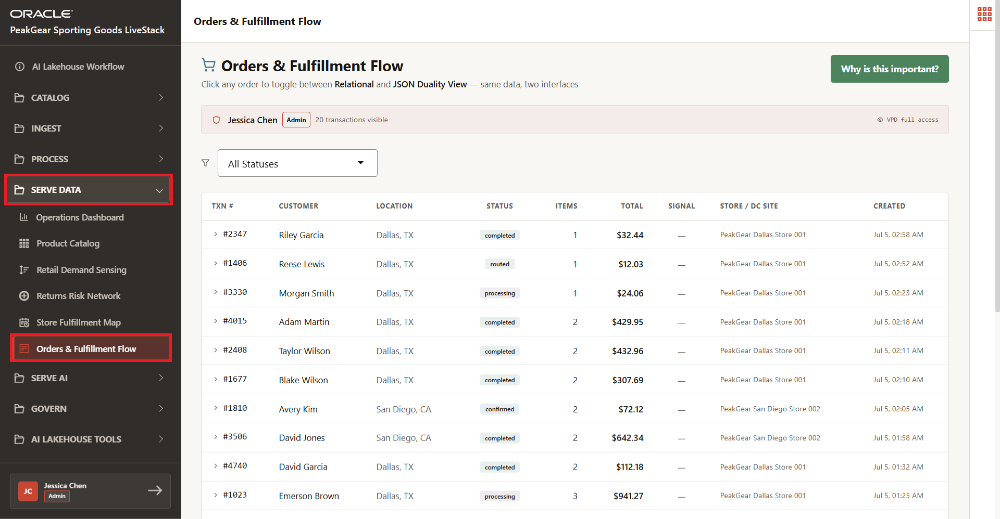
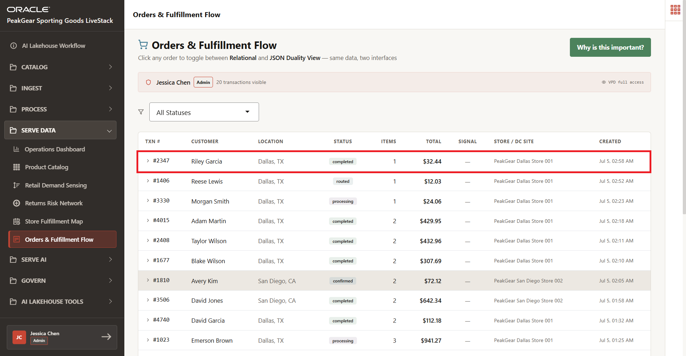
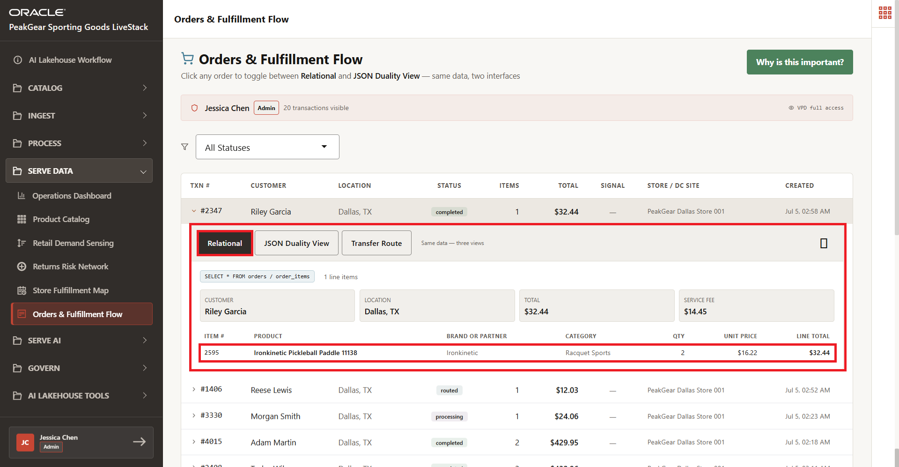
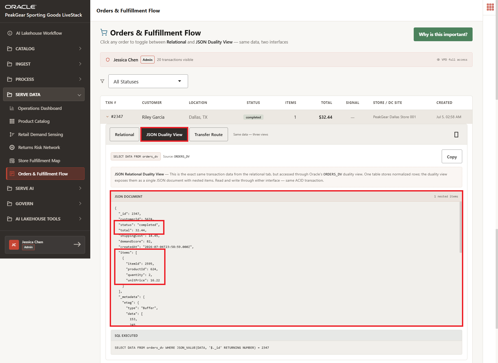
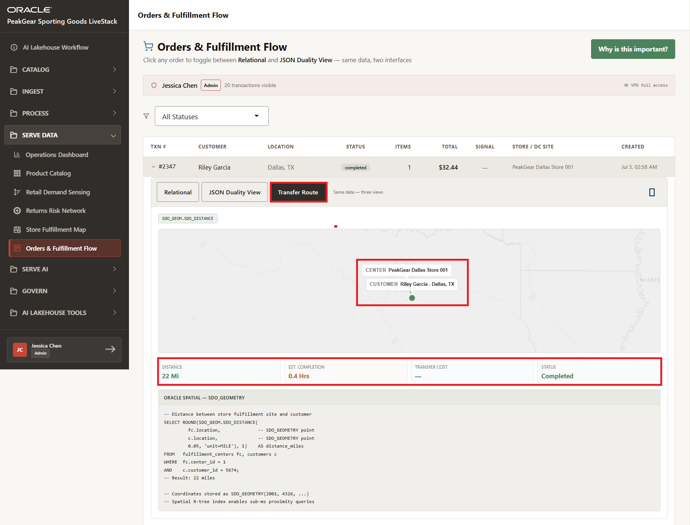

# Orders and Fulfillment Flow

## Introduction

**PeakGear** has prepared order, customer, product, inventory, and fulfillment-site data through the **AI Lakehouse** process. This scene shows how different teams can use the same order in different views without creating separate copies.

An ecommerce order may be a JSON document for an application team, a relational transaction for a database team, a route for fulfillment, or a customer-service case. When each team works from a separate copy, updates can drift and answers can conflict.

**Orders & Fulfillment Flow** shows one operational order in several forms. In the **Oracle AI Database**, **JSON Relational Duality** keeps the application-style JSON view and relational tables connected to the same data.

**Oracle Spatial** supplies the transfer-route context shown in the fulfillment view.

Estimated Time: **10 minutes**

### Objectives

In this scene, you will:

- Review one order from relational, JSON, and route views.
- See how the same order supports application, database, and fulfillment work.

## Task 1: Open Orders & Fulfillment Flow

Open **Orders & Fulfillment Flow**:

1. In the left sidebar, expand **Serve Data**.
2. Select **Orders & Fulfillment Flow**.
3. Confirm that the page title is **Orders & Fulfillment Flow**.

This page shows an order data product prepared through the medallion process.

## Task 2: Select the demo order

Select the demo order:

1. Review the order table.
2. Use **Order 2347** as the demo point.
3. Confirm the visible order details: **Riley Garcia**, **Dallas, TX**, **completed**, **1 item**, **$32.44**, fulfilled by **PeakGear Dallas Store 001**.
4. Click the **Order 2347** row.

This order is simple enough to show the same transaction in different views without creating another copy of the data.

**Note:** Sample values may change after data refreshes or rebuilds. Focus on the expected result pattern and the business takeaway, not the exact values.

## Task 3: Review relational order detail

Review the relational order detail:

1. Start on the **Relational** tab.
2. Review the customer, location, total, and service-fee fields.
3. Review the line item **Ironkinetic Pickleball Paddle 11138**.
4. Use the tab controls to explain that the same order can be inspected as relational data, JSON document data, or route data.

The relational view supports operational reporting and database analysis in a familiar row-and-column format.

## Task 4: Compare the JSON Duality view

Compare the JSON Duality view:

1. Select **JSON Duality View**.
2. Review the generated JSON document for **Order 2347**.
3. Confirm that the JSON document still represents the same transaction: status **completed**, total **32.44**, and one nested item.
4. Confirm that the same order remains available to applications as JSON and to database users as relational data.

This Serve Data view lets application teams work with JSON and operations teams work with relational tables while using the same order data.

**Note:** Sample values may change after data refreshes or rebuilds. Focus on the expected result pattern and the business takeaway, not the exact values.

## Task 5: Review the transfer route

Review the transfer route:

1. Select **Transfer Route**.
2. Review the route from **PeakGear Dallas Store 001** to **Riley Garcia - Dallas, TX**.
3. Review the route metrics: **22 Mi**, **0.4 Hrs**, and status **Completed**.
4. Explain that this route uses the same curated order, customer, and fulfillment-site context shown in the earlier views.

The route view adds location context to the order. PeakGear can review order, customer, fulfillment, and location data together.

**Note:** Sample values may change after data refreshes or rebuilds. Focus on the expected result pattern and the business takeaway, not the exact values.

## Conclusion: Business Outcome

Orders & Fulfillment Flow shows how one Gold-layer order data product can support relational analysis, JSON application access, and spatial transfer-route review.

The medallion process prepares the data for these views. Bronze captures order events. Silver standardizes customers, items, sites, and statuses. Gold provides the order data used by relational SQL, JSON Relational Duality, and spatial functions.

For the business, order teams can investigate fulfillment questions and application, customer-service, and operations teams can work from the same transaction context.

## Acknowledgements

* **Author** - Kevin Lazarz August 2026
* **Contributor** - Eugenio Galiano
* **Last Updated By/Date** - Kevin Lazarz  August 2026
