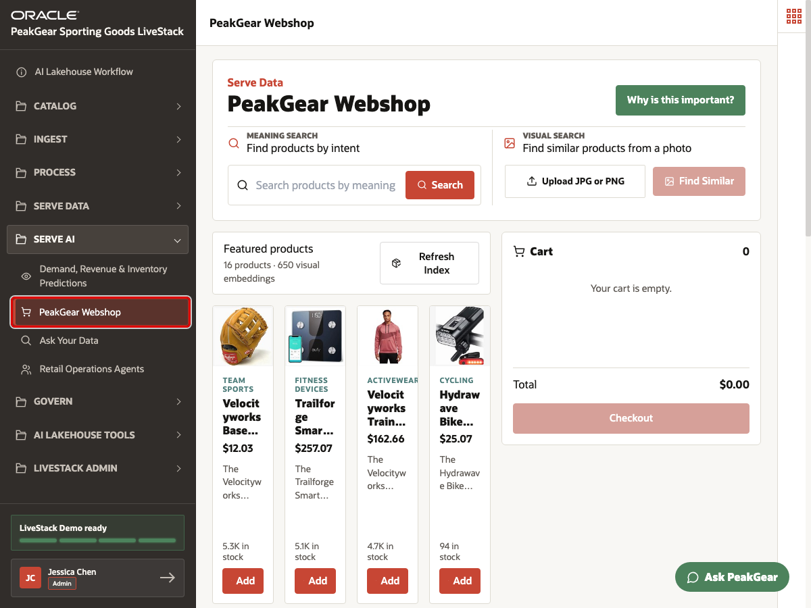
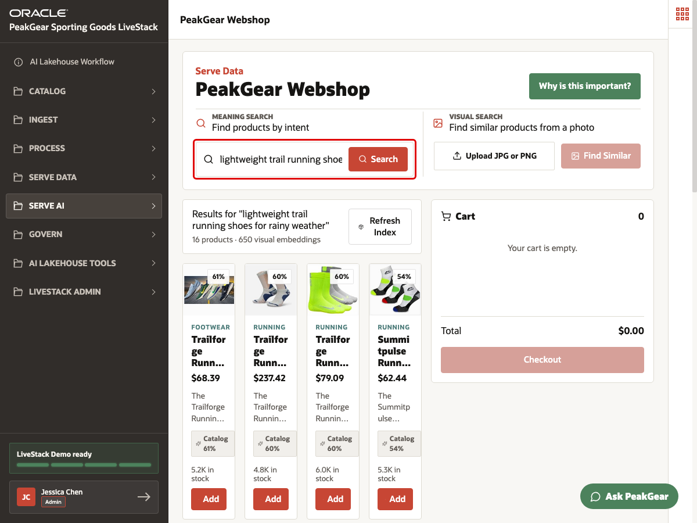
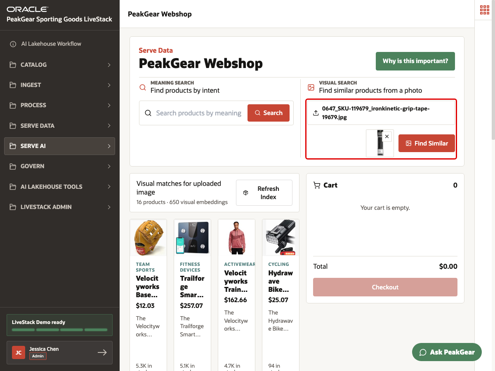
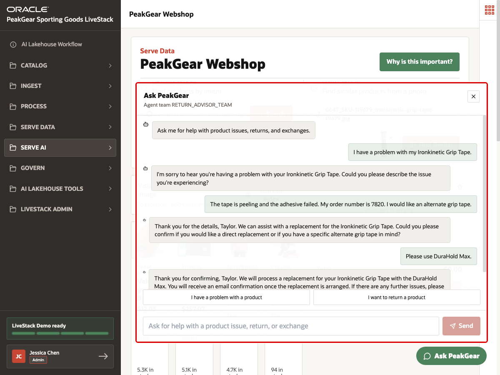

# Scene 14 PeakGear Webshop and Product Discovery

## Introduction

PeakGear customers do not always shop with clean product names, SKUs, or catalog categories. They search by need: "trail running shoes for rainy weather", "something like this photo", or "I have a problem with the grip tape I ordered." If the webshop only supports keyword search and disconnected customer support, shoppers may miss the right product, abandon the session, or wait for manual service follow-up.

The AI Lakehouse changes that experience. Product master data, inventory, images, orders, and demand signals can enter through the earlier ingest paths, move through Bronze, Silver, and Gold, and then serve an AI-powered shopping experience. The **PeakGear Webshop** demonstrates how curated Gold-layer product data can support semantic text search, visual product discovery, and an Ask PeakGear customer-service agent that is grounded in order and product data.

The business outcome is a better retail experience: shoppers can find products by intent, use images as a search input, and resolve product issues through an agent workflow that can verify order context and recommend a replacement path.

Estimated Time: **10 minutes**

### Objectives

In this scene, you will:

- Open **PeakGear Webshop** from the **Serve AI** menu.
- Search for products by shopper intent.
- Use image similarity to find visually related products.
- Use **Ask PeakGear** for a product-support and replacement scenario.
- Connect the webshop experience to the medallion process and Gold-layer product data.

## Task 1: Open PeakGear Webshop



1. In the left sidebar, expand **Serve AI**.
2. Select **PeakGear Webshop**.
3. Confirm that the page title is **PeakGear Webshop**.

This page is a Serve AI outcome because the shopper experience uses governed product, image, inventory, and order data that has already been prepared through the AI Lakehouse process.

## Task 2: Search by shopper intent



1. In **Meaning Search**, enter:

```text
lightweight trail running shoes for rainy weather
```

2. Click **Search**.
3. Review the ranked product cards.
4. Explain that the shopper did not need to know an exact product name or SKU.

Semantic search turns product discovery into an intent-based experience. The webshop can compare the shopper's language to curated catalog descriptions and product embeddings served from the lakehouse foundation.

## Task 3: Search with a product image



1. In **Visual Search**, click **Upload JPG or PNG**.
2. Upload a product image, such as the Ironkinetic grip tape image used in this demo.
3. Click **Find Similar**.
4. Review the visual matches.

Visual search shows how images can become part of the same governed product discovery experience. Product images are not just static assets; after the medallion process prepares the catalog and image metadata, embeddings can help customers find similar items from a photo.

## Task 4: Use Ask PeakGear for an order issue



1. Click **Ask PeakGear** in the lower-right corner.
2. Enter:

```text
I have a problem with my Ironkinetic Grip Tape.
```

3. When the agent asks for more detail, enter:

```text
The tape is peeling and the adhesive failed. My order number is 7820. I would like an alternate grip tape.
```

4. When the agent suggests replacement options, choose one:

```text
Please use DuraHold Max.
```

5. Review the final response confirming that the replacement will be processed for order **7820**.

Ask PeakGear demonstrates why the webshop is more than a search page. A support agent can use order context, product context, and replacement logic from the governed AI Lakehouse foundation to move from a customer problem to an actionable service outcome.

## Conclusion: Business Outcome

The PeakGear Webshop shows how AI Lakehouse data products can become a customer-facing AI experience. Bronze captures product, image, order, inventory, and demand data. Silver standardizes and enriches those records. Gold serves the trusted product and order foundation used by semantic search, visual search, and the Ask PeakGear support agent.

For the business, this means product discovery can become more relevant, customer-service workflows can become more automated, and ecommerce teams can build AI experiences without copying catalog, image, and order data into disconnected systems.

You can move to the next scene.

## Credits & Build Notes
- **Author** - Oracle LiveLabs Team
- **Last Updated By/Date** - Oracle LiveLabs Team, 2026-06-13
