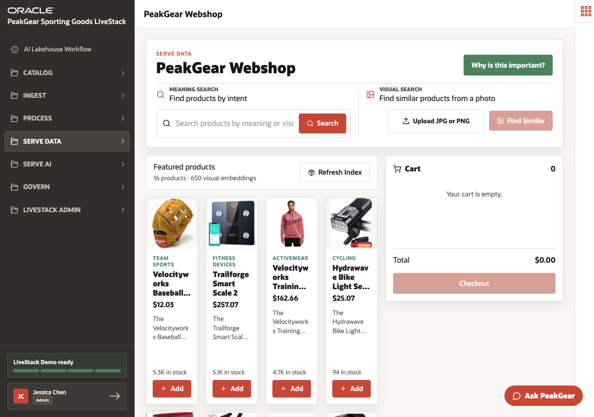
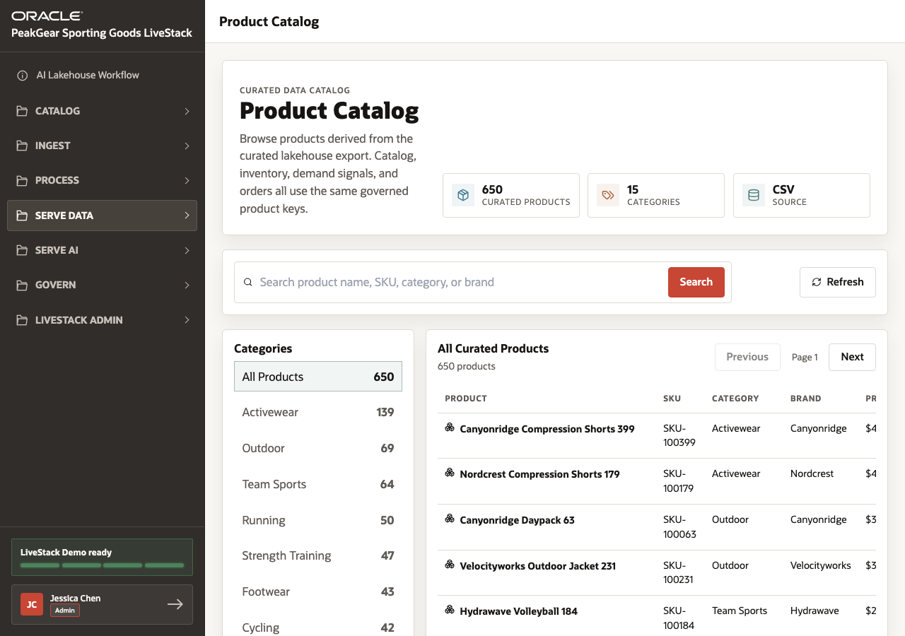

# Scene 6 PeakGear Webshop and Product Discovery

## Introduction

Retail customers do not always search with exact product names or SKUs. They search by intent, style, activity, image, or problem. PeakGear needs product discovery that understands shopper language while still using governed catalog data.

This scene shows how the **PeakGear Webshop** and **Product Catalog** use vector search, image similarity, curated product data, and Select AI Agents.

Estimated Time: **10 minutes**

### Objectives

In this scene, you will:

- Search for products by meaning, not only by keyword.
- Review visual product search from an uploaded image.
- Connect the webshop to the curated product catalog.
- Show how Ask PeakGear uses agent workflows for product support and returns.

## Task 1: Search with shopper language and images

1. Open **Serve Data** and select **PeakGear Webshop**.
2. Use the meaning search field with a phrase such as **trail running gear in Texas** or **white tee shirt**.
3. Explain that semantic search ranks products by meaning, using embeddings stored in or near the governed database foundation.
4. Use the visual search panel to show that product images can follow the same ranked discovery experience.
5. Open **Why is this important?** to explain why database-grounded similarity search is more useful than disconnected site search.

## Task 2: Review curated product details

1. Open **Product Catalog**.
2. Select a product such as **Canyonridge Daypack 63** or **Velocityworks Outdoor Jacket 231**.
3. Review the product details panel, including image, category, inventory, demand signals, and curated catalog context.
4. Explain that the curated catalog gives the webshop, dashboard, and AI agents the same trusted product facts.

## Task 3: Discuss Ask PeakGear

1. Return to **PeakGear Webshop**.
2. Open the floating **Ask PeakGear** button.
3. Explain that Select AI Agents can use trusted tools, order facts, product manuals, alternative product data, and database updates.
4. Use the return and exchange story as the customer-service example: the agent verifies order context, recommends troubleshooting, suggests alternatives, and records the final exchange or refund status.

You can move to the next scene.

## Credits & Build Notes
- **Author** - Oracle LiveLabs Team
- **Last Updated By/Date** - Oracle LiveLabs Team, 2026-06-05
