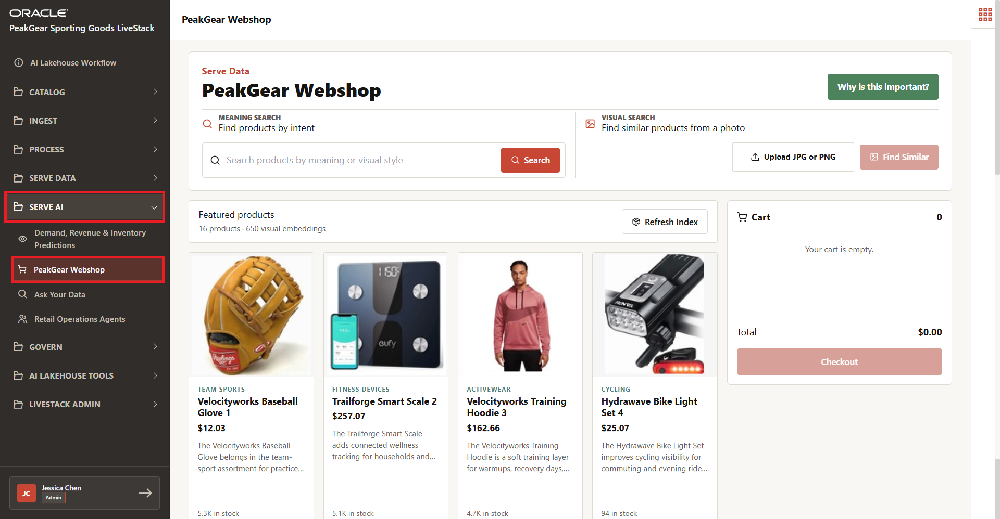
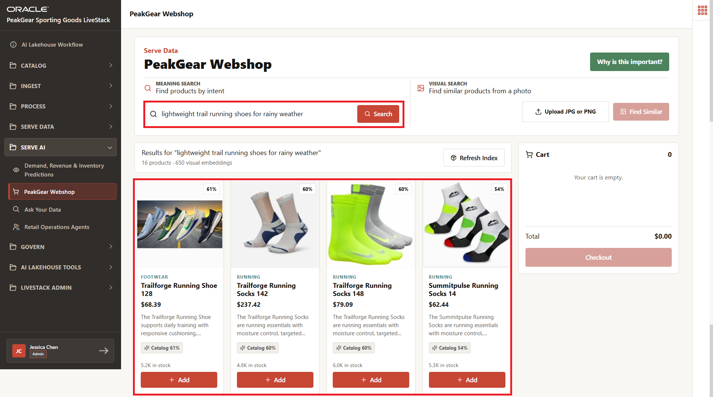
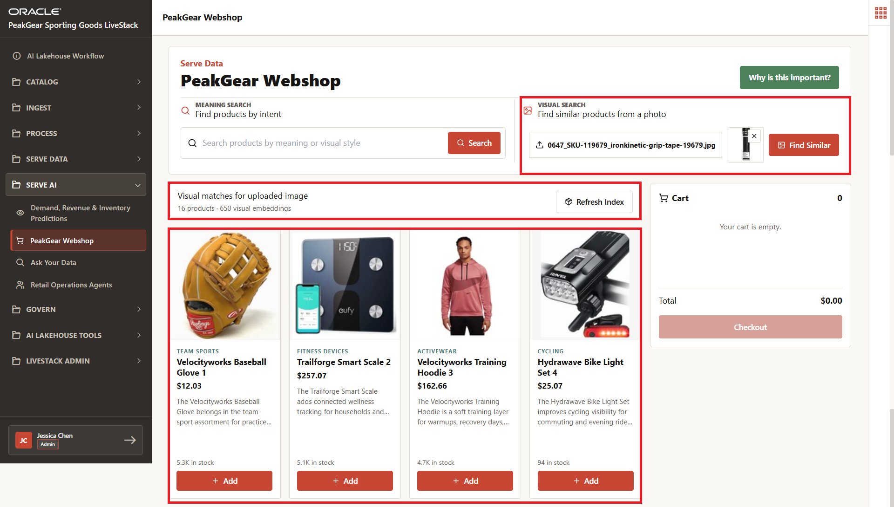
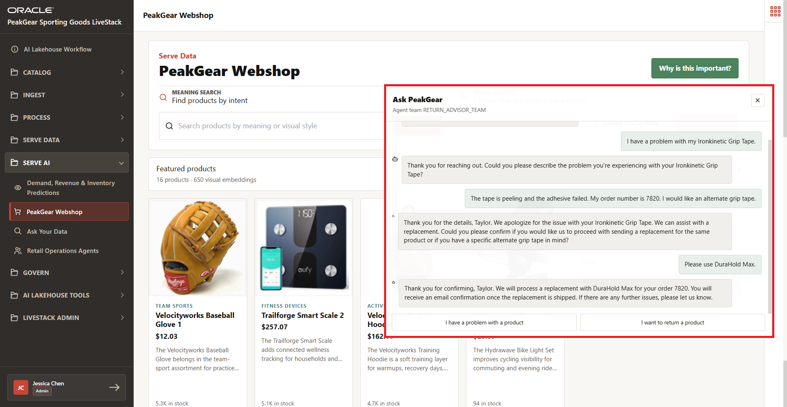

# PeakGear Webshop and Product Discovery

## Introduction

**PeakGear** customers do not always search with a product name, SKU, or catalog category. This scene shows a customer-facing experience built on prepared product, image, inventory, and order data.

The shopper can search by intent, search with an image, and resolve an order issue with **Ask PeakGear**.

These features help shoppers find relevant products and give support teams order context when a product issue needs a replacement.

**Oracle AI Vector Search** uses in-database embeddings for text and image searches. **Ask PeakGear** uses the prepared product and order data to suggest a replacement.

Estimated Time: **10 minutes**

### Objectives

In this scene, you will:

- Find products with a plain-language search.
- Use an image to find similar products.
- Use **Ask PeakGear** to resolve an order issue.
- See how prepared product data supports the shopper experience.

## Task 1: Open PeakGear Webshop



Open **PeakGear Webshop**:

1. In the left sidebar, expand **Serve AI**.
2. Select **PeakGear Webshop**.
3. Confirm that the page title is **PeakGear Webshop**.

This page is a Serve AI experience built on product, image, inventory, and order data prepared through the AI Lakehouse process.

## Task 2: Search by shopper intent



Search by shopper intent:

1. In **Meaning Search**, enter:

    ```text
    lightweight trail running shoes for rainy weather
    ```

2. Click **Search**.
3. Review the ranked product cards.
4. Explain that the shopper did not need to know an exact product name or SKU.

The webshop compares the shopper's words with product descriptions and uses in-database embeddings and vector search to rank relevant products.

## Task 3: Search with a product image



Search with a product image:

1. In **Visual Search**, click **Upload JPG or PNG**.
2. Upload a product image, such as the Ironkinetic grip tape image used in this demo.
3. Click **Find Similar**.
4. Review the visual matches.

Visual Search uses product-image embeddings to find similar items. It uses the same prepared product data as the text search.

**Note:** Sample values may change after data refreshes or rebuilds. Focus on the expected result pattern and the business takeaway, not the exact values.

## Task 4: Use Ask PeakGear for an order issue



Use Ask PeakGear for an order issue:

1. Click **Ask PeakGear** in the lower-right corner.
2. Enter:

    ```text
    I have a problem with my Ironkinetic Grip Tape.
    ```

3. When the agent asks for more detail, enter:

    ```text
    The tape is peeling and the adhesive failed. My order number is 7820. I would like an alternate grip tape.
    ```

4. When the agent suggests replacement options, choose one:

    ```text
    Please use DuraHold Max.
    ```

5. Review the final response confirming that the replacement will be processed for order **7820**.

Ask PeakGear uses order and product context to suggest a replacement as part of the support flow.

**Note:** Sample values may change after data refreshes or rebuilds. Focus on the expected result pattern and the business takeaway, not the exact values.

## Conclusion: Business Outcome

The PeakGear Webshop uses AI Lakehouse data in a customer-facing experience. Bronze captures product, image, order, inventory, and demand data. Silver standardizes and enriches those records. Gold provides the product and order data used by text search, Visual Search, and Ask PeakGear.

For the business, shoppers can find products in more than one way, while support teams can work from the same product and order context.


## Acknowledgements

* **Author** - Kevin Lazarz August 2026
* **Contributor** - Eugenio Galiano
* **Last Updated By/Date** - Kevin Lazarz  August 2026
