# Scene 5 Data Processing and Pipelines

## Introduction

PeakGear has now landed raw source data into the lakehouse. The product master file is in Bronze, customer changes can arrive through CDC, and demand signals can arrive through real-time streaming. That is progress, but Bronze is not where the business should make decisions.

Retail data becomes valuable when it is standardized and reusable. A raw product file can contain duplicate SKUs, mixed casing, trailing spaces, deleted records, inconsistent categories, and fields that are still shaped like the source system. If PeakGear lets every dashboard, webshop feature, AI agent, and planning workflow fix those problems independently, the business ends up with conflicting product definitions.

This scene shows the Process stage of the AI Lakehouse. You will use Oracle Data Transforms to create a repeatable pipeline that turns the previously loaded product master Bronze data into a Silver product table. The example transformation is intentionally simple and visible: product IDs are standardized with `UPPER(TRIM(raw_sku))`, product attributes are cleaned, deleted records are filtered out, and the latest row per SKU is kept.

That Silver table becomes the governed product foundation for later Gold data products: webshop search, product discovery, operations dashboards, fulfillment decisions, and retail agents.

Estimated Time: **15 minutes**

### Objectives

In this scene, you will:

- Open the **Data Processing & Pipelines** demo from the **Process** menu.
- Open Oracle Data Transforms from the LiveStack page.
- Confirm that Product Master Bronze and Silver Data Entities are available.
- Create a Data Transforms project for the Silver process.
- Create a `SILVER_PRODUCTS_FLOW` data flow.
- Apply a product master transformation that uppercases product IDs and prepares data for Silver.
- Run or review the flow execution path into `SILVER_PRODUCTS`.
- Verify the Silver output with SQL.

## Task 1: Open the Data Processing & Pipelines demo

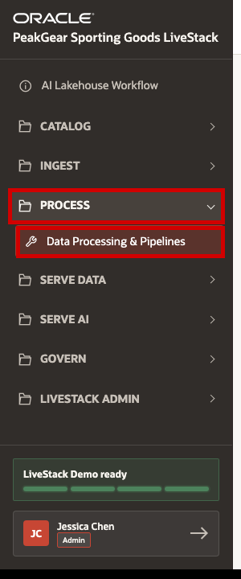

1. In the left sidebar, expand **Process**.
2. Select **Data Processing & Pipelines**.
3. Confirm that the page title is **Data Processing & Pipelines** before continuing.

## Task 2: Open Data Transforms

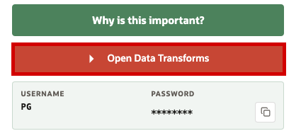

1. Click **Open Data Transforms**.
2. Use the displayed PG username and password to sign in.
3. Keep the LiveStack tab open so you can return to the guide while working in Data Transforms.

## Task 3: Sign in to Data Transforms

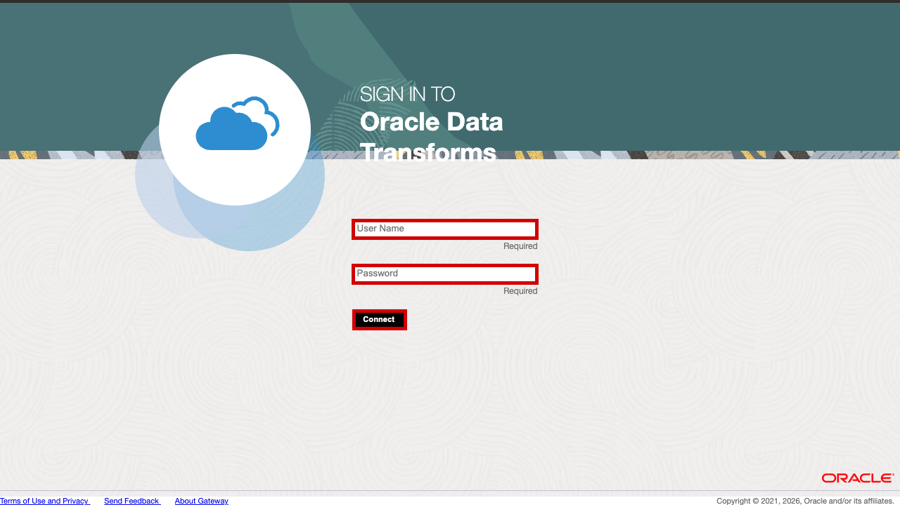

1. Enter the PG username.
2. Enter the PG password from the LiveStack page.
3. Click **Connect**.

## Task 4: Start from the Data Transforms home page

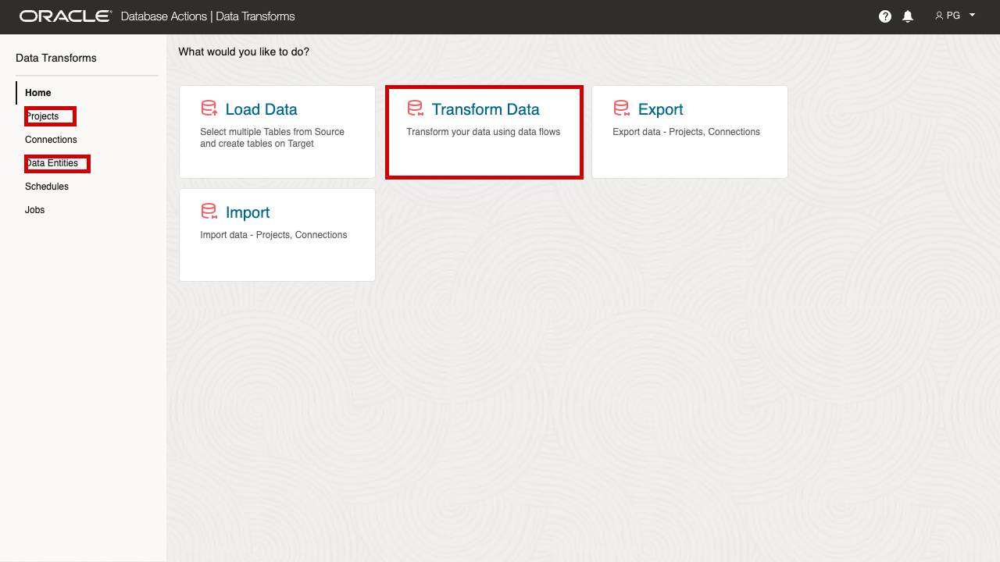

1. Review the Data Transforms home page.
2. Use **Data Entities** to confirm that the source and target objects are visible.
3. Use **Projects** to create the repeatable Silver pipeline.
4. The **Transform Data** tile is the conceptual path: Bronze source data is transformed into Silver tables through data flows.

## Task 5: Confirm Product Master Data Entities

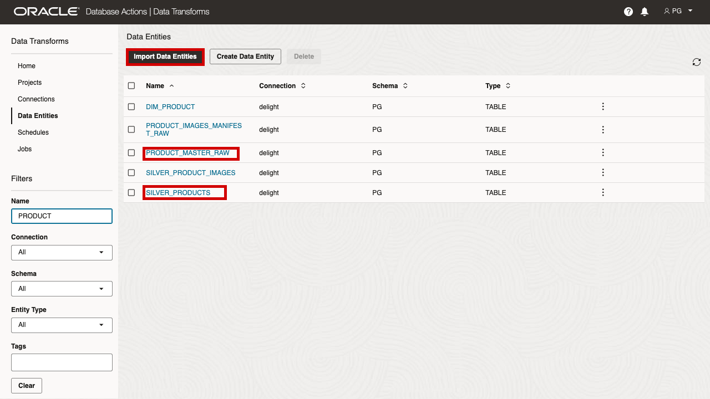

1. Open **Data Entities**.
2. Filter for `PRODUCT`.
3. Confirm that `PRODUCT_MASTER_RAW` is available. This is the Bronze product file loaded in the previous scene.
4. Confirm that `SILVER_PRODUCTS` is available. This is the Silver target table.
5. If `PRODUCT_MASTER_SILVER_V` is missing later, you will create it in Task 11 and import it as a Data Entity.

## Task 6: Create the Silver project

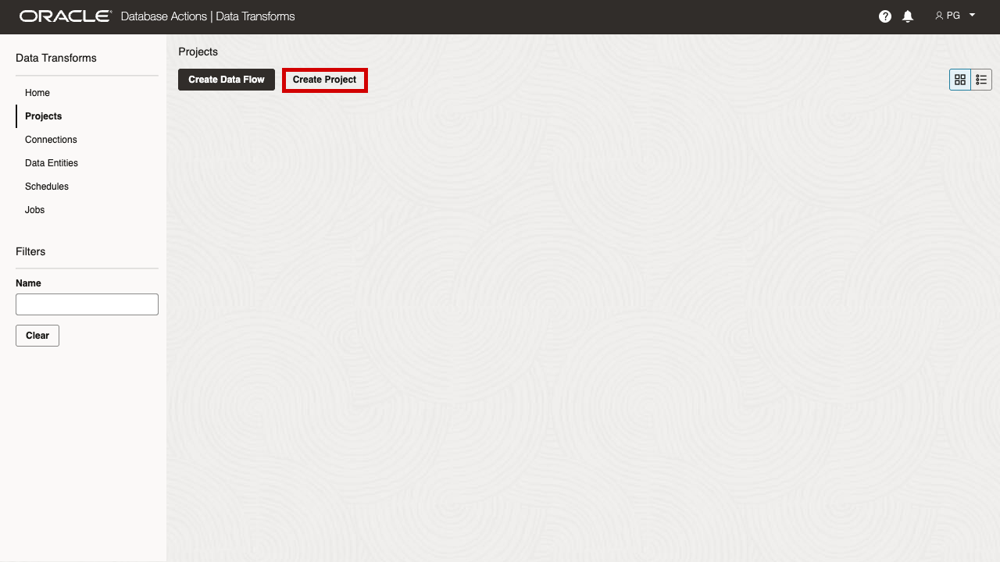

1. Open **Projects**.
2. Click **Create Project**.

## Task 7: Name the Silver project

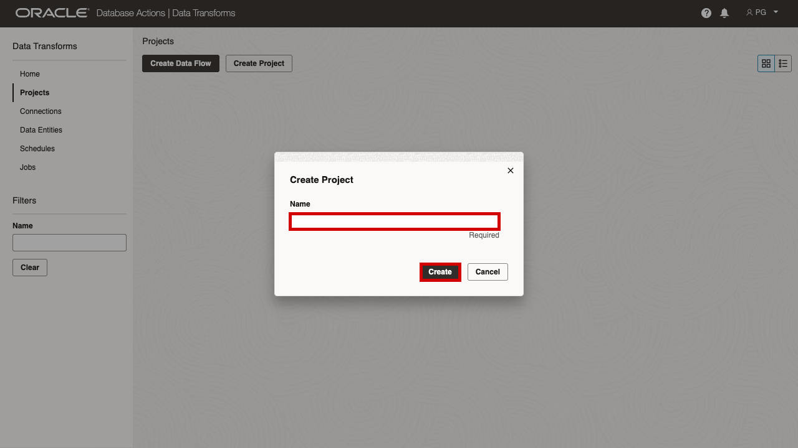

1. Enter the project name:

```text
PG_SILVER_PROCESS
```

2. Click **Create**.

The project gives PeakGear a managed workspace for repeatable Bronze-to-Silver flows.

## Task 8: Open Data Flows in the project

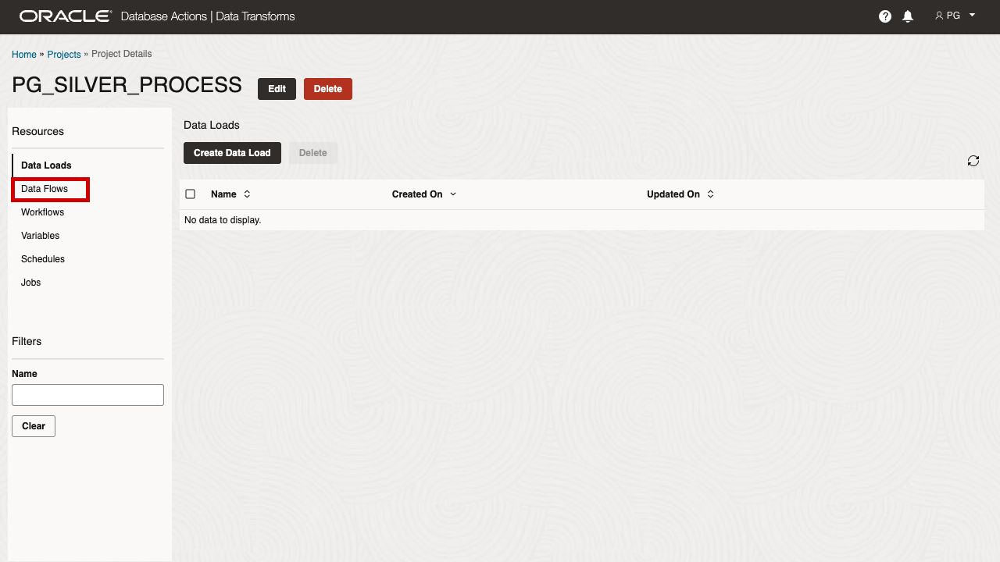

1. In the project resource list, select **Data Flows**.
2. Click **Create Data Flow** after the Data Flows resource page opens.

## Task 9: Create the Silver product flow

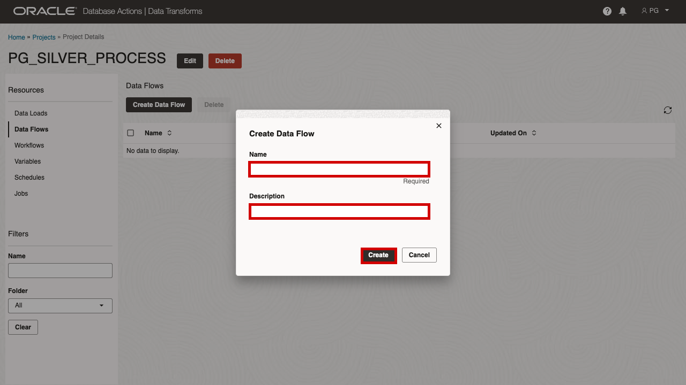

1. Enter the flow name:

```text
SILVER_PRODUCTS_FLOW
```

2. Add a description such as:

```text
Transform PRODUCT_MASTER_RAW into SILVER_PRODUCTS.
```

3. Click **Create**.

## Task 10: Add the PG schema to the flow editor

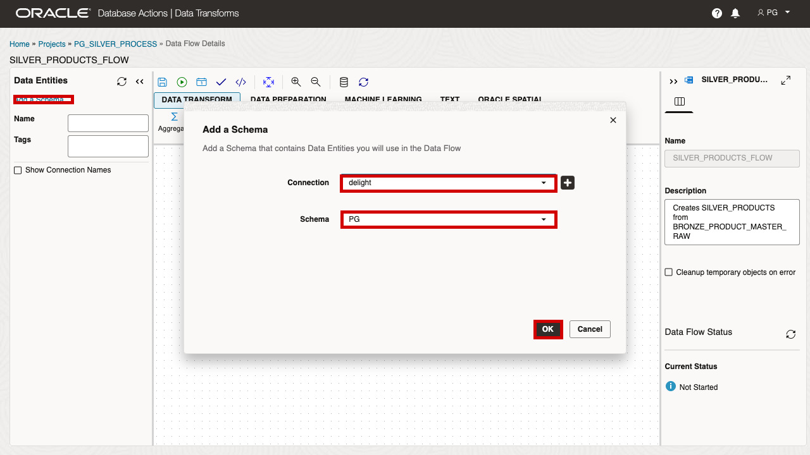

1. Click **Add a Schema**.
2. Select the ADB connection for this environment. In this demo it is shown as `delight`.
3. Select schema `PG`.
4. Click **OK**.

The left panel can now show the PG Data Entities that can be used in the flow.

## Task 11: Define the Bronze-to-Silver transformation

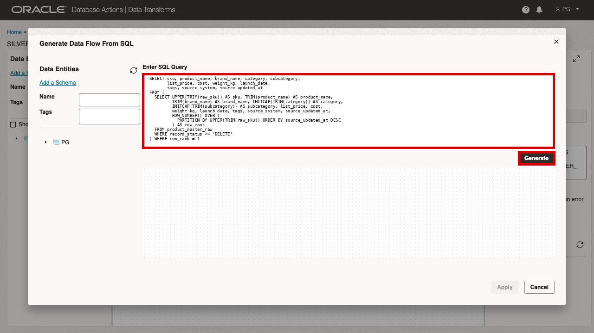

Use this transformation as the presenter-safe path for the product master flow. It makes the product ID rule explicit, removes deleted records, trims product attributes, standardizes category casing, and keeps the latest row per SKU.

Run this first in SQL Worksheet if `PRODUCT_MASTER_SILVER_V` is not already present, then import the view as a Data Entity in Data Transforms.

```sql
CREATE OR REPLACE VIEW product_master_silver_v AS
SELECT
  sku,
  product_name,
  brand_name,
  category,
  subcategory,
  list_price,
  cost,
  weight_kg,
  launch_date,
  tags,
  source_system,
  source_updated_at
FROM (
  SELECT
    UPPER(TRIM(raw_sku)) AS sku,
    TRIM(product_name) AS product_name,
    TRIM(brand_name) AS brand_name,
    INITCAP(TRIM(category)) AS category,
    INITCAP(TRIM(subcategory)) AS subcategory,
    list_price,
    cost,
    weight_kg,
    launch_date,
    tags,
    source_system,
    source_updated_at,
    ROW_NUMBER() OVER (
      PARTITION BY UPPER(TRIM(raw_sku))
      ORDER BY source_updated_at DESC
    ) AS row_rank
  FROM product_master_raw
  WHERE record_status <> 'DELETE'
)
WHERE row_rank = 1;
```

After the view exists:

1. Import `PRODUCT_MASTER_SILVER_V` as a Data Entity if it is not already listed.
2. Drag `PRODUCT_MASTER_SILVER_V` onto the flow canvas as the source.
3. Drag `SILVER_PRODUCTS` onto the flow canvas as the target.
4. Connect the source to the target.
5. Open the target mapping and confirm that `PRODUCT_MASTER_SILVER_V.SKU` maps to `SILVER_PRODUCTS.SKU`.

If you prefer to model the rule visually, add an **Expression** step between the raw source and target and define the Silver SKU as `UPPER(TRIM(raw_sku))`. The source-view path is usually easier for a workshop because it is deterministic and easy to verify.

## Task 12: Save, validate, and start the flow

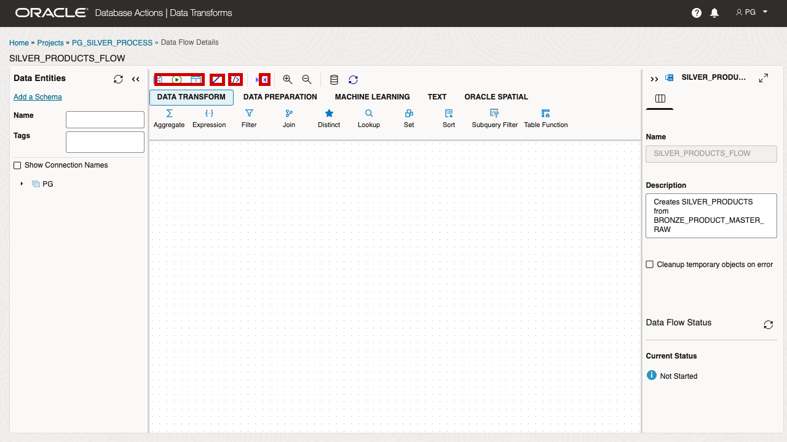

1. Click **Save** after the source, transformation, and target are connected.
2. Click **Validate**.
3. Review generated SQL if you want to inspect the insert statement.
4. Click **Start** to execute the flow.
5. Open **Jobs** in the project resources and confirm that the flow finishes successfully.

If `SILVER_PRODUCTS` already contains rows from a previous demo run, do not overwrite shared workshop data casually. Either use a temporary target table such as `SILVER_PRODUCTS_DEMO`, or skip the rerun and use the verification query in Task 13 to inspect the existing Silver output.

## Task 13: Verify the Silver product output

Run the following checks in SQL Worksheet.

```sql
SELECT COUNT(*) AS silver_product_rows
FROM silver_products;
```

The expected row count for the product master example is **35**. The Bronze file has 38 rows, but the Silver transformation removes deleted records and keeps the latest row per SKU.

Verify that every product ID in Silver is uppercase:

```sql
SELECT COUNT(*) AS non_uppercase_skus
FROM silver_products
WHERE sku <> UPPER(sku);
```

The expected result is **0**.

Inspect a few rows:

```sql
SELECT sku, product_name, brand_name, category, subcategory
FROM silver_products
ORDER BY sku
FETCH FIRST 10 ROWS ONLY;
```

## Conclusion: Business Outcome

The Data Processing and Pipelines scene shows why the Process stage is the core of the AI Lakehouse. Bronze preserved the product master source file exactly as it arrived, but raw source data is not reliable enough for every dashboard, app, and agent to interpret independently.

The Data Transforms flow turns that raw source into a Silver product table with standardized product IDs, cleaned attributes, deduplicated SKUs, and deleted records removed. From there, Gold data products can serve a consistent product foundation to webshop search, semantic product discovery, inventory joins, fulfillment views, dashboards, predictions, and AI agents.

For PeakGear, this means the business can reuse trusted product data instead of rebuilding cleanup logic in every downstream tool. The Process stage turns raw ingest into governed data products that make later Serve Data and Serve AI outcomes more efficient, consistent, and defensible.

You can move to the next scene.

## Credits & Build Notes
- **Author** - Oracle LiveLabs Team
- **Last Updated By/Date** - Oracle LiveLabs Team, 2026-06-12
