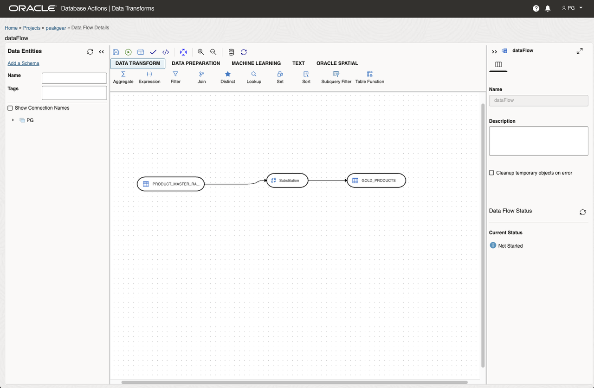
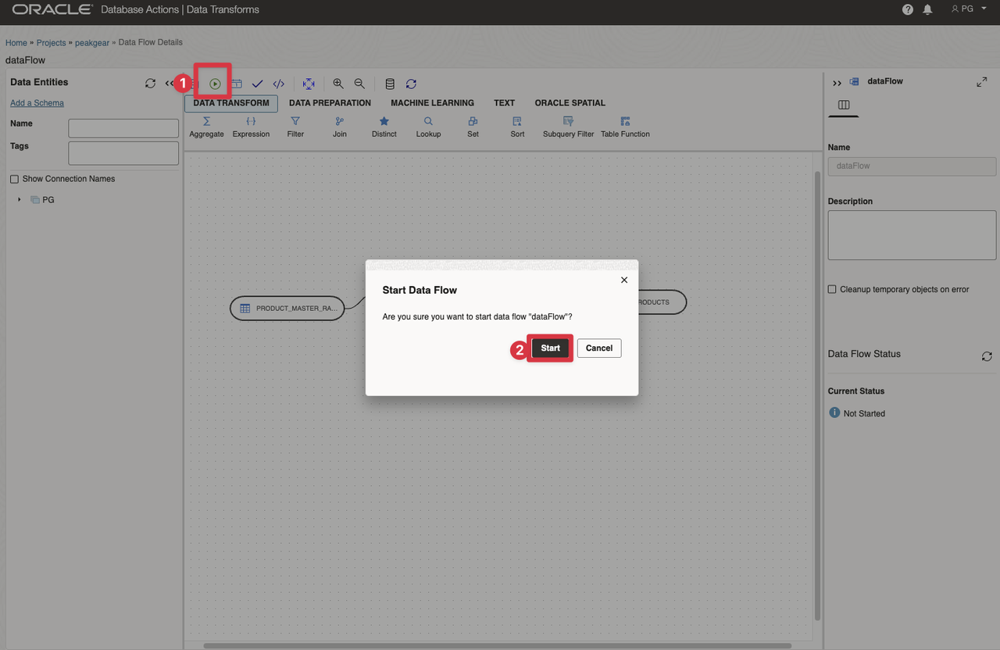
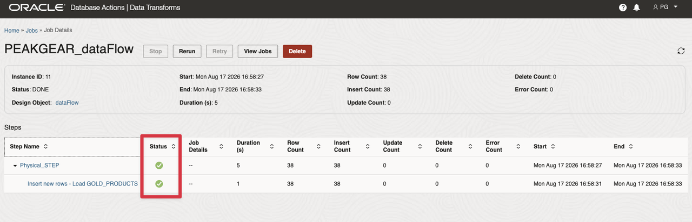

# Transform Iceberg Data

## Introduction

**PeakGear** keeps its raw product data in an **Apache Iceberg** table. In the Medallion process, this table serves as the **Bronze** layer and preserves the source data for later processing.

The table is registered in an Iceberg Catalog Server, so **Oracle Data Transforms** can read it directly. A prepared data flow applies a simple business rule and writes the result to a separate product table. The Bronze source remains unchanged.

The flow changes `SUBCATEGORY` values from `NetSuite` to `Databricks`. This makes the path from source data to a prepared product table visible.

Estimated Time: **10 minutes**

### Objectives

In this scene, you will:

- See how raw product data can move from Bronze to a prepared product table.
- Review the source data and the result of a simple business rule.
- Run the prepared transformation.
- Confirm that the source remains unchanged and the new table contains the transformed values.


## Task 1: Open and sign in to Data Transforms

Open **Data Transforms**:

1. Click **Open Data Transforms**.
2. Copy the displayed PG username and password from the **Login information** panel.
3. Enter those credentials and click **Connect**.
4. Keep the LiveStack tab open so that you can return to the demo page if needed.

## Task 2: Open the preconfigured PeakGear flow

The environment already contains the project and flow for this scene. You do not need to create them manually.

1. From the Data Transforms home page, open **Projects**.
2. Open the project named `peakgear`.


3. In the project resources, open **Data Flows**.
4. Open the flow named `dataFlow`.


If the project or flow is not visible, wait a moment and refresh the page. The environment may still be finishing its setup.

## Task 3: Inspect the source and target

The flow canvas shows the source, transformation, and target already connected:

| Flow element                     | Purpose                                                            |
| ----------------------------------| --------------------------------------------------------------------|
| `PRODUCT_MASTER_RAW_ICEBERG_EXT` | Raw product data stored in an Iceberg table.        |
| `Substitution`                   | The rule that changes the demonstration values.    |
| `GOLD_PRODUCTS`                  | The prepared product table.                        |




1. Select `PRODUCT_MASTER_RAW_ICEBERG_EXT` on the canvas.
2. This is the Bronze product data registered in the Iceberg Catalog Server. The flow reads it directly and does not create another Bronze copy.
3. Select `GOLD_PRODUCTS`.
4. Confirm that this is a separate target table. The Iceberg-backed Bronze source remains unchanged.

## Task 4: Inspect the transformation

1. Select the **Substitution** expression between the source and target.
2. Open the mapping for the `SUBCATEGORY` attribute.
3. Confirm the preconfigured rule:

    ```text
    NetSuite → Databricks
    ```


This small rule shows that the flow can process data stored in an Iceberg table and write a new result without changing the Bronze source.

The source remains in Iceberg as the Bronze layer. Data Transforms reads it, changes `SUBCATEGORY`, and writes the result to a separate table. No copy of the Bronze source is required.

## Task 5: Run the preconfigured data flow

Run the prepared transformation:

1. Click **Save** if Data Transforms shows unsaved changes.
2. Click **Validate** and confirm that the flow is valid.
3. Click **Start**.



4. Open **Jobs** in the project resources.

 

5. Confirm that the `dataFlow` job finishes successfully.



The target uses an append pattern. Run the flow once in a freshly provisioned environment. Start it again only if you intend to add another set of target rows.

## Bonus Task: Verify the transformed output

Open a SQL Worksheet using the `PG` schema. You can find SQL Developer Web in the AI Lakehouse tools section. Use the same credentials as the Data Transforms demo.


First, compare the Bronze source and transformed target row counts:

```sql
SELECT 'BRONZE_ICEBERG_SOURCE' AS layer, COUNT(*) AS row_count
FROM product_master_raw_iceberg_ext
UNION ALL
SELECT 'TRANSFORMED_TARGET' AS layer, COUNT(*) AS row_count
FROM gold_products;
```

 


Then inspect the transformed subcategory values:

```sql
SELECT subcategory, COUNT(*) AS row_count
FROM gold_products
GROUP BY subcategory
ORDER BY subcategory;
```

Then compare the source and target values for the changed subcategory:

```sql
SELECT raw_sku, subcategory
FROM product_master_raw_iceberg_ext
WHERE subcategory = 'NetSuite'
FETCH FIRST 10 ROWS ONLY;

SELECT raw_sku, subcategory
FROM gold_products
WHERE subcategory = 'Databricks'
FETCH FIRST 10 ROWS ONLY;
```

The row counts can vary if the flow has been run previously. The result is that Bronze remains an Iceberg-backed source, while `GOLD_PRODUCTS` contains the transformed values.

## Conclusion: Business Outcome

PeakGear can process product data stored in an Iceberg table without first copying it into another store.

The flow keeps the Bronze source unchanged and writes a separate table with the business rule applied. PeakGear can then use the prepared table for dashboards, analytics, and AI experiences.

## Acknowledgements

* **Author** - Kevin Lazarz August 2026
* **Contributor** - Eugenio Galiano
* **Last Updated By/Date** - Kevin Lazarz  August 2026
