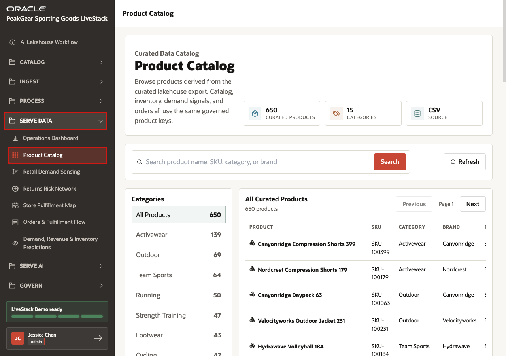
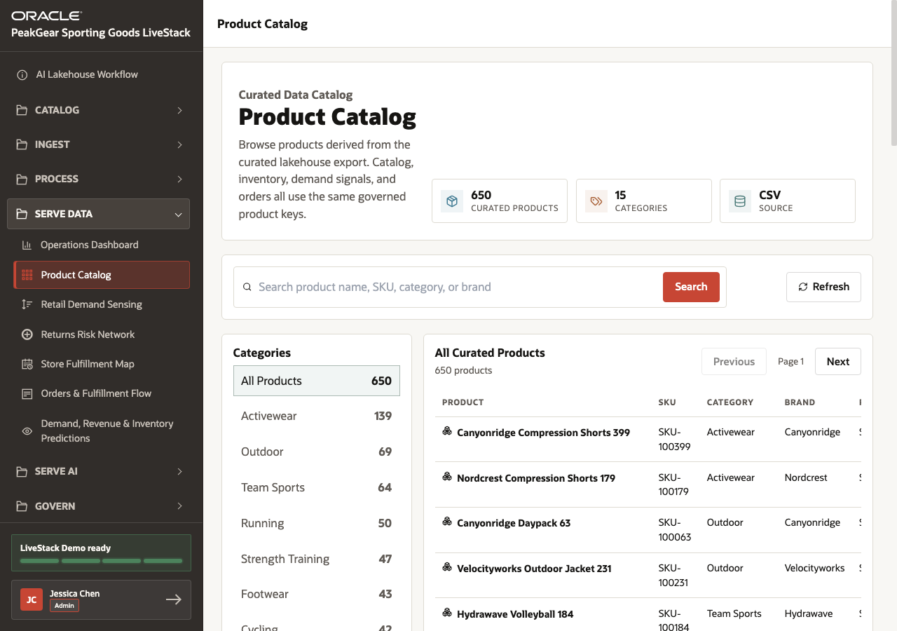
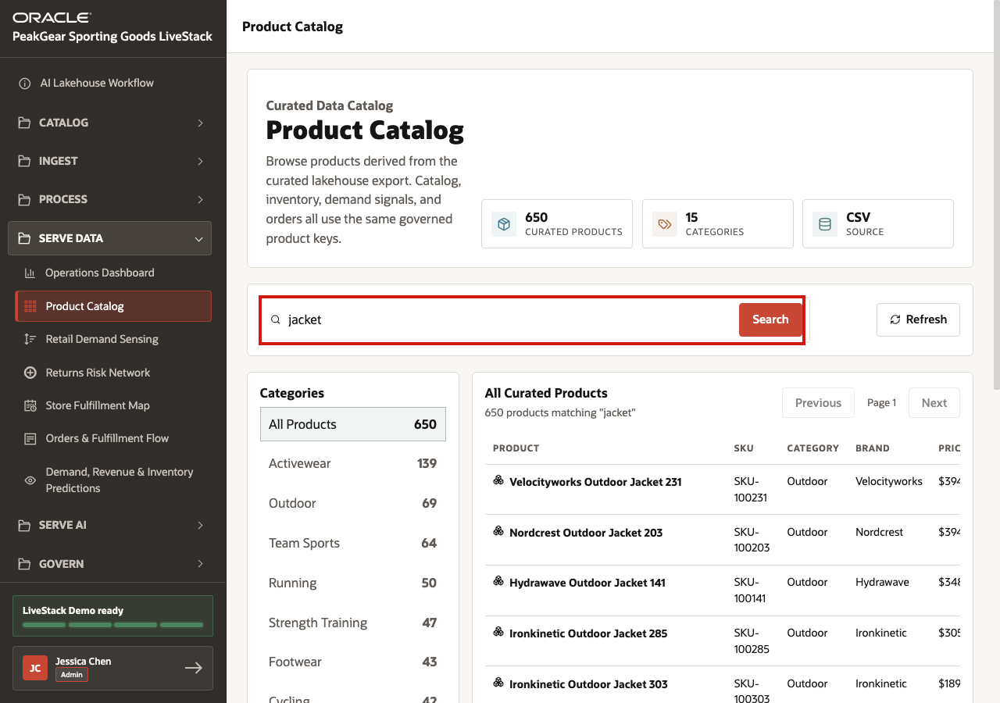
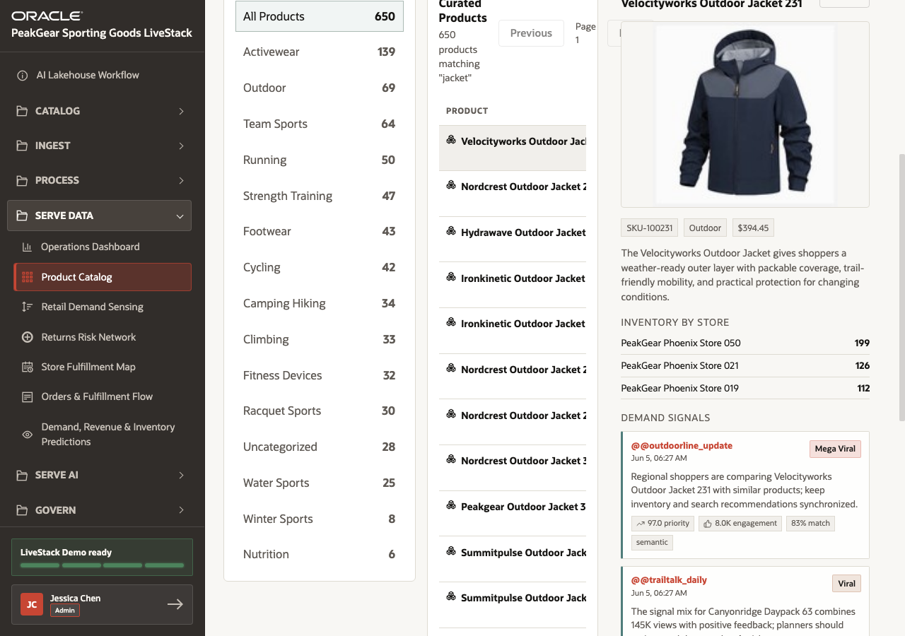

# Scene 8 Product Catalog

## Introduction

**PeakGear** has now shown how data enters the **AI Lakehouse** and moves through the medallion process. The **Product Catalog** is a practical example of a **Gold** data product that business teams can inspect directly.

Without a governed catalog foundation, PeakGear teams would have to reconcile product names, SKUs, categories, brands, prices, images, inventory, demand signals, and order context separately in each dashboard or application. Merchandising might use one product list, ecommerce might use another, operations might depend on a spreadsheet, and AI experiences might answer from stale or incomplete product data.

This scene shows a simpler outcome: a clean operational product catalog that can be reused across the business. The catalog combines product master data with supporting context from other sources, so the same trusted product foundation can support dashboards, webshop experiences, fulfillment decisions, recommendations, and AI agents.

Estimated Time: **5 minutes**

### Objectives

In this scene, you will:

- Open the **Product Catalog** from the **Serve Data** menu.
- Review the curated catalog summary and product list.
- Search for a product category or product term.
- Open a product detail view with inventory and demand context.
- Connect the catalog experience to the Gold-layer outcome of the medallion process.

## Task 1: Open the Product Catalog



Perform the following set of steps to open the **Product Catalog**:

1. In the left sidebar, expand **Serve Data**.
2. Select **Product Catalog**.
3. Confirm that the page title is **Product Catalog**.

The Product Catalog sits in Serve Data because it is a consumption experience. The user is no longer loading, cleansing, or transforming data. They are using a curated product data product that has already been prepared through the AI Lakehouse process.

## Task 2: Review the curated catalog



Perform the following set of steps to review the curated catalog:

1. Review the catalog summary cards for **Curated Products**, **Categories**, and **Source**.
2. Review the category list on the left.
3. Review the product table with product name, SKU, category, brand, price, and inventory.

This is the operational catalog view that business teams expect: a single place to inspect trusted product records. Behind the scenes, the catalog demonstrates the value of the medallion process because products, categories, inventory context, and supporting signals can be served from one governed foundation.

## Task 3: Search and filter the catalog



Perform the following set of steps to search and filter the catalog:

1. In the search field, enter:

```text
jacket
```

2. Click **Search**.
3. Review the filtered product results.
4. Optionally select a category from the left-side category list.

This search is intentionally simple. The goal is not to demonstrate semantic product discovery yet; that comes later in the webshop scene. Here the key point is that clean Gold-layer product data can be used for reliable operational lookup across product names, SKUs, categories, and brands.

## Task 4: Open a product detail



Perform the following set of steps to open a product detail:

1. Select a product row, such as **Velocityworks Outdoor Jacket 231**.
2. Review the product image, SKU, category, price, and product description.
3. Review **Inventory By Store**.
4. Review **Demand Signals**.

The detail view shows why the catalog is more than a product list. A product record can bring together the core product master with image context, store inventory, and market demand signals. Those inputs may have originated from different data sources, but the Serve Data experience presents them as one usable operational data product.

## Conclusion: Business Outcome

The Product Catalog shows one of the simplest but most important Serve Data outcomes from the AI Lakehouse. PeakGear does not need every dashboard, webshop feature, operations workflow, and AI agent to rebuild product cleanup logic or reconcile product keys independently.

Through the medallion process, Bronze captures source-shaped data, Silver standardizes and enriches it, and Gold serves trusted product data. The catalog becomes a reusable operational reference that combines product facts, categories, images, inventory, demand signals, and order context.

For the business, this means teams can trust one product foundation across merchandising, ecommerce, operations, fulfillment, recommendations, and AI automation. PeakGear can reduce inconsistent product views and accelerate the next data products built on top of the same governed lakehouse foundation.

You can move to the next scene.

## Credits & Build Notes
- **Author** - Oracle LiveLabs Team
- **Last Updated By/Date** - Oracle LiveLabs Team, 2026-06-12
