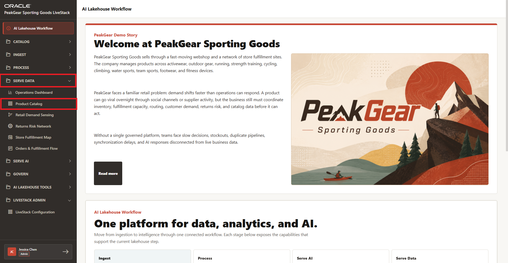
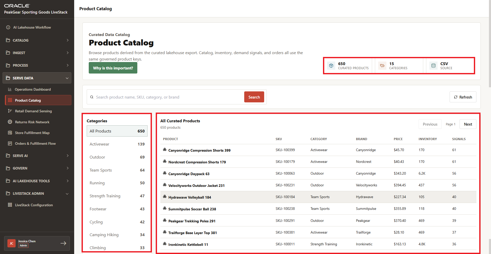
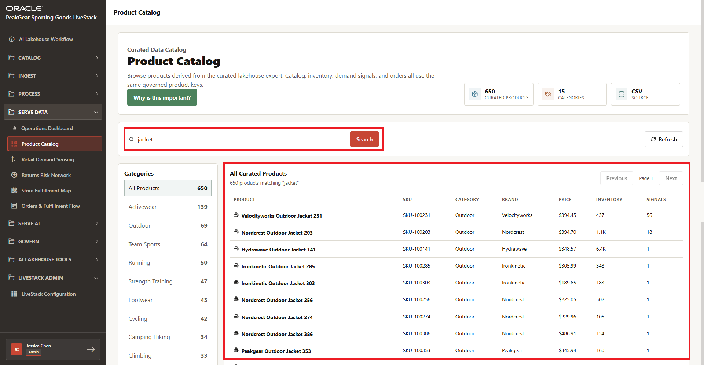
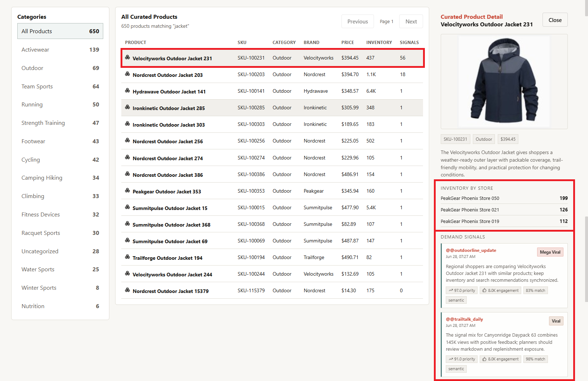

# Product Catalog

## Introduction

**PeakGear** has moved data through the **AI Lakehouse** and the medallion process. The **Product Catalog** is a **Gold** data product that business teams can inspect directly.

Without a shared catalog, PeakGear teams may use different product names, SKUs, prices, and inventory values in different dashboards and applications. That makes it harder to keep customer and operational views consistent.

This scene shows a product catalog that combines product data with inventory and demand context. The same product information can support dashboards, webshop experiences, fulfillment decisions, recommendations, and AI agents.

The **Oracle AI Database** serves this Gold product view so dashboards and applications can use the same product context.

Estimated Time: **5 minutes**

### Objectives

In this scene, you will:

- Review the product catalog and its summary information.
- Search for a product or category.
- Open a product detail view with inventory and demand context.
- See how a Gold data product supports business use.

## Task 1: Open the Product Catalog



Open the **Product Catalog**:

1. In the left sidebar, expand **Serve Data**.
2. Select **Product Catalog**.
3. Confirm that the page title is **Product Catalog**.

The Product Catalog sits in Serve Data because it uses product data that has already been prepared through the AI Lakehouse process.

## Task 2: Review the curated catalog



Review the product catalog:

1. Review the catalog summary cards for **Curated Products**, **Categories**, and **Source**.
2. Review the category list on the left.
3. Review the product table with product name, SKU, category, brand, price, and inventory.

This view gives business teams one place to inspect product records. The medallion process combines product, category, inventory, and supporting signal data for this view.

## Task 3: Search and filter the catalog



Search and filter the catalog:

1. In the search field, enter:

    ```text
    jacket
    ```

2. Click **Search**.
3. Review the filtered product results.
4. Optionally select a category from the left-side category list.

This search uses exact text lookup. Semantic product discovery appears in the webshop scene. Here, the product names, SKUs, categories, and brands are available for operational lookup.

## Task 4: Open a product detail



Open a product detail:

1. Select a product row, such as **Velocityworks Outdoor Jacket 231**.
2. Review the product image, SKU, category, price, and product description.
3. Review **Inventory By Store**.
4. Review **Demand Signals**.

The detail view combines the product record with image context, store inventory, and market demand signals. Data from different sources appears together in one operational view.

## Conclusion: Business Outcome

The Product Catalog shows a straightforward Serve Data outcome from the AI Lakehouse. PeakGear can use one prepared product foundation across dashboards, webshop features, operations workflows, and AI agents.

Through the medallion process, Bronze captures source data, Silver standardizes and enriches it, and Gold provides product data for business use. The catalog combines product facts, categories, images, inventory, demand signals, and order context.

For the business, merchandising, ecommerce, operations, fulfillment, recommendation, and AI teams can work from the same product information.

## Acknowledgements

* **Author** - Kevin Lazarz August 2026
* **Contributor** - Eugenio Galiano
* **Last Updated By/Date** - Kevin Lazarz  August 2026
